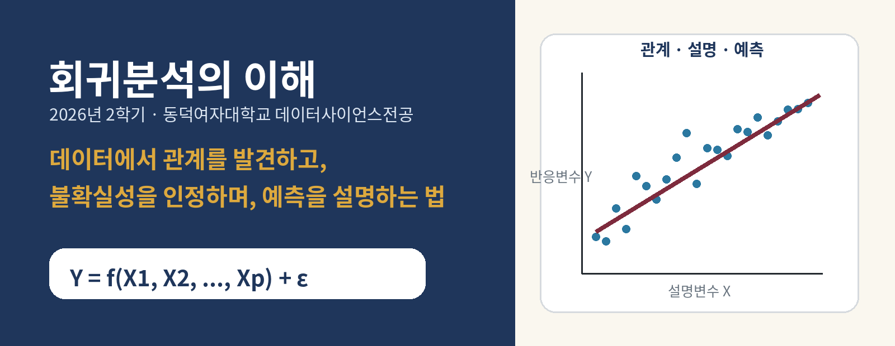
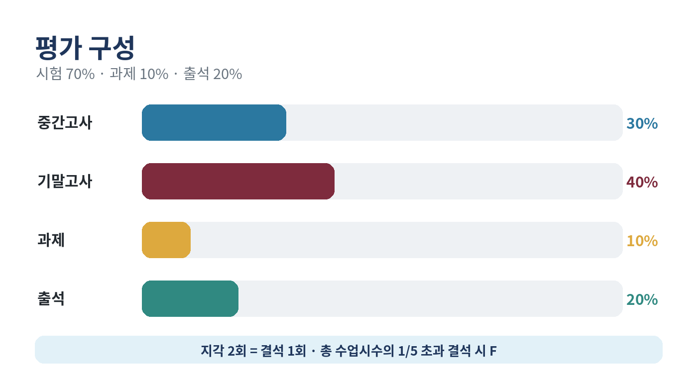
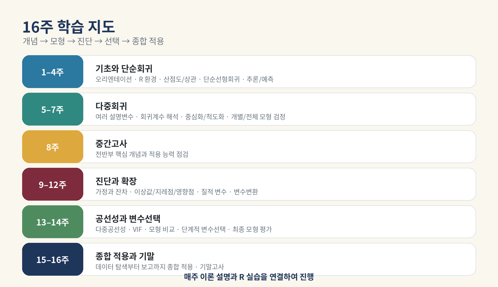

# 회귀분석의 이해

회귀분석의 이해 강의자료 모음

## 수업 자료

| 차시 | 날짜 | 주제 | 강의노트 | 퀴즈 해설 | 실습 | 실행 |
|---|---|---|---|---|---|---|
| w01a | 2026-09-02 | 강의 소개와 회귀분석의 개요 | [MD](course/notion/week01/01_week01_orientation_regression_intro.md) · [PDF](course/handouts/01_week01_orientation_regression_intro.pdf) · [Notion](https://app.notion.com/p/1-3ce7fd00109f81f79f4ae262b83e6ed8?source=copy_link) | [MD](course/handouts/w01a-quiz.md) · [PDF](course/handouts/w01a-quiz.pdf) | [R](labs/student/week01/week01_lab_student.R) · [qmd](labs/student/week01/week01_lab_student.qmd) | [브라우저 실습](https://lunalab-ai.github.io/regre/w01a.html) · 이론 수업 · 선택 R/QMD 복습 실습 |
| w02a | 2026-09-07 | RStudio 실습 환경 설정, R 문법 복습 및 데모 | [MD](course/notion/w02a/w02a-rstudio-r-basics.md) · [PDF](course/handouts/w02a-rstudio-r-basics.pdf) · [Notion](https://app.notion.com/p/W02a-RStudio-R-3d37fd00109f8176bd38ca5d95f40f67?source=copy_link) | [MD](course/handouts/w02a-quiz.md) · [PDF](course/handouts/w02a-quiz.pdf) | [R](labs/student/w02a/w02a-r-basics.R) · [qmd](labs/student/w02a/w02a-r-basics.qmd) · [Rproj](labs/student/w02a/w02a.Rproj) | [브라우저 실습](https://lunalab-ai.github.io/regre/w02a.html) · RStudio · R |
| w02b | 2026-09-09 | R 문법 복습 (2) | [MD](course/notion/w02b/w02b-r-syntax-2.md) · [PDF](course/handouts/w02b-r-syntax-2.pdf) · [Notion](https://app.notion.com/p/W02b-R-3d57fd00109f81958c47c404c4050a99?source=copy_link) | [MD](course/handouts/w02b-quiz.md) · [PDF](course/handouts/w02b-quiz.pdf) | [R](labs/student/w02b/w02b-r-syntax-2.R) · [qmd](labs/student/w02b/w02b-r-syntax-2.qmd) · [Rproj](labs/student/w02b/w02b.Rproj) · [csv](labs/student/w02b/data/w02b-observations.csv) · [R](labs/student/w02b/app/app.R) | [브라우저 실습](https://lunalab-ai.github.io/regre/w02b.html) · RStudio · R · Shiny |
| w03a | 2026-09-14 | 산점도, 공분산, 상관계수와 회귀분석의 기본 아이디어 | [MD](course/notion/w03a/w03a-association.md) · [PDF](course/handouts/w03a-association.pdf) · [Notion](https://fancy-ballcap-a15.notion.site/w03a-association-e08dc88a-3db7fd00109f819795aee9dbae9e1211) | [MD](course/handouts/w03a-quiz.md) · [PDF](course/handouts/w03a-quiz.pdf) | [R](labs/student/w03a/w03a-association.R) · [qmd](labs/student/w03a/w03a-association.qmd) · [R](labs/student/w03a/app/app.R) | [브라우저 실습](https://lunalab-ai.github.io/regre/w03a.html) · R · 공분산·상관계수 탐색 |
| w03b | 2026-09-16 | 단순선형회귀모형: 회귀계수 추정·검정·신뢰구간과 R 실습 | [MD](course/notion/w03b/w03b-simple-regression.md) · [PDF](course/handouts/w03b-simple-regression.pdf) · [Notion](https://app.notion.com/p/W03b-3dc7fd00109f812bb7f5cd153db3045c?source=copy_link) | [MD](course/handouts/w03b-quiz.md) · [PDF](course/handouts/w03b-quiz.pdf) | [R](labs/student/w03b/w03b-simple-regression.R) · [qmd](labs/student/w03b/w03b-simple-regression.qmd) · [R](labs/student/w03b/app/app.R) | [브라우저 실습](https://lunalab-ai.github.io/regre/w03b.html) · R · 계수 추정·검정·신뢰구간 |
| w04a | 2026-09-21 | 단순선형회귀모형 마무리: 예측·적합성·특수 회귀모형 | [MD](course/notion/w04a/w04a-prediction.md) · [PDF](course/handouts/w04a-prediction.pdf) · [Notion](https://fancy-ballcap-a15.notion.site/W04A-2026-09-21-3e17fd00109f81168b6ccf9faa2e8245) | [MD](course/handouts/w04a-quiz.md) · [PDF](course/handouts/w04a-quiz.pdf) | [R](labs/student/w04a/w04a-prediction.R) · [qmd](labs/student/w04a/w04a-prediction.qmd) · [R](labs/student/w04a/app/app.R) | [브라우저 실습](https://lunalab-ai.github.io/regre/w04a.html) · R · 예측구간·적합성·특수 회귀모형 |
| w05a | 2026-09-28 | 다중선형회귀모형과 모수 추정: 평균 예측에서 여러 설명변수로 | [MD](course/notion/w05a/w05a-multiple-regression.md) · [PDF](course/handouts/w05a-multiple-regression.pdf) · [MD](course/notion/w05a/w05a-r2-remediation.md) · [PDF](course/handouts/w05a-r2-remediation.pdf) · [Notion](https://fancy-ballcap-a15.notion.site/W05A-2026-09-28-3e87fd00109f8112b11fda197e1a26d9) | [MD](course/handouts/w05a-quiz.md) · [PDF](course/handouts/w05a-quiz.pdf) | [R](labs/student/w05a/w05a-multiple-regression.R) · [qmd](labs/student/w05a/w05a-multiple-regression.qmd) · [R](labs/student/w05a/app/app.R) · [ipynb](notebooks/student/w05a_deviations.ipynb) · [ipynb](notebooks/student/w05a_multiple_regression.ipynb) | [브라우저 실습](https://lunalab-ai.github.io/regre/w05a.html) · [Colab](https://colab.research.google.com/github/lunalab-ai/regre/blob/2026-fall-w05a-v2/notebooks/student/w05a_multiple_regression.ipynb) |
| w05b | 2026-09-30 | 다중회귀의 해석·추론·예측: 계수에서 불확실성으로 | [MD](course/notion/w05b/w05b-interpretation.md) · [PDF](course/handouts/w05b-interpretation.pdf) · [MD](course/notion/w05b/w05b-inference.md) · [PDF](course/handouts/w05b-inference.pdf) · [MD](course/notion/w05b/w05b-workbook.md) · [PDF](course/handouts/w05b-workbook.pdf) · [MD](course/notion/w05b/w05b-math.md) · [PDF](course/handouts/w05b-math.pdf) · [Notion](https://fancy-ballcap-a15.notion.site/W05B-2026-09-30-3ea7fd00109f814ab0e9caa5ac72f039) | [MD](course/handouts/w05b-quiz.md) · [PDF](course/handouts/w05b-quiz.pdf) | [R](labs/student/w05b/w05b-inference.R) · [qmd](labs/student/w05b/w05b-inference.qmd) · [R](labs/student/w05b/app/app.R) · [ipynb](notebooks/student/w05b_interpretation.ipynb) · [ipynb](notebooks/student/w05b_inference.ipynb) | [브라우저 실습](https://lunalab-ai.github.io/regre/w05b.html) · [Colab](https://colab.research.google.com/github/lunalab-ai/regre/blob/2026-fall-w05b-r1/notebooks/student/w05b_interpretation.ipynb) |
| w06a | 2026-10-05 | 회귀진단: 모형위반의 검출 | [MD](course/notion/w06a/w06a-assumptions.md) · [PDF](course/handouts/w06a-assumptions.pdf) · [MD](course/notion/w06a/w06a-residuals.md) · [PDF](course/handouts/w06a-residuals.pdf) · [MD](course/notion/w06a/w06a-graphs.md) · [PDF](course/handouts/w06a-graphs.pdf) · [MD](course/notion/w06a/w06a-workbook.md) · [PDF](course/handouts/w06a-workbook.pdf) · [MD](course/notion/w06a/w06a-math.md) · [PDF](course/handouts/w06a-math.pdf) · [Notion](https://fancy-ballcap-a15.notion.site/W06A-2026-10-05-3f07fd00109f8167ad03d7f1fb84b341) | [MD](course/handouts/w06a-quiz.md) · [PDF](course/handouts/w06a-quiz.pdf) | [R](labs/student/w06a/w06a-diagnostics.R) · [qmd](labs/student/w06a/w06a-diagnostics.qmd) · [R](labs/student/w06a/app/app.R) · [ipynb](notebooks/student/w06a_residuals.ipynb) · [ipynb](notebooks/student/w06a_graphs.ipynb) | [브라우저 실습](https://lunalab-ai.github.io/regre/w06a.html) · [Colab](https://colab.research.google.com/github/lunalab-ai/regre/blob/2026-fall-w06a/notebooks/student/w06a_residuals.ipynb) |
| w06b | 2026-10-08 | 중간고사 대비 복습 ①: 회귀분석의 개요와 R 기초 | [MD](course/notion/w06b/w06b-review-workbook.md) · [PDF](course/handouts/w06b-review-workbook.pdf) · [Notion](https://fancy-ballcap-a15.notion.site/W06B-60-2026-10-08-3f27fd00109f8146b8c9f159be626e5b) | — | [R](labs/student/w06b/w06b-review.R) · [qmd](labs/student/w06b/w06b-review.qmd) · [R](labs/student/w06b/app/app.R) · [ipynb](notebooks/student/w06b_foundations.ipynb) · [ipynb](notebooks/student/w06b_reasoning.ipynb) | [브라우저 실습](https://lunalab-ai.github.io/regre/w06b.html) · [Colab](https://colab.research.google.com/github/lunalab-ai/regre/blob/2026-fall-w06b/notebooks/student/w06b_foundations.ipynb) |

> **2026년 2학기 · 동덕여자대학교 데이터사이언스전공**  
> 담당교수: 유원상 · 수업: 월요일/수요일 13:30–14:45 · 연구실: 예지관 B553호

## 이 강의에서 무엇을 배우는가

회귀분석은 데이터 분석에서 가장 기본적이고 널리 활용되는 방법 중 하나입니다. 이 강의는 단순선형회귀와 다중선형회귀를 중심으로 회귀모형의 구조, 회귀계수의 추정과 해석, 가설검정, 신뢰구간, 예측, 적합도 평가를 배웁니다. 이후 잔차분석과 회귀진단, 질적 예측변수, 변수변환, 다중공선성, 변수선택까지 실제 데이터 분석에서 자주 만나는 문제로 확장합니다.

수학적 증명 자체보다 **개념을 이해하고 실제 데이터에 적용하며 결과를 설명하는 능력**을 중시합니다. 매주 이론을 배운 뒤 R을 이용해 데이터를 불러오고, 시각화하고, 모형을 적합하고, 결과를 해석합니다.

## 학습 성과

수강을 마치면 다음을 수행할 수 있어야 합니다.

1. 데이터 기반 질문을 반응변수와 설명변수의 관계로 정식화한다.
2. R로 데이터를 읽고 탐색하며 적절한 회귀모형을 적합한다.
3. 회귀계수, 검정, 신뢰구간, 예측구간과 적합도 지표를 해석한다.
4. 잔차와 영향력 진단을 통해 모형 가정과 문제 관측값을 비판적으로 검토한다.
5. 분석 결과를 표, 그래프, 재현 가능한 문서와 간단한 웹 애플리케이션으로 설명한다.

## 수업 운영 방식

- 대부분의 수업은 **개념 설명 → 짧은 확인 활동 → R 실습 → 정리**의 흐름으로 진행합니다.
- 실습은 R/RStudio와 Quarto 문서(`.qmd`)를 기본 환경으로 사용합니다.
- 학기 동안 하나의 회귀분석 웹 앱을 작은 기능부터 단계적으로 발전시킵니다.
- 주차별 내용과 실습 범위는 수강생의 이해도와 실습 진행 상황에 따라 일부 조정될 수 있습니다.
- 실습을 위해 개인 노트북을 준비합니다. 기본적인 R 문법과 프로그래밍 경험을 권장합니다.

## 평가

| 평가 요소 | 반영 비율 |
|---|---:|
| 중간고사 | 30% |
| 기말고사 | 40% |
| 과제 | 10% |
| 출석 | 20% |
| **합계** | **100%** |

> **출결 규정**: 지각 2회는 결석 1회로 산정합니다. 결석시수가 총 수업시수의 1/5을 초과하면 학칙에 따라 F학점이 부여됩니다.

## 학기 전체 지도

| 주차 | 핵심 주제 |
|---:|---|
| 1 | 강의 소개, 회귀분석 개요, R/RStudio/Quarto 환경 설정 |
| 2 | 데이터 불러오기, 기초 R, 산점도, 공분산과 상관계수 |
| 3 | 단순선형회귀모형, 회귀직선, 최소제곱추정, `lm()` |
| 4 | 회귀계수 검정, 신뢰구간, 예측구간, 결정계수 |
| 5 | 다중선형회귀모형과 기본 출력 해석 |
| 6 | 조건부 회귀계수 해석, 중심화·척도화, 설명력 |
| 7 | 개별/전체 모형 검정, 부분모형 비교, 다중회귀 예측 |
| 8 | 중간고사 |
| 9 | 회귀 가정, 잔차의 종류, 잔차플롯, 기본 진단 |
| 10 | 이상값, 지레점, 영향점, Cook의 거리 |
| 11 | 질적 예측변수, 더미변수, 기준범주, 상호작용 |
| 12 | 비선형 관계, 로그변환, 이분산성, 분산 안정화 |
| 13 | 다중공선성, 분산팽창계수, 모형비교 기준 |
| 14 | 가능한 모형 비교, 단계적 변수선택, 최종 모형 평가 |
| 15 | 실제 데이터에 전체 회귀분석 절차 적용 및 설명 |
| 16 | 기말고사 |

## 강의 위키 바로가기

- [1주차: 강의 소개와 회귀분석의 첫 지도](course/notion/week01/01_week01_orientation_regression_intro.md)
- [1주차 실습 안내: R/Quarto 환경과 첫 회귀 앱](course/notion/week01/02_week01_lab_guide.md)
- [R/RStudio/Quarto 설치와 문제 해결](course/notion/week01/03_setup_troubleshooting.md)
- [핵심 용어집](course/notion/week01/04_course_glossary.md)

## 교재

**주교재**  
Ali S. Hadi, Samprit Chatterjee, *Chatterjee 예제를 통한 회귀분석 제6판: R 활용*, 강현철·이성건·김기영·전명식 옮김, 자유아카데미, 2024.

**부교재**  
허집, *회귀분석의 이해: R 활용*, 자유아카데미, 2025.

## 담당교수 및 면담

- 담당교수: 유원상
- 이메일: `wonsang@dongduk.ac.kr`
- 전화: 02-940-4753
- 연구실: 예지관 B553호
- 면담시간: 월–목 15:00–18:00

> 강의 자료와 실습 코드는 수업 진행에 따라 계속 보완됩니다. 각 페이지의 최종 수정일과 수업 공지를 함께 확인하세요.

## 교재와 참고자료

[전체 참고자료와 차시별 출처](course/references.md)
[기초 실습 안내](course/basics.md)
