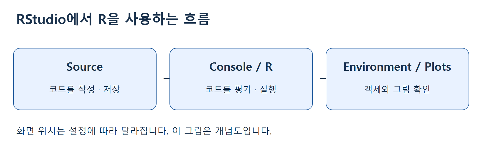
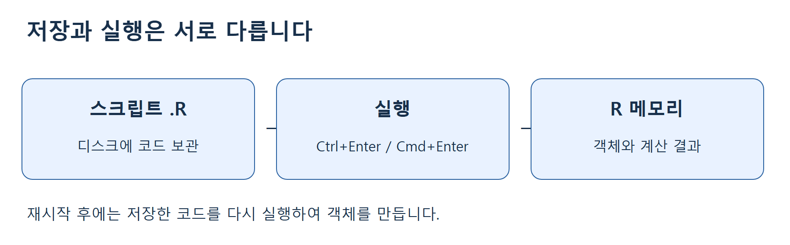
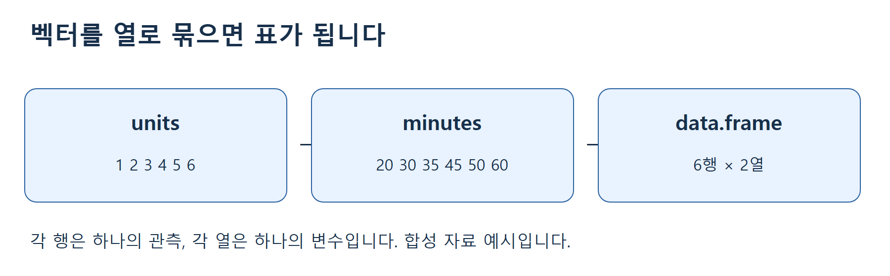

# 2주차 1차시 · RStudio 설정과 R 문법 복습 ①

동덕여자대학교 · 회귀분석의 이해 · 유원상 교수 · 2026학년도 2학기  
수업일: 2026-09-07 · 실습 안내

오늘은 R을 처음 켠 상태에서 시작하여, 코드를 저장하고 작은 표를 직접 만드는 데까지 진행합니다. 추가 데이터 파일이나 유료 서비스는 필요하지 않습니다. 아래 자료는 제공된 2장 §§2.1–2.4의 기초 개념을 바탕으로 새로 작성했습니다. 주문 수와 작업 시간 데이터는 설명용 합성 자료이며 실제 관측 자료가 아닙니다.

## 오늘과 다음 시간

오늘: R/RStudio 설치 → 프로젝트와 스크립트 → 계산과 객체 → 자료형 → 벡터와 인덱싱 → 데이터프레임·그림. 다음 시간: 행렬·리스트·요인 보충, 패키지, 파일 입출력, 연산과 함수, 조건문·반복문. 분량은 페이지 수보다 따라 하는 시간을 기준으로 나눕니다. 다음 수업의 날짜는 별도 안내합니다.

권장 진행은 설치·화면 15분, 실행·저장 15분, 벡터 20분, 표·그림 15분, 정리 10분입니다. 설치가 길어지면 그림과 추가 과제는 복습으로 돌립니다.

## 1. 설치하고 첫 화면 열기

1. [R 공식 다운로드](https://cran.r-project.org/)를 엽니다. Windows는 Download R for Windows → base에서 설치 프로그램을 받습니다. macOS는 Download R for macOS에서 자신의 Apple silicon/Intel에 맞는 항목과 지원 OS를 확인합니다.
2. 설치 프로그램을 실행하고 안내를 따릅니다. 학교 PC에서 권한이 없으면 임의로 설정을 바꾸지 말고 담당자에게 요청합니다. 이미 설치되어 있다면 재설치부터 하지 않습니다.
3. [Posit RStudio 시작 안내](https://docs.posit.co/ide/user/ide/get-started/)에서 Desktop 설치 안내를 따라 무료 RStudio Desktop을 설치합니다. **R이 계산 엔진이고 RStudio는 작업 화면**이므로 R을 먼저 설치합니다.
4. RStudio를 실행합니다. R을 찾을 수 없다는 메시지가 나오면 R 설치 완료 여부를 확인하고 RStudio를 다시 엽니다.
5. Console의 `>` 뒤를 클릭하고 아래 한 줄을 입력한 뒤 Enter를 누릅니다. 문서의 `>`나 `[1]`은 입력하지 않습니다.

```r
R.version.string
```

예상: `R version ...` 문자열이 나옵니다. 버전 숫자는 PC마다 다를 수 있습니다. 설치 여부를 확인하는 것이 목적입니다.



## 2. 오늘의 폴더와 스크립트 만들기

1. File → New Project → New Directory → New Project를 선택합니다.
2. Directory name에 `regression-w02a`를 입력하고 저장할 상위 폴더를 고른 뒤 Create Project를 누릅니다. 메뉴 명칭은 OS와 버전에 따라 조금 다를 수 있습니다.
3. File → New File → R Script를 누릅니다. 왼쪽 위 Source 창이 열립니다.
4. File → Save As로 프로젝트 폴더 안에 `w02a-practice.R`을 저장합니다. 한글 문장은 UTF-8로 저장합니다.
5. 배포된 `labs/student/w02a/w02a-r-basics.R`을 다운로드했다면 프로젝트 폴더에 옮기고 File → Open File로 열어도 됩니다. GitHub 코드 화면의 Download raw file로 받으며 웹페이지 HTML로 저장하지 않습니다.
6. 아래 코드를 **Source 창**에 씁니다. 커서를 첫 줄에 두고 Windows/Linux는 Ctrl+Enter, macOS는 Cmd+Enter를 누릅니다. 다음 줄에서도 반복합니다.

```r
2 + 3
10 / 4
sqrt(16)
```

예상 출력은 차례로 `[1] 5`, `[1] 2.5`, `[1] 4`입니다. `[1]`은 출력 줄의 첫 원소 위치 표시이며 계산 결과의 일부가 아닙니다. Enter만 누르면 Source에서는 줄바꿈, Console에서는 실행이 됩니다. 처음부터 Source 버튼으로 전체 파일을 실행하지 말고 한 줄씩 비교하세요.

## 3. 객체, 대입, 저장과 실행

`<-`는 오른쪽 값을 왼쪽 이름에 저장합니다. 숫자를 따옴표로 감싸면 문자가 됩니다. 대소문자는 구별됩니다.

```r
units <- 3
minutes_per_unit <- 5
total_minutes <- units * minutes_per_unit
total_minutes
print(total_minutes)
```

대입 줄은 정상 실행되어도 출력이 없을 수 있습니다. 마지막 두 줄은 각각 15를 보여 줍니다. Environment에 객체가 생겼는지 확인합니다. `units`를 4로 고친 뒤 **대입 줄과 계산 줄과 출력 줄을 모두** 다시 실행해 20인지 확인합니다. 파일을 고친 것만으로 이미 저장된 객체가 바뀌지는 않습니다.



저장 단축키 Ctrl+S/macOS Cmd+S는 스크립트 파일을 저장합니다. Session → Restart R로 R을 다시 시작하면 객체가 사라질 수 있습니다. 스크립트를 위에서부터 실행하여 재현하는 것이 목표입니다. 종료할 때 작업 공간 `.RData` 저장 여부를 물으면 오늘은 저장하지 않고 스크립트를 보관합니다.

따라 해 보기: `total_minutes` 계산 줄의 `units`를 잠시 `unit`으로 바꿔 실행하고 오류를 읽은 뒤 원래대로 고칩니다. Console이 `+` 프롬프트에서 멈추면 괄호나 따옴표가 덜 닫혔는지 확인합니다. Esc로 미완성 입력을 취소하고 완전한 한 줄을 다시 실행합니다.

## 4. 자료형과 결측값

아래는 숫자, 문자, 논리값입니다. `class()`로 확인합니다. `#` 뒤는 사람이 읽는 주석입니다.

```r
score <- 80
student_name <- "Kim"
passed <- score >= 60
class(score)
class(student_name)
class(passed)
as.numeric("80") + 5
```

예상: `numeric`, `character`, `logical`, 그리고 85. `TRUE`와 `FALSE`는 논리값입니다. `=`를 비교로 사용하지 않고 `==`로 같은지 검사합니다.

```r
score == 80
score > 80
measurements <- c(10, NA, 30)
mean(measurements)
is.na(measurements)
mean(measurements, na.rm = TRUE)
```

예상: TRUE, FALSE, NA, `FALSE TRUE FALSE`, 20. `NA`는 모르는 값이며 0과 다릅니다. `na.rm = TRUE`는 이 계산에서 결측을 제외한다는 뜻입니다. 원본 벡터를 수정하는 명령은 아닙니다. `x == NA` 대신 `is.na(x)`로 확인합니다. 실제 분석에서는 왜 값이 빠졌는지도 확인해야 합니다.

예측 활동: `c(10, "20", 30)`의 자료형은 무엇일까요? 먼저 적고 아래를 실행합니다.

```r
mixed <- c(10, "20", 30)
class(mixed)
mixed
```

## 5. 벡터: 여러 값을 하나의 이름에

`c()`는 값을 묶습니다. R 벡터의 첫 위치는 1입니다. 대괄호는 필요한 원소를 고릅니다. 대입과 각 출력 줄을 하나씩 실행합니다.

```r
minutes <- c(20, 30, 35, 45, 50, 60)
length(minutes)
minutes[1]
minutes[c(1, 3)]
minutes[2:4]
mean(minutes)
sum(minutes)
```

예상: 길이 6, 첫 값 20, 선택값 20과 35, 연속값 30·35·45, 평균 40, 합계 240. `2:4`는 2, 3, 4입니다. `minutes[0]`은 첫 값을 뜻하지 않으며 빈 벡터가 됩니다.

```r
minutes >= 40
minutes[minutes >= 40]
minutes + 5
minutes
```

조건은 `FALSE FALSE FALSE TRUE TRUE TRUE`, 선택 결과는 45·50·60입니다. `minutes + 5`는 각 원소에 5를 더한 결과를 보여 주지만 원본은 그대로입니다. 변경을 보관하려면 별도 이름에 대입합니다.

직접 수정 과제: (1) 두 번째와 다섯 번째 값을 고르기, (2) 35 이하 값 고르기, (3) 시간을 초로 바꾼 새 벡터 만들기. 예상 결과를 종이에 적은 뒤 스크립트 마지막에 자기 코드를 추가하세요. `mean <- 40`처럼 함수 이름을 객체 이름으로 쓰지 않습니다.

## 6. 작은 표와 회귀분석으로 이어지는 데모

벡터는 한 줄의 값, 데이터프레임은 같은 개수의 관측을 여러 열로 묶은 표입니다. 행은 관측, 열은 변수입니다. 아래 6행은 실제 주문을 수집한 것이 아니라 이번 수업에서 만든 예시입니다.



```r
demo <- data.frame(
  units = 1:6,
  minutes = c(20, 30, 35, 45, 50, 60)
)
demo
nrow(demo)
ncol(demo)
names(demo)
str(demo)
```

예상: 6행 2열, 열 이름 `units`, `minutes`. 여러 줄 괄호 안에서는 입력이 이어집니다. 전체 `data.frame(...)` 표현식을 선택해서 실행하세요. `str()`는 구조를 보여 주며 숫자형 세부 표시가 열마다 다를 수 있습니다.

```r
demo$minutes
demo[1, 2]
demo[demo$minutes >= 40, ]
mean(demo$minutes)
summary(demo)
```

`$minutes`는 그 열을 꺼냅니다. `[행, 열]`에서 `demo[1, 2]`는 20입니다. 열 위치를 비워 둔 조건 선택은 모든 열을 유지하며 4·5·6행을 반환합니다. 평균은 40입니다. 표 전체에 무작정 `mean(demo)`를 적용하지 말고 어떤 열의 평균인지 명시합니다.

```r
plot(demo$units, demo$minutes,
     xlab = "Units", ylab = "Minutes",
     main = "Synthetic practice data", pch = 19)
```

Plots 창에 오른쪽 위로 향하는 여섯 점이 보입니다. 가로축은 작업 단위 수, 세로축은 시간입니다. 오늘은 관계를 관찰하는 데모이며 회귀계수 계산이나 인과관계 판정은 하지 않습니다. Plots의 Export로 이미지 저장을 연습해도 좋습니다.

비교 활동: 복사한 데이터프레임에서 마지막 시간을 바꾸면 점과 평균이 어떻게 달라질까요? 먼저 예상하고 새 이름 `demo_changed`를 사용하여 실험하세요. 다른 조건은 유지합니다.

## 7. 저장·재실행·오류 해결

1. 스크립트를 저장합니다. 실행한 내용이 파일에 남았는지 확인합니다.
2. 오늘 만든 `.Rproj` 파일과 `.R` 파일의 위치를 확인합니다. `.Rproj`는 프로젝트 설정이며 코드 자체가 아닙니다.
3. Session → Restart R 후 스크립트를 위에서부터 다시 실행합니다. 정의 전의 객체를 참조하지 않는지 점검합니다.
4. 기록에 R 버전, 실행 완료한 마지막 단계, 해결한 오류 1개, 아직 어려운 점 1개를 적습니다.
5. 배포된 `.qmd`는 같은 코드를 설명과 묶은 선택 자료입니다. 오늘은 `.R`만으로 수업을 완료할 수 있습니다. Quarto 렌더링 환경은 다음 안내에 따라 준비합니다.

| 증상 | 확인 | 해결 |
|---|---|---|
| object not found | 철자·대소문자·정의 실행 여부 | 정의 줄부터 실행 |
| unexpected symbol | 따옴표·괄호·쉼표 | 스마트 따옴표 대신 일반 따옴표 사용 |
| Console의 + | 미완성 표현식 | Esc 후 완전한 표현식 실행 |
| 출력이 안 나옴 | 대입인지 확인 | 객체 이름 또는 print() 실행 |
| 평균이 NA | 결측 포함 여부 | is.na() 확인 후 제외 여부 결정 |
| 그림이 없음 | plot 줄 실행·Plots 탭 | 탭 선택, 전체 plot 표현식 실행 |
| 저장했는데 결과가 옛 값 | 수정 줄 실행 여부 | 대입·후속 계산 재실행 |

## 점검 퀴즈

1. R과 RStudio는 각각 어떤 역할을 하나요?
2. Source 창에 코드를 저장하는 것과 실행하는 것은 어떻게 다른가요?
3. 출력 앞의 [1]과 minutes[1]에서 1은 각각 무엇을 뜻하나요?
4. total_minutes를 계산한 뒤 units만 바꾸면 기존 total_minutes도 자동으로 바뀌나요?
5. c(10, "20", 30)의 자료형은 무엇이며 이유는 무엇인가요?
6. 결측값 NA와 숫자 0은 어떻게 다르며 결측은 어떤 함수로 확인하나요?
7. demo[1, 2]와 demo$minutes는 각각 무엇을 선택하나요?
8. 합성 자료의 산점도가 오른쪽 위로 향하면 인과관계가 증명되나요?

## 오늘의 핵심과 참고자료

파일 저장, 코드 실행, 객체 상태를 구분하세요. R 인덱스는 1부터 시작하고, 계산할 열과 결측 처리 여부를 명시하세요. 다음 시간에는 오늘의 벡터·표를 바탕으로 파일과 프로그램 구조를 다룹니다.

- 제공된 교재 2장 §§2.1–2.4: 설치·시작·자료형과 자료구조. 원본 스캔을 재배포하지 않고 설명과 예시를 새로 작성했습니다.
- [R 공식 입문서](https://cran.r-project.org/doc/manuals/r-release/R-intro.html): 객체, 벡터, 자료형, 데이터프레임.
- [R 다운로드](https://cran.r-project.org/): 운영체제별 설치.
- [RStudio 시작 안내](https://docs.posit.co/ide/user/ide/get-started/): IDE 시작과 화면 안내.
