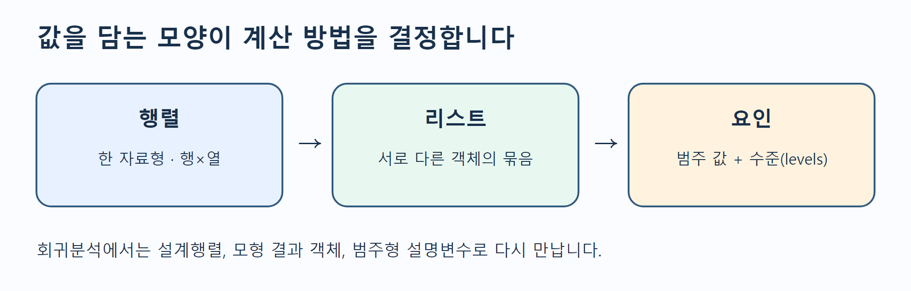
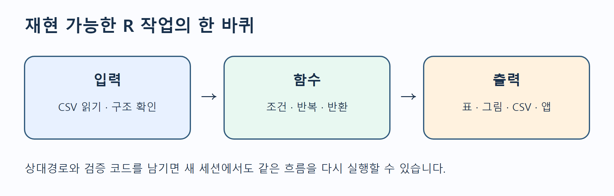

# 2주차 2차시 · R 문법 복습 ②

동덕여자대학교 · 회귀분석의 이해 · 유원상 교수 · 2026학년도 2학기  
수업일: 2026-09-09 · RStudio/R/브라우저 실습

이번 시간에는 주교재 2장의 남은 R 문법을 마칩니다. W02A에서 만든 벡터와
데이터프레임을 행렬·리스트·요인으로 확장하고, 파일을 읽어 조건에 따라 처리한 뒤
함수와 앱에서 재사용합니다. 예제는 수업용 합성 자료이며 실제 업무 기록이 아닙니다.

## 오늘의 목표

수업을 마치면 다음을 할 수 있습니다.

1. 행렬·리스트·요인의 구조와 쓰임을 구분한다.
2. 프로젝트 상대경로로 CSV를 읽고 구조·결측을 점검한 뒤 다시 저장한다.
3. 비교·논리 연산자와 `if/else`로 판단 규칙을 표현한다.
4. `for` 반복문과 벡터화·apply 계열 결과를 비교한다.
5. 입력–처리–반환을 갖춘 함수를 만들고 앱의 입력과 출력에 연결한다.



*그림 1. 주교재 2장의 자료구조 개념을 바탕으로 수업용 예와 배치를 독립적으로 재구성했습니다.*

## 1. W02A에서 이어가기

W02A에서는 `c()`로 벡터를 만들고 `data.frame()`으로 열을 묶었습니다. 아래 표는
이번 시간 전체에서 사용할 합성 자료입니다.

| id | units | minutes | shift |
|---|---:|---:|---|
| J01 | 1 | 18 | morning |
| J02 | 2 | 29 | morning |
| J03 | 3 | 35 | morning |
| J04 | 4 | 44 | afternoon |
| J05 | 5 | 52 | afternoon |
| J06 | 6 | 61 | afternoon |
| J07 | 7 | NA | evening |
| J08 | 8 | 79 | evening |

`minutes`의 `NA`는 작업 시간이 0분이라는 뜻이 아니라 값이 기록되지 않았다는 뜻입니다.
다음 표현식의 결과를 먼저 예상합니다.

```r
observations$minutes
observations[observations$units >= 5, c("id", "minutes")]
```

첫 줄은 한 열을 벡터로 반환합니다. 둘째 줄은 조건을 만족하는 행에서 지정한 열만 남긴
데이터프레임입니다. 같은 대괄호라도 객체의 차원과 쉼표 위치에 따라 결과가 달라집니다.

## 2. 자료구조를 목적에 맞게 고르기

### 행렬: 한 자료형의 직사각형

행렬은 모든 칸이 같은 자료형이어야 합니다. `cbind()`는 열을 나란히 붙입니다.

```r
design <- cbind(intercept = 1, units = observations$units)
design[1:3, ]
dim(design)
storage.mode(design)
```

`design[1:3, ]`에서 쉼표 뒤를 비워 모든 열을 유지합니다. 숫자 행렬에 문자 열을
붙이면 전체가 문자로 강제 변환될 수 있으므로 계산용 행렬과 설명용 표를 구분합니다.
다음 주차 이후 회귀모형의 설계행렬을 볼 때 이 구조를 다시 사용합니다.

### 리스트: 서로 다른 객체를 한 묶음으로

```r
lesson_object <- list(
  data = observations,
  design = design,
  note = "synthetic practice data"
)
names(lesson_object)
lesson_object$data$minutes
```

리스트는 데이터프레임, 행렬, 문자처럼 서로 다른 객체를 함께 담을 수 있습니다.
`lesson_object$data`는 `data`라는 구성요소를 고르고, 뒤의 `$minutes`는 그
데이터프레임에서 열을 고릅니다. 이후 `lm()` 결과도 계수·잔차·적합값 등을 묶은
리스트형 객체로 이해할 수 있습니다.

### 요인: 값과 가능한 수준을 함께 관리

```r
observations$shift <- factor(
  observations$shift,
  levels = c("morning", "afternoon", "evening")
)
levels(observations$shift)
table(observations$shift)
```

요인은 범주 값과 가능한 수준인 `levels`를 함께 보관합니다. 수준의 순서는 표와
모형의 기준 범주에 영향을 줄 수 있으므로 우연한 알파벳 순서에 맡기지 않습니다.
순서 자체에 의미가 있는 범주만 `ordered = TRUE`를 사용합니다.

| 구조 | 차원·구성 | 자료형 | 대표 선택 | 회귀분석 연결 |
|---|---|---|---|---|
| 벡터 | 1차원 | 한 종류 | `x[2]` | 한 변수 |
| 행렬 | 2차원 | 모든 칸 한 종류 | `x[행, 열]` | 계산·설계행렬 |
| 리스트 | 구성요소 묶음 | 서로 달라도 됨 | `x$name`, `x[[1]]` | 모형 결과 객체 |
| 요인 | 벡터+수준 | 범주 | `levels(x)` | 범주형 설명변수 |
| 데이터프레임 | 2차원 열 묶음 | 열마다 달라도 됨 | `x$col` | 분석 자료 |

## 3. 패키지와 도움말

패키지는 함수와 자료를 묶어 R을 확장합니다. 설치와 불러오기는 다른 작업입니다.

```r
help(mean)
?read.csv
find("filter")
```

```r
# 설치는 PC에 한 번, 인터넷과 권한이 필요할 수 있습니다.
# install.packages("패키지이름")

# 사용할 세션마다 불러옵니다.
# library(패키지이름)
```

이번 실습은 수업 중 설치 지연을 피하기 위해 기본 R만 사용합니다. 서로 다른 패키지가
같은 함수 이름을 제공하면 `package::function()`처럼 출처를 명시할 수 있습니다.
오류가 나면 바로 재설치하기 전에 패키지 철자, 설치 여부, 현재 R 버전을 확인합니다.

## 4. CSV 읽기–점검–저장–재읽기

재현 가능한 분석은 파일을 찾는 방법부터 재현 가능해야 합니다. RStudio 프로젝트를
열고 프로젝트 안의 상대경로를 사용합니다.

```r
data_path <- file.path("data", "w02b-observations.csv")
observations <- read.csv(
  data_path,
  na.strings = "",
  stringsAsFactors = FALSE
)
head(observations)
str(observations)
colSums(is.na(observations))
```

`file.path()`는 운영체제에 맞는 경로 구분자를 만듭니다. `str()`는 열의 자료형을,
`colSums(is.na(...))`는 열별 결측 개수를 보여 줍니다. 파일이 열렸다는 사실만으로
자료가 올바르게 읽힌 것은 아닙니다.

```r
output_path <- file.path("data", "w02b-summary-output.csv")
write.csv(observations, output_path, row.names = FALSE, na = "")
round_trip <- read.csv(output_path, na.strings = "")
stopifnot(nrow(round_trip) == nrow(observations))
```

`row.names = FALSE`를 생략하면 필요하지 않은 행 이름 열이 추가될 수 있습니다.
저장한 파일을 다시 읽는 왕복 검사는 구분자·열 이름·결측 표현 문제를 빨리 찾습니다.
중요한 원본 파일을 같은 이름으로 덮어쓰지 말고 출력 이름을 분리합니다.



*그림 2. 입력–처리–출력의 재현 가능한 흐름을 수업용으로 독립 제작했습니다.*

## 5. 연산자로 판단 규칙 만들기

```r
observed <- !is.na(observations$minutes)
within_range <- observations$minutes >= 40 & observations$minutes <= 70
needs_review <- is.na(observations$minutes) |
  observations$minutes < 0 |
  observations$minutes > 120
```

| 연산자 | 뜻 | 예 |
|---|---|---|
| `==`, `!=` | 같음, 다름 | `shift == "morning"` |
| `<`, `<=`, `>`, `>=` | 크기 비교 | `minutes <= 45` |
| `!` | 부정 | `!is.na(minutes)` |
| `&`, `|` | 원소별 그리고, 또는 | 벡터 조건 선택 |
| `&&`, `||` | 첫 판단의 그리고, 또는 | 주로 `if` 조건 |

`x == NA`는 원하는 결측 판정을 만들지 못합니다. `is.na(x)`를 사용합니다. 두 조건을
동시에 만족해야 한다면 `&`, 하나라도 만족하면 `|`입니다. 괄호로 판단 단위를 명확히
하면 실수를 줄일 수 있습니다.

## 6. if/else: 한 번의 판단

```r
threshold <- 45
one_value <- 52

if (is.na(one_value)) {
  "missing"
} else if (one_value <= threshold) {
  "fast"
} else {
  "slow"
}
```

결측 여부를 먼저 확인하는 이유는 `if`가 하나의 확실한 `TRUE` 또는 `FALSE`를
필요로 하기 때문입니다. 벡터 전체의 각 값을 나누려면 반복문, `ifelse()`, 또는
목적에 맞는 벡터화 함수를 사용합니다.

```r
label <- ifelse(
  is.na(observations$minutes), "missing",
  ifelse(observations$minutes <= threshold, "fast", "slow")
)
table(label)
```

`ifelse()`는 편리하지만 결과 자료형이 단순화될 수 있습니다. 범주 순서를 보존하려면
마지막에 `factor(..., levels = ...)`로 명시합니다.

## 7. 반복문과 벡터화

```r
loop_result <- numeric(nrow(observations))
for (i in seq_len(nrow(observations))) {
  loop_result[i] <- observations$units[i] * 10
}

vector_result <- observations$units * 10
stopifnot(identical(loop_result, vector_result))
```

`seq_len(n)`은 1부터 n까지 안전하게 만듭니다. 결과 벡터를 먼저 할당하면 반복할
때마다 길이를 늘리는 일을 피할 수 있습니다. 반복문은 나쁜 문법이 아니라 절차가
분명한 도구입니다. 다만 같은 계산을 각 원소에 독립적으로 적용할 때는 벡터 연산이
더 짧고 의도가 선명합니다.

## 8. 함수로 재사용하기

```r
classify_minutes <- function(minutes, threshold = 45) {
  stopifnot(is.numeric(minutes), length(threshold) == 1L,
            is.finite(threshold))
  label <- ifelse(
    is.na(minutes), "missing",
    ifelse(minutes <= threshold, "fast", "slow")
  )
  factor(label, levels = c("fast", "slow", "missing"), ordered = TRUE)
}

observations$status <- classify_minutes(observations$minutes, 45)
table(observations$status)
```

좋은 작은 함수는 입력, 처리 규칙, 반환값을 구분합니다. `stopifnot()`는 잘못된 입력을
조용히 통과시키지 않습니다. 함수 안에서 만든 이름은 보통 함수 밖의 동명 객체를
바꾸지 않습니다. 마지막으로 계산된 표현식이 반환되지만 중요한 함수에서는
`return()`을 명시해도 됩니다.

## 9. apply 계열의 입력과 출력

```r
sapply(
  observations[c("units", "minutes")],
  mean,
  na.rm = TRUE
)

apply(design, 1, mean)  # 각 행
apply(design, 2, mean)  # 각 열
```

- `lapply(X, FUN)`은 리스트를 반환합니다.
- `sapply(X, FUN)`은 가능하면 벡터나 행렬로 단순화합니다.
- `apply(X, MARGIN, FUN)`은 주로 행렬·배열의 행 또는 열에 함수를 적용합니다.

함수 이름만 보고 결과 모양을 가정하지 말고 `class()`, `length()`, `dim()`, `str()`로
확인합니다. 데이터프레임 전체에 `apply()`를 쓰면 문자 열 때문에 행렬로 강제 변환될
수 있으므로 계산할 숫자 열을 먼저 선택합니다.

## 10. R 문법 실험실 앱

누적 앱에는 1주차의 수리시간 예측 기능을 그대로 두고 **R 문법 실험실** 탭을
추가했습니다. 임계값과 근무조를 바꾸면 다음 흐름이 실행됩니다.

1. UI가 임계값과 근무조를 입력으로 받습니다.
2. 조건문이 선택한 근무조를 거릅니다.
3. `classify_minutes()`가 각 시간을 fast/slow/missing 요인으로 바꿉니다.
4. 같은 결과가 요약 문장, 표, 그래프에 전달됩니다.

앱에서 45분과 55분 기준을 비교하세요. 기준을 바꾸면 원자료가 바뀌는 것이 아니라
같은 값을 해석하는 규칙이 바뀝니다. 근무조별 행 수가 작으므로 화면의 차이를 모집단의
일반적 차이로 확대 해석하지 않습니다.

## 자주 만나는 오류

| 증상 | 원인 후보 | 확인·해결 |
|---|---|---|
| cannot open the connection | 작업 폴더·상대경로·파일명 | `getwd()`, `list.files("data")` |
| object not found | 정의 줄 미실행·철자 | 위에서부터 다시 실행 |
| argument is of length zero | `if`에 길이 0 입력 | `length()`와 필터 결과 확인 |
| missing value where TRUE/FALSE needed | `if` 조건이 `NA` | `is.na()`를 먼저 검사 |
| non-numeric argument | 문자 열이 계산에 포함 | `str()`로 자료형 확인 |
| 예상하지 않은 열 추가 | CSV에 행 이름 저장 | `row.names = FALSE` |
| apply 결과가 문자 | 혼합형 데이터프레임의 강제 변환 | 숫자 열만 선택 |

## 점검 퀴즈

1. 행렬과 데이터프레임의 자료형 규칙은 어떻게 다른가요?
2. 리스트가 이후 회귀모형 결과를 이해하는 데 도움이 되는 이유는 무엇인가요?
3. 요인의 값과 `levels`는 어떻게 다른가요?
4. `install.packages()`와 `library()`는 각각 언제 사용하나요?
5. CSV를 읽은 직후 `str()`와 결측 개수를 확인하는 이유는 무엇인가요?
6. 벡터 조건에서 `&`와 `&&`는 어떻게 다른가요?
7. `if` 조건이 `NA`가 되지 않도록 어떤 검사를 먼저 할 수 있나요?
8. 반복문과 벡터 연산의 결과가 같은지 어떤 코드로 검증할 수 있나요?
9. `apply(X, 1, mean)`과 `apply(X, 2, mean)`은 각각 어느 방향을 계산하나요?
10. 앱에서 임계값을 바꾸는 것은 원자료를 바꾸는 것인가요, 분류 규칙을 바꾸는 것인가요?

## 핵심 정리와 참고자료

자료구조는 값을 담는 모양이고, 함수는 입력을 처리해 결과를 반환하는 재사용 단위입니다.
상대경로로 자료를 읽고 구조와 결측을 확인한 뒤, 작은 조건과 함수를 조합하여 표·그림·앱까지
같은 계산을 공유하세요. 이 흐름이 앞으로의 회귀분석 실습을 재현 가능하게 만듭니다.

- 주교재 Chapter 2: 행렬·리스트·요인, 패키지, 입출력, 연산자, 제어문, 반복문, 함수와 apply 계열. 원본 스캔은 재배포하지 않았습니다.
- [R 공식 입문서](https://cran.r-project.org/doc/manuals/r-release/R-intro.html): 자료구조, 제어문, 함수.
- [R Data Import/Export](https://cran.r-project.org/doc/manuals/r-release/R-data.html): 표 형식 자료의 읽기와 쓰기.
- [Posit Shiny 반응형 요소](https://shiny.posit.co/r/getstarted/build-an-app/reactivity-essentials/reactive-elements.html): 입력–계산–출력 연결.
