# 산점도에서 회귀분석으로

> **회귀분석의 이해 · 2026년 9월 14일 월요일 · 3주차 1차시**  
> 주교재 3.2 공분산과 상관계수, 3.3 컴퓨터 수리시간 사례

## 1. 오늘의 질문: 수리 예약에 몇 분을 배정할까?

컴퓨터 수리점에서 고객이 “부품 4개를 고쳐야 합니다”라고 말한다. 직원에게 필요한 것은 “부품 수와 수리시간은 관련이 있다”라는 설명만이 아니다. 예약표에 **몇 분을 배정할지**도 판단해야 한다.

오늘은 이 질문을 세 단계로 나누어 생각한다.

1. **그림으로 보기:** 부품 수가 많을수록 수리시간도 긴가?
2. **숫자로 요약하기:** 함께 증가하는 경향은 얼마나 뚜렷한가?
3. **예측으로 나아가기:** 부품 수를 알면 수리시간을 더 잘 예상할 수 있는가?

공분산과 상관계수는 두 번째 질문에 답하는 도구다. 회귀분석은 세 번째 질문으로 나아갈 수 있게 한다. 오늘은 모형의 추정·검정을 배우기 전에 그 필요성과 기본 아이디어를 이해한다.

**학습목표:** 산점도 읽기, 편차의 곱 설명하기, 공분산·상관계수 손계산하기, 상관의 한계 구분하기, 관계 요약과 예측의 차이 설명하기.

## 2. 한 점은 한 건의 관측이다

수리 기록에서 $X$는 수리할 부품 수(개), $Y$는 수리시간(분)이다. 가로축에 $X$, 세로축에 $Y$를 놓는다. **같은 수리 건의 두 값**이 하나의 점이 된다. $(4,64)$는 “4번째 수리”가 아니라 “부품 4개, 수리시간 64분인 한 건”이다.

| 수리 건 | 부품 수 $x_i$ | 수리시간 $y_i$ | 산점도에 찍을 점 |
|---|---:|---:|---|
| A | 2 | 29 | $(2,29)$ |
| B | 4 | 64 | $(4,64)$ |
| C | 4 | 74 | $(4,74)$ |
| D | 8 | 119 | $(8,119)$ |

위 네 건은 교재 사례의 일부다. B와 C는 부품 수가 같지만 수리시간은 다르다. 따라서 “부품 수만 알면 시간이 완벽하게 정해진다”고 생각하면 안 된다. 부품 종류·고장 정도·작업 조건 등 기록되지 않은 요인이 있을 수 있다. 이것은 가능한 해석이지, 이 자료에서 해당 요인을 실제로 측정했다는 뜻은 아니다.

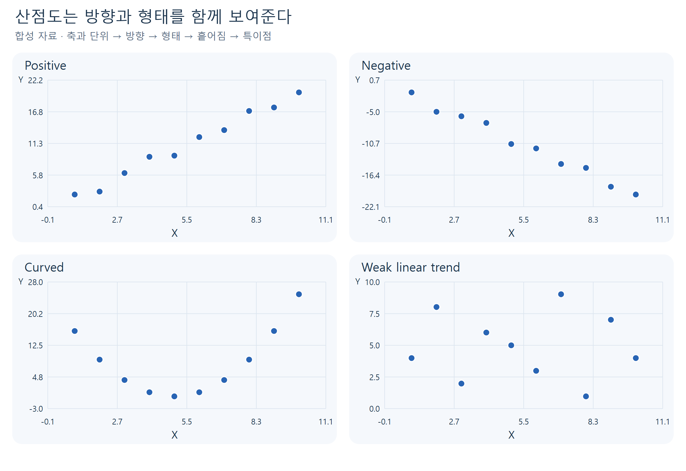

**그림 1.** 각 패널은 개념 설명을 위한 합성 자료다. 점의 높이가 아니라 **왼쪽에서 오른쪽으로 갈 때의 패턴**을 비교한다. 점을 선으로 연결하지 않아도 관계를 읽을 수 있다.

### 산점도를 읽는 다섯 가지 순서

| 읽을 것 | 확인할 내용 | 말로 설명하는 예 |
|---|---|---|
| 축·단위 | 무엇을 어떤 단위로 측정했는가? | “가로는 부품 수, 세로는 분이다.” |
| 방향 | 함께 증가하는가, 반대로 움직이는가? | “부품 수가 많을수록 시간이 긴 편이다.” |
| 형태 | 직선 주변인가, 곡선인가? | “직선으로 대략 요약할 수 있어 보인다.” |
| 흩어짐 | 같은 $X$에서 $Y$는 얼마나 다양한가? | “부품 수가 같아도 시간이 다르다.” |
| 특이점 | 전체 패턴에서 벗어난 점이 있는가? | “몇 점이 전체 인상을 좌우하는지 살핀다.” |

**직접 확인 E1.** $(4,64)$와 $(4,74)$는 어느 방향으로 나란히 놓이는가? 두 점 사이의 거리는 무엇을 뜻하는가? 힌트: 가로좌표가 같다.

## 3. 평균에서 얼마나 벗어났는가?

“함께 크다”를 판단하려면 비교 기준이 필요하다. 각 변수의 **표본평균**을 기준으로 삼는다.

$$
\bar{x}=\frac{1}{n}\sum_{i=1}^{n}x_i,\qquad
\bar{y}=\frac{1}{n}\sum_{i=1}^{n}y_i.
$$

| 기호 | 뜻 | 읽는 방법 |
|---|---|---|
| $n$ | 관측한 쌍의 개수 | 데이터가 네 쌍이면 $n=4$ |
| $i$ | 관측을 구별하는 번호 | $x_i,y_i$는 같은 관측의 두 값 |
| $\sum$ | 지정한 항을 모두 더하라는 기호 | $\sum x_i=x_1+\cdots+x_n$ |
| $\bar{x},\bar{y}$ | 각 변수의 표본평균 | 합계를 관측 수로 나눈 값 |
| $x_i-\bar{x}$ | $X$의 편차 | 평균보다 크면 양수, 작으면 음수 |

### 풀이 예제 1: 평균과 편차를 먼저 계산한다

손계산을 위해 만든 작은 합성 자료를 사용하자. 교재의 실제 수리시간 데이터와는 다른 **계산 연습용 자료**다.

$$X=(1,2,3,4),\qquad Y=(2,4,4,6).
$$

**1단계. 평균:** $\bar{x}=(1+2+3+4)/4=2.5$, $\bar{y}=(2+4+4+6)/4=4$.

**2단계. 관측마다 평균을 뺀다.**

| $i$ | $x_i$ | $y_i$ | $x_i-2.5$ | $y_i-4$ |
|---|---:|---:|---:|---:|
| 1 | 1 | 2 | $-1.5$ | $-2$ |
| 2 | 2 | 4 | $-0.5$ | $0$ |
| 3 | 3 | 4 | $0.5$ | $0$ |
| 4 | 4 | 6 | $1.5$ | $2$ |

첫 관측은 두 평균보다 모두 작고, 마지막 관측은 두 평균보다 모두 크다. 평균을 뺀 값들의 합은 각 열에서 0이다. 따라서 편차를 그냥 더해서는 함께 움직이는 정도를 알아낼 수 없다.

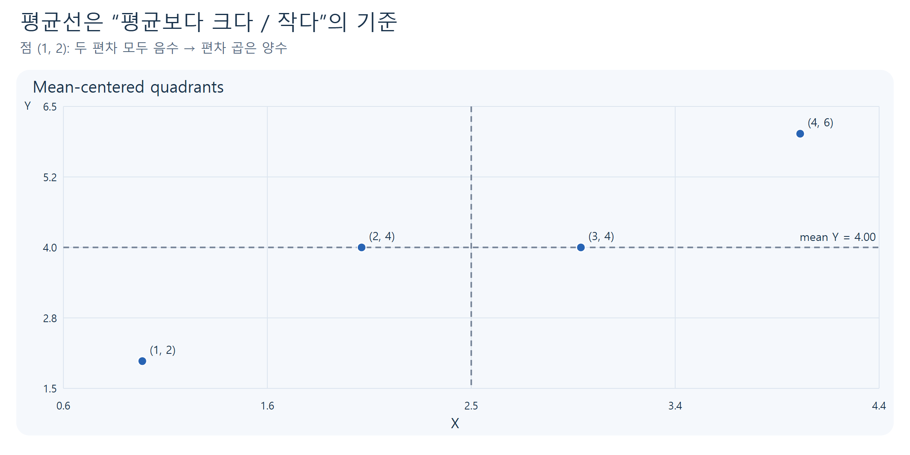

**그림 2.** 가로축·세로축의 원점이 아니라 **두 평균선의 교점**을 기준으로 영역을 나눈다. 평균선 위의 점은 편차 하나가 0이므로 편차의 곱도 0이다. 교재 그림 3.1의 개념을 작은 계산 자료로 새로 구성했다.

## 4. 왜 편차 두 개를 곱할까?

한 관측의 두 편차를 곱하면 “두 변수가 평균을 기준으로 같은 방향에 있는가?”를 부호로 표시할 수 있다.

| $X$의 위치 | $Y$의 위치 | 편차의 곱 | 관계에 대한 기여 |
|---|---|---|---|
| 평균보다 큼 | 평균보다 큼 | $(+)\times(+)=+$ | 함께 큰 관측 |
| 평균보다 작음 | 평균보다 작음 | $(-)\times(-)=+$ | 함께 작은 관측 |
| 평균보다 큼 | 평균보다 작음 | $(+)\times(-)=-$ | 반대쪽에 있는 관측 |
| 평균보다 작음 | 평균보다 큼 | $(-)\times(+)=-$ | 반대쪽에 있는 관측 |

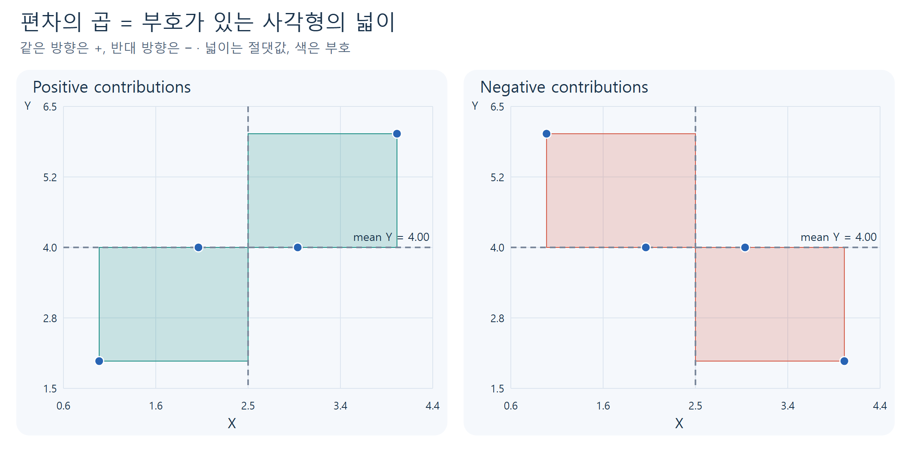

**그림 3.** 사각형의 넓이는 편차 곱의 **절댓값**이다. 색은 부호를 나타낸다. 넓이는 음수가 될 수 없지만, 대수적으로 합산하는 편차의 곱은 음수일 수 있다. 넓은 사각형을 만드는 점은 합에 크게 기여한다.

여기서 “양의 영역에 점이 더 많으면 반드시 양의 공분산”이라고 단정하면 안 된다. **점의 개수뿐 아니라 편차 곱의 크기**도 중요하다. 평균에서 멀리 떨어진 한 점이 작은 여러 점보다 더 크게 작용할 수 있다.

### 풀이 예제 2: 공분산을 표 한 장으로 계산한다

앞의 네 쌍을 계속 사용한다. 마지막 열은 같은 행의 두 편차를 곱한 값이다.

| $i$ | $x_i-\bar{x}$ | $y_i-\bar{y}$ | $(x_i-\bar{x})(y_i-\bar{y})$ |
|---|---:|---:|---:|
| 1 | $-1.5$ | $-2$ | $3$ |
| 2 | $-0.5$ | $0$ | $0$ |
| 3 | $0.5$ | $0$ | $0$ |
| 4 | $1.5$ | $2$ | $3$ |
| 합 | $0$ | $0$ | $6$ |

**표본 공분산**은 편차 곱의 합을 $n-1$로 나눈 값이다.

$$
s_{xy}=\operatorname{cov}(X,Y)
=\frac{\sum_{i=1}^{n}(x_i-\bar{x})(y_i-\bar{y})}{n-1}
=\frac{6}{4-1}=2.
$$

결과가 양수라는 것은 두 변수가 표본에서 함께 증가하는 선형 경향을 가진다는 뜻이다. 여기서 2는 “2배 증가한다”거나 “2만큼의 기울기”라는 뜻이 아니다.

**왜 $n-1$인가?** 이 수업에서는 모집단 전체가 아니라 표본으로 공분산을 계산한다. 표본평균을 데이터에서 구하면 편차들의 합이 0이라는 제약이 생긴다. 표준적인 표본 분산·공분산은 이를 반영해 $n-1$을 사용한다. 엄밀한 불편성 증명은 오늘 범위 밖이다. R의 `cov()`도 같은 분모를 사용한다.

**직접 확인 E2.** 위 자료에서 $Y$를 $(6,4,4,2)$로 바꾸면 공분산의 부호와 값은 어떻게 될까? 먼저 그림을 예상한 뒤 편차의 곱을 계산하라.

## 5. 공분산에는 단위가 남아 있다

$X$가 부품 수(개), $Y$가 시간(분)이면 $s_{xy}$의 단위는 **개·분**이다. 시간 단위를 분에서 초로 바꾸면 모든 $Y$의 숫자는 60배가 된다. 실제 수리 사건은 그대로인데 공분산도 60배가 된다.

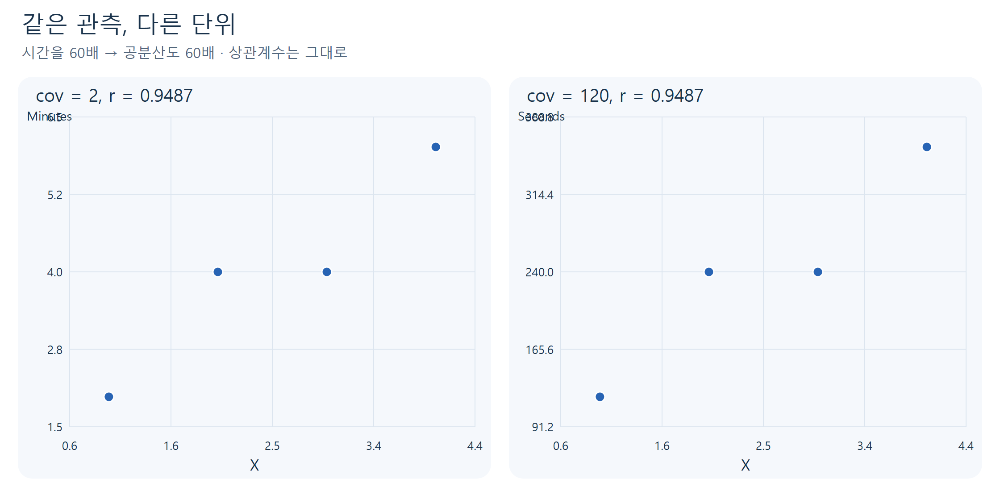

**그림 4.** 두 그림은 같은 합성 관측이다. 오른쪽 세로축은 왼쪽의 60배다. 축 단위를 읽지 않고 공분산 숫자만 비교하면 관계가 더 강해졌다고 오해할 수 있다.

단위를 양의 상수배로 바꿀 때는 다음이 성립한다.

$$
\operatorname{cov}(X,60Y)=60\operatorname{cov}(X,Y).
$$

상수를 더하면 평균도 같은 만큼 이동하므로 편차는 변하지 않는다. 예를 들어 모든 시간에 10분을 더해도 공분산은 그대로다. 일반적으로는

$$
\operatorname{cov}(aX+b,cY+d)=ac\operatorname{cov}(X,Y).
$$

이 식은 새 관측을 만드는 공식이 아니라 **척도 변환의 효과**를 정리한 것이다. 서로 단위가 다른 두 연구의 공분산을 보고 “숫자가 더 큰 연구에서 관계가 더 강하다”고 바로 비교할 수 없다.

## 6. 표준편차로 나누면 단위가 없어진다

공분산에서 단위와 산포 크기의 영향을 제거하려면 각 변수의 표준편차로 나눈다. 표본 표준편차는 평균 주변의 퍼짐을 원래 단위로 나타내는 값이다.

$$
s_x=\sqrt{\frac{\sum_{i=1}^{n}(x_i-\bar{x})^2}{n-1}},\qquad
s_y=\sqrt{\frac{\sum_{i=1}^{n}(y_i-\bar{y})^2}{n-1}}.
$$

편차를 제곱하면 음수와 양수가 상쇄되지 않는다. 평균적인 제곱 크기를 구한 뒤 제곱근을 취해 원래 단위로 돌아온다. 여기서는 **표본 표준편차**를 쓰므로 분모가 $n-1$이다.

**표준화 값** $z_{xi}=(x_i-\bar{x})/s_x$는 “평균에서 표준편차 몇 개만큼 떨어져 있는가?”를 나타낸다. $z=1$이면 평균보다 표준편차 하나만큼 크다. 단위가 같아야 한다는 제약 없이 두 변수의 위치를 비교할 수 있다.

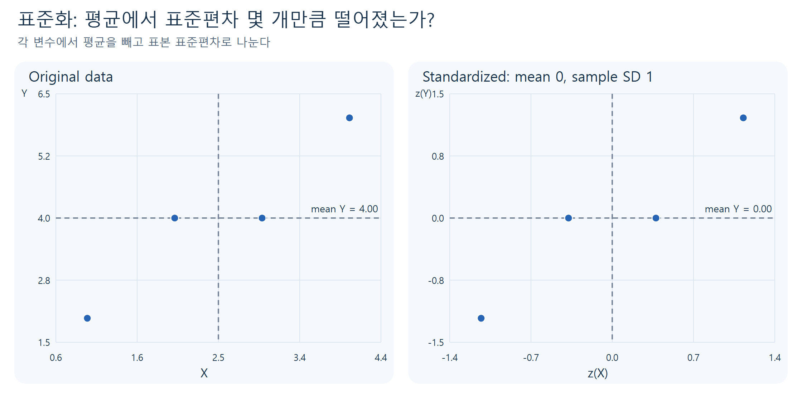

**그림 5.** 점의 상대적인 선형 패턴은 유지된다. 표준화 후 각 축의 평균은 0, 표본 표준편차는 1이다. 표준화한다고 분포가 정규분포로 바뀌는 것은 아니다.

### 풀이 예제 3: 상관계수를 끝까지 계산한다

앞의 작은 자료에서 필요한 합은 다음과 같다.

$$
\begin{aligned}
S_{xx}&=(-1.5)^2+(-0.5)^2+(0.5)^2+(1.5)^2=5,\\
S_{yy}&=(-2)^2+0^2+0^2+2^2=8,\\
S_{xy}&=3+0+0+3=6.
\end{aligned}
$$

$S_{xx}$, $S_{yy}$, $S_{xy}$는 계산을 간단히 적기 위해 이름 붙인 **합계**다. 아직 $n-1$로 나누지 않았다.

$$
s_x=\sqrt{5/3}\approx1.2910,\qquad s_y=\sqrt{8/3}\approx1.6330.
$$

표본 Pearson 상관계수 $r$는 다음과 같다.

$$
r=\frac{s_{xy}}{s_xs_y}
=\frac{2}{\sqrt{5/3}\sqrt{8/3}}
=\frac{6}{\sqrt{5\times8}}
\approx0.9487.
$$

**해석:** 이 네 쌍에서는 강한 양의 선형관계가 나타난다. $r=0.9487$은 “94.87%의 관측이 맞는다”, “94.87%의 원인을 설명한다”, “기울기가 0.9487이다”라는 뜻이 아니다.

분모에서 단위가 상쇄되므로 $r$에는 단위가 없다. 두 표준편차가 모두 양수일 때 $-1\le r\le1$이다. 한 변수가 모든 관측에서 같은 값이면 표준편차가 0이 되어 이 상관계수는 정의되지 않는다.

| 상관계수 | 기본 해석 | 주의할 점 |
|---|---|---|
| $r>0$ | 양의 선형 경향 | 인과 방향을 알려주지 않음 |
| $r<0$ | 음의 선형 경향 | 관계가 약하다는 뜻이 아님 |
| $|r|$가 1에 가까움 | 직선에 가까운 경향 | 이상점·표본 크기·맥락도 확인 |
| $r=0$ | 표본의 선형 동행이 상쇄됨 | 관계 자체가 없다는 뜻은 아님 |
| $r=1$ 또는 $-1$ | 모든 점이 양·음의 기울기의 직선 위 | 두 변수 모두 변동이 있어야 함 |

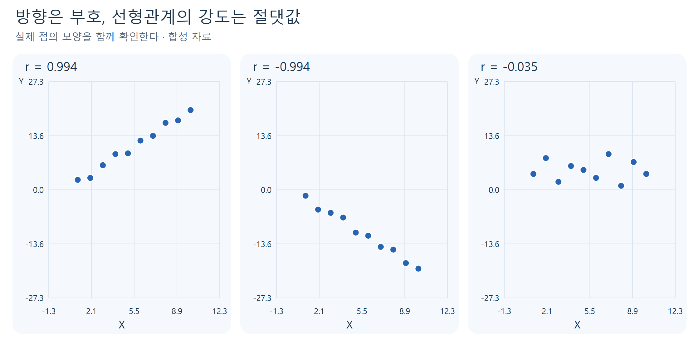

**그림 6.** 방향은 부호로, 직선 주변에 모이는 정도는 절댓값으로 읽는다. “강함”의 보편적인 경계값이 있는 것은 아니며, 이 자료의 맥락에서 해석해야 한다.

### 풀이 예제 4: 분을 초로 바꾸어도 상관은 같은가?

풀이 예제 2의 자료를 시간 측정의 합성 예로 생각하고 $Y^*=60Y$로 바꾸자.

1. 새 공분산: $s_{x,y^*}=60\times2=120$.
2. 새 표준편차: $s_{y^*}=60s_y$.
3. 상관계수에서 60이 약분된다.

$$
r_{X,Y^*}=\frac{60s_{xy}}{s_x(60s_y)}=r_{X,Y}\approx0.9487.
$$

양의 단위 변환과 평행이동은 상관을 바꾸지 않는다. 반면 $Y^*=-Y$처럼 **방향을 뒤집으면 부호가 반대**가 된다. “어떤 변환을 해도 상관은 불변”이라고 외우면 안 된다. 제곱·로그 같은 비선형 변환도 일반적으로 상관을 바꾼다.

**직접 확인 E3.** 같은 자료의 $Y$에 100을 더하면 공분산과 상관계수는 어떻게 되는가? $Y$에 $-1$을 곱하는 경우와 비교하라.

## 7. 숫자가 0이어도 관계는 남아 있을 수 있다

교재는 비선형 관계가 있는데 상관계수는 0인 예를 제시한다. 원리를 더 쉽게 계산하기 위해 아래의 작은 합성 자료를 사용한다.

| $X$ | $-2$ | $-1$ | $0$ | $1$ | $2$ |
|---|---:|---:|---:|---:|---:|
| $Y=X^2$ | 4 | 1 | 0 | 1 | 4 |

이때 $\bar{x}=0$, $\bar{y}=2$이다. 편차 곱은 순서대로 $-4,1,0,-1,4$이며 합은 0이다. 따라서 $s_{xy}=0$, $r=0$이다. 하지만 $X$를 알면 $Y=X^2$로 정확히 알 수 있다.

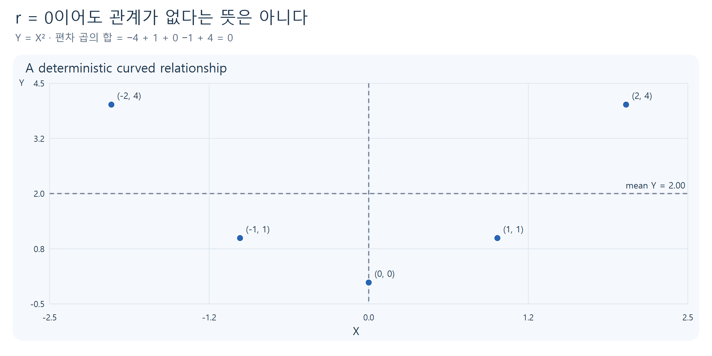

**그림 7.** 왼쪽 구간에서는 $X$가 증가할 때 $Y$가 감소하고, 오른쪽에서는 증가한다. 두 방향이 상쇄된 결과가 상관 0이다. 교재 그림 3.2의 핵심을 별도의 작은 자료로 재구성했다.

**직접 확인 E4.** 이 자료에서 “$r=0$이므로 $X$를 알아도 $Y$ 예측에 도움이 없다”라는 주장이 틀린 이유를 한 문장으로 설명하라.

### 거의 같은 상관계수, 전혀 다른 네 그림

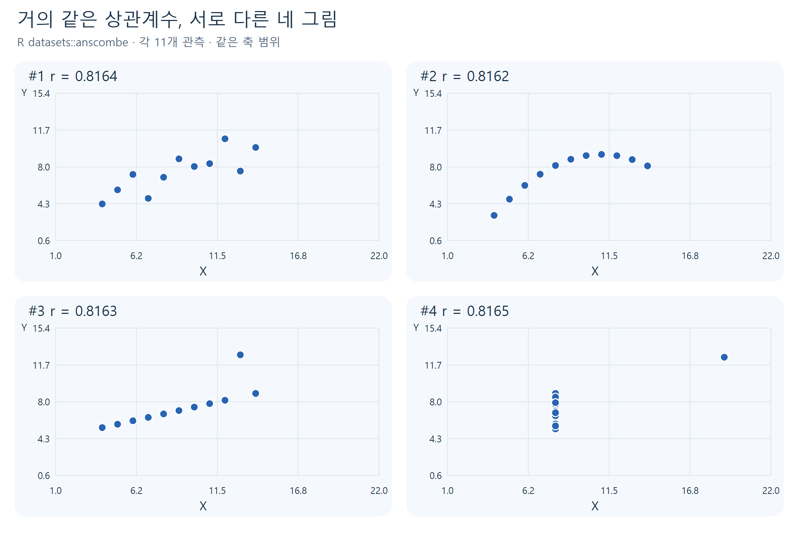

**그림 8.** R 내장 `anscombe`의 실제 수치로 다시 그린 네 산점도다. 상관계수는 모두 약 0.816이지만, 첫째는 비교적 선형이고 둘째는 곡선이며 셋째와 넷째는 특정 점의 영향이 크다. 교재 그림 3.3과 같은 통계적 사실을 독립적인 배치와 표시로 시각화했다.

상관계수는 많은 점을 하나의 숫자로 압축한다. 그 과정에서 형태·이상점·집단 구조 같은 정보를 잃는다. **상관을 계산하기 전에 산점도, 계산한 뒤에도 산점도**를 확인한다.

## 8. 실제 사례: 컴퓨터 수리시간 14건

주교재 3.3은 컴퓨터를 판매·수리하는 회사의 수리기록을 다룬다. 반응변수 `Minutes`는 수리시간(분), 예측변수 `Units`는 교체·수리가 필요한 부품 수(개)다. 다음은 교재 표 3.4의 수치이며, 기존 수업 데이터 파일과 대조했다.

| 관측 | Units | Minutes | 관측 | Units | Minutes |
|---|---:|---:|---|---:|---:|
| 1 | 1 | 23 | 8 | 6 | 97 |
| 2 | 2 | 29 | 9 | 7 | 109 |
| 3 | 3 | 49 | 10 | 8 | 119 |
| 4 | 4 | 64 | 11 | 9 | 149 |
| 5 | 4 | 74 | 12 | 9 | 145 |
| 6 | 5 | 87 | 13 | 10 | 154 |
| 7 | 6 | 96 | 14 | 10 | 166 |

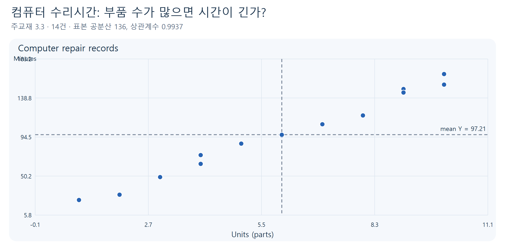

**그림 9.** 오른쪽 위로 매우 뚜렷하게 증가한다. 같은 부품 수에서도 시간이 조금씩 달라 완전한 직선은 아니다. 교재 그림 3.4의 데이터를 직접 다시 그렸다.

### 풀이 예제 5: 표 전체를 공식과 연결한다

**1단계. 데이터의 개수와 합**

$$
n=14,\qquad \sum x_i=84,\qquad \sum y_i=1361.
$$

**2단계. 평균**

$$
\bar{x}=84/14=6,\qquad \bar{y}=1361/14\approx97.2143.
$$

**3단계. 행 하나를 먼저 이해한다.** 첫 수리 건 $(1,23)$의 편차는 $1-6=-5$, $23-97.2143=-74.2143$이다. 두 변수 모두 평균보다 작으므로 편차 곱은 양수다.

$$(-5)(-74.2143)\approx371.0714.
$$

부품이 6개인 관측에서는 $x_i-\bar{x}=0$이므로 편차 곱이 0이다. **그 관측이 불필요한 자료라는 뜻은 아니다.** 공분산의 해당 항만 0인 것이다.

**4단계. 14개 행을 합한다.** 중간값을 반올림하지 않고 계산하면 다음 값을 얻는다.

$$
S_{xx}=114,\qquad S_{yy}\approx27768.3571,\qquad S_{xy}=1768.
$$

**5단계. 공분산과 상관계수**

$$
s_{xy}=\frac{1768}{13}=136\ \text{개·분},
\qquad
r=\frac{1768}{\sqrt{114\times27768.3571}}\approx0.9937.
$$

**6단계. 말로 해석한다.** “이 14건에서는 부품 수와 수리시간 사이에 매우 강한 양의 선형관계가 관찰된다.” 표본이 작고 한 회사의 기록이므로 모든 회사·모든 수리 상황에 같은 관계가 그대로 적용된다고 단정하지 않는다.

상관 0.9937은 강한 관계를 보여주지만, 여전히 **‘부품 7개면 몇 분인가?’라는 질문의 단위 있는 답**은 아니다. 예측에는 관계를 수식으로 표현하는 추가 단계가 필요하다.

## 9. 회귀분석을 배우는 이유: 평균에서 조건부 예측으로

아무 정보가 없다면 모든 수리에 전체 평균인 약 97.2분을 배정하는 방법을 생각할 수 있다. 하지만 부품 1개인 수리와 10개인 수리에 같은 시간을 배정하는 것이 적절할까?

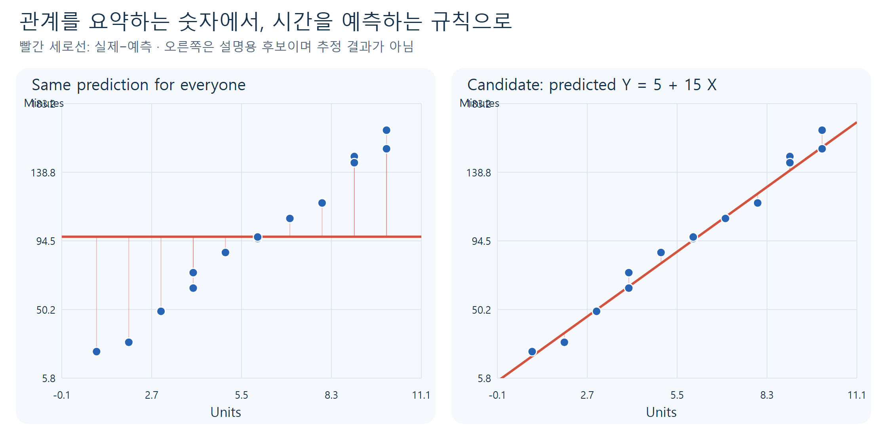

**그림 10.** 왼쪽은 부품 수를 사용하지 않은 평균 예측이다. 오른쪽은 설명을 위해 제안한 후보 규칙 $\widehat{Y}=5+15X$다. 이 규칙은 이번 예시에서 비교하기 위해 정한 것이며, 최적이라고 추정한 결과가 아니다. 실제 점과 예측선 사이의 세로 차이에 주목한다.

### 풀이 예제 6: 후보 예측 규칙을 실제 관측과 비교한다

후보 규칙을 “기본 준비시간 5분에 부품당 15분을 더한다”라고 읽어보자.

$$\widehat{Y}=5+15X.
$$

$\widehat{Y}$는 실제 시간이 아니라 **예측값**이다. 5의 단위는 분, 15의 단위는 분/개다. 이 해석은 후보 규칙의 산술적 의미이며 실제 작업의 고정시간·부품당 시간이 확인됐다는 뜻은 아니다.

| 부품 수 $X$ | 실제 시간 $Y$ | 후보 예측 $\widehat{Y}$ | 실제−예측 $Y-\widehat{Y}$ |
|---|---:|---:|---:|
| 4 | 64 | $5+15\times4=65$ | $-1$ |
| 4 | 74 | $65$ | $9$ |
| 9 | 149 | $5+15\times9=140$ | $9$ |
| 9 | 145 | $140$ | $5$ |

양의 차이는 예측보다 실제 시간이 길었다는 뜻이고, 음의 차이는 짧았다는 뜻이다. 같은 $X$에는 같은 후보 예측을 주지만 실제 $Y$는 서로 다르다. 다음 차시에는 데이터를 이용해 이러한 예측 직선을 어떻게 정하고 차이를 어떻게 평가하는지 배운다.

**직접 확인 E5.** 후보 규칙으로 부품 7개의 시간을 계산하라. 그 값이 미래의 모든 수리에서 반드시 맞는다고 말할 수 없는 이유도 쓰라.

### 상관과 회귀의 역할을 구분하기

| 비교 | 상관계수 | 회귀분석 |
|---|---|---|
| 기본 질문 | 두 변수의 선형관계는 어느 방향·정도인가? | $X$를 알 때 $Y$를 어떻게 설명·예측할까? |
| 변수 역할 | $r_{XY}=r_{YX}$로 대칭적 | 예측변수와 반응변수의 역할을 정함 |
| 결과 단위 | 없음 | 시간 예측이라면 분처럼 반응변수 단위 |
| 주의 | 숫자 하나가 형태를 모두 담지 못함 | 모형 가정·불확실성·적용 범위를 확인해야 함 |

수리시간으로 부품 수를 역으로 예측하는 문제는 다른 예측 문제다. $X,Y$를 바꾸어도 상관계수는 같지만, 회귀 문제의 목표까지 같아지는 것은 아니다.

## 10. 두 가지 경고: 이상점과 인과관계

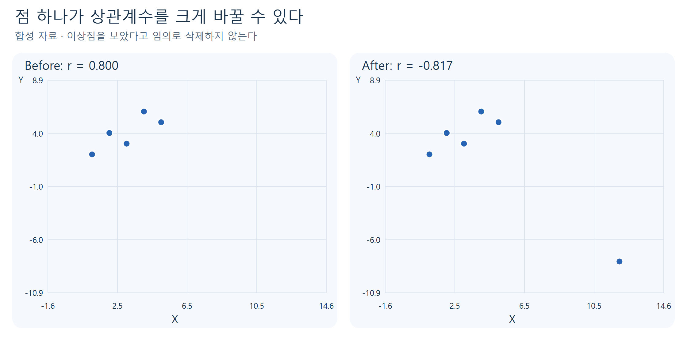

**그림 11.** 합성 자료의 점 하나가 전체 상관을 크게 바꿀 수 있다. 상관을 원하는 방향으로 만들기 위해 점을 임의로 삭제하면 안 된다. 입력 오류인지, 다른 조건의 관측인지, 중요한 실제 사례인지 먼저 조사한다.

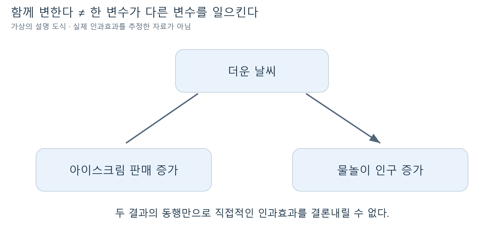

**그림 12.** 인과 오해를 설명하기 위한 가상의 개념도다. 아이스크림 판매와 물놀이 인구가 함께 늘었다고 판매가 물놀이를 유발했다고 결론 내릴 수 없다. 날씨 같은 공통 원인이 있을 수 있다. 이 도식은 실제 자료에서 인과효과를 추정한 결과가 아니다.

**직접 확인 E6.** 공부시간과 시험점수의 상관이 양수라는 관찰만으로 “누구나 공부시간을 1시간 늘리면 점수가 정확히 일정량 오른다”고 말할 수 있는가? 기초학력·학습방법 같은 다른 요인도 고려하라.

## 11. 짧은 R 확인: 손으로 이해한 계산을 실행한다

다음 코드는 기본 R만 사용한다. `x`, `y`는 같은 길이의 숫자 벡터이며 같은 위치의 원소가 관측 쌍이다. `plot(x,y)`의 첫 인자는 가로축, 두 번째는 세로축이다. `cov()`와 `cor()`는 각각 공분산과 Pearson 상관계수 하나를 반환한다.

```r
x <- c(1, 2, 3, 4)
y <- c(2, 4, 4, 6)
plot(x, y, pch = 19, xlab = "X", ylab = "Y")
abline(v = mean(x), h = mean(y), lty = 2)
cov(x, y)
cor(x, y)
```

위 코드는 풀이 예제의 확인용이다. 예상 출력은 공분산 2, 상관계수 약 0.9487이다. **별도 학생 실습**에서는 단위 변환·빈칸 채우기·오류 수정·실제 수리 데이터·앱 입력 변경을 직접 해본다. 실습 파일에는 필요한 데이터와 공통 함수가 포함되므로 데이터 다운로드나 패키지 설치부터 시작하지 않는다.

`NA`가 있으면 기본 `cov()`·`cor()` 결과도 `NA`가 될 수 있다. 이번 자료에는 결측이 없다. 실제 자료에서 결측을 발견하면 원인을 확인하고 같은 관측 쌍을 일관되게 처리해야 한다. 서로 다른 행을 따로 제거해 엉뚱한 쌍을 만들지 않는다.

**앱에서 확인할 것:** 단위를 분에서 초로 바꾸기, 실제 자료와 곡선 자료 비교하기, 평균선 표시 바꾸기. 입력 → 데이터 변환 → 공통 계산 함수 → 표·산점도의 순서를 찾아본다. 공통 함수는 이미 만들어진 계산 절차를 재사용하는 것이며 모델 학습을 수행하지 않는다.

## 12. 점검 퀴즈

다음 질문은 먼저 스스로 답한 뒤 별도 퀴즈 해설로 확인한다.

1. 산점도에서 한 점은 무엇을 나타내는가?
2. 두 변수가 모두 평균보다 작은 관측의 편차 곱은 왜 양수인가?
3. 공분산이 양수이면 그 값이 회귀직선의 기울기를 뜻하는가?
4. 시간을 분에서 초로 바꾸면 공분산과 상관계수는 각각 어떻게 달라지는가?
5. 상관계수가 0이어도 두 변수 사이에 관계가 있을 수 있는가?
6. 상관계수가 거의 같더라도 산점도를 따로 살펴야 하는 이유는 무엇인가?
7. 한 변수의 모든 값이 같을 때 Pearson 상관계수는 정의되는가?
8. 수리시간 사례에서 상관계수만으로 부품 7개의 수리시간을 바로 예측할 수 있는가?

## 참고자료와 그림 안내

- Ali S. Hadi·Samprit Chatterjee, 『Chatterjee 예제를 통한 회귀분석 제6판: R 활용』, 자유아카데미, 2024, 3.2–3.3, pp.92–100. 그림 3.1–3.4의 교육적 개념과 표 3.4의 수리시간 수치를 참고했다. 원본 스캔은 포함하지 않았다.
- 수리시간 데이터는 기존 수업의 `Computer.Repair.txt`를 재사용했다. 이 노트의 0.9937은 14개 관측을 반올림하지 않고 재계산한 값이다.
- [R 공식 문서: 공분산·상관계수](https://stat.ethz.ch/R-manual/R-devel/library/stats/html/cor.html): 기본 Pearson 방식과 표본 공분산의 분모.
- [R 공식 문서: Anscombe 데이터](https://stat.ethz.ch/R-manual/R-devel/library/datasets/html/anscombe.html): 내장 데이터와 네 산점도 비교. 원출처 F. J. Anscombe (1973), “Graphs in Statistical Analysis”.
- [NIST: Scatter Plot](https://www.itl.nist.gov/div898/handbook/eda/section3/scatterp.htm): 형태·산포·이상점 탐색 및 연관성과 인과의 구분.
- 그림 1–7, 10–12의 배치·색상·예시와 풀이 예제 1–4, 6은 수업용으로 새로 설계했다. 그림 8은 R 내장 데이터, 그림 9는 교재 사례의 수치를 직접 그린 것이다. 합성 자료와 실제 사례를 구분해 표시했다.
