# 회귀직선을 구하고, 그 기울기를 얼마나 믿을지 판단하기

> **회귀분석의 이해 · 2026년 9월 16일 수요일 · 3주차 2차시**  
> 주교재 3.4 단순선형회귀모형, 3.5 모수에 대한 추정, 3.6 가설검정, 3.7 신뢰구간

## 1. 지난 수업의 산점도에서 오늘의 회귀직선으로

지난 시간에는 컴퓨터 수리 14건에서 부품 수와 수리시간이 함께 증가하는 모습을 보았다. 공분산은 136, 상관계수는 약 0.9937이었다. 하지만 상관계수만으로는 “부품 4개를 수리할 때 평균적으로 몇 분이 필요한가?”에 분 단위로 답할 수 없다.

오늘은 **직선을 구하는 문제**와 **그 직선의 계수가 얼마나 확실한지 판단하는 문제**를 나누어 해결한다.

| 단계 | 질문 | 결과 |
|---|---|---|
| 모형 | 평균 수리시간을 무엇으로 표현할까? | 모집단의 회귀모형 |
| 추정 | 관측된 점들에 어떤 직선이 잘 맞을까? | 추정한 절편과 기울기 |
| 검정 | 특정 기울기라는 주장과 자료가 잘 맞는가? | 검정통계량과 p값 |
| 구간 | 자료와 양립할 만한 기울기의 범위는? | 회귀계수의 신뢰구간 |

수식의 기호를 읽고 작은 자료로 계산한 뒤, 같은 계산을 R과 웹앱에서 확인한다. 예측구간과 결정계수의 자세한 설명은 다음 범위로 남긴다.

## 2. 단순선형회귀모형: 평균적인 경향과 개별 차이

예측변수가 하나인 선형회귀모형을 **단순선형회귀모형**이라고 한다. 부품 수가 $x_i$로 주어졌을 때 수리시간을 다음과 같이 표현한다.

$$Y_i=\beta_0+\beta_1x_i+\varepsilon_i,\qquad i=1,\ldots,n.$$

| 기호 | 쉬운 뜻 | 수리 사례의 단위 |
|---|---|---|
| $x_i$ | i번째 관측의 예측변수 값 | 부품 수, 개 |
| $Y_i$ | 같은 조건에서도 달라질 수 있는 반응변수 | 수리시간, 분 |
| $\beta_0$ | $x=0$에서의 평균 높이인 절편 | 분 |
| $\beta_1$ | $x$가 1 증가할 때 평균 높이의 변화인 기울기 | 분/개 |
| $\varepsilon_i$ | 모집단 평균 직선에서 벗어나는 확률오차 | 분 |
| $n$ | 관측한 수리 건수 | 여기서는 14 |

오차의 조건부 평균을 0으로 가정하면 모집단의 평균 직선은 다음과 같다.

$$E(Y_i\mid x_i)=\beta_0+\beta_1x_i.$$

이는 모든 점이 직선 위에 있다는 뜻이 아니다. 같은 부품 4개라도 고장 정도·부품 종류·작업 여건에 따라 실제 시간이 다를 수 있다. 이 요인들은 가능한 설명이지, 이번 자료에서 모두 측정했다는 뜻은 아니다.

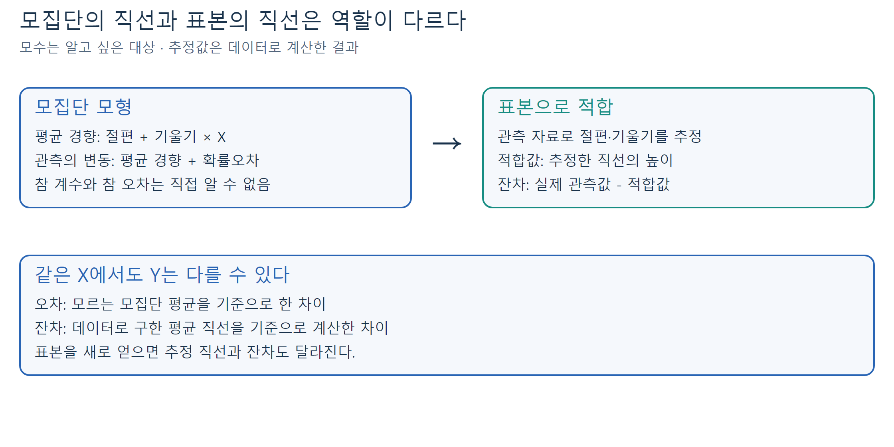

**그림 1.** 모집단의 계수는 모르는 대상이고, 추정계수는 표본으로 계산하는 값이다. 오차와 잔차를 같은 기호로 섞지 않는다. 이 그림은 개념도다.

### 모집단의 직선과 표본으로 구한 직선

자료에서 관측한 수리시간은 소문자 $y_i$로 쓰고, 구한 계수에는 모자 기호를 붙인다.

$$\hat y_i=\hat\beta_0+\hat\beta_1x_i,\qquad e_i=y_i-\hat y_i.$$

$\hat y_i$는 **적합값**, $e_i$는 **잔차**다. 오차 $\varepsilon_i=Y_i-(\beta_0+\beta_1x_i)$는 모르는 모집단 직선과의 차이지만, 잔차는 계산한 직선과 관측값의 차이이므로 계산할 수 있다. “오차가 있다”는 말이 곧 기록 실수라는 뜻은 아니다.

**직접 확인 E1.** 같은 $x=4$에서 관측시간이 64분과 74분이면 적합값은 같은가? 잔차도 같은가? 힌트: 모형에는 부품 수만 들어간다.

## 3. 기울기와 절편을 말로 읽기

어떤 추정 직선이 $\hat y=4+15x$라고 하자. 이 식은 설명용으로 반올림한 예이며 뒤에서 정확한 값을 구한다.

- 절편 4: 이 직선을 $x=0$까지 연장하면 높이가 4다.
- 기울기 15: 부품 수가 한 개 늘 때 **평균 수리시간의 추정값**이 15분 늘어난다.
- 부품 수가 세 개 늘 때의 평균 변화는 $15\times3=45$분이다.

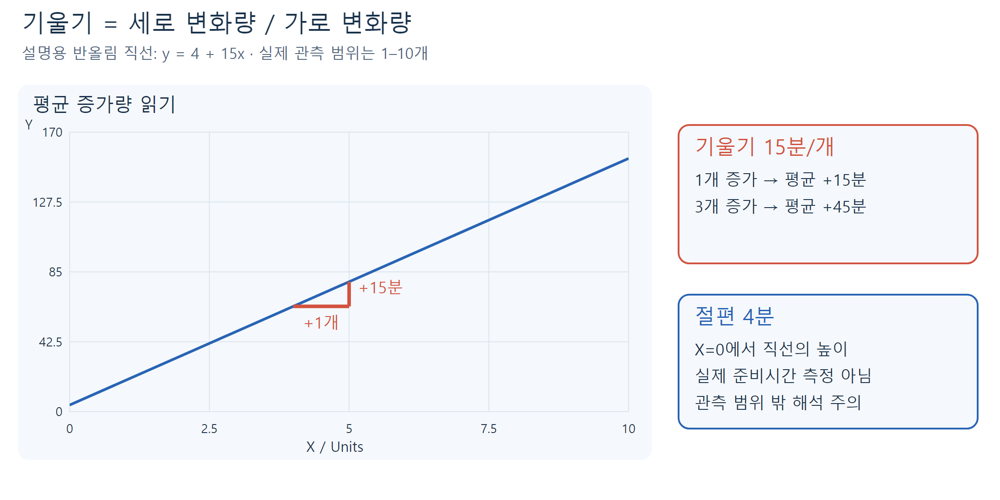

**그림 2.** 삼각형의 세로 변화량을 가로 변화량으로 나누면 기울기다. 절편은 기준 높이이며, 실제 자료의 부품 수 범위는 1–10개다. 0개에서의 해석은 관측 범위 밖이므로 조심한다.

“부품을 하나 더 수리하면 누구에게나 정확히 15분 더 걸린다”거나 “부품 수의 인과효과가 입증되었다”는 뜻은 아니다. 평균적 연관성을 표현하는 모형이라는 점을 유지한다.

## 4. 어떤 직선이 가장 잘 맞는가: 최소제곱

한 관측에서 $x_i$를 그대로 두고, 실제 높이 $y_i$에서 직선의 높이 $a+bx_i$를 뺀다. 이 차이가 **세로 방향의 잔차**다. 점에서 직선까지의 최단거리나 가로거리를 사용하는 방법과 다르다.

잔차를 그대로 더하면 양수와 음수가 상쇄될 수 있다. 최소제곱법은 각 잔차를 제곱한 뒤 더한 값을 가장 작게 하는 절편과 기울기를 찾는다.

$$S(a,b)=\sum_{i=1}^{n}(y_i-a-bx_i)^2.$$

$$ (\hat\beta_0,\hat\beta_1)=\underset{a,b}{\operatorname{argmin}}\ S(a,b). $$

$a,b$는 비교해 보는 후보 계수이고, argmin은 **가장 작은 함수값을 만드는 계수의 조합**을 고르라는 뜻이다. 선택된 직선에서의 잔차제곱합을 SSE라고 부른다.

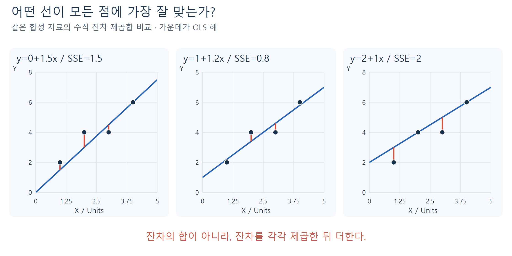

**그림 3.** 같은 데이터이므로 SSE끼리 비교할 수 있다. 눈으로 보기 좋은 선을 고르는 대신 모든 점의 수직 차이를 하나의 기준으로 합산한다. 작은 합성 자료를 사용한 독립 그림이다.

### 왜 평균과 편차가 다시 등장하는가?

다음 세 합계를 먼저 구한다. 지난 시간의 공분산 계산과 같은 재료다.

$$\bar x=\frac{1}{n}\sum_i x_i,\qquad \bar y=\frac{1}{n}\sum_i y_i,$$

$$S_{xx}=\sum_i(x_i-\bar x)^2,\qquad S_{xy}=\sum_i(x_i-\bar x)(y_i-\bar y).$$

절편을 포함하고 $S_{xx}>0$이면 최소제곱 추정값은 다음과 같다.

$$\boxed{\hat\beta_1=\frac{S_{xy}}{S_{xx}},\qquad \hat\beta_0=\bar y-\hat\beta_1\bar x.}$$

분자는 두 변수가 함께 움직이는 정도, 분모는 예측변수 자체의 퍼짐이다. 기울기를 먼저 계산한 다음, 직선이 평균점 $(\bar x,\bar y)$을 지나도록 절편을 정한다. $x$가 모두 같으면 $S_{xx}=0$이므로 절편과 기울기를 따로 유일하게 정할 수 없다.

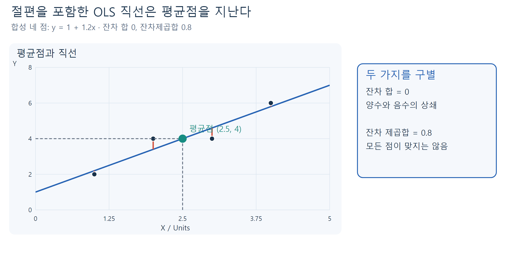

**그림 4.** 절편 포함 최소제곱 직선의 성질이다. 잔차 합이 0이라고 개별 잔차까지 0이 되는 것은 아니다.

**유도의 핵심만 보기:** 제곱합을 절편과 기울기로 미분하여 0으로 두면 $\sum_i e_i=0$, $\sum_i x_ie_i=0$을 얻는다. 첫 식에서 $a=\bar y-b\bar x$를 구하고 두 번째 식에 대입하면 $bS_{xx}=S_{xy}$가 된다. 미분 계산을 외우기보다 두 계수가 모든 점을 함께 고려해 정해진다는 뜻을 이해한다.

## 5. 풀이 예제: 네 점으로 끝까지 계산하기

지난 시간의 **계산 연습용 합성 자료**를 다시 사용한다.

$$x=(1,2,3,4),\qquad y=(2,4,4,6).$$

**1단계. 평균:** $\bar x=2.5$, $\bar y=4$.

| $x_i$ | $y_i$ | $x_i-2.5$ | $y_i-4$ | $(x_i-2.5)^2$ | 편차의 곱 |
|---:|---:|---:|---:|---:|---:|
| 1 | 2 | -1.5 | -2 | 2.25 | 3 |
| 2 | 4 | -0.5 | 0 | 0.25 | 0 |
| 3 | 4 | 0.5 | 0 | 0.25 | 0 |
| 4 | 6 | 1.5 | 2 | 2.25 | 3 |
| 합 | | | | 5 | 6 |

**2단계. 기울기:** $\hat\beta_1=6/5=1.2$.

**3단계. 절편:** $\hat\beta_0=4-1.2\times2.5=1$.

**4단계. 적합값과 잔차:** $\hat y=1+1.2x$에 각 $x$를 대입한다.

| x | 관측값 y | 적합값 | 잔차 (관측−적합) | 잔차제곱 |
|---:|---:|---:|---:|---:|
| 1 | 2 | 2.2 | -0.2 | 0.04 |
| 2 | 4 | 3.4 | 0.6 | 0.36 |
| 3 | 4 | 4.6 | -0.6 | 0.36 |
| 4 | 6 | 5.8 | 0.2 | 0.04 |
| 합 | | | 0 | 0.80 |

**5단계. 해석:** 적합직선은 평균점 $(2.5,4)$를 지나며 잔차 합은 0이다. 그러나 SSE는 0.8이다. 모든 관측을 정확히 맞히는 선은 아니다.

**직접 확인 E2.** 위 자료에서 분모를 $\sum_i x_i^2$로 바꾸면 왜 다른 기울기가 나오는가? 힌트: 평균을 뺀 제곱합과 원래 값의 제곱합은 다르다.

## 6. 실제 수리시간 14건의 직선

기존 `Computer.Repair.txt`의 `Units`가 $x$, `Minutes`가 $y$다. 원자료에는 결측이 없고 부품 수는 1–10개다. 계산 중에는 반올림하지 않고 최종 표시만 반올림한다.

$$n=14,\quad \bar x=6,\quad \bar y=97.2142857,\quad S_{xx}=114,\quad S_{xy}=1768.$$

$$\hat\beta_1=\frac{1768}{114}=15.5087719,$$

$$\hat\beta_0=97.2142857-15.5087719\times6=4.1616541.$$

$$\boxed{\widehat{\text{Minutes}}=4.1616541+15.5087719\times\text{Units}.}$$

**풀이 예제: 부품 4개인 두 수리 건.** 적합값은 둘 다 $4.1616541+15.5087719\times4=66.1967419$분이다. 실제 시간이 64분이면 잔차는 약 -2.1967분, 74분이면 약 7.8033분이다. 직선보다 아래인 점의 잔차는 음수다.

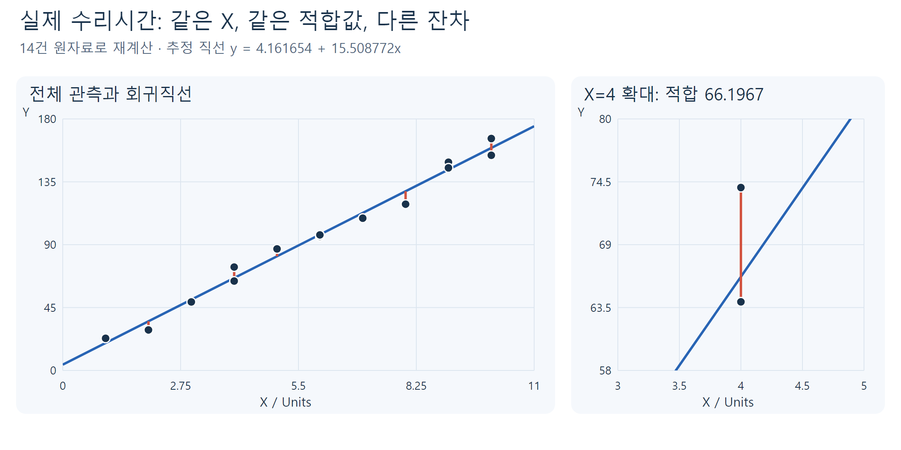

**그림 5.** 교재 그림 3.5의 데이터를 직접 계산하여 새로 그렸다. 오른쪽 확대도에서 두 점은 같은 적합값을 갖지만 잔차는 다르다. 교재 원본 이미지를 복사한 것이 아니다.

지난 시간과 연결하면 다음도 성립한다.

$$\hat\beta_1=\frac{s_{xy}}{s_x^2}=r\frac{s_y}{s_x}.$$

상관과 기울기는 같은 부호지만 같은 숫자가 아니다. 상관에는 단위가 없고, 기울기는 분/개 단위다. 시간을 초로 바꾸면 기울기와 절편은 60배가 되지만 상관은 그대로다.

**직접 확인 E3.** 절편 약 4.16을 “준비시간을 직접 측정한 결과”라고 말해도 되는가? 힌트: 관측한 부품 수의 최소값과, 측정한 변수의 종류를 확인한다.

## 7. R의 lm(): 식, 객체, 출력표를 연결하기

`repair`는 `Units`, `Minutes`라는 숫자 열을 가진 데이터프레임이다. 아래 코드는 기본 R의 `stats` 기능을 사용한다. 데이터 준비 코드는 동봉한 학생 실습에 들어 있다.

```r
fit <- lm(Minutes ~ Units, data = repair)
coef(fit)
fitted(fit)
residuals(fit)
summary(fit)
confint(fit, level = 0.95)
```

`Minutes ~ Units`에서 **왼쪽이 반응변수**, 오른쪽이 예측변수다. `~`는 등호도, 데이터를 곱하는 기호도 아니다. 기본으로 절편이 포함된다. `lm()`은 데이터를 이용해 계수를 추정한 **lm 객체**를 반환하며, `fit`에 그 결과를 저장한다. 같은 모형을 다시 쓸 때 이 객체를 재사용한다. [R 공식 lm 문서](https://stat.ethz.ch/R-manual/R-devel/library/stats/html/lm.html)

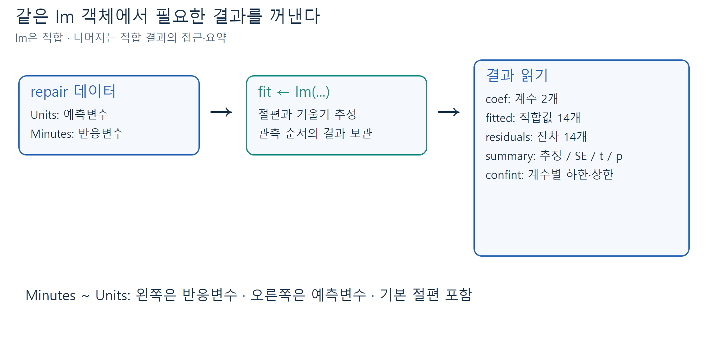

**그림 6.** `lm()`은 적합 단계, 뒤의 함수들은 적합 결과를 꺼내거나 요약하는 단계다. `summary()`가 데이터를 새로 수집하는 것은 아니다.

| R 호출 | 반환하는 핵심 내용 | 읽을 때 주의 |
|---|---|---|
| `coef(fit)` | 이름 있는 계수 벡터 2개 | 첫 값 절편, `Units`가 기울기 |
| `fitted(fit)` | 관측 순서의 적합값 벡터 14개 | 각각 평균 직선의 높이 |
| `residuals(fit)` | 관측 순서의 잔차 벡터 14개 | 관측값에서 적합값을 뺌 |
| `summary(fit)$coefficients` | 계수표 행렬 2행·4열 | 행은 계수, 열은 추정·SE·t·p |
| `confint(fit)` | 각 계수의 하한·상한 행렬 | 개별 수리시간의 구간이 아님 |

`summary(fit)`의 계수표는 다음과 같다.

| 계수 | Estimate | Std. Error | t value | Pr(>\|t\|) |
|---|---:|---:|---:|---:|
| (Intercept) | 4.161654 | 3.355100 | 1.240396 | 0.238534 |
| Units | 15.508772 | 0.504981 | 30.711576 | $8.9163\times10^{-13}$ |

각 열은 **추정값, 표준오차, 0과 비교하는 t값, 양측 p값**이다. 별표 개수만 읽지 말고 추정값의 단위와 불확실성을 함께 읽는다. 나머지 출력의 결정계수·F값은 다음 범위에서 다룬다. [R 공식 summary.lm 문서](https://stat.ethz.ch/R-manual/R-devel/library/stats/html/summary.lm.html)

## 8. 표준오차: 기울기의 흔들림은 얼마나 큰가?

한 표본으로 계산한 기울기는 하나의 숫자다. 같은 조건에서 수리기록을 새로 관측하면 점들이 달라지고 추정한 직선도 달라진다. **표준오차(SE)**는 이런 추정값의 표본 간 변동 크기를 추정한 값이다.

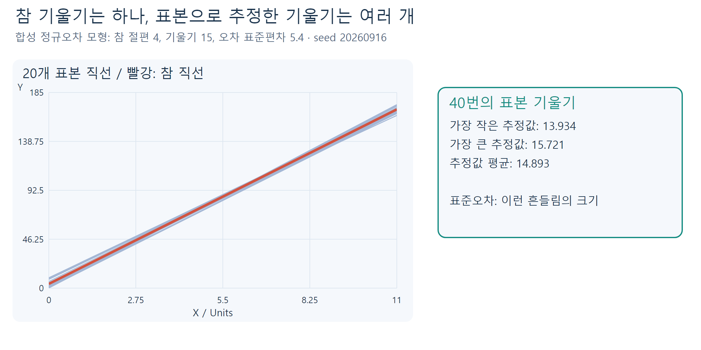

**그림 7.** 실제 회사의 추가 자료가 아니라, 참 기울기를 15로 정한 정규오차 모형에서 반복 생성한 합성 자료다. 모집단 기울기는 하나지만 표본 기울기는 달라진다.

### 먼저 오차의 분산을 추정한다

$$\mathrm{SSE}=\sum_i e_i^2,\qquad s^2=\frac{\mathrm{SSE}}{n-2},\qquad s=\sqrt{\frac{\mathrm{SSE}}{n-2}}.$$

두 계수인 절편과 기울기를 추정했으므로 잔차 자유도는 $n-2$다. $s$는 R의 **Residual standard error**이며 수리시간 단위인 분으로 읽는다. 잔차가 크면 직선 주변의 불확실성이 커진다.

기울기와 절편의 표준오차는 서로 다르다.

$$\operatorname{SE}(\hat\beta_1)=\frac{s}{\sqrt{S_{xx}}},\qquad
\operatorname{SE}(\hat\beta_0)=s\sqrt{\frac{1}{n}+\frac{\bar x^2}{S_{xx}}}.$$

**풀이 예제: 실제 수리 자료.** SSE는 348.848371이다.

$$s=\sqrt{348.848371/12}=5.391725\ \text{분},$$

$$\operatorname{SE}(\hat\beta_1)=5.391725/\sqrt{114}=0.504981\ \text{분/개}.$$

기울기 15.5088과 그 표준오차 0.5050은 역할이 다르다. 앞의 값은 평균 증가량의 추정값, 뒤의 값은 그 추정의 정밀도다. 오차 크기 $s$가 작고 $x$가 충분히 퍼져 $S_{xx}$가 크면 기울기를 더 정밀하게 구할 수 있다. 자료를 넓게 모으더라도 같은 선형모형을 적용할 수 있는 범위인지는 별도로 확인한다.

**직접 확인 E4.** 같은 자료의 SSE를 사용하면서 분모를 $n-2$ 대신 $n$으로 바꾸어 오차분산을 계산하면 문제가 무엇인가? 힌트: 표본에서 추정한 계수가 두 개다.

### 추론에 필요한 가정은 별도로 확인한다

| 가정 | 쉬운 뜻 | 이번 수업에서의 위치 |
|---|---|---|
| 선형 평균 | $E(Y\mid x)=\beta_0+\beta_1x$ | 평균 경향을 직선으로 표현 |
| 평균 0 오차 | $E(\varepsilon_i\mid x)=0$ | 평균 경향을 오차에 남기지 않음 |
| 등분산 | $\operatorname{Var}(\varepsilon_i\mid x)=\sigma^2$ | 모든 x에서 같은 오차분산 |
| 독립성 | 관측 간 오차가 독립 | 반복·연속 관측에서는 특히 주의 |
| 정규성 | 조건부 오차가 정규분포 | 아래 소표본 t 검정·구간의 정확한 근거 |

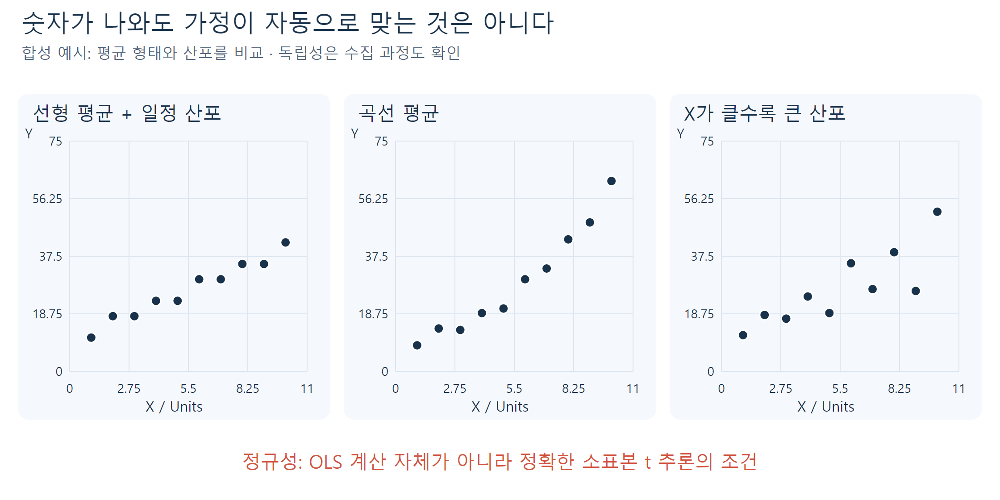

**그림 8.** 같은 선형 추론 공식을 적용하기 전에 살펴야 할 구조다. 개념 설명용 합성 점들이며 이 그림 자체가 실제 수리자료의 가정 검증 결과는 아니다. 독립성은 그림만으로 확인할 수 없고 수집 과정도 알아야 한다.

OLS 계수를 **계산하기 위해** 정규분포를 가정해야 하는 것은 아니다. 다만 위의 조건에서 정확한 t분포를 사용해 검정·구간을 해석한다. R이 숫자를 출력했다고 가정이 자동으로 충족되는 것은 아니다. 잔차 진단은 이후 수업에서 더 자세히 배운다.

## 9. 가설검정: 특정 기울기라는 주장과 비교하기

우선 기울기 0을 검정하자. 유의수준을 미리 $\alpha=0.05$로 정한다.

$$H_0:\beta_1=0,\qquad H_1:\beta_1\ne0.$$

모형 안에서 기울기 0은 $x$가 달라져도 **평균 직선의 높이가 바뀌지 않음**을 뜻한다. 비선형 관계까지 전혀 없다는 뜻은 아니다.

검정통계량은 “귀무가설의 값에서 표준오차 몇 개 떨어져 있는가?”다.

$$t_{\mathrm{obs}}=\frac{\hat\beta_1-\beta_{1,0}}{\operatorname{SE}(\hat\beta_1)}.$$

$\beta_{1,0}$는 귀무가설에서 주장하는 기울기다. $H_0$와 모형 가정 아래에서 통계량은 자유도 $n-2$의 t분포를 따른다. 양쪽 방향의 차이를 모두 보기 때문에 양측 p값은 다음과 같다.

$$p=P\left(|T_{n-2}|\ge |t_{\mathrm{obs}}|\mid H_0\right).$$

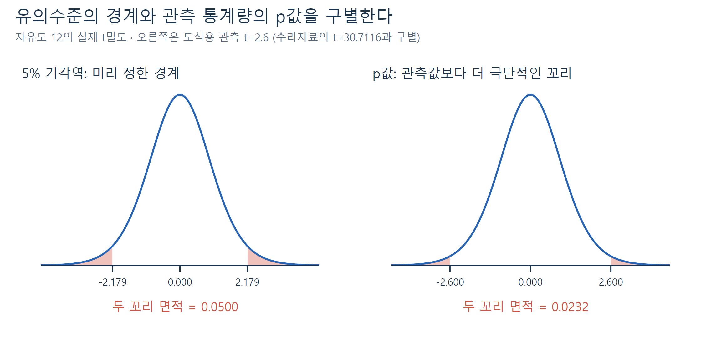

**그림 9.** 교재 그림 3.6의 두 꼬리 개념을 독립적으로 계산·재구성했다. 왼쪽은 유의수준으로 정한 경계, 오른쪽은 도식용 관측 통계량 2.6으로 정한 p값 영역이다. 실제 수리자료의 기울기 0 검정 t값 30.7116과 구별한다. 두 영역의 의미를 구별한다.

### 풀이 예제 1: 기울기 0인가?

$$t_{\mathrm{obs}}=15.5087719/0.5049813=30.7115764,\quad \mathrm{df}=12.$$

양측 p값은 약 $8.9163\times10^{-13}$로 0.05보다 작다. 따라서 이 모형의 가정 아래 기울기 0이라는 귀무가설을 기각한다. 이는 선형 연관성의 통계적 근거이며 인과효과를 입증하는 결과는 아니다.

```r
tab <- summary(fit)$coefficients
t_zero <- tab["Units", "Estimate"] / tab["Units", "Std. Error"]
p_zero <- 2 * pt(-abs(t_zero), df = df.residual(fit))
```

`pt()`는 t분포의 누적확률이다. 음의 절댓값까지의 왼쪽 꼬리를 구하고 대칭인 오른쪽 꼬리까지 포함하도록 2배 한다. `abs()`를 생략하면 음의 통계량에서 잘못된 p값을 얻을 수 있다.

### 풀이 예제 2: 부품 하나당 12분이라는 기대는 타당한가?

이번에는 $H_0:\beta_1=12$, $H_1:\beta_1\ne12$이다. 같은 자료이므로 적합한 직선과 표준오차는 그대로이고 **비교하는 기준만 바뀐다**.

$$t_{12}=\frac{15.5087719-12}{0.5049813}\approx6.9483.$$

양측 p값은 약 $1.5423\times10^{-5}$로, 5% 수준에서 12라는 값을 기각한다. `summary()`의 기본 p값을 그대로 읽으면 기울기 12가 아니라 0을 검정하므로 주의한다. 이 계산을 학생 실습에서 직접 조립한다.

### 절편도 검정할 수 있다

$$H_0:\beta_0=0,\qquad t_0=4.1616541/3.3551004\approx1.2404.$$

p값은 약 0.2385다. 5% 수준에서 기각하지 못하지만, 절편이 정확히 0이라는 증명은 아니다. 절편을 자동 삭제하라는 뜻도 아니다. 특히 이번 자료에서 $x=0$은 관측 범위 밖이다.

**직접 확인 E5.** p값 0.2385를 “절편이 0일 확률이 23.85%”라고 해석하면 왜 안 되는가? 힌트: p값을 계산할 때 이미 무엇을 가정했는가?

### 보충: 지난 시간의 상관계수 검정과 연결

절편을 포함한 단순회귀에서 같은 완전 관측값으로 구한 표본상관을 $r$이라고 하면, 기울기 0의 t통계량은 다음과도 같다.

$$t=\frac{r\sqrt{n-2}}{\sqrt{1-r^2}}.$$

교재 3.6의 상관 검정과 연결되는 식이다. 모집단 상관 0에 대한 정확한 t 검정은 이변량 정규모형 등의 추론 조건 아래 해석한다. 높은 표본상관만으로 p값을 정할 수 없고 표본 수와 가정도 필요하다. 여기서는 새로운 필수 실습으로 늘리지 않고 앞에서 구한 기울기 검정을 이해하는 보충 연결로 사용한다.

## 10. 신뢰구간: 점 하나 대신 가능한 범위를 제시하기

점추정값 15.5088만 제시하면 정밀도를 알기 어렵다. 회귀계수 $\beta_j$의 양측 $100(1-\alpha)\%$ 신뢰구간은 다음과 같다.

$$\boxed{\hat\beta_j\ \pm\ t_{1-\alpha/2,\,n-2}\operatorname{SE}(\hat\beta_j),\qquad j=0,1.}$$

여기서 $t_{1-\alpha/2,\,n-2}$는 자유도 $n-2$의 t분포에서 **누적확률**이 $1-\alpha/2$인 양의 분위수다. 95% 구간이면 $\alpha=0.05$, 누적확률 0.975를 사용한다. “추정값 ± 임계값 × 표준오차”의 구조로 읽는다.

**풀이 예제: 기울기의 95% 구간**

$$t_{0.975,12}=2.1788128,$$

$$15.5087719\pm2.1788128\times0.5049813=15.5087719\pm1.1002597,$$

$$\boxed{14.4085122<\beta_1<16.6090317.}$$

이것이 기울기의 **95% 신뢰구간**이며 단위는 분/개다. **추정된 평균 증가량의 불확실성**을 나타내며, 모든 수리시간이 14–17분에 들어간다는 뜻이 아니다. 절편의 95% 구간은 약 $(-3.1485,11.4718)$분이다.

```r
qt(0.975, df = df.residual(fit))
confint(fit, parm = "Units", level = 0.95)
confint(fit, level = 0.95)
```

`confint()`의 `parm`은 선택할 계수 이름이고 `level`은 0과 1 사이의 신뢰수준이다. lm 객체에는 t분포 기반 공식을 사용한다. 출력의 2.5%, 97.5% 열은 하한과 상한이다. [R 공식 confint 문서](https://stat.ethz.ch/R-manual/R-devel/library/stats/html/confint.html)

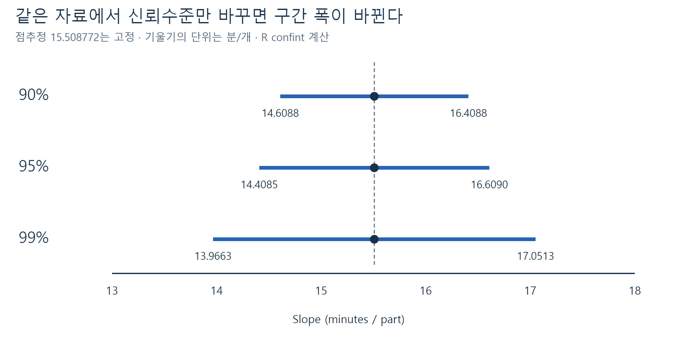

**그림 10.** 같은 데이터이므로 점추정값과 표준오차는 변하지 않는다. 더 높은 신뢰수준을 요구하면 임계값이 커져 구간이 넓어진다. 정확한 구간은 R로 계산했다.

### 신뢰구간과 양측 검정의 대응

같은 모형·같은 표준오차를 사용하는 유의수준 5% 양측 검정과 95% 신뢰구간을 비교한다. 귀무가설의 값이 구간 **밖**이면 기각하고, 구간 안이면 기각하지 못한다.

- 기울기 0과 12는 모두 기울기 구간 밖이다.
- 절편 0은 절편 구간 안이다.
- 절편과 기울기의 구간을 각각 95%로 구했다고 두 계수를 동시에 포괄할 확률까지 자동으로 95%가 되는 것은 아니다.

**직접 확인 E6.** 99% 구간이 95% 구간보다 넓다면 “더 정밀해졌다”고 말할 수 있는가? 힌트: 신뢰수준과 구간 폭은 같은 개념이 아니다.

## 11. ‘95%’를 올바르게 이해하기

같은 조건에서 표본을 반복해서 얻고 매번 같은 방법으로 구간을 만들면, 그 구간들 중 장기적으로 약 95%가 고정된 참 계수를 포함한다는 의미다.

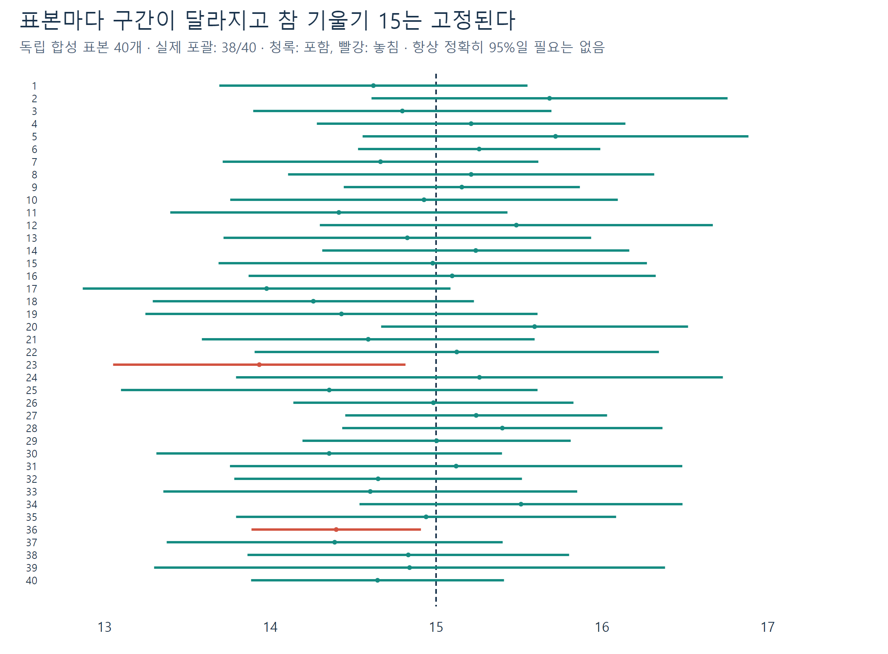

**그림 11.** 세로 기준선은 참 기울기 15로 고정되어 있다. 각 가로 막대가 새 표본에서 만든 구간이고, 붉은 막대는 참값을 놓친 경우다. 그림의 포괄 수는 실제 시뮬레이션 결과다. 40번처럼 적은 반복에서 정확히 95%가 나와야 하는 것은 아니다.

| 흔한 말 | 고쳐 읽기 |
|---|---|
| “계수가 이 구간 안에 있을 확률이 계산 후 95%다.” | 빈도주의 구간에서는 계수는 고정, 반복 표본마다 구간이 달라진다. |
| “95%의 관측 시간이 이 범위에 있다.” | 여기서는 회귀계수의 구간이지 관측값 구간이 아니다. |
| “0이 안 들어가니 중요한 인과효과다.” | 통계적 유의성, 실질적 크기, 인과 해석은 따로 판단한다. |
| “p가 0.05보다 크니 효과가 없다.” | 이 자료로 귀무가설을 기각할 근거가 충분하지 않다는 뜻이다. |

추가 비교: 네 점의 작은 합성 자료는 기울기 1.2, 상관 약 0.9487이다. 하지만 기울기 0 검정의 p값은 약 0.0513이고 95% 구간은 약 $(-0.0170,2.4170)$이다. 높은 표본 상관만으로 표본 수와 불확실성을 무시할 수 없다.

## 12. R에서 웹앱으로 연결하기

[설치 없는 W03B R 실습](https://lunalab-ai.github.io/regre/w03b.html)에서 코드를 수정하고 실행한다. 마지막에는 [누적 웹앱 편집기](https://lunalab-ai.github.io/regre/apps/w03b/edit/index.html)를 연다. 처음 열 때 R 런타임을 내려받으므로 인터넷 연결이 필요하다. 로그인·유료 API·개인자료 업로드는 필요 없다.

이번에 추가하는 **계수 추론** 탭은 수리시간 모형에 신뢰수준과 귀무가설의 기울기를 연결한다. 기존 관계 탐색, 첫 회귀 예측, R 문법 실험실 탭은 유지한다.

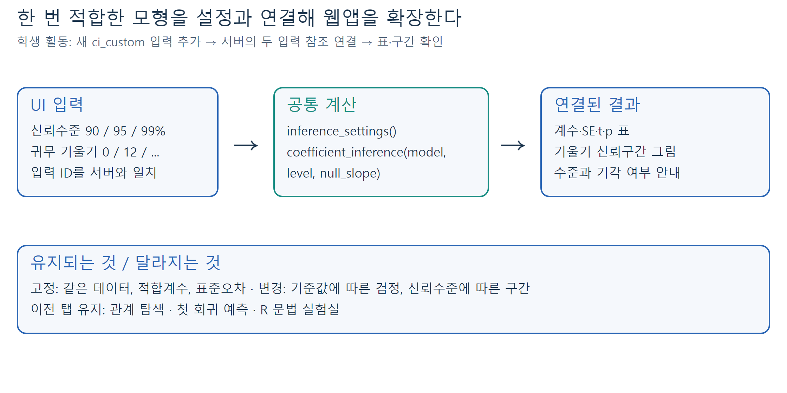

**그림 12.** 같은 `lm` 객체를 재사용한다. 신뢰수준만 바꾸어도 원자료나 회귀계수를 다시 수집·변경하는 것은 아니다. 바뀐 설정으로 표와 구간을 다시 계산한다.

공통 원본은 공개 저장소의 [slr-tools.R](https://github.com/lunalab-ai/regre/blob/2026-fall-w03b/src/slr-tools.R)이다. 동봉한 같은 버전의 파일을 `source()`로 읽으며 외부 다운로드나 학습을 몰래 수행하지 않는다. `fit_repair(data)`는 숫자형 `Units`, `Minutes` 열의 완전한 표를 받아 절편 포함 `lm` 객체를 반환한다. `coefficient_inference(model, level=0.95, null_slope=0)`는 그 객체에서 두 계수의 추정·표준오차·검정·신뢰구간을 반환한다. 자세한 입력·출력과 정의 위치는 실습 및 [공통 API 설명](https://github.com/lunalab-ai/regre/blob/2026-fall-w03b/src/slr-api.md)에 있다.

학생 실습의 L1–L5에서 빈칸·오류를 고치고, 신뢰수준을 바꿀 때 무엇이 그대로인지 설명한다. 마지막에는 UI 입력을 추가하고 서버의 같은 입력 이름을 연결해 본다. 브라우저에서 편집한 코드는 자동 제출되지 않는다. **내 R 코드 다운로드**로 보관하고, 새로 시작해 위에서부터 실행한다.

## 13. 점검 퀴즈

먼저 답한 뒤 별도 해설 자료로 확인한다.

1. 모집단 오차와 표본 잔차의 기준 직선은 어떻게 다른가?
2. 최소제곱법은 어떤 방향의 차이를 제곱하여 더하는가?
3. 절편 포함 최소제곱 직선이 지나는 평균점은 무엇인가?
4. lm(Minutes ~ Units)에서 반응변수는 무엇이며 절편은 기본으로 포함되는가?
5. 관측 14개로 절편과 기울기를 추정했을 때 잔차 자유도는 얼마인가?
6. summary(fit)의 기울기 p값은 기본적으로 어떤 귀무가설을 검정하는가?
7. 95% 계수 신뢰구간에 0이 포함되면 대응하는 5% 양측 검정에서는 어떻게 판단하는가?
8. 같은 자료에서 99% 신뢰구간이 95% 구간보다 넓어지는 이유는 무엇인가?

## 참고자료와 그림의 출처

- Ali S. Hadi·Samprit Chatterjee, 『Chatterjee 예제를 통한 회귀분석 제6판: R 활용』, 자유아카데미, 2024, 3.4–3.7, pp.100–114. 모형·추정·계수 검정·신뢰구간과 수리시간 사례를 참고했다.
- [R lm 공식 문서](https://stat.ethz.ch/R-manual/R-devel/library/stats/html/lm.html), [summary.lm 공식 문서](https://stat.ethz.ch/R-manual/R-devel/library/stats/html/summary.lm.html), [confint 공식 문서](https://stat.ethz.ch/R-manual/R-devel/library/stats/html/confint.html), 2026-09-15 확인.
- 수리시간 수치는 기존 수업의 14행 데이터를 R로 재계산했다. 그림 5와 9는 교재 그림 3.5·3.6의 수학적 관계를 새 배치로 독립 제작했다. 원본 스캔은 포함하지 않았다.
- 그림 1·6·12는 독립 개념도, 2–4·8은 설명용 도식/합성 자료, 7·11은 참 계수를 명시한 정규오차 시뮬레이션, 10은 실제 수리자료의 계산이다. 시뮬레이션을 실제 회사의 추가 관측으로 해석하지 않는다.
