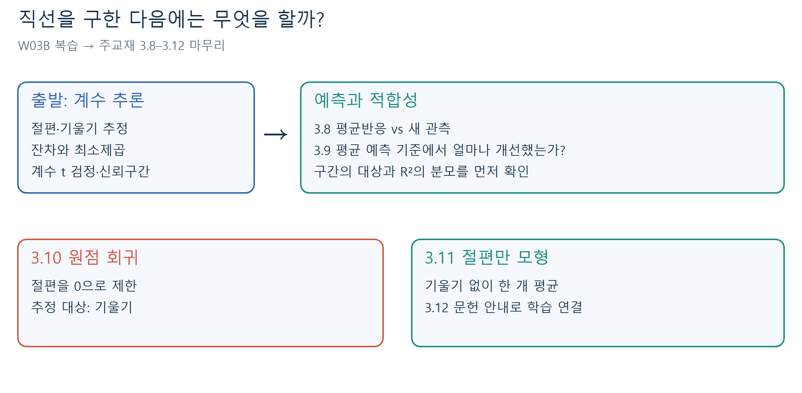
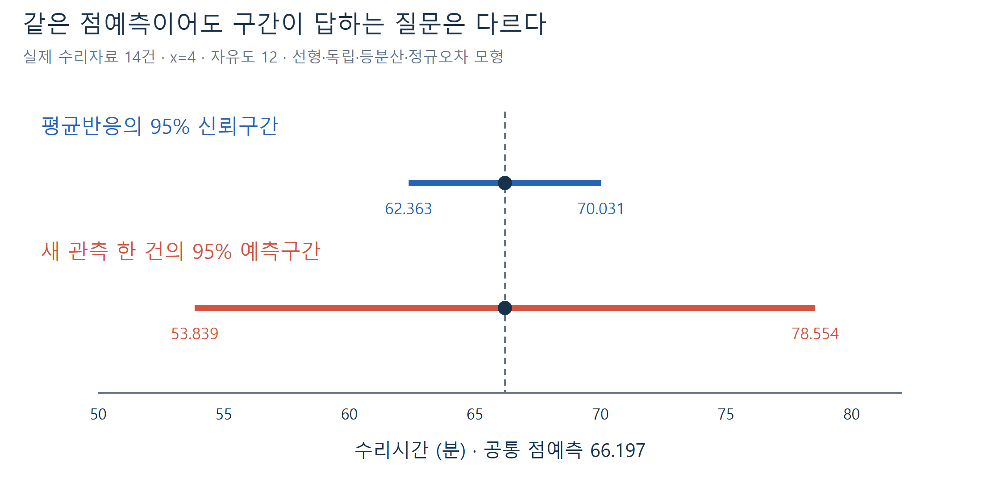
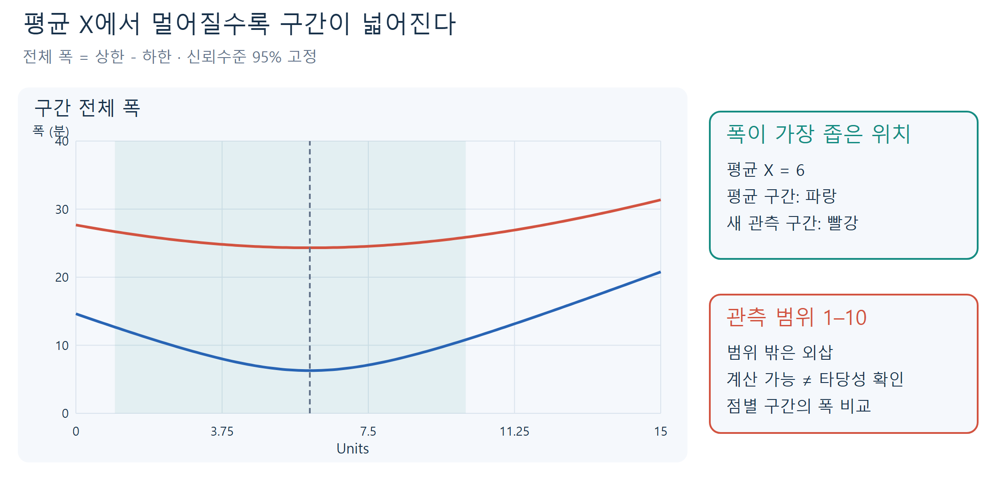
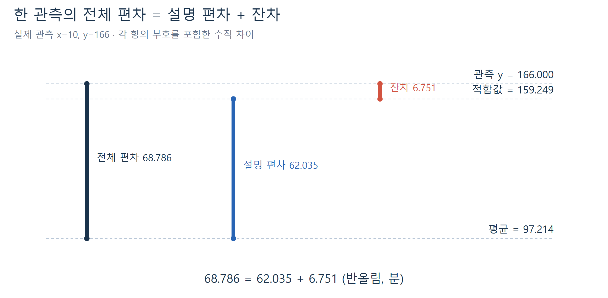
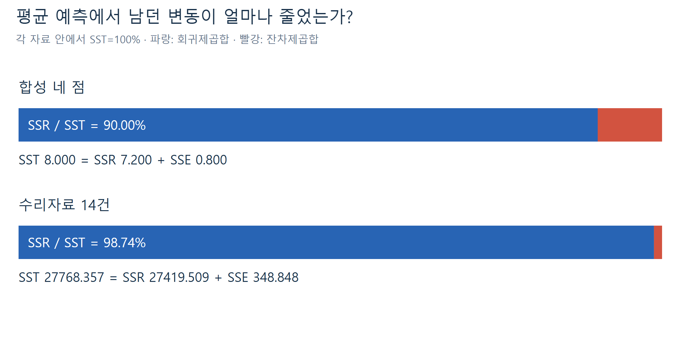
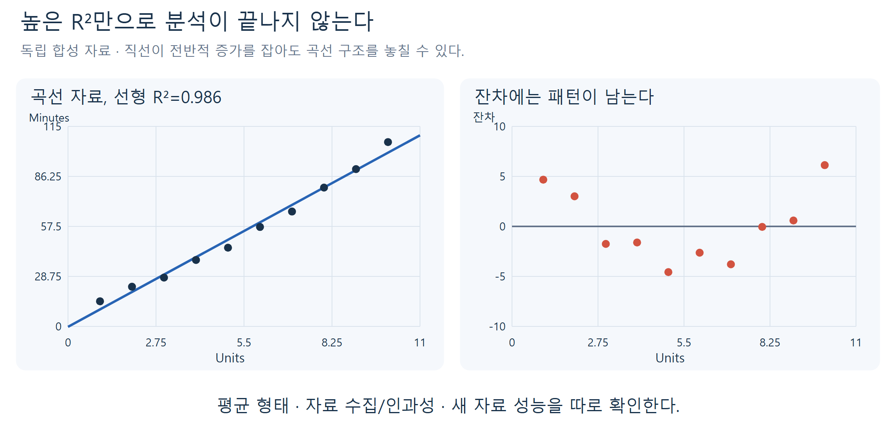
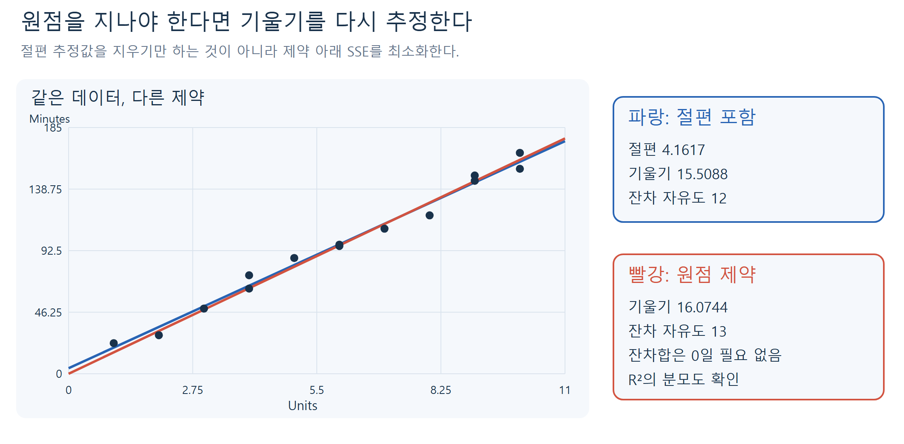
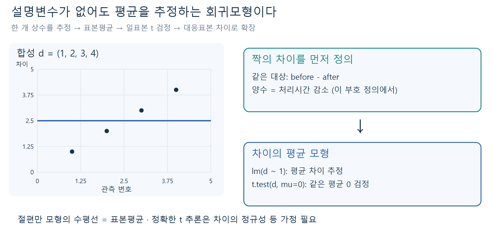
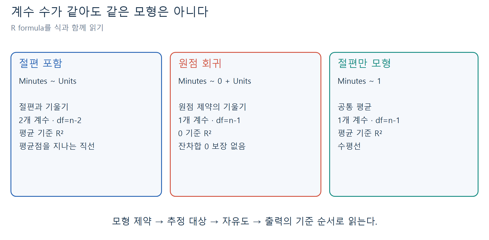
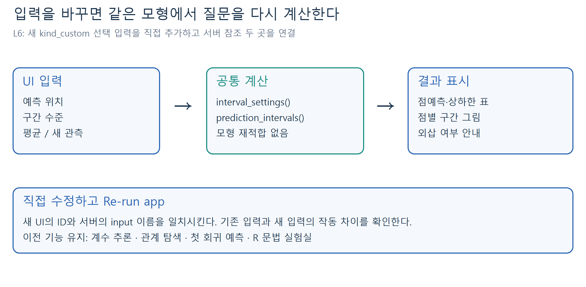

# W04A · 단순선형회귀모형 마무리

회귀분석의 이해 · 2026년 9월 21일 월요일 · 4주차 1차시

주교재 **3.8 예측, 3.9 적합성의 측정, 3.10 원점을 통과하는 회귀선, 3.11 사소한 회귀모형, 3.12 문헌목록에 관하여**를 다룬다. 지난 시간의 같은 컴퓨터 수리자료를 사용해 단순선형회귀를 마무리한다.

[지난 수업 복습](../w03b/w03b-simple-regression.md) · [설치 없는 온라인 R](https://lunalab-ai.github.io/regre/w04a.html) · [누적 앱 편집기](https://lunalab-ai.github.io/regre/apps/w04a/edit/index.html) · [R/QMD·자료 다운로드](https://github.com/lunalab-ai/regre/tree/2026-fall-w04a/labs/student/w04a)

## 1. 오늘 연결할 질문

지난 시간에는 ‘직선의 절편과 기울기를 어떻게 추정하고 검정하는가’를 배웠다. 오늘은 그 직선을 **사용하고 평가하는 방법**, 그리고 **특별한 제약을 둔 두 모형**을 배운다.

| 알고 싶은 것 | 이번 수업의 도구 | 주의할 구별 |
|---|---|---|
| 부품 4개 수리의 평균 시간 | 평균반응 신뢰구간 | 기울기의 신뢰구간과 다름 |
| 다음 수리 작업 한 건의 시간 | 새 관측의 예측구간 | 평균 추정에 새 오차가 더해짐 |
| 관측 자료에 얼마나 잘 맞는가 | 제곱합과 결정계수 | 인과성·미래 성능과 다름 |
| 반드시 원점을 지나야 하는가 | 절편 없는 회귀 | 제약의 근거와 R²의 기준 확인 |
| 설명변수가 하나도 없으면? | 절편만 있는 회귀 | 표본평균과 t 검정으로 연결 |



그림 1. 계수 추정이 출발점이다. 같은 적합 결과에서 서로 다른 질문에 맞는 계산을 선택한다. 주교재 3.8–3.11의 개념을 독립적으로 구성한 도식이다.

## 2. 복습: 모형, 적합직선, 오차와 잔차

단순선형회귀모형은 다음과 같다.

$$
Y_i=\beta_0+\beta_1x_i+\varepsilon_i,\qquad
E(\varepsilon_i\mid X)=0,\quad \operatorname{Var}(\varepsilon_i\mid X)=\sigma^2.
$$

$Y_i$는 i번째 반응, $x_i$는 예측변수, $\beta_0,\beta_1$은 모집단 계수다. $\varepsilon_i$는 **모르는 모집단 평균 직선**으로부터의 차이다. 독립·등분산 오차와 선형 평균을 가정하며, 아래의 정확한 소표본 t 구간에는 정규오차를 추가로 가정한다. X를 고정하거나 관측한 X에 조건부로 생각한다.

표본에서는 계수를 추정하여 $\hat y_i=b_0+b_1x_i$를 만들고, **잔차** $e_i=y_i-\hat y_i$를 계산한다. 최소제곱은 수직 잔차의 제곱합을 가장 작게 하는 계수를 찾는다.

$$
S_{xx}=\sum_i(x_i-\bar x)^2,\quad
S_{xy}=\sum_i(x_i-\bar x)(y_i-\bar y),\quad
b_1=\frac{S_{xy}}{S_{xx}},\quad b_0=\bar y-b_1\bar x.
$$

$\bar x,\bar y$는 표본평균이다. $b_1$의 단위는 반응변수 단위/예측변수 단위다. 두 계수를 추정하므로 잔차 자유도는 $n-2$이고, 오차분산 추정값은 $s^2=\mathrm{SSE}/(n-2)$다.

지난 시간의 기울기 검정은 $t=(b_1-\beta_{1,0})/\operatorname{SE}(b_1)$, 계수 신뢰구간은 $b_1\pm t_{1-\alpha/2,n-2}\operatorname{SE}(b_1)$였다. $\beta_{1,0}$는 검정할 귀무값, $1-\alpha$는 신뢰수준이다. **계수의 불확실성**과 **수리시간의 불확실성**을 혼동하지 않는다.

### 같은 14건으로 계속하기

자료의 `Units`는 부품 수(개), `Minutes`는 수리시간(분)이다. 관측 범위는 1–10개이며, 모든 작업이 동일한 시간을 갖지는 않는다.

| 수량 | 이번 자료의 계산값 |
|---|---:|
| $n,\bar x,\bar y$ | 14, 6, 97.214286 |
| $S_{xx},S_{xy}$ | 114, 1768 |
| $b_0,b_1$ | 4.161654, 15.508772 |
| SSE, 잔차 자유도 | 348.848371, 12 |
| $s^2,s$ | 29.070698 분², 5.391725 분 |

따라서 적합직선은 $\hat y=4.161654+15.508772x$다. 부품이 한 개 늘 때 평균 수리시간의 추정 증가량은 약 15.51분이다. 절편은 x=0에서 직선의 높이지만 이 자료의 관측 범위 밖이므로 실제 준비시간으로 확정하지 않는다.

**E1 · 복습 확인:** x=4에서 실제 시간이 74분이었다면 잔차는 어떤 부호인가? 왜 이것을 모집단 오차라고 바로 부를 수 없는가? 힌트: 실제 관측값과 적합직선의 높이를 비교한다.

## 3. §3.8 예측: 같은 점예측, 다른 질문

새 예측 위치를 $x_0$라 쓰자. 0은 ‘예측하려는 위치’의 첨자이지 x값이 0이라는 뜻이 아니다. 그 위치의 점예측은 다음과 같다.

$$
\hat y_0=b_0+b_1x_0.
$$

예를 들어 x=4이면 $4.161654+15.508772\times4=66.196742$분이다. 이 값은 두 질문에서 모두 쓰인다.

| 질문 | 추론 대상 | 불확실성 |
|---|---|---|
| 같은 조건 작업들의 평균 시간은? | $\mu_0=E(Y\mid x_0)$ | 평균 직선을 표본으로 추정한 오차 |
| 다음 작업 한 건은 얼마나 걸릴까? | $Y_{\mathrm{new}}$ | 직선 추정 오차 + 새 작업 자체의 오차 |

표본을 더 모으면 평균을 더 정밀하게 추정할 수 있다. 그러나 새 작업의 우연한 변동 자체가 없어지는 것은 아니다. 이 차이가 예측구간을 더 넓게 만든다.



그림 2. 두 구간의 중심은 약 66.197분으로 같다. 파란 구간은 평균 추정, 붉은 구간은 다음 관측 한 건을 대상으로 한다. 실제 14건의 R 계산을 사용했다.

### 표준오차의 구조부터 읽기

예측 위치에 따른 추정 불확실성을 $h_0$로 묶으면 다음과 같다.

$$
h_0=\frac1n+\frac{(x_0-\bar x)^2}{S_{xx}},\qquad
\operatorname{SE}(\hat y_0)=s\sqrt{h_0}.
$$

첫 항은 표본 수, 둘째 항은 평균 X로부터의 거리를 반영한다. $s$는 원래 반응의 단위이고 $h_0$는 단위가 없다. 따라서 표준오차도 수리시간의 단위인 분이다. $x_0=\bar x$에서 둘째 항이 0이 되어 가장 좁다.

**평균반응의 신뢰구간**은 다음과 같다.

$$
\hat y_0\ \pm\ t_{1-\alpha/2,n-2}\,s\sqrt{h_0}.
$$

**새 개별 관측의 예측구간**은 다음과 같다.

$$
\hat y_0\ \pm\ t_{1-\alpha/2,n-2}\,s\sqrt{1+h_0}.
$$

추가된 **1**은 새 관측 자체의 오차분산 $\sigma^2$에 대응한다. 새 오차가 학습 자료의 오차와 독립이고 같은 분산을 따른다는 조건에서 $\operatorname{Var}(Y_{\mathrm{new}}-\hat y_0)=\sigma^2(1+h_0)$다. 주교재의 예측오차 표준편차는 평균 추정의 표준오차와 구별해서 읽는다.

### 풀이 예제 A: 부품 4개의 두 95% 구간

1. 점예측은 $\hat y_0=66.196742$분이다.
2. $h_0=1/14+(4-6)^2/114=0.106516$이다.
3. 자유도 12의 임계값은 $t_{0.975,12}\approx2.178813$이다.
4. 평균 구간의 오차한계는 $2.178813\times5.391725\times\sqrt{0.106516}\approx3.834031$분이다.
5. 새 관측 구간에서는 제곱근 안에 1을 더하므로 오차한계가 약 12.357384분이다.

| 대상 | 점예측(분) | 95% 하한(분) | 95% 상한(분) |
|---|---:|---:|---:|
| 평균반응 | 66.196742 | 62.362710 | 70.030773 |
| 새 관측 한 건 | 66.196742 | 53.839357 | 78.554126 |

모형 가정 아래 동일한 방법을 반복하면 평균 신뢰구간은 참 평균을, 예측구간은 새 관측을 해당 비율로 포함하도록 구성된다. 이미 계산한 평균 신뢰구간을 ‘참 평균이 확률 95%로 움직이는 구간’으로 설명하지 않는다. 개별 관측 95%가 평균 신뢰구간에 들어간다는 뜻도 아니다.

**E2 · 대상 확인:** 신뢰수준을 95%에서 99%로 바꾸면 점예측과 두 구간의 폭은 각각 어떻게 되는가? 평균 구간이 새 관측 구간보다 넓어지는가? 힌트: 바뀌는 항은 t 임계값이다.

### x가 달라지면 구간은 어떻게 달라지는가?



그림 3. 동일 자료·동일 95% 수준에서 구간 폭을 비교했다. X가 평균 6에서 멀어질수록 넓어진다. 음영 밖의 예측은 외삽이다.

x=11도 R은 구간을 계산한다. 그러나 관측한 1–10 범위를 벗어나면 선형 관계가 계속된다는 추가적인 믿음이 필요하다. 공식의 구간 폭은 **정해 둔 선형모형 안에서의 불확실성**이며, 모형 자체가 잘못된 불확실성을 모두 반영하지 못한다. 구간이 아주 넓지 않다는 이유만으로 외삽이 안전하다고 결론 내리지 않는다.

**E3 · 외삽 판단:** x=6과 x=11 중 평균 구간이 좁은 쪽을 이유와 함께 고르라. ‘11은 10보다 겨우 1 크므로 확인 없이 사용해도 된다’는 주장에 어떤 정보가 더 필요한가?

### R에서는 질문을 인자로 명시한다

```r
fit <- lm(Minutes ~ Units, data=repair)
predict(fit, newdata=data.frame(Units=4), interval="confidence", level=.95)
predict(fit, newdata=data.frame(Units=4), interval="prediction", level=.95)
```

`lm()`은 표본으로 계수를 적합한다. `predict()`는 이미 적합된 모형과 `newdata`를 받아 계산하며, 여기서는 계수를 다시 학습하지 않는다. 열 이름 `Units`는 대소문자까지 모형과 같아야 한다. `confidence/prediction`은 서로 바꾸어 쓸 수 없다. 반환 행은 새 자료의 행 순서, 열은 `fit/lwr/upr`다. `se.fit=TRUE`가 반환하는 표준오차는 평균 예측에 대한 것이다. [R 공식 predict.lm 문서](https://stat.ethz.ch/R-manual/R-devel/library/stats/html/predict.lm.html)를 참고한다.

## 4. §3.9 적합성의 측정: 무엇을 설명했는가?

아무 설명변수도 사용하지 않으면 모든 수리시간을 표본평균 $\bar y$로 예측할 수 있다. 회귀직선을 사용했을 때 이 **평균 예측 기준**보다 잔차제곱합이 얼마나 줄어드는지 살펴본다.

각 관측의 편차는 다음과 같이 정확히 분해된다.

$$
y_i-\bar y=(\hat y_i-\bar y)+(y_i-\hat y_i).
$$

왼쪽은 전체 편차, 오른쪽 첫 항은 직선으로 설명한 편차, 둘째 항은 잔차다. 한 관측에서 이 식을 제곱하면 교차항이 생긴다. 제곱합 등식이 성립하려면 그 교차항의 **합**이 0이어야 한다.



그림 4. 수리자료의 x=10, y=166인 관측을 사용한 독립 재구성이다. 주교재 그림 3.7의 편차 관계를 참고하되 실제 수치와 배치를 새로 설계했다. 한 점의 편차 분해와 전체 제곱합 분해를 구별한다.

### 세 가지 제곱합과 조건

$$
\mathrm{SST}=\sum_i(y_i-\bar y)^2,\qquad
\mathrm{SSR}=\sum_i(\hat y_i-\bar y)^2,\qquad
\mathrm{SSE}=\sum_i(y_i-\hat y_i)^2.
$$

SST는 총제곱합, SSR은 회귀제곱합, SSE는 잔차제곱합이다. 여기서는 주교재 표기를 따른다. 세 값의 단위는 모두 분²이며 관측 수와 변동의 크기에 영향을 받는다.

절편 포함 OLS에서는 $\sum_i e_i=0$이고 $\sum_i x_ie_i=0$이다. 따라서 다음 교차항이 사라진다.

$$
\sum_i(\hat y_i-\bar y)e_i
=(b_0-\bar y)\sum_i e_i+b_1\sum_i x_ie_i=0.
$$

이에 따라 **절편을 포함하여 같은 자료에 최소제곱으로 적합했을 때** 다음이 성립한다.

$$
\boxed{\mathrm{SST}=\mathrm{SSR}+\mathrm{SSE}}.
$$

이 항등식 자체는 정규오차 가정이 아니라 OLS의 대수적 성질에서 나온다. 정규성은 t·F 추론에 필요한 추가 조건이다.

### 풀이 예제 B: 네 점으로 제곱합 확인

지난 시간의 **합성 자료** $x=(1,2,3,4)$, $y=(2,4,4,6)$를 다시 사용하자. 직선은 $\hat y=1+1.2x$, 평균은 $\bar y=4$다.

| x | y | 적합값 | 잔차 | $y-\bar y$ | $\hat y-\bar y$ |
|---:|---:|---:|---:|---:|---:|
| 1 | 2 | 2.2 | -0.2 | -2 | -1.8 |
| 2 | 4 | 3.4 | 0.6 | 0 | -0.6 |
| 3 | 4 | 4.6 | -0.6 | 0 | 0.6 |
| 4 | 6 | 5.8 | 0.2 | 2 | 1.8 |

각 열을 제곱하고 더하면 SST=8, SSR=7.2, SSE=0.8이다. 실제로 $8=7.2+0.8$이다. 첫 행만 보면 전체 편차의 제곱 4는 설명 편차 제곱 3.24와 잔차 제곱 0.04의 합과 같지 않다. 합을 내는 과정에서 교차항이 상쇄된다.



그림 5. 각각의 자료 안에서 SST를 100%로 두어 비교했다. 위는 설명용 합성 자료, 아래는 실제 14건이다. 두 자료의 원래 제곱합 크기가 같다는 뜻은 아니다.

### 결정계수 R²

$$
R^2=\frac{\mathrm{SSR}}{\mathrm{SST}}
=1-\frac{\mathrm{SSE}}{\mathrm{SST}}.
$$

SST가 양수인 절편 포함 OLS에서 R²는 0–1 사이다. 합성 예의 R²는 0.9다. 이는 관측 Y의 **평균 기준 총변동 중 90%가 이 직선의 적합값 변동으로 설명된다**는 뜻이다. ‘각 관측을 90% 정확히 예측한다’는 뜻이 아니다.

실제 수리자료에서는 SST=27768.357143, SSR=27419.508772, SSE=348.848371이며 R²=0.987437이다. 반올림 전 14행을 재계산한 수치이며 인쇄된 중간 합계의 반올림과 약간 다를 수 있다.

절편을 포함한 **단순** OLS에서는 피어슨 표본상관계수 $r$에 대해 다음도 성립한다.

$$
R^2=r^2=\frac{S_{xy}^2}{S_{xx}S_{yy}},\qquad S_{yy}=\mathrm{SST}.
$$

R²는 부호가 없으므로 기울기의 증가·감소 방향을 알려주지 않는다. 이 관계를 원점 회귀나 임의의 비선형 모형에 그대로 옮기지 않는다.

**E4 · 계산과 해석:** 합성 예에서 SST=8, SSE=0.8로 R²를 구하라. 기울기가 음수인 다른 단순회귀에서도 R²가 양수일 수 있는가? R²=0.9라는 말에 ‘90% 확률로 맞는다’는 해석을 붙여도 되는가?

### 높은 R²가 보장하지 않는 것



그림 6. 독립적으로 만든 합성 자료에서 선형 적합의 R²가 높아도 평균의 곡선 구조가 남는다. 잔차 그림과 수집 과정을 함께 살펴야 한다. 자세한 진단 방법은 후속 학습에서 다룬다.

높은 R²는 인과관계를 증명하지 않는다. 누락된 변수, 자료 수집 방식, 시간 추세 등이 관계를 만들 수 있다. 또한 학습 자료에서 잘 맞는 것과 새 자료에서 잘 예측하는 것은 다르다. 새 자료의 조건과 모형 가정을 점검해야 한다. 반대로 오차 변동이 큰 분야에서는 낮은 R²만으로 의미 있는 평균 관계를 부정할 수도 없다.

**보충 · 지난 summary 출력의 F 연결:** 절편 포함 단순회귀에서 기울기 0 검정의 $F=(\mathrm{SSR}/1)/(\mathrm{SSE}/(n-2))$는 같은 가정의 기울기 t 통계량 제곱과 같다. 이번 자료에서는 $F\approx943.201=t^2$다. 이는 앞 시간 출력의 연결이며 다중회귀 ANOVA 전개는 이번 핵심 범위에 추가하지 않는다.

## 5. §3.10 원점을 통과하는 회귀선

어떤 이론이 ‘X=0이면 평균 Y도 정확히 0’이라고 정한다면 절편을 없앤 모형을 생각할 수 있다.

$$
Y_i=\beta_1x_i+\varepsilon_i,\qquad
\hat y_i=b_1^{(0)}x_i,\qquad
b_1^{(0)}=\frac{\sum_i x_iy_i}{\sum_i x_i^2}.
$$

위첨자 (0)은 원점 제약을 구별하기 위한 수업 표기다. 분모가 양수여야 한다. 일반 회귀의 기울기처럼 평균을 빼지 않는다. 절편을 0으로 강제한 상태에서 SSE를 최소화한 결과다.



그림 7. 같은 자료에 제약을 추가하면 기울기가 바뀐다. 작은 차이처럼 보여도 자유도, 잔차 성질, R²의 기준은 달라진다. x=0은 이 자료의 관측 범위 밖이다.

추정하는 계수가 하나이므로 잔차 자유도는 $n-1$이다. 이 모형의 가정 아래 다음을 사용한다.

$$
s_0^2=\frac{\sum_i(y_i-b_1^{(0)}x_i)^2}{n-1},\qquad
\operatorname{SE}(b_1^{(0)})=\frac{s_0}{\sqrt{\sum_i x_i^2}}.
$$

정규·독립·등분산 오차하에서 $(b_1^{(0)}-\beta_{1,0})/\operatorname{SE}(b_1^{(0)})$를 자유도 $n-1$의 t 분포와 비교한다. 신뢰구간도 같은 자유도의 t 임계값을 사용한다.

원점 회귀에서는 $\sum_i x_ie_i=0$이지만 **잔차합이 0일 필요가 없고**, 직선이 평균점을 지날 필요도 없다. 따라서 앞의 **중심 제곱합** SST=SSR+SSE를 그대로 적용하면 안 된다.

```r
origin_fit <- lm(Minutes ~ 0 + Units, data=repair)
coef(origin_fit)
df.residual(origin_fit)
sum(residuals(origin_fit))
```

`~ 0 + Units`와 `~ Units - 1`은 모두 절편을 제거한다. 이번 기울기는 약 16.074434분/개, 잔차 자유도는 13, 잔차합은 약 10.747573분이다.

### R²의 분모가 달라진다

R의 `summary.lm()`은 절편이 없으면 **0을 기준으로 한 비중심 결정계수**를 반환한다.

$$
R_0^2=1-\frac{\mathrm{SSE}_0}{\sum_i y_i^2}.
$$

한편 비교용으로 같은 평균 기준 $1-\mathrm{SSE}_0/\sum_i(y_i-\bar y)^2$를 계산할 수도 있다. 이것은 원점 모형의 기본 R 출력과 다른 값이며 음수가 될 수도 있다. 비중심 R²와 중심 R²를 이름 없이 섞지 않는다.

| 모형 | R 기본 R² | R 기본 분모 기준 | 같은 평균 기준 R² |
|---|---:|---|---:|
| 절편 포함 | 0.987437 | $\sum(y_i-\bar y)^2$ | 0.987437 |
| 원점 회귀 | 약 0.997541 | $\sum y_i^2$ | 약 0.985827 |

원점 회귀의 출력 R²가 더 커도 같은 기준으로 적합성이 좋아졌다는 뜻이 아니다. 같은 자료에서 절편을 0으로 제한했으므로 최소 SSE가 더 작아질 수는 없다. 절편 포함 모형의 절편 p값이 크다는 사실만으로 참 절편이 정확히 0임을 증명하지도 못한다. 교재의 절편 검정 논의에 더해, 수업에서는 과학적 제약·관측 범위·예측 목적을 함께 확인하도록 한다. [R summary.lm의 R² 정의](https://stat.ethz.ch/R-manual/R-devel/library/stats/html/summary.lm.html)를 참고한다.

**E5 · 모형 선택:** ‘원점 모형의 R²가 0.9975로 더 크므로 원점 회귀를 선택하자’는 결론의 문제를 설명하라. 절편 제거를 뒷받침하려면 어떤 근거가 필요한가?

## 6. §3.11 사소한 회귀모형: 절편만 남기기

교재의 ‘사소한 회귀모형’은 **절편만 있는 모형**이다. 설명변수가 없고 모든 관측이 같은 평균을 갖는다고 놓는다.

$$
Y_i=\beta_0+\varepsilon_i,\qquad
b_0=\bar y,\qquad \hat y_i=\bar y.
$$

SSE를 최소화하는 한 개의 상수가 표본평균이다. 잔차는 $y_i-\bar y$, 자유도는 $n-1$이며, 잔차분산 추정값은 익숙한 표본분산이다.

$$
s^2=\frac{\sum_i(y_i-\bar y)^2}{n-1},\qquad
\operatorname{SE}(b_0)=\frac{s}{\sqrt n},\qquad
t=\frac{\bar y-\mu_0}{s/\sqrt n}.
$$

$\mu_0$는 검정하려는 모집단 평균이다. 독립·정규·등분산 모형에서 자유도 $n-1$의 t 검정이며 바로 **일표본 t 검정**이다. `lm(y ~ 1)`의 기본 계수 표는 $\mu_0=0$을 검정한다. 0 이외 귀무값에는 직접 t를 구성하거나 `t.test(y, mu=...)`를 쓴다.



그림 8. 왼쪽은 모든 관측을 평균으로 예측하는 모형, 오른쪽은 합성 대응자료를 차이점수로 바꾼 후 같은 원리를 적용하는 흐름이다.

```r
mean_fit <- lm(Minutes ~ 1, data=repair)
coef(mean_fit)
mean(repair$Minutes)
```

두 값은 모두 약 97.214286분이다. 절편만 모형과 원점 회귀는 둘 다 추정계수가 하나지만 서로 다르다. 하나는 **수평선의 높이**, 다른 하나는 **원점을 지나는 직선의 기울기**를 추정한다.

### 대응표본 t 검정도 차이의 평균 모형

같은 대상의 전·후 값을 짝지어 $d_i=\text{before}_i-\text{after}_i$로 정한다. 그러면 $D_i=\mu_D+\varepsilon_i$와 `lm(d ~ 1)`로 평균 차이를 추정할 수 있다. 짝 사이에는 독립성을 가정하며, 정확한 소표본 t 추론에는 차이점수의 정규성을 가정한다. 전·후를 서로 독립인 두 표본으로 바꾸지 않는다.

풀이 예제로 **독립적으로 만든 합성 차이** $d=(1,2,3,4)$를 사용하자. $\bar d=2.5$, $s_d=\sqrt{5/3}\approx1.291$, $\operatorname{SE}(\bar d)\approx0.6455$다. 귀무평균차 0에 대한 t는 약 3.873, 자유도는 3이다. 같은 값은 `summary(lm(d ~ 1))`의 절편 t와 `t.test(d, mu=0)`에서 얻는다. 실제 R 실습 L5는 다른 6쌍 합성 자료로 직접 계산한다.

**E6 · 부호와 가정:** 차이를 after-before로 바꾸면 평균차와 t의 부호, 양측 p값은 어떻게 되는가? 표본 4개의 결과로 현실의 모든 장비에 개선 효과가 있다고 주장하려면 왜 부족한가?

## 7. 세 모형을 한 번에 구별하기



그림 9. `~ Units`, `~ 0 + Units`, `~ 1`은 서로 다른 질문이다. 식의 모양, 추정계수, 자유도, R²의 기준을 함께 읽는다.

| R 식 | 추정하는 것 | 잔차 자유도 | 기본 R² 기준 |
|---|---|---:|---|
| `Minutes ~ Units` | 절편·기울기 | $n-2$ | 평균 |
| `Minutes ~ 0 + Units` | 원점 제약하의 기울기 | $n-1$ | 0 |
| `Minutes ~ 1` | 공통 평균 | $n-1$ | 평균 |

일반적인 절편만 모형에서는 적합값이 모두 평균이므로 SSR=0, SSE=SST, R²=0이다. Y가 모두 같은 경우에는 SST=0이므로 비율 자체가 정의되지 않는 점을 구별한다. 계수 수가 같다고 같은 모형은 아니다.

## 8. R에서 웹앱까지 직접 연결하기

온라인 실습은 [W04A R 페이지](https://lunalab-ai.github.io/regre/w04a.html)에서 수행한다. 다운로드판은 `data` 폴더와 함께 사용한다. 기본 셀과 연습 변수를 분리했으므로 빈칸을 건너뛰어도 기본 계산이 진행된다.

공통 코드는 고정 공개 버전 **2026-fall-w04a**를 사용한다. [API 설명](https://github.com/lunalab-ai/regre/blob/2026-fall-w04a/src/prediction-api.md)에는 입력·기본값·단위·반환·오류 조건이 있다. `fit_repair()`는 모형을 적합하고, `prediction_intervals()`와 `regression_fit_summary()`는 기존 모형을 읽어 계산한다. 이 둘은 다시 적합하거나 다운로드하지 않는다. 함수의 정의 링크와 작은 호출 예는 실습 첫 부분에 있다.

| 활동 | 직접 할 일 | 자가 점검 |
|---|---|---|
| L1 | 새 위치의 두 구간 빈칸 채우기 | 중심과 폭, 추가 오차를 구별 |
| L2 | newdata 열 이름·구간 종류 수정 | 경고 없는 1행 구간, 질문과 일치 |
| L3 | 세 제곱합과 R² 조립 | 단위·항등식·해석 확인 |
| L4 | 원점 회귀와 절편 포함 비교 | 기준이 다른 R²를 혼동하지 않음 |
| L5 | 차이점수의 절편만 모형 | 평균·t·자유도와 대응 검정 연결 |
| L6 | 새 UI 입력을 서버 계산에 연결 | 표·그림·안내가 함께 바뀜 |



그림 10. 마지막 활동은 완성 앱을 보는 데서 끝나지 않는다. 새 입력 ID를 두 서버 참조와 연결하고 **Re-run app**으로 직접 확인한다. 기존 계수 추론·관계 탐색·첫 회귀 예측·R 문법 탭도 유지한다.

‘예측과 구간’ 탭에서는 위치·수준·구간 종류를 바꾼다. ‘적합성 비교’에서는 세 모형의 잔차와 R² 기준을 확인한다. 코드 편집기에서 L6 표시를 찾아 UI와 서버를 연결한다. 수정한 코드는 다운로드하고 **R 세션 다시 시작** 후 기본 셀부터 재실행한다. 첫 접속에는 런타임 다운로드를 위한 인터넷이 필요하다. 별도 성적 반영 과제나 제출 기한은 없다.

## 9. §3.12 문헌목록에 관하여

이 절은 새로운 계산 공식을 더하는 절이 아니라, 단순회귀를 더 공부할 문헌으로 안내하는 부분이다. 이번에는 앞선 절의 모형 → 추정 → 검정·구간 → 예측 → 적합성 → 특수 모형을 하나의 흐름으로 정리한다. 교재에 열거된 원전을 모두 직접 검토했다는 뜻은 아니다.

더 공부할 때에는 ‘어떤 가정에서 성립하는가’, ‘평균·계수·새 관측 중 무엇을 추론하는가’, ‘분산이나 R²의 분모는 무엇인가’를 먼저 확인한다. R 결과의 인자·반환·기준은 해당 공식 문서를 함께 읽는다. 다중회귀와 상세 잔차진단은 후속 학습으로 이어진다.

## 10. 점검 퀴즈

먼저 직접 답한 뒤 [별도 퀴즈 해설](https://github.com/lunalab-ai/regre/blob/main/course/handouts/w04a-quiz.md)로 확인한다.

1. 평균반응의 신뢰구간과 새 관측의 예측구간은 무엇을 각각 포함하려는가?
2. 같은 x와 신뢰수준에서 예측구간이 더 넓은 이유는 무엇인가?
3. 평균반응 구간이 가장 좁아지는 x 위치는 어디이며, 외삽 계산은 무엇을 보장하지 못하는가?
4. SST=SSR+SSE가 성립하는 이번 최소제곱모형의 중요한 조건은 무엇인가?
5. 절편 포함 단순회귀의 R²와 상관계수 r은 어떤 관계이며, R²가 크면 인과관계가 증명되는가?
6. 원점 회귀의 잔차 자유도는 얼마이며, 잔차합은 반드시 0인가?
7. 원점 회귀의 R 기본 R²와 절편 포함 모형의 R²를 그대로 크기 비교하면 안 되는 이유는 무엇인가?
8. lm(y ~ 1)의 절편 추정값은 무엇이며, 대응표본 t 검정과는 어떻게 연결되는가?

## 참고자료와 제작 구분

- 주교재: Hadi·Chatterjee, 『Chatterjee 예제를 통한 회귀분석 제6판: R 활용』, 자유아카데미(2024), 3.8–3.12, pp.115–126. 용어·수식 관계와 장 순서를 따르며 설명은 수업용으로 새로 작성했다.
- R 공식 문서: [predict.lm](https://stat.ethz.ch/R-manual/R-devel/library/stats/html/predict.lm.html), [summary.lm](https://stat.ethz.ch/R-manual/R-devel/library/stats/html/summary.lm.html), [lm](https://stat.ethz.ch/R-manual/R-devel/library/stats/html/lm.html), [t.test](https://stat.ethz.ch/R-manual/R-devel/library/stats/html/t.test.html). 2026-09-20 확인.
- 수리자료는 이전 차시와 동일한 공개 수업 자료를 재사용했다. 수치와 그림은 반올림 전 14행으로 다시 계산했다. 작은 네 점, 곡선 예시, 대응표본은 별도로 만든 합성 자료다.
- 모든 그림은 수학적 관계와 실제 계산을 바탕으로 독립 제작했다. 교재 스캔을 사용하지 않았다. 외삽·인과성·R² 비교의 주의, F와 t의 연결, 웹앱 활동은 이해를 돕기 위한 수업의 추가 설명이다.
