# 다중선형회귀모형과 모수 추정 · 평균 예측에서 여러 설명변수로

회귀분석의 이해 · 2026년 9월 28일 · 5주차 1차시

주교재 **4.1 소개, 4.2 데이터와 모형에 대한 서술, 4.3 감독자 직무수행능력 데이터, 4.4 모수 추정, 4.5 회귀계수에 대한 해석**을 다룹니다. 모형을 읽고, 추정하고, 다른 조건이 같은 비교를 해석하는 것이 이번 시간의 목표입니다.

[별도 보강: 설명편차에서 R²까지](https://github.com/lunalab-ai/regre/blob/main/course/notion/w05a/w05a-r2-remediation.md) · [온라인 R](https://lunalab-ai.github.io/regre/w05a.html) · [Colab B: 다중회귀](https://colab.research.google.com/github/lunalab-ai/regre/blob/2026-fall-w05a-v2/notebooks/student/w05a_multiple_regression.ipynb) · [누적 웹 앱](https://lunalab-ai.github.io/regre/apps/w05a/edit/index.html)

## 1. 오늘의 연결: 비교 기준은 그대로, 설명변수는 여러 개

지난 단순회귀는 x 하나로 평균반응을 예측했습니다. 다중회귀는 여러 설명변수를 함께 사용합니다. 예측값을 만드는 식은 길어지지만, **실제값과 예측값의 차이를 제곱해 더하고 줄인다**는 최소제곱의 원리는 같습니다.

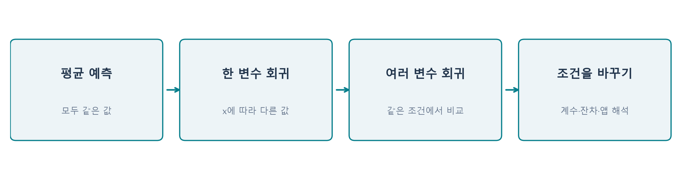

**그림 1.** 관측값 y는 그대로 두고 예측에 사용하는 정보를 늘립니다. 평균 기준 손실 SST는 같은 데이터에서 고정됩니다. 모형에 따라 달라지는 것은 적합값, 잔차, SSE입니다. 주교재 4.1–4.5를 연결한 수업용 도식입니다.

이번 자료에서 ‘설명’은 모형이 관측 자료의 변동을 반영한다는 뜻입니다. 설명변수가 y의 원인임을 자동으로 뜻하지 않습니다. ‘다른 변수를 고정한다’는 말도 실제로 실험을 했다는 뜻이 아니라, **정해진 회귀식에서 비교 조건을 같게 둔다**는 의미부터 이해합니다.

학습이 끝나면 다음을 할 수 있어야 합니다.

- 자료의 한 행과 다중회귀식의 한 관측을 대응시킵니다.
- 계수를 바꾸면 예측값과 SSE가 어떻게 변하는지 설명합니다.
- 적합값·잔차·잔차 자유도·오차분산 추정값을 계산합니다.
- “다른 설명변수가 같을 때”를 포함해 회귀계수를 해석합니다.
- 단순회귀와 편회귀계수가 다른 이유를 잔차 그림으로 설명합니다.

## 2. 짧은 복습: 무엇을 기준으로 좋아졌는가?

평균 예측과 회귀 예측은 같은 관측값에 서로 다른 예측 규칙을 적용합니다. 평균에서 실제값까지의 차이는 총편차, 평균에서 회귀 예측까지의 이동은 설명편차, 예측에서 실제값까지의 차이는 잔차입니다.

$$
y_i-\bar y=(\hat y_i-\bar y)+(y_i-\hat y_i).
$$

별도 보강자료의 네 점은 평균 예측의 제곱오차 합이 8이고 회귀 예측의 잔차제곱합은 0.8입니다. 따라서 평균 예측 대비 손실이 90% 줄었습니다. 두 번째 점에서는 오차가 커졌지만 전체 합은 줄었습니다.

같은 표본에 절편을 포함한 비가중 최소제곱을 적합하면 다음을 사용할 수 있습니다. R²에는 SST>0도 필요합니다.

$$
\mathrm{SST}=\mathrm{SSR}+\mathrm{SSE},\qquad
R^2=1-\frac{\mathrm{SSE}}{\mathrm{SST}}.
$$

**E1 · 연결 확인:** 설명변수를 두 개로 늘려도 SST가 같은 이유를 설명하세요. 데이터의 행과 반응변수 y는 바꾸지 않는다고 가정합니다.

## 3. §4.1–4.3 실제 사례를 먼저 읽기

교재는 금융기관 직원들의 설문을 집계한 **감독자 직무수행능력** 자료를 사용합니다. R에서는 이에 대응하는 `datasets::attitude`를 사용할 수 있습니다. 30개 부서 각각에서 약 35명 직원의 응답을 집계했으며, 각 값은 해당 문항에 긍정적으로 응답한 비율(%)입니다.

**한 행은 직원 한 명이 아니라 부서 하나입니다.** rating=43은 어떤 직원의 시험 점수43점이 아니라, 그 부서에서 전반적 평가에 긍정 응답한 비율43%를 뜻합니다. 개인 수준의 행동으로 곧바로 해석하지 않습니다.

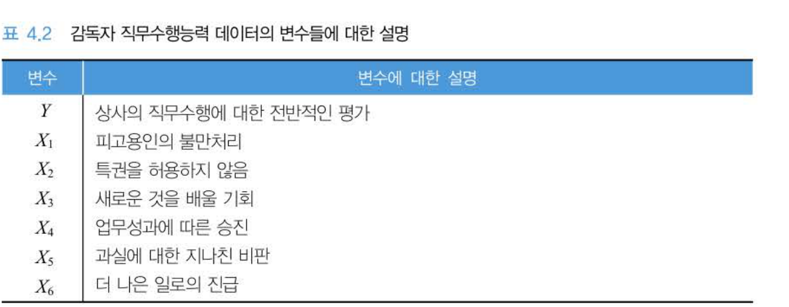

**그림 2.** 주교재 p.138, 표4.2 원본 발췌. 표의 $Y,X_1,\ldots,X_6$를 아래 R 열 이름과 연결합니다. 원본 용어는 보존하고 단위와 관측단위 해설을 추가했습니다.

| 교재 | R 열 이름 | 문항 의미 |
|---|---|---|
| Y | `rating` | 상사의 직무수행에 대한 전반적 평가 |
| X1 | `complaints` | 피고용인의 불만 처리 |
| X2 | `privileges` | 특권을 허용하지 않음 |
| X3 | `learning` | 새로운 것을 배울 기회 |
| X4 | `raises` | 업무성과에 따른 승진/보상 문항 |
| X5 | `critical` | 과실에 대한 지나친 비판 |
| X6 | `advance` | 더 나은 일로의 진급 |

문항 표현은 교재의 한국어를 기준으로 읽고, R 열 이름은 코드에서 그대로 사용합니다. `complaints`를 ‘불만 건수’로 바꾸어 해석하면 안 됩니다. 모든 설명변수가 동일한 방향의 좋은 의미라고 가정해서도 안 됩니다.

```r
d <- datasets::attitude
dim(d)       # 30행, 7열
head(d, 3)
```

| 부서 | rating | complaints | privileges |
|---|---:|---:|---:|
| 1 | 43 | 51 | 30 |
| 2 | 63 | 64 | 51 |
| 3 | 71 | 70 | 68 |

**E2 · 자료 읽기:** 두 번째 부서의 complaints=64를 말로 풀어 쓰세요. 한 행의 관측단위와 수치의 단위를 모두 포함하세요.

## 4. 설명변수를 함께 고려하는 이유

전반적 평가와 불만 처리 사이에 관계가 있다고 해도, 두 부서는 특권 문항이나 학습 기회에 대한 평가도 다를 수 있습니다. 한 변수만 이용한 직선은 다른 변수와 함께 움직이는 부분까지 한 기울기에 담을 수 있습니다.

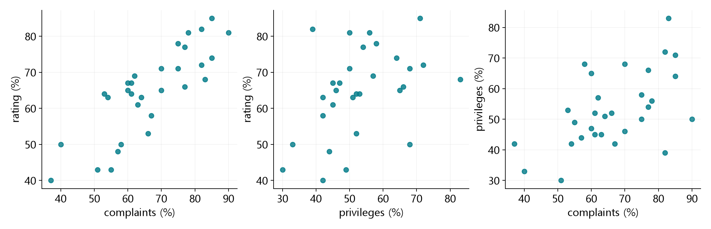

**그림 3.** 실제 attitude 30개 부서입니다. 오른쪽은 설명변수끼리도 함께 움직일 수 있음을 보여 줍니다. 다중회귀계수를 읽을 때 단순 산점도의 기울기만으로 판단하지 않는 이유입니다. 관측 자료의 관계이며 인과효과를 증명하는 그림은 아닙니다.

다중회귀는 다른 설명변수 값을 비교 조건에 포함하여 예측합니다. 설명변수를 많이 넣는 것이 목적은 아닙니다. **무엇을 같은 조건으로 비교하려는가**를 먼저 정해야 합니다. 측정하지 않은 요인, 자료의 범위, 변수 간 강한 관련성은 여전히 해석을 제한할 수 있습니다.

## 5. §4.2 모형의 한 줄과 데이터의 한 행

설명변수가 p개일 때 모형은 다음과 같습니다.

$$
Y_i=\beta_0+\beta_1x_{i1}+\cdots+\beta_px_{ip}+\varepsilon_i,
\qquad i=1,\ldots,n.
$$

| 기호 | 의미 | 두 변수 사례 |
|---|---|---|
| n | 관측 수 | 30개 부서 |
| p | 설명변수 수 | 2 |
| $\beta_0$ | 절편 | 두 설명변수가 0일 때 모형의 평균반응 |
| $\beta_1,\beta_2$ | 모집단 회귀계수 | 다른 변수 고정 조건의 기울기 |
| $\varepsilon_i$ | 모형의 평균반응으로 설명되지 않는 오차 | 관측할 수 없는 모집단 모형의 차이 |

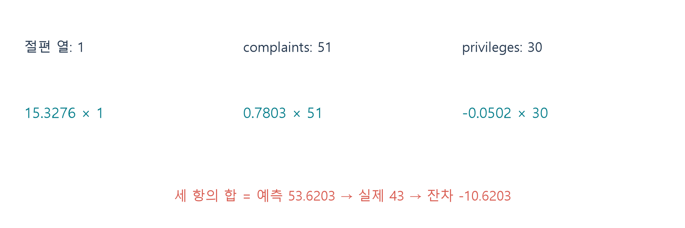

**그림 4.** 1번 부서는 complaints=51, privileges=30입니다. 모든 부서가 **같은 세 계수**를 사용하지만 각 부서의 설명변수 값이 다르므로 예측값은 달라집니다. 설명변수 두 개를 쓴다고 각 부서마다 계수 두 개를 따로 추정하지 않습니다.

조건부 평균의 모형으로 읽으면 다음과 같습니다.

$$
E(Y_i\mid X)=\beta_0+\beta_1x_{i1}+\beta_2x_{i2},\qquad
E(\varepsilon_i\mid X)=0.
$$

자료로 추정한 계수는 $\hat\beta_j$이며, 읽기 편하게 $b_j$라고도 쓰겠습니다. **모집단 계수**, **추정된 계수**, **한 관측의 값**을 구별해야 합니다.

$$
\hat y_i=b_0+b_1x_{i1}+b_2x_{i2},\qquad e_i=y_i-\hat y_i.
$$

오차 $\varepsilon_i$는 모르는 참 평균모형과의 차이이고, 잔차 $e_i$는 표본으로 적합한 모형과의 차이입니다. R이 바로 출력하는 것은 잔차입니다.

## 6. 직선에서 평면으로

설명변수가 하나이면 예측값은 직선 위에 있습니다. 두 개이면 $(x_1,x_2)$의 조합마다 높이를 주는 평면이 됩니다. 관측점은 그 평면의 위나 아래에 놓일 수 있습니다.

$$
\hat y=b_0+b_1x_1+b_2x_2.
$$

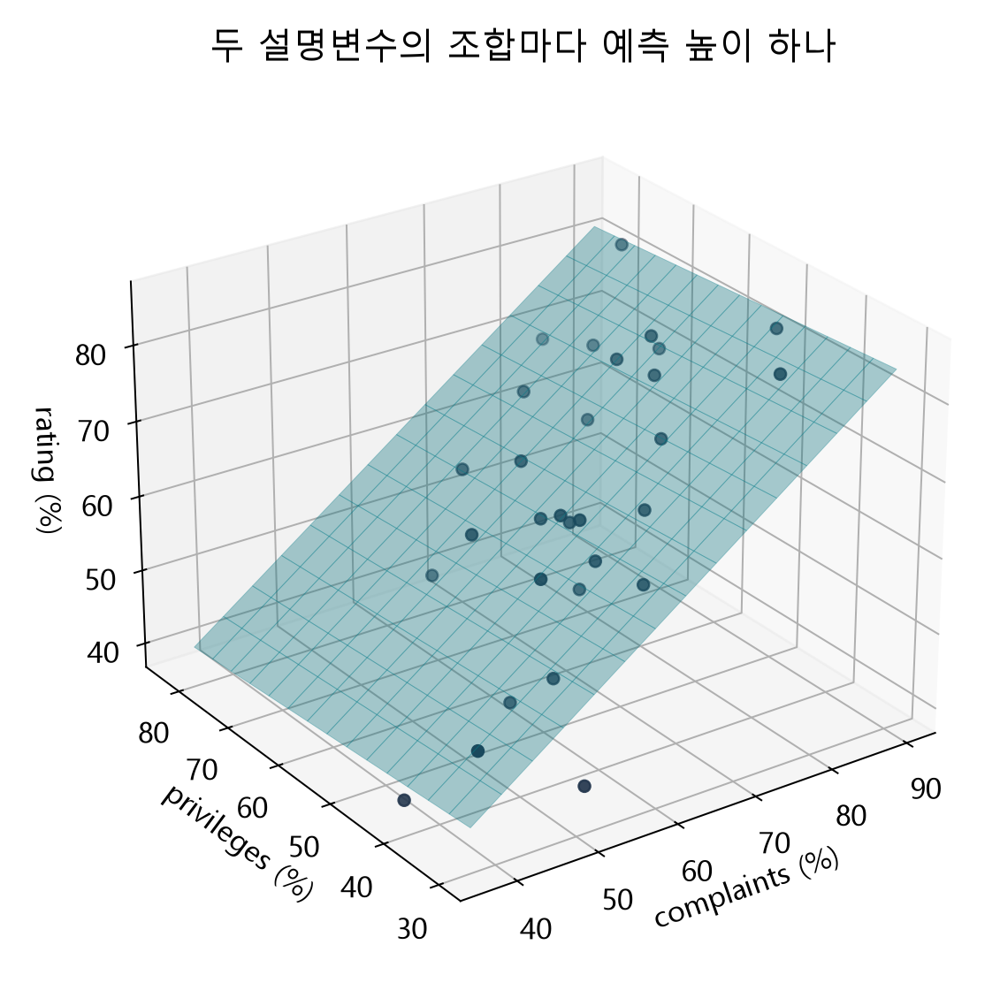

**그림 5.** 두 가로축이 두 설명변수이고 높이가 rating입니다. 잔차는 y 방향으로 관측 높이에서 평면의 예측 높이를 뺀 값입니다. 점과 평면 사이의 최단 기하학적 거리를 최소화하는 모형으로 혼동하지 않습니다.

3차원 그림을 회전해서 보는 것만으로 계수 해석이 쉬워지지는 않습니다. 다음 그림처럼 한 변수를 고정하면 익숙한 직선으로 읽을 수 있습니다.

## 7. §4.5 먼저 이해할 문장: 다른 설명변수가 같을 때

교재 두 변수 모형을 R로 적합하면 다음 계수를 얻습니다. 표시값은 반올림했으며 실제 계산은 원래 정밀도로 수행합니다.

$$
\hat y=15.327620+0.780343\,x_1-0.050160\,x_2.
$$

여기서 $x_1$은 complaints, $x_2$는 privileges입니다. $x_2$가 같은 두 조건에서 $x_1$만 1퍼센트포인트 높아지면 예측한 평균 rating은 약 0.7803퍼센트포인트 높아집니다. **1% 증가와 1퍼센트포인트 증가는 다릅니다.** 60%에서61%로의 변화가 1퍼센트포인트입니다.

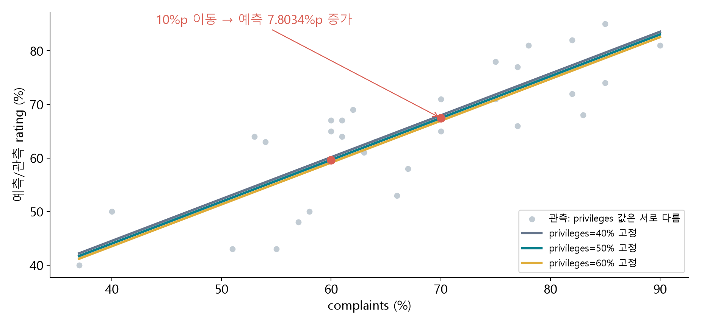

**그림 6.** 각 선에서는 privileges가 고정되어 있습니다. 선 위에서 오른쪽으로 움직이면 complaints의 계수를 읽습니다. 같은 complaints에서 선 사이를 이동하면 privileges의 계수를 읽습니다. 회색 점들의 privileges는 서로 다르므로 모든 점이 한 단면 직선에 놓일 필요가 없습니다.

| 조건 | complaints | privileges | 예측 rating |
|---|---:|---:|---:|
| A | 60 | 50 | 59.6402 |
| B | 70 | 50 | 67.4437 |
| C | 60 | 60 | 59.1386 |

A→B에서는 privileges가 같고 complaints만10퍼센트포인트 증가합니다. 예측 차이는 약7.8034퍼센트포인트입니다. A→C에서는 complaints가 같고 privileges만10퍼센트포인트 증가하여 예측 차이는 약−0.5016퍼센트포인트입니다.

이 부호만으로 특권을 허용하지 않는 정책이 평가를 낮춘다고 단정할 수 없습니다. 관측 자료의 조건부 관계이고, 이 수업에서는 그 계수의 통계적 유의성까지 검정하지 않았습니다.

**E3 · 비교 조건:** A와B를 비교하는 문장을 쓰세요. 어떤 변수를 같게 두었는지, 무엇이 얼마나 변하는지, 단위가 무엇인지 포함하세요.

절편15.3276은 두 설명변수가0일 때 평면의 높이입니다. 그러나 관측 complaints는37~90, privileges는30~83입니다. 원점은 관측 범위 밖이므로 실제 부서에 대한 자연스러운 기준값이라고 단정하지 않습니다.

## 8. §4.4 계수는 어떻게 정하는가?

계수를 바꾸면 모든 부서의 예측값이 함께 바뀝니다. 한 점을 정확하게 맞추려고 계수를 바꾸면 다른 점의 오차가 커질 수 있습니다. 따라서 모든 관측의 잔차를 함께 평가합니다.

$$
S(b_0,\ldots,b_p)=\sum_{i=1}^n
\left(y_i-b_0-\sum_{j=1}^p b_jx_{ij}\right)^2.
$$

최소제곱 추정량은 이 S를 가장 작게 만드는 계수입니다. 잔차의 합을 최소화하는 것도, 가장 큰 잔차 하나만 줄이는 것도 아닙니다. 제곱이므로 큰 잔차가 더 크게 반영됩니다.

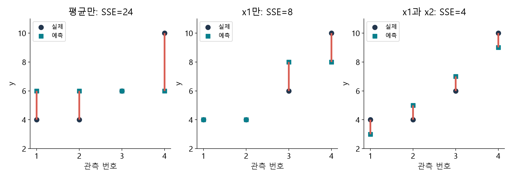

**그림 7.** 다음 절의 별도 합성 자료에 서로 다른 후보 계수를 적용했습니다. 관측은 고정하고 예측값만 바뀝니다. 왼쪽은 평균 예측, 가운데는 첫 설명변수만 사용한 예측, 오른쪽은 두 변수 최소제곱 예측입니다. 후보별 전체 제곱오차를 비교합니다.

최적화의 대상은 $b_0,b_1,b_2$ 같은 **계수**입니다. 관측한 x와 y를 바꾸어 오차를 줄이는 것이 아닙니다. 같은 데이터에서 계수의 후보값을 움직이는 활동과 새 데이터를 수집하는 활동은 다릅니다.

## 9. 선택 손계산: 두 기울기를 눈으로 검산하기

이 절의 네 행은 **추정 원리를 위한 별도 합성 자료**입니다. 앞의 단순회귀 네 점이나 실제 attitude 자료와 구별합니다. 계산이 잘 보이도록 두 설명변수의 중심화된 열을 직교하게 만들었습니다.

| 행 | x1 | x2 | y | $\hat y=2x_1+x_2$ | 잔차 |
|---|---:|---:|---:|---:|---:|
| 1 | 1 | 1 | 4 | 3 | 1 |
| 2 | 1 | 3 | 4 | 5 | −1 |
| 3 | 3 | 1 | 6 | 7 | −1 |
| 4 | 3 | 3 | 10 | 9 | 1 |

평균은 $\bar x_1=\bar x_2=2$, $\bar y=6$입니다. 중심화한 두 x열은 각각 $(−1,−1,1,1)$과 $(−1,1,−1,1)$이고 내적은0입니다. 이 특별한 구조에서는 두 기울기를 각각 계산할 수 있습니다.

$$
b_1=\frac{8}{4}=2,\qquad b_2=\frac{4}{4}=1,\qquad
b_0=6-2\times2-1\times2=0.
$$

그 결과 잔차는 $(1,−1,−1,1)$, SSE=4입니다. 일반 자료에서 설명변수 열들이 직교하지 않으면 기울기를 이렇게 독립적으로 계산할 수 없습니다. `lm()`은 계수들을 함께 추정합니다.

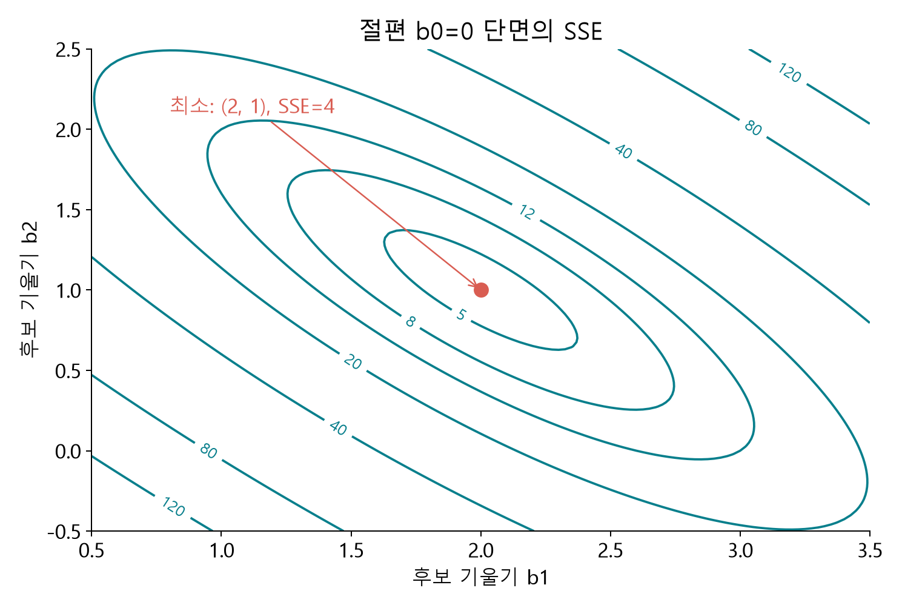

**그림 8.** 절편을0으로 고정한 단면에서 $(b_1,b_2)=(2,1)$이 SSE=4의 최솟값입니다. 점을 따라 계수를 움직이면 손실이 커집니다. 전체 세 계수 최적화의 단면을 보여 주는 그림이지, 절편을 언제나0으로 두라는 뜻은 아닙니다.

**E4 · 추정 확인:** 위 표의 잔차를 이용해 SSE를 계산하고, y의 단위가 점수라면 SSE의 단위를 쓰세요.

## 10. 정규방정식은 ‘더 줄일 방향이 없는 조건’

최소제곱 해에서는 절편이나 기울기를 아주 조금 바꾸어도 손실이 더 작아지는 방향이 없습니다. 미분하면 다음 조건으로 표현됩니다.

$$
\sum_i e_i=0,\qquad \sum_i x_{ij}e_i=0\quad(j=1,\ldots,p).
$$

설명변수와 잔차의 곱의 합이0이라는 뜻입니다. 오차가 각 점에서0이라는 뜻도, 잔차가 서로 독립이라는 뜻도 아닙니다. 이는 적합할 때 생기는 대수적 성질입니다.

행렬은 같은 계산을 짧게 적는 언어입니다. 절편을 위해 첫 열에1을 넣고, 이후 열에 설명변수를 넣습니다.

$$
\mathbf y=\mathbf X\boldsymbol\beta+\boldsymbol\varepsilon,
\qquad
\mathbf X=\begin{bmatrix}1&x_{11}&x_{12}\\1&x_{21}&x_{22}\\\vdots&\vdots&\vdots\\1&x_{n1}&x_{n2}\end{bmatrix}.
$$

정규방정식은 $\mathbf X^\mathsf T\mathbf X\hat{\boldsymbol\beta}=\mathbf X^\mathsf T\mathbf y$입니다. 열들이 선형독립이면 해가 유일합니다. 한 설명변수가 다른 열들의 정확한 선형결합이면 계수들을 유일하게 분리할 수 없습니다.

선택 공식 $\hat{\boldsymbol\beta}=(\mathbf X^\mathsf T\mathbf X)^{-1}\mathbf X^\mathsf T\mathbf y$는 역행렬이 존재할 때의 표현입니다. 실습에서는 역행렬을 직접 계산하도록 요구하지 않습니다. R의 `lm()`은 QR 계산을 사용합니다.

## 11. 적합값·잔차·분산을 구별하기

두 변수 attitude 모형에서 첫 부서의 예측값은 약53.6203이고 실제 rating은43이므로 잔차는 약−10.6203퍼센트포인트입니다. 음의 잔차는 실제값이 예측값보다 낮다는 뜻입니다. complaints의 기울기가 양수인 것과 모순되지 않습니다.

```r
fit2 <- lm(rating ~ complaints + privileges, data=d)
coef(fit2)
head(data.frame(observed=d$rating, fitted=fitted(fit2), residual=resid(fit2)))
```

오차분산의 추정값은 잔차의 제곱합을 **잔차 자유도**로 나눕니다. 이 교재의 p는 설명변수 수이므로 절편을 포함해 p+1개의 계수를 추정합니다.

$$
s^2=\frac{\mathrm{SSE}}{n-p-1},\qquad s=\sqrt{s^2}.
$$

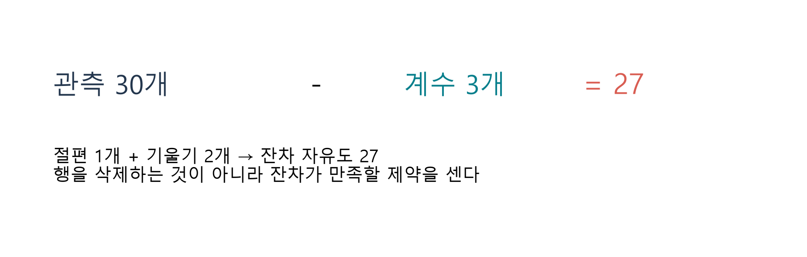

**그림 9.** n=30, p=2이면 계수3개를 추정하고 잔차 자유도는27입니다. 관측 세 행을 버리는 것이 아니라, 잔차들이 정규방정식의 세 제약을 받는다는 의미입니다. 그림의 블록은 개수 설명을 위한 도식입니다.

실제 두 변수 모형에서는 SSE≈1361.863852, 자유도27, $s^2\approx50.439402$, $s\approx7.102070$입니다. 분산은 퍼센트포인트², 표준편차는 퍼센트포인트 단위입니다. s는 자료 y의 전체 표준편차가 아니라 **모형을 적합한 뒤 남은 오차 규모의 추정값**입니다.

선형 조건부 평균, 평균0 오차, 독립·등분산 등의 모형 가정과 충분한 행렬 계수 조건 아래 해석합니다. 계수의 정확한 소표본 검정·구간에는 추가 가정이 필요하지만 이번 범위에서는 추정과 해석에 집중합니다. 잔차의 합이0이라는 사실이 모형 가정의 타당성을 증명하지는 않습니다.

**E5 · 자유도:** 같은30개 부서에 설명변수6개와 절편을 사용하면 몇 개의 계수를 추정하며 잔차 자유도는 얼마인가요?

## 12. §4.5 단순회귀 기울기와 편회귀계수

단순회귀 `rating ~ complaints`의 기울기는 약0.754610입니다. 두 변수 모형에서 complaints의 계수는 약0.780343입니다. 두 숫자는 서로 다른 질문에 답하므로, 다르다고 계산이 잘못된 것은 아닙니다.

| 모형 | 기울기가 답하는 질문 |
|---|---|
| 한 변수 | complaints에 따라 rating의 적합 평균이 어떻게 다른가? |
| 두 변수 | privileges가 같은 조건에서 complaints에 따라 적합 평균이 어떻게 다른가? |

교재는 **편회귀계수**가 ‘다른 설명변수에 대해 조정된’ 관계임을 잔차로 설명합니다. privileges의 계수를 이해하기 위해 complaints와 선형적으로 함께 움직이는 부분을 두 변수에서 각각 제거합니다.

1. rating을 complaints에 회귀하고 남은 잔차를 $r_Y$라 합니다.
2. privileges를 complaints에 회귀하고 남은 잔차를 $r_{X_2}$라 합니다.
3. 두 잔차를 회귀한 기울기를 구합니다.

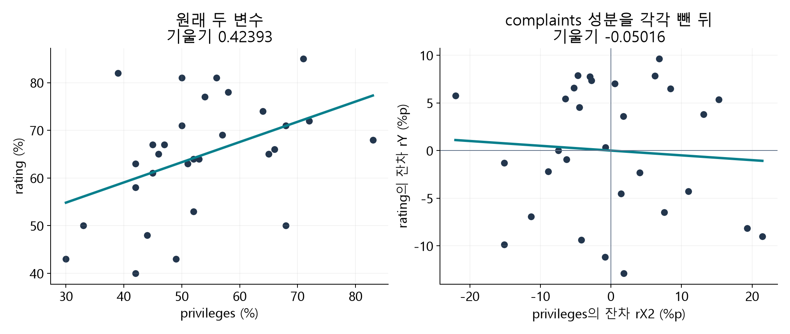

**그림 10.** 왼쪽은 privileges와 rating의 원래 관계, 오른쪽은 각각에서 complaints와의 선형 관계를 제거한 뒤의 잔차 관계입니다. 오른쪽 기울기는 두 변수 모형의 privileges 계수와 같습니다. 축의 숫자는 원래 긍정 응답 비율이 아니라 각 회귀에서 **남은 차이**입니다.

```r
ry <- resid(lm(rating ~ complaints, data=d))
rx <- resid(lm(privileges ~ complaints, data=d))
coef(lm(ry ~ rx))
coef(fit2)["privileges"]
```

잔차끼리 회귀한 기울기는 약−0.0501598로 일치합니다. 절편은 수치 오차 수준에서0입니다. 이 절차는 회귀식의 ‘조정’을 보여 주는 계산이며 관측하지 않은 요인까지 제거하는 인과적 통제는 아닙니다.

교재의 ‘편잔차’ 표를 읽을 때 여기서는 **두 별도 회귀에서 얻은 잔차들**이라는 점에 주목합니다. 다른 문헌에서 사용하는 component-plus-residual 그림과 용어가 다를 수 있으므로 계산 정의를 확인합니다.

**E6 · 잔차 해석:** 오른쪽 그림에서 $r_{X_2}=10$은 privileges 원래 값이10%라는 뜻인가요? 어떤 예측으로부터의 차이인지 설명하세요.

## 13. 여섯 변수 모형으로 확장하기

`rating ~ .`에서 점은 d의 rating을 제외한 나머지 열을 모두 설명변수로 사용한다는 뜻입니다. 식은 길어지지만 데이터→계수→예측→잔차 순서는 같습니다.

```r
fit6 <- lm(rating ~ ., data=d)
coef(fit6)
```

이번 R 내장 자료의 계수는 다음과 같습니다.

$$
\hat y=10.787076+0.613188x_1-0.073050x_2+0.320332x_3
+0.081732x_4+0.038381x_5-0.217057x_6.
$$

**교재 대조 메모:** 제공된 한국어 교재 p.140 식4.11에는 절편이 −10.79로 인쇄되어 있습니다. 이번 `datasets::attitude` 재계산은 +10.787076이며, 나머지 여섯 계수의 반올림값과 식4.14의 두 변수 계수는 재현됩니다. 수업 계산은 명시한 R 자료와 출력에 따릅니다. 별도 Supervisor.txt의 전체 행 동일성은 확인하지 않았으므로 부호 차이의 원인을 확정하지 않습니다.

| 모형 | 계수 수 | SSE | R² | 잔차 자유도 | 잔차 표준편차 |
|---|---:|---:|---:|---:|---:|
| 평균만 | 1 | 4296.9667 | 0.0000 | 29 | 12.1726 |
| complaints | 2 | 1369.3824 | 0.6813 | 28 | 6.9933 |
| complaints + privileges | 3 | 1361.8639 | 0.6831 | 27 | 7.1021 |
| 여섯 설명변수 | 7 | 1149.0003 | 0.7326 | 23 | 7.0680 |

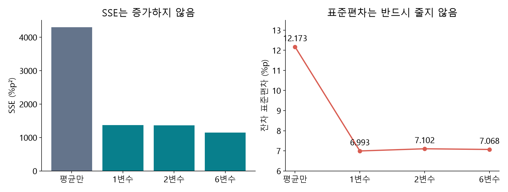

**그림 11.** 같은 행과 반응변수를 사용했으므로 모든 모형의 SST는4296.9667입니다. 중첩된 절편 포함 OLS에서 설명변수를 추가하면 SSE는 증가하지 않지만, 자유도도 줄기 때문에 잔차 표준편차까지 반드시 줄어들지는 않습니다.

추가 변수의 계수를0으로 두면 기존 모형을 그대로 만들 수 있습니다. 새 모형은 그보다 좋은 계수를 선택할 수 있으므로 학습 SSE가 더 커질 필요가 없습니다. 따라서 **변수를 넣고 학습 R²가 커졌다는 사실만으로 좋은 변수라고 판정할 수 없습니다.** 새 자료 예측이나 인과적 해석은 별도의 근거가 필요합니다.

**E7 · 비교 해석:** 한 변수에서 두 변수로 늘렸을 때 R²와 잔차 표준편차가 각각 어떻게 변했는지 표에서 읽으세요. 두 변화가 모순이 아닌 이유를 분모와 연결하세요.

## 14. 실습에서 읽을 R 코드와 공통 함수

핵심 계산은 먼저 기본 R로 확인하고, 같은 계산을 반복해서 그림과 앱에 연결할 때 공통 함수를 사용합니다. `source()`는 함수 정의를 읽어 들이는 작업이며, 모델을 추정하는 것은 `lm()` 또는 이를 호출하는 함수입니다.

| 코드 | 입력 → 출력 | 읽는 목적 |
|---|---|---|
| `lm(formula, data=d)` | 모형식·표 → 적합된 lm 객체 | SSE를 최소화하는 계수 추정 |
| `coef(fit2)` | 적합 모형 → 이름 있는 숫자 벡터 | 절편과 기울기 |
| `fitted(fit2)` | 적합 모형 → 관측 순서의 예측값 | 평면의 높이 |
| `residuals(fit2)` | 적합 모형 → 관측 순서의 잔차 | 실제 − 예측 |
| `predict(fit2, newdata=...)` | 적합 모형·새 조건 표 → 예측값 | 같은 조건 비교 |
| `model.matrix(fit2)` | 적합 모형 → 설계행렬 | 절편 열과 설명변수 열 확인 |

[공통 함수 정의와 입력·출력 설명](https://github.com/lunalab-ai/regre/blob/2026-fall-w05a-v2/src/mlr-api.md)을 실습 옆에 두었습니다. 각 이름은 실제 정의 줄로 연결됩니다. 코드와 링크는 같은 고정 버전 `2026-fall-w05a-v2`를 사용합니다.

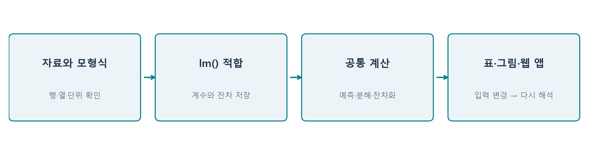

**그림 12.** 함수 이름을 외우기보다 입력과 출력의 역할을 읽습니다. 예측 조건을 바꿀 때는 적합된 계수를 읽어 새 예측을 계산합니다. 데이터나 모형식을 바꿀 때에는 먼저 다시 적합해야 합니다.

## 15. 마지막 활동: 웹 앱으로 설명하기

[누적 웹 앱 편집기](https://lunalab-ai.github.io/regre/apps/w05a/edit/index.html)는 앞선 차시의 기능을 유지하며 **편차와 R²**, **다중회귀** 탭을 추가한 실험실입니다. 처음에는 R 런타임을 내려받기 때문에 로딩 시간이 필요합니다.

1. **편차와 R²:** 관측점과 예측 방식을 선택해 세 편차를 읽습니다. 후보 절편·기울기를 바꾸고 SSE가 최소제곱 값보다 작아지는지 확인합니다.
2. **다중회귀:** 설명변수 모형을 바꾸며 SSE·R²·자유도를 비교합니다.
3. 두 변수 예측에서 privileges를 고정하고 complaints만 바꿉니다. 예측값의 차이를 기울기와 연결합니다.
4. 코드 편집기에서 L6의 출력 한 곳을 수정해 예측 차이를 보여 줍니다. **입력→계산→출력**이 실제로 연결되는지 재실행합니다.

**E8 · 최종 설명:** 친구에게 “complaints의 계수0.7803”을 설명하는 문장을 쓰고, 그 문장만으로 주장할 수 없는 것 하나를 덧붙이세요.

수업 후에는 자신이 수정한 R 코드를 다운로드해 보관하세요. 온라인 R의 저장은 서버 과제 제출이 아닙니다. Colab을 사용하는 경우 개인 사본을 Drive에 저장할 수 있습니다. 별도 성적 반영 과제나 제출기한은 이번 자료에 설정하지 않았습니다.

## 개념 확인 퀴즈

먼저 스스로 답한 뒤 [별도 해설](https://github.com/lunalab-ai/regre/blob/main/course/handouts/w05a-quiz.md)을 확인하세요.

1. 설명편차와 잔차는 각각 어느 두 값을 비교하는가?
2. R²=0.9를 평균 예측과 제곱오차를 포함해 설명하라.
3. attitude의 한 행과 수치의 단위는 무엇인가?
4. 다중회귀계수를 해석할 때 반드시 덧붙여야 하는 비교 조건은 무엇인가?
5. 최소제곱법이 최소화하는 양과 조정하는 대상은 무엇인가?
6. 관측30개, 설명변수2개, 절편 포함 모형의 잔차 자유도는 얼마인가?
7. 두 잔차를 회귀한 기울기는 어떤 다중회귀계수와 연결되는가?
8. 설명변수를 추가하여 학습 R²가 커지면 새 자료의 예측성능도 반드시 좋아지는가?

## 참고자료와 제작 구분

- 주교재: 『Chatterjee 예제를 통한 회귀분석 제6판: R 활용』, 4.1–4.5, pp.136–145(4.6 시작 전). 표4.2는 선별 원본 발췌, 나머지 도식·그래프는 실제 계산과 명시한 합성 자료로 제작했습니다. 3.9절 보강은 별도 자료입니다.
- [R attitude](https://stat.ethz.ch/R-manual/R-devel/library/datasets/html/attitude.html), [lm](https://stat.ethz.ch/R-manual/R-devel/library/stats/html/lm.html), [summary.lm](https://stat.ethz.ch/R-manual/R-devel/library/stats/html/summary.lm.html), [predict.lm](https://stat.ethz.ch/R-manual/R-devel/library/stats/html/predict.lm.html), [model.matrix](https://stat.ethz.ch/R-manual/R-devel/library/stats/html/model.matrix.html). 2026-09-28 확인.
- 퍼센트포인트 해석, 평균 기준 손실 비교, 고정 단면, 인과성·외삽의 주의와 앱 조립 활동은 이해를 돕는 추가 설명입니다. 이번 범위 이후의 검정·예측구간을 이미 학습한 것으로 전제하지 않습니다.
