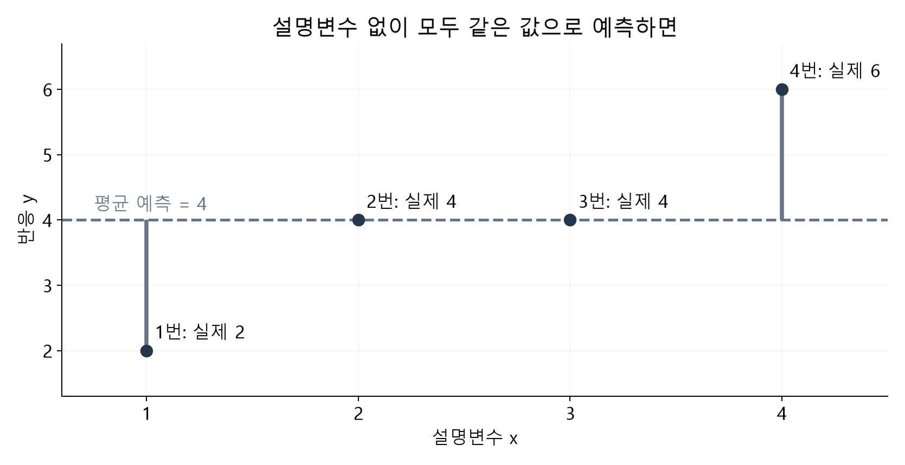
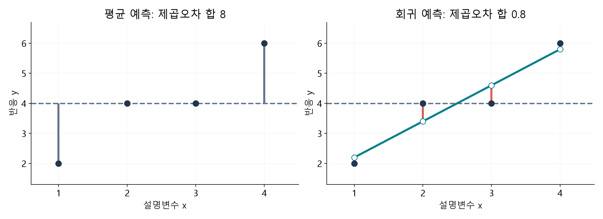
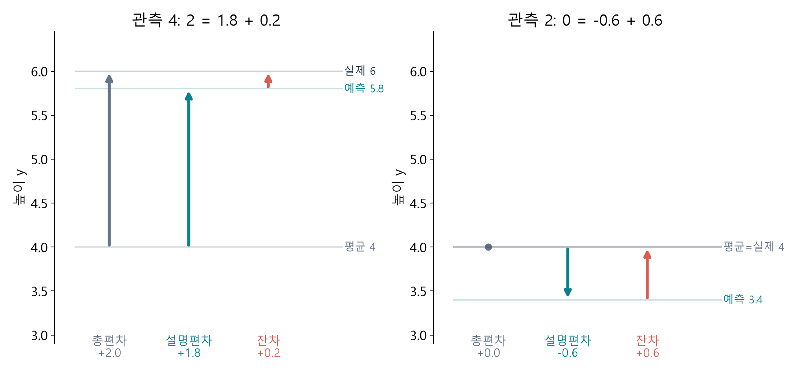
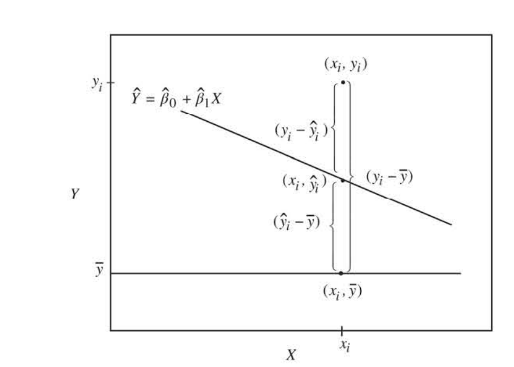
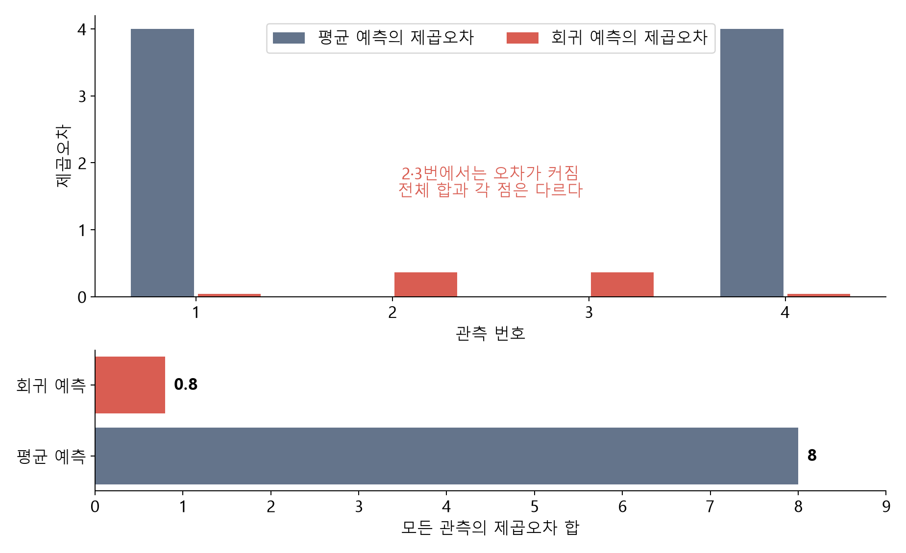
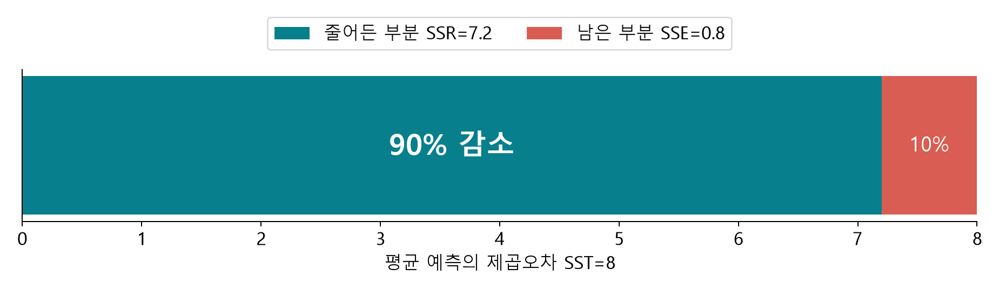

# 설명편차에서 R²까지 · 평균 예측과 회귀 예측 비교

회귀분석의 이해 · W05A 별도 보강자료 · 2026년 9월 28일

**이 자료의 목표는 공식을 외우는 것이 아니라, 세 제곱합이 무엇을 비교하는지 말로 설명하는 것입니다.** 지난 단순회귀에서 배운 내용을 다시 연결합니다. 먼저 1~5절을 읽고, 계산을 확인할 때 6~8절로 돌아오세요. 마지막 선택 보충은 증명이 궁금할 때 읽습니다.

[온라인 R 실습](https://lunalab-ai.github.io/regre/w05a.html) · [Colab A: 편차와 R²](https://colab.research.google.com/github/lunalab-ai/regre/blob/2026-fall-w05a-v2/notebooks/student/w05a_deviations.ipynb) · [직접 조작하는 웹 앱](https://lunalab-ai.github.io/regre/apps/w05a/edit/index.html) · [본 강의노트](https://github.com/lunalab-ai/regre/blob/main/course/notion/w05a/w05a-multiple-regression.md)

## 1. 출발점: 설명변수 없이 예측한다면?

네 관측값이 2, 4, 4, 6이라고 합시다. 아직 x를 사용할 수 없다면 모든 관측을 같은 숫자로 예측해야 합니다. 제곱오차의 합을 가장 작게 만드는 일정한 숫자는 표본평균 **4**입니다. 이 평균 예측을 앞으로 비교의 **기준선**으로 사용합니다.

여기서 ‘변동이 크다’는 것은 관측값들이 기준인 평균에서 멀리 흩어져 있다는 뜻입니다. 평균이 4라는 사실만으로 네 관측을 정확히 맞히지는 못합니다. 실제값이 2인 점과 6인 점에는 각각 2만큼의 거리가 남습니다.



**그림 B1.** 점은 바꾸지 않고 예측 규칙만 정합니다. 회색 선은 네 점 모두에 같은 예측값 4를 줍니다. 회색 세로선은 실제값과 평균 예측 사이의 차이입니다. 수업용 합성 자료로 직접 계산·제작했습니다.

| 관측 번호 | x | 실제 y | 평균으로 예측 | 실제 − 평균 |
|---|---:|---:|---:|---:|
| 1 | 1 | 2 | 4 | −2 |
| 2 | 2 | 4 | 4 | 0 |
| 3 | 3 | 4 | 4 | 0 |
| 4 | 4 | 6 | 4 | 2 |

차이를 그냥 더하면 −2+0+0+2=0이 되어, 틀린 예측들이 서로 상쇄됩니다. 따라서 이 수업에서는 차이를 **제곱해서 더한 값**을 예측 규칙의 손실로 사용합니다. 절댓값도 다른 손실이 될 수 있지만, 최소제곱 회귀의 기준은 제곱입니다.

$$
(-2)^2+0^2+0^2+2^2=8.
$$

**B1 · 말로 확인:** 평균 예측의 오차를 그냥 더한 값이 0이면, 네 점을 모두 맞혔다고 할 수 있을까요? 상쇄되는 두 관측을 짚어 설명하세요.

## 2. x를 알면 예측값을 다르게 줄 수 있다

이제 x=1,2,3,4를 함께 사용합니다. 이 네 점에 최소제곱으로 적합한 직선은 다음과 같습니다.

$$
\hat y=1+1.2x.
$$

평균 예측은 모든 사람에게 같은 숫자 4를 주지만, 회귀 예측은 x에 따라 2.2, 3.4, 4.6, 5.8을 줍니다. 실제 관측은 그대로입니다. **바뀐 것은 예측 규칙**입니다.



**그림 B2.** 왼쪽과 오른쪽의 관측점과 축 범위는 같습니다. 오른쪽의 청록 선이 회귀 예측이고, 붉은 세로선이 예측 후 남은 잔차입니다. 그림을 비교할 때 먼저 ‘점이 바뀌었는가, 예측이 바뀌었는가’를 확인하세요.

| 관측 | 실제 y | 회귀 예측 | 잔차: 실제 − 예측 | 잔차의 제곱 |
|---|---:|---:|---:|---:|
| 1 | 2 | 2.2 | −0.2 | 0.04 |
| 2 | 4 | 3.4 | 0.6 | 0.36 |
| 3 | 4 | 4.6 | −0.6 | 0.36 |
| 4 | 6 | 5.8 | 0.2 | 0.04 |
| 합 | | | 0 | **0.8** |

평균 예측의 제곱오차 합은 8, 회귀 예측의 제곱오차 합은 0.8입니다. 전체 손실은 줄었습니다. 그러나 두 번째 점은 평균으로 정확히 맞혔는데, 회귀식으로 예측하면 0.6만큼 틀립니다. **전체적으로 좋아지는 것과 모든 점이 좋아지는 것은 다릅니다.**

## 3. 설명편차는 ‘모형이 평균에서 움직인 양’이다

세 위치를 먼저 구별합니다. 평균은 비교 기준, 적합값은 모형의 예측, 관측값은 실제 결과입니다. 어떤 편차인지 알려면 **어디에서 어디로 가는지**를 말해야 합니다.

| 이름 | 출발 → 도착 | 식 | 말로 읽기 |
|---|---|---|---|
| 총편차 | 평균 → 실제 | $y_i-\bar y$ | 평균 예측에서 실제값까지의 차이 |
| 설명편차 | 평균 → 회귀 예측 | $\hat y_i-\bar y$ | x를 써서 예측을 평균에서 이동시킨 양 |
| 잔차 | 회귀 예측 → 실제 | $y_i-\hat y_i$ | 예측한 뒤에도 남은 차이 |

‘설명했다’는 말은 이 모형의 예측이 평균 기준 변동을 얼마나 반영하는지에 관한 표현입니다. 원인을 밝혔다는 뜻은 아닙니다. 설명편차는 양수일 수도, 음수일 수도, 0일 수도 있습니다.



**그림 B3.** 관측4에서는 평균4 → 예측5.8 → 실제6으로 이동합니다. 관측2에서는 평균4 → 예측3.4로 내려갔다가 실제4로 올라옵니다. 두 경우 모두 화살표의 **부호 있는 이동량**이 더해집니다. 색뿐 아니라 출발·도착과 수치도 함께 읽으세요.

관측4는 다음처럼 읽습니다.

$$
6-4=(5.8-4)+(6-5.8),\qquad 2=1.8+0.2.
$$

관측2는 다음과 같습니다.

$$
4-4=(3.4-4)+(4-3.4),\qquad 0=-0.6+0.6.
$$

설명편차 −0.6은 ‘오차를 0.6 줄였다’는 뜻이 아닙니다. **예측값을 평균보다 0.6 낮게 잡았다**는 뜻입니다. 이 점에서는 오히려 평균 예측보다 오차가 커졌습니다.

**B2 · 그림 설명:** 관측2의 설명편차와 잔차는 왜 서로 반대 부호일까요? ‘평균’, ‘예측’, ‘실제’ 세 단어를 모두 사용하세요.

## 4. 교재 그림으로 돌아가기



**그림 B4.** 『Chatterjee 예제를 통한 회귀분석 제6판: R 활용』 3.9절, p.119, 그림3.7 원본 발췌. 교수자 지시에 따라 필요한 그림을 직접 사용했습니다. 먼저 아래 평균선, 다음 회귀직선 위의 적합값, 마지막 위쪽 관측점을 찾으세요. 교재의 기울기가 음수라는 사실과 이 관측점의 잔차가 양수라는 사실은 서로 다른 이야기입니다.

읽는 순서는 **평균에서 예측으로**, 그다음 **예측에서 실제로**입니다. 어느 방향으로 움직이는지를 구별하면 기호의 뺄셈 순서를 외울 필요가 줄어듭니다. 교재 그림은 한 점의 관계를 보여 주고, 앞의 네 점 예제는 이를 모든 관측에 적용한 것입니다.

$$
\underbrace{y_i-\bar y}_{\text{총편차}}
=\underbrace{\hat y_i-\bar y}_{\text{설명편차}}
+\underbrace{y_i-\hat y_i}_{\text{잔차}}.
$$

이 등식은 단순한 이동 경로의 합입니다. 이를 각 점에서 제곱하면 교차항이 생깁니다. 아직 세 제곱의 합이 같다고 말하면 안 됩니다.

## 5. 세 제곱합에 이름 붙이기

이제 이미 계산한 양에 SST, SSE라는 이름을 붙입니다. SSR은 설명편차들의 제곱합입니다. 여기서 R은 회귀(regression), E는 오차(error)를 나타냅니다. 다른 자료에서 약어가 다르게 쓰이면 반드시 정의를 확인하세요.

$$
\mathrm{SST}=\sum_i(y_i-\bar y)^2,\qquad
\mathrm{SSE}=\sum_i(y_i-\hat y_i)^2,\qquad
\mathrm{SSR}=\sum_i(\hat y_i-\bar y)^2.
$$

| 양 | 이 예제 | 비교하는 것 |
|---|---:|---|
| SST | 8 | 평균 예측에서 출발한 전체 제곱오차 |
| SSE | 0.8 | 회귀 예측 뒤에도 남은 제곱오차 |
| SSR | 7.2 | 모형의 예측이 평균에서 달라진 정도의 제곱합 |



**그림 B5.** 위쪽은 각 점의 평균 제곱오차와 회귀 제곱오차입니다. 2·3번에서는 회귀 쪽이 더 큽니다. 아래쪽은 전체 합으로, 8에서 0.8로 줄어듭니다. 따라서 개선은 각 점을 따로 평가한 결과와 전체 합을 구별해야 합니다.

같은 자료에 **절편을 포함한 비가중 최소제곱 회귀**를 적합하면 다음 관계가 성립합니다.

$$
\mathrm{SST}=\mathrm{SSR}+\mathrm{SSE},\qquad 8=7.2+0.8.
$$

이 조건에서는 SSR이 전체 제곱오차의 감소량 SST−SSE와 같습니다. 설명편차 자체가 각 점의 오차 감소량이라는 뜻은 아닙니다. 정규분포 가정은 이 대수적 분해 자체에 필요하지 않습니다.

## 6. 네 점을 한 번에 검산하기

| i | 총편차 | 설명편차 | 잔차 | 총편차² | 설명편차² | 잔차² |
|---|---:|---:|---:|---:|---:|---:|
| 1 | −2 | −1.8 | −0.2 | 4 | 3.24 | 0.04 |
| 2 | 0 | −0.6 | 0.6 | 0 | 0.36 | 0.36 |
| 3 | 0 | 0.6 | −0.6 | 0 | 0.36 | 0.36 |
| 4 | 2 | 1.8 | 0.2 | 4 | 3.24 | 0.04 |
| 합 | 0 | 0 | 0 | **8** | **7.2** | **0.8** |

각 행에서는 총편차=설명편차+잔차입니다. 그러나 첫 행의 제곱은 4이고, 오른쪽 제곱 둘을 더하면 3.28입니다. **행별 제곱 분해는 성립하지 않습니다.** 제곱합의 분해는 모든 행을 합친 뒤 성립합니다.

수계산과 같은 의미를 R로 옮기면 다음과 같습니다. `fitted()`는 이미 적합된 모형의 예측값을 읽고, `residuals()`는 실제값에서 그 예측값을 뺀 잔차를 읽습니다.

```r
d <- data.frame(x=1:4, y=c(2,4,4,6))
fit <- lm(y ~ x, data=d)
SST <- sum((d$y - mean(d$y))^2)
SSE <- sum(residuals(fit)^2)
SSR <- sum((fitted(fit) - mean(d$y))^2)
c(SST=SST, SSR=SSR, SSE=SSE)
```

**B3 · 계산 점검:** 관측2 한 행에서 ‘총편차²=설명편차²+잔차²’를 계산해 보세요. 왜 전체 합의 관계와 혼동하면 안 될까요?

## 7. R²는 평균 예측 대비 얼마나 줄었는가?

8만큼 있던 제곱오차 중 7.2가 줄고 0.8이 남았습니다. 감소량을 원래 값으로 나누면 0.9입니다.

$$
R^2=\frac{\mathrm{SST}-\mathrm{SSE}}{\mathrm{SST}}
=1-\frac{\mathrm{SSE}}{\mathrm{SST}}
=\frac{\mathrm{SSR}}{\mathrm{SST}}=0.9.
$$



**그림 B6.** 막대 하나의 전체 길이가 평균 예측의 손실8입니다. 회귀 예측은 그중 0.8을 남겼습니다. 이 그림은 **총합 수준의 분해**이며 각 관측에서 같은 비율로 오차가 감소했다는 뜻은 아닙니다.

이 예제의 올바른 설명은 다음과 같습니다.

> 이 네 관측을 적합하는 데 사용한 절편 포함 회귀모형은 평균만으로 예측했을 때보다 총 제곱오차를 90% 줄였습니다.

‘네 관측 중 90%를 정확히 맞혔다’, ‘각 점의 오차를 90% 줄였다’, ‘x가 y의 원인 중 90%를 차지한다’, ‘새 자료도 90% 맞힌다’는 설명은 모두 다른 주장입니다.

SST가 0이면 모든 y가 같으므로 이 비율의 분모가 0입니다. 이때 이 정의의 R²는 정의되지 않습니다. 절편 없는 회귀의 R 기본 출력은 0 기준 분모를 사용할 수 있으므로 평균 기준 R²와 그대로 비교하지 않습니다.

## 8. 크기보다 기준을 먼저 확인하기

| 상황 | 확인할 것 |
|---|---|
| 평균만 사용하는 모형 | 평균 기준 SSE=SST이므로 R²=0 |
| 같은 관측을 완벽하게 적합 | SSE=0이고 SST>0이면 R²=1 |
| 아무렇게나 정한 예측값 | SSE가 SST보다 크면 평균 기준 점수는 음수 가능 |
| 다른 표본·시험 자료 | 학습 표본에서의 분해 성질을 그대로 전용하지 않기 |
| 설명변수를 추가한 중첩 모형 | 같은 행·같은 y·절편 포함 OLS라면 학습 SSE는 증가하지 않음 |

높은 R² 하나로 선형성·잔차 구조·자료 범위·인과성을 판단할 수 없습니다. 다음 강의에서는 변수 두 개로 예측값을 만들더라도 **평균과 비교한다는 기준은 그대로** 유지됩니다.

**B4 · 해석 점검:** “R²=0.9이므로 앞으로 나올 관측 10개 중 9개를 정확히 맞힌다.”에서 틀린 부분을 고치세요. 표본과 손실의 기준을 모두 포함하세요.

## 9. 웹 앱에서 직접 확인하기

[누적 앱 편집기](https://lunalab-ai.github.io/regre/apps/w05a/edit/index.html)를 열고 **편차와 R²** 탭을 선택합니다.

1. 관측4를 선택해 평균4 → 예측5.8 → 실제6의 순서로 읽습니다.
2. 관측2로 바꾸어 설명편차와 잔차의 부호를 비교합니다.
3. 평균 예측과 회귀 예측의 화면을 바꾸어 점은 같은지 확인합니다.
4. 후보 절편·기울기를 바꾸어 SSE를 관찰한 뒤 최소제곱 값으로 되돌립니다.

**B5 · 앱 기록:** 평균 예측보다 개별 오차가 커진 점 하나를 찾고, 그럼에도 전체 SSE가 줄어든 이유를 두 문장으로 적으세요. 자세한 코드 수정 활동은 온라인 R 실습에 있습니다.

## 선택 보충: 교차항은 왜 합치면 사라질까?

이 부분은 앞의 그림과 해석을 이해한 뒤 읽어도 됩니다. $a_i=\hat y_i-\bar y$, $e_i=y_i-\hat y_i$라고 쓰면 다음과 같습니다.

$$
\sum_i(a_i+e_i)^2=\sum_i a_i^2+\sum_i e_i^2+2\sum_i a_ie_i.
$$

절편 포함 최소제곱의 잔차는 설계행렬의 각 열과 직교합니다. 따라서 잔차합은 0이고, 적합값과 잔차의 내적도 0입니다. 그래서 $\sum_i(\hat y_i-\bar y)e_i=0$이 됩니다. 임의로 그린 직선에는 이 성질이 보장되지 않습니다.

네 점의 교차항은 0.72, −0.72, −0.72, 0.72로 합이 0입니다. 한 점의 등식에서 교차항을 지우는 것이 아니라 **합에서 상쇄됨을 확인하는 것**입니다.

## 참고와 자료 구분

- 주교재 3.9, pp.117–121, 식3.44–3.47 및 그림3.7을 기준으로 용어와 관계를 설명했습니다. 그림3.7은 원본 발췌, 나머지는 독립 제작입니다.
- [R 공식 summary.lm](https://stat.ethz.ch/R-manual/R-devel/library/stats/html/summary.lm.html): R²의 기준과 잔차분산. [lm](https://stat.ethz.ch/R-manual/R-devel/library/stats/html/lm.html): 최소제곱 적합과 절편. 2026-09-28 확인.
- 네 점은 수업용 합성 자료입니다. 실제 조사 자료나 새로운 실험 결과로 해석하지 않습니다. 방향 화살표·단계적 비교·오해 점검은 수업을 위해 추가한 설명입니다.
