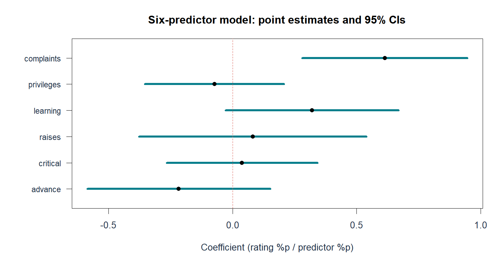
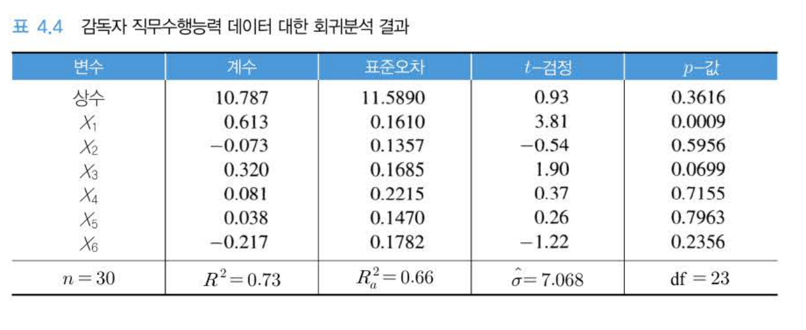
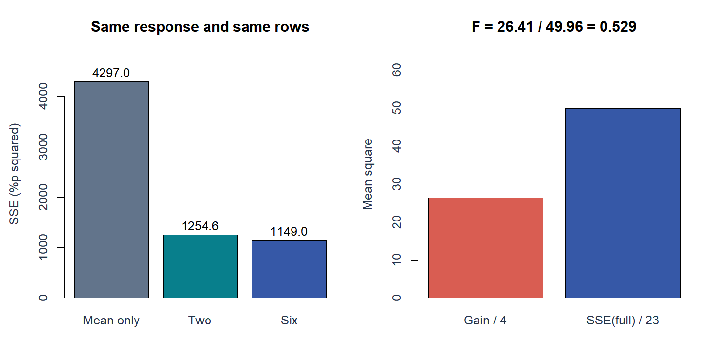
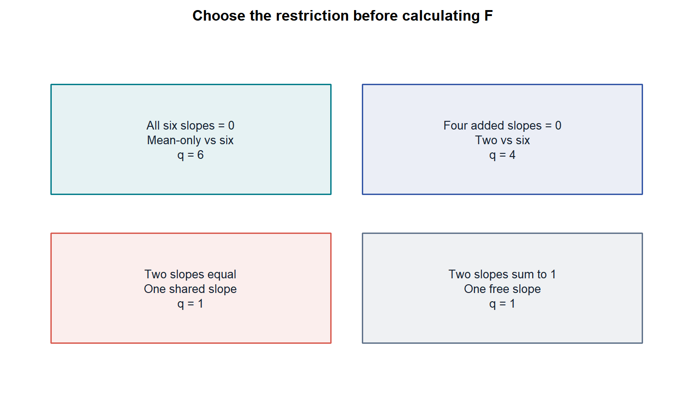
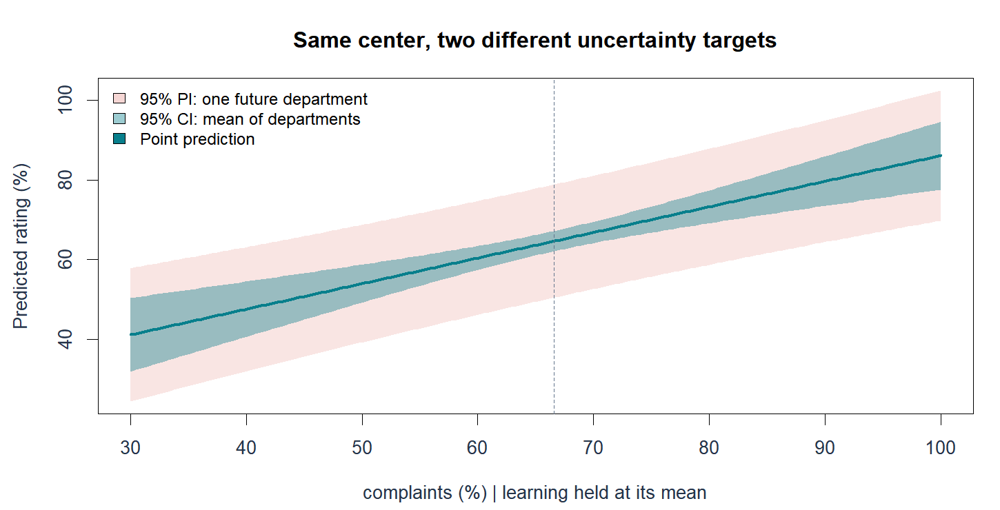
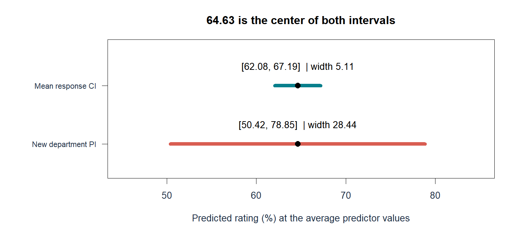
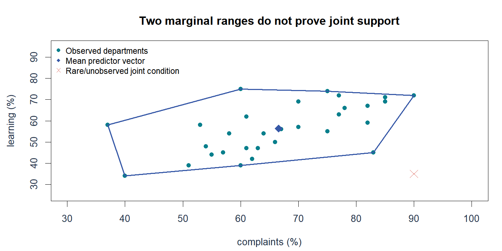
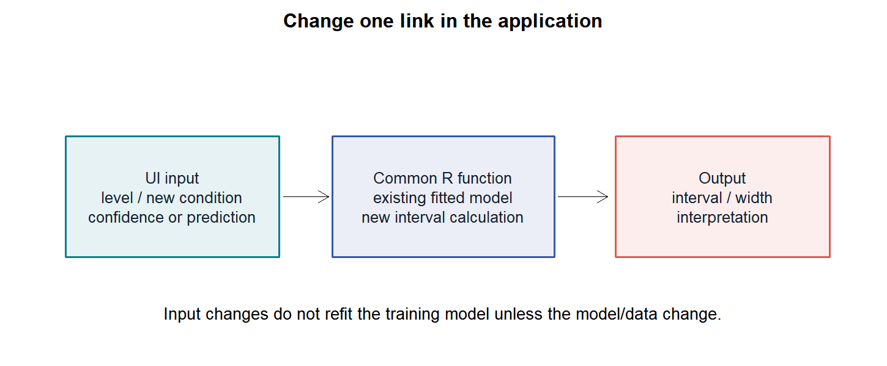

# W05B B · 계수와 모형의 추론, 그리고 예측

회귀분석의 이해 · 2026년 9월 30일 · 5주차 2차시

주교재 §4.9–4.12(pp.152–171). A의 같은 30개 부서 자료를 사용합니다. **계수의 신뢰구간**, **평균반응의 신뢰구간**, **새 관측의 예측구간**을 서로 바꾸어 읽지 않는 것이 목표입니다.

[A: 해석과 추정량](w05b-interpretation.md) · [온라인 R](https://lunalab-ai.github.io/regre/w05b.html) · [누적 웹 앱](https://lunalab-ai.github.io/regre/apps/w05b/edit/index.html) · [비교 기록지](w05b-workbook.md)

## 1. §4.9 계수표를 네 칸으로 읽기

계수 하나를 읽을 때 순서는 **추정값→표준오차→귀무값에서 떨어진 거리→그 거리가 얼마나 이례적인지**입니다. 추정값만 크다고 통계적 근거가 강한 것은 아닙니다. 같은 추정값이라도 표준오차가 크면 추정의 불확실성이 큽니다.

$$
t_j=\frac{\hat\beta_j-\beta_{j,0}}{\operatorname{SE}(\hat\beta_j)},\qquad
t_j\sim t_{n-p-1}\quad\text{under }H_0.
$$

기본 계수표는 귀무값 0에 대한 양측검정입니다. 정규오차 선형모형의 가정 아래 해석합니다. 여섯 변수 모형의 complaints는 추정값 0.613188, SE 0.160983, t≈3.809, p≈0.000903입니다. 다른 다섯 설명변수가 같은 조건에서 해당 계수가 0인 가설과 자료의 양립 정도를 묻습니다.

| summary 출력 | 읽는 질문 | 단위 |
|---|---|---|
| Estimate | 조건부 비교의 추정 크기는? | 계수 단위 |
| Std. Error | 그 추정량의 흔들림은? | 계수 단위 |
| t value | 귀무값으로부터 SE 몇 개만큼 떨어졌나? | 없음 |
| 양측 p값 | H0 아래 이 정도 이상 극단적인 t의 확률은? | 확률 |

```r
fit6 <- lm(rating ~ ., data=attitude)
summary(fit6)$coefficients
df.residual(fit6)
```

**교재 코드 대조:** p.153의 p값 계산 코드에는 자유도 `n-2`가 인쇄되어 있지만, 일반 다중회귀 본문은 `n-p-1`을 사용합니다. 이 수업은 실제 적합의 `df.residual(fit6)=23`으로 검산합니다. 단순회귀의 자유도를 설명변수 여섯 개 모형에 그대로 넣지 않습니다.

## 2. 계수 신뢰구간과 ‘유의하지 않음’의 뜻

$$
\hat\beta_j\pm t_{1-\alpha/2,n-p-1}\operatorname{SE}(\hat\beta_j).
$$

95% 신뢰구간은 같은 조건의 반복 표본에서 이 절차로 만든 구간들이 참 계수를 약 95% 포함한다는 해석입니다. 계산된 구간에 참 계수가 존재할 확률을 이번 표본만으로 95%라고 부르는 빈도주의 해석은 아닙니다.



**그림 B1.** 점은 추정값이고 가로선은 계수의 95% 신뢰구간입니다. 0 점선을 포함하는지 먼저 보고, 구간 폭과 방향도 함께 읽습니다. 이 그림은 rating의 예측구간이 아닙니다. complaints의 구간은 약 [0.2802, 0.9462], learning은 약 [−0.0283, 0.6689]입니다.

learning의 p≈0.0699는 유의수준 0.05에서 0을 기각하지 못하지만 0.10에서는 기각합니다. 이를 계수가 정확히 0이라는 증명이나 변수 자동 삭제 규칙으로 읽지 않습니다. 유의수준과 실질적 크기, 연구 목적을 함께 살펴야 합니다. 자료를 본 뒤 유리한 유의수준만 고르는 것도 적절하지 않습니다.

**E6 · 오해 고치기:** “learning의 p값이 0.05보다 크므로 학습 기회는 평가와 아무 관계가 없다”는 문장을 현재 모형과 불확실성을 포함한 문장으로 고쳐 보세요.

## 3. 교재 표를 실제 출력에 연결하기



**표 B1 · 교재 원본 발췌.** 『Chatterjee 예제를 통한 회귀분석 제6판: R 활용』 p.154 표4.4. 교수자 제공 스캔에서 이 표만 선별했습니다. X1=complaints, X2=privileges, X3=learning, X4=raises, X5=critical, X6=advance입니다. 왼쪽의 변수 이름을 확인하고 한 행을 가로로 읽으세요. 작은 반올림 차이는 전체 정밀도의 R 계산과 구분합니다.

표의 절편은 +10.787입니다. 이전 p.140 식4.11에는 −10.79로 인쇄되어 있고 `datasets::attitude`의 재계산은 +10.787076입니다. 이번 수업의 계산은 명시한 R 자료와 출력에 따릅니다. 원본 Supervisor 파일과 모든 행이 같은지 별도로 대조한 것은 아니므로 차이의 원인을 단정하지 않습니다.

표의 df=23은 관측30개에서 절편과 기울기6개, 총7개 계수를 추정한 결과입니다. 부서7개를 삭제했다는 의미가 아닙니다. 교재 숫자를 외우기보다 어떤 모형·어떤 행·어떤 자유도인지 확인하는 습관이 중요합니다.

## 4. §4.10 완전모형과 축소모형

“더 복잡한 모형이 필요한가?”라는 질문은 **무엇을 제한한 모형과 비교하는가**가 정해져야 계산할 수 있습니다. 완전모형은 비교에서 더 자유로운 모형이고, 축소모형은 완전모형의 계수에 귀무가설의 제약을 가한 모형입니다. 축소모형이 완전모형의 특별한 경우일 때 두 모형은 내포되어 있습니다.

같은 반응변수와 같은 관측행에서 비교해야 합니다. 결측 때문에 두 모형이 서로 다른 행을 사용하거나 반응변수를 다르게 변환했다면 SSE를 바로 비교할 수 없습니다. `anova(fit)` 하나는 변수 입력 순서에 따른 순차제곱합을 보여 줍니다. 모든 변수를 조정한 개별 계수검정과 자동으로 같지 않습니다.

$$
F=\frac{(\mathrm{SSE}_{R}-\mathrm{SSE}_{F})/q}{\mathrm{SSE}_{F}/\nu_F},
\qquad q=k_F-k_R,\qquad \nu_F=n-k_F.
$$

여기서 k는 절편을 포함한 독립 계수 수이고 q는 제약 수입니다. 분자는 **제약 하나당 잃은 적합의 크기**, 분모는 **완전모형에서 남은 오차의 규모**입니다. 두 평균제곱을 비교하므로 단위가 상쇄됩니다.

**E7 · 분모 확인:** 두 변수에서 여섯 변수로 늘린 비교에서 q와 분모 자유도는 각각 얼마인가요? 왜 둘 다 4가 아닌가요?

## 5. 전체 검정과 부분집합 검정은 다른 질문

전체 검정은 여섯 기울기가 모두 0인지 묻습니다. 축소모형은 평균만 예측합니다. 이 자료에서는 F(6,23)≈10.502, p≈0.0000124입니다. “적어도 하나의 기울기가 0이 아니라는 근거”이지 “여섯 계수가 모두 유의하다”는 결론이 아닙니다.

부분집합 검정은 complaints와 learning을 이미 사용한 상태에서 **privileges, raises, critical, advance의 네 기울기가 함께 0인지** 묻습니다. 이때 축소모형은 두 변수 모형입니다.



**그림 B2.** 왼쪽에서 1254.649→1149.000의 감소량만 떼어 봅니다. 오른쪽은 감소량을 추가 계수4개로 나눈 26.412와, 완전모형 SSE를 자유도23으로 나눈 49.957입니다. 비율 약 0.529는 추가 변수 때문에 얻은 감소가 잔차 오차 규모에 비해 크지 않음을 보여 줍니다.

$$
F=\frac{(1254.649-1149.000)/4}{1149.000/23}\approx0.5287,
\qquad p\approx0.7158.
$$

```r
fit2 <- lm(rating ~ complaints + learning, data=attitude)
fit6 <- lm(rating ~ ., data=attitude)
anova(fit2, fit6)
```

전체 검정이 유의하고 이 부분 검정은 유의하지 않아도 모순이 아닙니다. 비교 기준이 평균만 예측하는 모형인지, 이미 두 변수를 사용한 모형인지가 다릅니다. 이 검정 하나로 두 변수 모형의 모든 가정이나 미래 예측 성능까지 확인한 것은 아닙니다.

## 6. 한 제약에서는 F=t²

두 변수 모형에서 learning 계수가 0인지 검정하면 완전모형은 complaints+learning, 축소모형은 complaints만 사용합니다. 같은 가정과 같은 모형에서 한 제약에 대한 양측 t검정과 F검정은 같습니다.

$$
F_{1,27}=t_{27}^{\,2},\qquad 2.4691\approx1.5713^2.
$$

```r
t_learning <- summary(fit2)$coefficients["learning", "t value"]
one_restriction <- anova(lm(rating~complaints, data=attitude), fit2)
c(t_squared=t_learning^2, F=one_restriction$F[2])
```

여섯 변수 모형의 전체 F값에 아무 t값이나 제곱해 비교하지 않습니다. 검정하는 제약과 완전모형이 같아야 합니다. 또한 t의 부호는 추정값이 귀무값의 어느 쪽에 있는지 알려 주지만, 제곱한 F에는 방향이 남지 않습니다.

## 7. 계수 동일성과 합 제약까지 한 지도에서 보기



**그림 B3.** 주교재 §4.10.1–4의 네 경우입니다. 위 두 칸은 평균만/두 변수/여섯 변수 비교이고, 아래 두 칸은 두 변수 모형 안에서 서로 다른 한 개 제약을 적용합니다. 어떤 계수를 자유롭게 추정하는지 적은 뒤 q를 셉니다.

두 변수 모형에서 βcomplaints=βlearning=γ라는 **동일성 제약**을 가하면 다음 축소식이 됩니다.

$$
y=\beta_0+\gamma(x_1+x_3)+\varepsilon.
$$

`lm(rating ~ I(complaints+learning), data=attitude)`와 원래 두 변수 모형을 비교할 수 있습니다. 여기서 `I()`는 합을 하나의 수치 설명변수로 계산하게 합니다. F(1,27)≈3.6572, p≈0.06649입니다. 유의수준 0.05에서 비기각이라고 두 계수가 같다는 사실이 입증되지는 않습니다.

합 제약 βcomplaints+βlearning=1이면 βlearning=1−βcomplaints를 대입합니다.

$$
y-x_3=\beta_0+\beta_1(x_1-x_3)+\varepsilon.
$$

이 식으로 축소모형을 적합할 수 있지만 **변환된 y−x3의 회귀와 원래 y의 회귀를 `anova()`로 직접 비교하면 안 됩니다.** 적합값에 x3를 다시 더해 원래 y의 잔차 SSE를 구한 뒤 비교하거나 일반 선형가설을 사용합니다. 결과는 F(1,27)≈1.6118, p≈0.2151입니다. 상세 계산과 공분산을 포함한 검산은 [수학 보충](w05b-math.md)에 있습니다.

**해석 보완:** 각각의 동일성 검정과 합 검정에서 기각하지 못했다는 사실을 합쳐 “두 계수는 각각 정확히 0.5이다”라고 결론내리지 않습니다. 두 조건을 동시에 가정하는 것은 별도의 **두 제약**이며, 비기각은 어느 경우에도 정확한 값의 입증이 아닙니다.

## 8. §4.11 예측 대상을 먼저 선택하기

새 부서의 complaints와 learning을 입력하면 점예측을 구할 수 있습니다. 이때 서로 다른 두 질문을 구별합니다.

| 질문 | 불확실성의 대상 | 필요한 구간 |
|---|---|---|
| 이 조건을 가진 부서들의 평균 rating은? | 조건부 평균의 추정 | 평균반응 신뢰구간 |
| 다음에 관측할 부서 하나의 rating은? | 평균 추정 + 그 부서의 새 오차 | 새 관측 예측구간 |

같은 조건이면 중심인 점예측은 같습니다. 새 관측에는 그 부서만의 오차가 추가되므로 예측구간이 더 넓습니다. 계수 하나의 신뢰구간은 다시 별개의 대상입니다. 아래 ŷ0의 구간에 계수의 SE를 그대로 넣지 않습니다.

$$
h_0=\mathbf x_0^{\mathsf T}(X^{\mathsf T}X)^{-1}\mathbf x_0,
\qquad
\operatorname{SE}_{\mathrm{mean}}=s\sqrt{h_0},
\qquad
\operatorname{SE}_{\mathrm{new}}=s\sqrt{1+h_0}.
$$

벡터 x0에는 절편에 대응하는 첫 원소 1이 포함됩니다. 평균 추정에는 h0가 들어가고 새 관측에는 **1이 추가**됩니다. 추가된 1은 새 부서 오차의 분산 σ²에 대응합니다. 두 구간 모두 해당 표준오차에 같은 t 임계값을 곱해 점예측 양쪽에 더하고 뺍니다.



**그림 B4.** 안쪽 청록 리본은 평균반응 CI, 바깥 연한 빨강 리본은 새 부서 PI입니다. 두 중심선은 같습니다. 각 x에서의 점별 구간이며 모든 x를 동시에 덮는 신뢰띠라고 부르지 않습니다. 리본을 그렸다는 사실만으로 외삽 위치의 모형이 타당해지지는 않습니다.

## 9. 같은 숫자로 두 구간 직접 읽기

학습 평균 조건은 complaints=66.6%, learning≈56.3667%입니다. 이때 점예측은 64.6333%입니다.



**그림 B5.** 위와 아래 모두 중앙 검은 점은 같은 예측입니다. 위 구간 폭은 약 5.1073%p이고 아래는 약 28.4362%p입니다. 표본이 많아져 평균 추정이 정확해져도 새로운 부서의 개별 오차 자체가 사라지는 것은 아닙니다.

```r
new_department <- data.frame(complaints=mean(attitude$complaints),
                             learning=mean(attitude$learning))
predict(fit2, newdata=new_department, interval="confidence", level=.95)
predict(fit2, newdata=new_department, interval="prediction", level=.95)
```

`newdata`는 학습 모형의 열 이름과 원래 단위를 사용합니다. `interval` 인자만 바꿔도 대상이 달라집니다. `level=.99`로 높이면 더 높은 포함률을 얻기 위해 구간이 넓어집니다. 신뢰수준을 높이는 것이 계수 추정값을 바꾸거나 자료를 새로 모으는 작업은 아닙니다.

**E8 · 선택:** “이 조건의 다음 부서 한 곳이 대략 어느 범위에 들어올까?”라는 질문에는 두 구간 중 어느 것을 써야 할까요? 추가되는 불확실성을 말하세요.

## 10. 공동 관측 범위와 외삽

complaints와 learning이 각각 최소–최대 범위 안에 있어도 두 값의 **조합**은 관측되지 않았을 수 있습니다. 두 변수가 함께 움직이는 자료에서 “높은 complaints, 낮은 learning” 같은 조합은 드물 수 있습니다. 개별 열의 범위 검사만으로 공동 지지 영역을 확인했다고 할 수 없습니다.



**그림 B6.** 점은 실제 부서이며 파란 선은 관측점들의 볼록껍질을 잇습니다. 빨간 표시는 각 축의 범위만 보면 가능해 보이지만 공동 관측 영역에서 멀리 떨어진 조건의 예입니다. 볼록껍질 내부라는 사실도 인과성이나 정확한 예측을 보장하지는 않습니다.

평균 조건에서 멀어진 입력은 일반적으로 h0를 키워 평균 추정의 불확실성을 늘릴 수 있습니다. 다중회귀에서는 각 축 거리만이 아니라 설명변수들의 배치와 공분산을 함께 봅니다. 외삽을 할 때는 계산 가능한 예측과 믿을 만한 예측을 구별해야 합니다.

## 11. 마지막 실습 · 앱의 입력→계산→출력 연결

[누적 Shiny 앱 편집기](https://lunalab-ai.github.io/regre/apps/w05b/edit/index.html)에는 기존 차시 기능과 함께 **W05B 단위**, **W05B 검정**, **W05B 예측** 탭이 있습니다. 웹에서 R 런타임을 처음 내려받는 동안 잠시 기다려 주세요. 설치나 API 키는 필요 없습니다.



**그림 B7.** 새 예측 조건과 구간 수준은 적합된 모형을 이용한 계산에 전달됩니다. 현재 앱에서 조건을 바꾸는 것은 학습 자료를 변경하거나 다시 적합하는 것이 아닙니다. ‘가상 오차 배율’이 1이 아닐 때는 실제 재추정이 아닌 비교 시나리오라는 표시를 확인하세요.

1. 단위 탭에서 중심화 전후 계수와 원단위 예측의 최대 차이를 확인합니다.
2. 검정 탭에서 전체/부분/동일성/합 제약을 선택하고 **비교하기**를 누릅니다. q와 분모 자유도를 읽습니다.
3. 예측 탭에서 같은 입력의 평균 CI와 새 부서 PI를 비교합니다. 95%→99%, 오차 배율1→1.5를 한 번에 하나씩 바꿉니다.
4. **L8 앱 조립:** 코드의 `W05B-L8` 표식을 찾아 구간 폭을 설명하는 출력문에 `selected_interval()$width`를 연결하고 재실행합니다. 기본 앱의 나머지 계산은 그대로 작동합니다.

**E9 · 설명 기록:** 바꾼 입력 하나, 바뀐 결과 하나, 바뀌지 않은 결과 하나를 적으세요. 왜 그런지 모형 적합과 예측 계산의 차이로 설명하세요.

## 12. §4.12 요약과 스스로 점검하기

회귀식의 숫자를 의미 있는 문장으로 읽는 데에는 비교 조건·단위·가정·대상이 필요합니다. 중심화와 척도화는 좌표를 바꾸고, 표준오차는 반복 추정의 변동을 나타내며, 검정은 명시한 제약을 평가합니다. 높은 R²나 작은 p값이 자료 수집과 모형 가정을 대신하지 않습니다. 예측을 전달할 때에는 점 하나와 함께 어느 대상을 위한 구간인지 반드시 말합니다.

**E10 · 출구 설명:** 표준화 계수, t와 F, 평균 CI와 새 관측 PI 중 하나를 골라 서로 혼동하기 쉬운 두 개념을 친구에게 두 문장으로 설명하세요.

## 개념 확인 퀴즈

먼저 스스로 답한 뒤 별도 해설을 읽으세요. 이번 자료에는 새 성적 반영 과제나 제출 기한이 없습니다.

1. complaints의 회귀계수를 해석할 때 비교 조건과 단위는 무엇인가?
2. 절편 포함 OLS에서 X만 중심화하면 무엇이 달라지고 무엇이 유지되는가?
3. 표준편차 1 표준화와 단위길이 척도화는 어떻게 다른가?
4. 새 부서 한 행에 scale()을 다시 적용하면 왜 잘못되는가?
5. 불편성 또는 BLUE를 설명할 때 정규오차가 반드시 필요한가?
6. R²가 증가하는데 수정 R²가 감소할 수 있는 이유는 무엇인가?
7. 전체 F검정과 추가 변수의 부분 F검정은 무엇을 다르게 묻는가?
8. 어떤 경우에 F=t²가 성립하며 t의 부호는 어떻게 되는가?
9. 동일성과 합 제약에서 각각 비기각이면 두 계수는 각각 0.5인가?
10. 평균반응 신뢰구간과 새 관측 예측구간은 왜 폭이 다른가?

## 참고자료와 제작 구분

- 주교재 §4.9–4.12, pp.152–171. 표4.4만 선별 원본 발췌; 나머지 그림은 명시한 R 자료와 수업용 도식으로 제작했습니다. 표4.7의 두 변수 계수는 전체 정밀도의 R 결과를 사용합니다.
- [R summary.lm](https://stat.ethz.ch/R-manual/R-devel/library/stats/html/summary.lm.html), [anova.lm](https://stat.ethz.ch/R-manual/R-devel/library/stats/html/anova.lm.html), [predict.lm](https://stat.ethz.ch/R-manual/R-devel/library/stats/html/predict.lm.html), [vcov](https://stat.ethz.ch/R-manual/R-devel/library/stats/html/vcov.html). 2026-09-29 본문 확인.
- 비기각의 해석, 동일 반응·동일 행의 비교, 공동 관측 영역, 앱 입력/출력 활동은 개념 이해를 돕는 보완 설명입니다. 행렬과 제약 계산의 상세 유도는 수학 보충에서 확인하세요.
