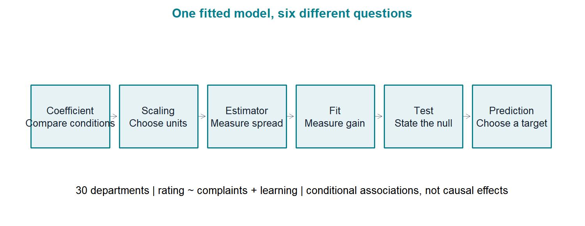
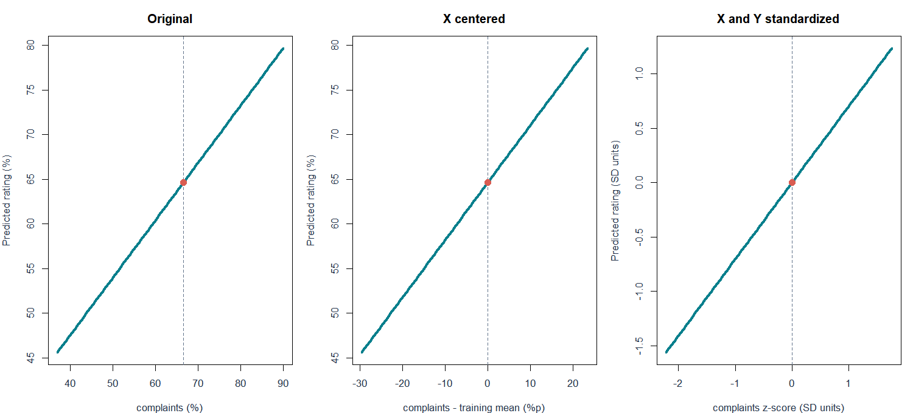
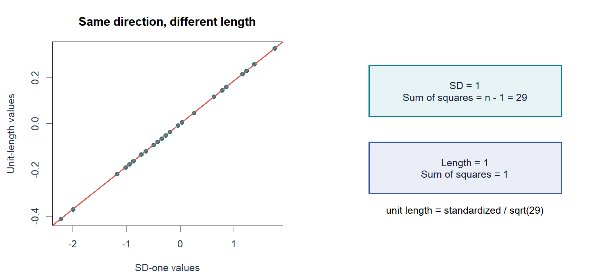
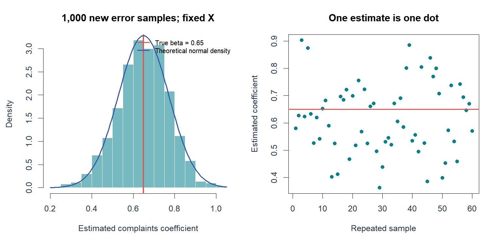
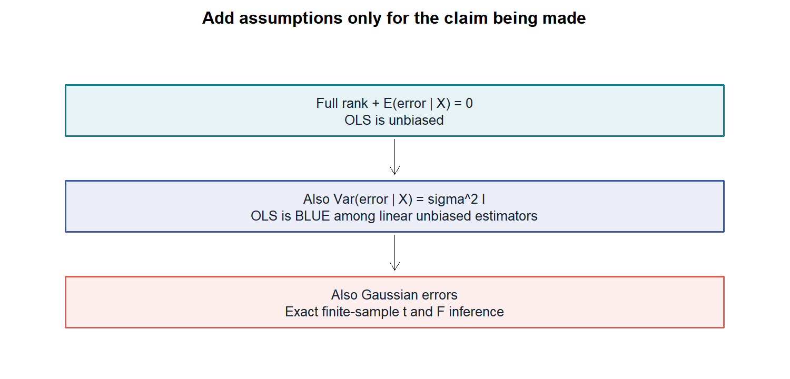
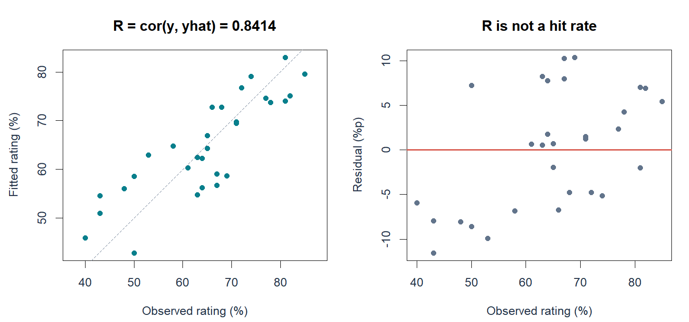
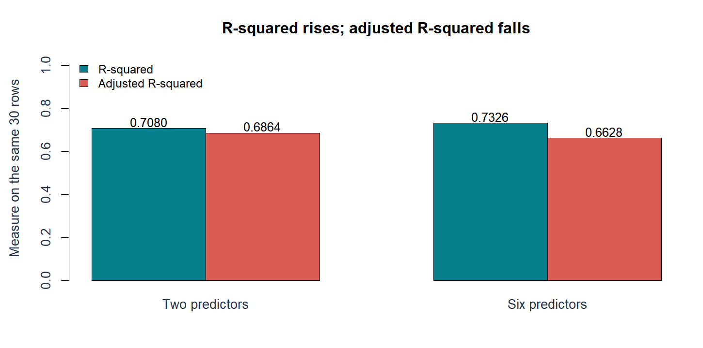

# W05B A · 다중회귀의 해석과 추정량의 불확실성

회귀분석의 이해 · 2026년 9월 30일 · 5주차 2차시

주교재 『Chatterjee 예제를 통한 회귀분석 제6판: R 활용』 §4.6–4.8(pp.145–151). §4.5의 계수 해석을 먼저 연결 복습합니다. B에서는 §4.9–4.12의 추론과 예측으로 이어갑니다.

[온라인 R 실습](https://lunalab-ai.github.io/regre/w05b.html) · [B: 추론과 예측](w05b-inference.md) · [비교 기록지](w05b-workbook.md) · [수학 보충](w05b-math.md)

## 1. 숫자를 읽기 전에 질문을 정하기

회귀분석 결과에는 계수, 표준오차, t값, p값, R²가 함께 나옵니다. 이들은 같은 내용을 다른 형식으로 쓴 숫자가 아닙니다. **계수는 비교의 크기**, **표준오차는 추정의 흔들림**, **검정은 특정 가설과 자료의 양립 가능성**, **예측구간은 새 관측의 불확실성**을 다룹니다. 먼저 숫자가 답하는 질문을 정하면 출력표를 읽기 쉬워집니다.



**그림 A1.** 왼쪽부터 비교 조건→단위→반복 표본→설명력→귀무가설→예측 대상 순서로 읽습니다. 같은 자료를 사용해도 질문이 달라지면 필요한 숫자가 달라집니다. 주교재의 논리 순서를 연결한 수업용 도식입니다.

이번 수업이 끝나면 출력 숫자만 말하는 대신 “무엇을 고정했는지, 어떤 단위인지, 어느 가정 아래인지, 무엇을 결론내릴 수 없는지”를 함께 설명할 수 있어야 합니다.

## 2. 하나의 실제 사례를 끝까지 사용하기

R 내장 `datasets::attitude`는 무작위로 선정된 **30개 부서**의 설문 집계 자료입니다. 부서마다 약 35명이 응답했고 각 열은 해당 항목에 대한 긍정 응답 비율(%)입니다. 한 행은 직원 한 명이 아니라 **부서 하나**입니다. 60%에서 70%로 변하면 10퍼센트포인트(%p) 차이입니다.

| 변수 | 이번 수업에서 읽는 뜻 | 역할 |
|---|---|---|
| rating | 상사에 대한 전반적인 평가의 긍정 응답 비율 | 반응변수 Y |
| complaints | 불만 처리에 대한 긍정 응답 비율 | 설명변수 X1 |
| learning | 학습 기회에 대한 긍정 응답 비율 | 설명변수 X3 |
| privileges, raises, critical, advance | 특혜·승급·비판·승진 관련 항목 | 여섯 변수 모형의 나머지 설명변수 |

지난 W05A의 두 변수 모형은 `complaints + privileges`였습니다. **이번 교재의 부분집합 비교는 `complaints + learning`입니다.** 같은 ‘두 변수 모형’이라는 말만 보고 계수를 서로 옮겨 쓰지 마세요. 데이터는 같고 모형의 설명변수 구성이 달라졌습니다.

```r
d <- datasets::attitude
fit2 <- lm(rating ~ complaints + learning, data=d)
fit6 <- lm(rating ~ ., data=d)
coef(fit2)
```

`lm()`은 주어진 자료와 모형식에서 잔차제곱합을 최소화하는 계수를 추정합니다. `fit2`는 숫자 세 개만이 아니라 계수·잔차·설계행렬 정보 등을 보관하는 적합 객체입니다. `coef()`는 그 객체에서 계수를 꺼냅니다. `rating ~ .`의 점은 d의 rating을 제외한 모든 열을 뜻합니다.

## 3. 연결 복습 · 계수는 ‘같은 조건의 차이’

두 변수 적합식은 다음과 같습니다.

$$
\widehat{\mathrm{rating}}=9.870880+0.643518\,\mathrm{complaints}+0.211192\,\mathrm{learning}.
$$

learning이 같은 두 조건을 비교하면 complaints가 1%p 높은 조건에서 예측 rating이 약 0.6435%p 높습니다. 10%p 차이이면 약 6.4352%p 차이입니다. 관측 설문으로 구한 조건부 관계이므로, 불만 처리 정책을 바꾸면 평가가 반드시 그만큼 오른다는 인과효과로 바꾸어 말할 수 없습니다.

절편 9.8709는 두 설명변수가 모두 0일 때의 적합식 높이입니다. 실제 관측 범위를 크게 벗어나므로 현실의 ‘기본 평가’라고 단정하기 어렵습니다. 그렇다고 절편의 p값이 크다는 이유만으로 절편을 제거하지는 않습니다. 절편을 없애면 적합의 제약과 R²의 기준이 달라집니다.

**E1 · 문장 완성:** “learning이 같은 조건에서 complaints가 5%p 높은 부서의 예측 rating은 ____%p 높다.” 이 문장을 인과효과로 말할 수 없는 이유를 덧붙이세요.

회귀 예측의 기준도 다시 확인합니다. 평균만 예측할 때의 제곱오차 합이 SST이고, 회귀를 사용한 뒤 남은 제곱오차 합이 SSE입니다. 설명편차는 예측값에서 표본평균을 뺀 값입니다. 개별 설명편차 자체가 개별 관측의 오차 감소량은 아닙니다. [W05A 별도 보강노트](https://fancy-ballcap-a15.notion.site/R-3e87fd00109f811d9e0cc8890bf2a0b0)에서 네 점 계산을 복습할 수 있습니다.

## 4. §4.6 중심화 · 점을 바꾸는 것이 아니라 원점을 옮기기

키를 ‘0cm에서 얼마나 큰가’ 대신 ‘평균 키에서 얼마나 다른가’로 표시해도 사람은 바뀌지 않습니다. 중심화도 같습니다. 각 설명변수에서 학습 자료의 평균을 뺍니다.

$$
x^c_{ij}=x_{ij}-\bar x_j,\qquad
\hat y_i=\hat\alpha_0+\sum_{j=1}^{p}\hat\beta_jx^c_{ij},\qquad
\hat\alpha_0=\hat\beta_0+\sum_j\hat\beta_j\bar x_j.
$$

절편을 포함한 비가중 OLS에서 X만 중심화하면 기울기, 원래 단위의 적합값과 잔차는 그대로이고 절편은 바뀝니다. 새 절편은 **모든 설명변수가 학습 평균일 때의 예측값**입니다. 이 모형에서는 표본평균 rating인 64.6333과 같습니다.



**그림 A2.** learning을 평균으로 고정한 예측 단면입니다. 빨간 점은 같은 부서 조건입니다. 왼쪽과 가운데는 rating 단위가 같고 원점만 이동했습니다. 오른쪽은 X와 Y를 모두 표준화했으므로 숫자 축의 단위도 달라집니다. 실제 관측점이 이동했다거나 모형이 더 정확해졌다고 읽지 않습니다.

```r
dc <- d
dc$complaints <- d$complaints - mean(d$complaints)
dc$learning <- d$learning - mean(d$learning)
fit_centered <- lm(rating ~ complaints + learning, data=dc)
coef(fit_centered)
max(abs(fitted(fit2) - fitted(fit_centered)))
```

최대 예측 차이는 수치 오차 수준입니다. Y도 평균을 빼면 새 절편은 0이 됩니다. **X만 중심화한 경우와 X·Y를 모두 중심화한 경우를 구별**해야 합니다. 이를 무절편 모형이나 벌점회귀에 조건 없이 일반화하지 않습니다.

**E2 · 먼저 예측:** X만 중심화할 때 절편·기울기·SSE 중 무엇이 바뀔까요? 실행 전 답을 적고 결과와 비교하세요.

## 5. 척도화 · 표준편차 1과 길이 1은 다르다

표준화는 평균을 뺀 값을 표본 표준편차로 나눕니다. 교재의 **단위길이 척도화**는 평균을 뺀 값을 그 벡터의 길이로 나눕니다. 둘 다 무차원 값이지만 분모가 다릅니다.

$$
z_{ij}=\frac{x_{ij}-\bar x_j}{s_j},\qquad
x^*_{ij}=\frac{x_{ij}-\bar x_j}{\sqrt{\sum_i(x_{ij}-\bar x_j)^2}}
=\frac{z_{ij}}{\sqrt{n-1}}.
$$

| 변환 | 평균 | 표본 표준편차 | 값들의 제곱합 |
|---|---|---|---|
| z 표준화 | 0 | 1 | n−1 |
| 단위길이 | 0 | 1/√(n−1) | 1 |



**그림 A3.** n=30이면 두 값은 √29≈5.385배 차이입니다. 같은 방향의 벡터를 다른 길이로 표시합니다. X와 Y를 모두 같은 방식으로 변환하면 기울기의 상대 환산에서 √29가 상쇄되므로 두 방식의 회귀기울기는 같습니다. 그러나 변환한 관측값 자체는 같지 않습니다.

```r
x <- d$complaints
z <- as.numeric(scale(x))
u <- (x-mean(x))/sqrt(sum((x-mean(x))^2))
c(sd_z=sd(z), sum_z2=sum(z^2), length_u=sqrt(sum(u^2)))
```

`scale(x, center=FALSE, scale=TRUE)`는 중심화하지 않은 값의 RMS 계열 크기로 나눕니다. 이때 분모는 표준편차가 아닙니다. 함수 이름에 scale이 들어 있다고 항상 ‘평균 0, 표준편차 1’이 되는 것은 아닙니다. [공식 scale 문서](https://stat.ethz.ch/R-manual/R-devel/library/base/html/scale.html)에서 두 인자를 함께 읽으세요.

**E3 · 구별:** 표준화한 30개 값의 제곱합은 1일까요, 29일까요? 단위길이 척도화와 연결해 설명하세요.

## 6. 표준화 계수의 환산과 새 자료의 변환

Y와 X를 모두 표준화한 기울기와 원래 기울기는 다음 관계를 가집니다.

$$
\hat\beta_j^{(z)}=\hat\beta_j\frac{s_j}{s_y},\qquad
\hat\beta_j=\hat\beta_j^{(z)}\frac{s_y}{s_j}.
$$

complaints의 원래 기울기 약 0.6435는 표준화한 모형에서 약 0.7039가 됩니다. 해석은 “learning이 같은 표준화 조건에서 complaints가 1표준편차 높은 조건의 예측 rating은 약 0.7039표준편차 높다”입니다. 0.7039가 0.6435보다 크다고 예측력이 좋아진 것이 아닙니다. 측정 단위가 바뀌었습니다.

표준화 계수의 절댓값을 곧바로 변수의 인과적 중요도 순위로 쓰지 않습니다. 포함된 설명변수, 변수 간 관계, 분산, 측정 방법에 따라 값이 바뀔 수 있습니다.

새 자료에는 **학습 자료에서 저장한 평균과 표준편차**를 적용합니다. 새 부서 한 행에 다시 `scale()`을 하면 표준편차를 구할 수 없어 NA가 생깁니다. 새 자료 묶음의 평균으로 변환해도 학습 때의 좌표계와 달라집니다.

```r
training_mean <- mean(d$complaints)
training_sd <- sd(d$complaints)
new_complaints_z <- (70-training_mean)/training_sd
```

전체 학습 좌표를 바꾼 뒤 적합하고 예측을 원단위로 되돌리면 원래 적합값과 일치합니다. **변환한 Y의 예측을 원래 rating과 직접 비교하지 않는 것**이 핵심입니다.

## 7. §4.7 추정값 하나와 추정량의 분포

실제 자료에서 구한 계수 0.6435는 한 번 관측한 자료의 **추정값**입니다. 표본이 달라지면 같은 추정법으로 계산한 숫자도 달라집니다. 이때 자료의 함수로서 반복 계산되는 대상을 **추정량**이라고 합니다. 표준오차는 이 추정량이 반복 표본에서 흔들리는 규모를 추정합니다.

실습에서는 설명변수 X를 고정하고 참 계수를 (10, 0.65, 0.20), 정규오차의 표준편차를 7로 정한 **명시적 모의실험**을 합니다. 새로운 오차를 1,000번 만들어 모형을 다시 적합합니다. 실제 rating을 1,000번 더 조사한 자료가 아닙니다.



**그림 A4.** 빨간 선은 참 계수 0.65이고 각 점은 다른 모의 표본의 추정값입니다. 모든 점이 참값 위에 있지는 않지만 분포의 중심이 참값에 가깝습니다. 히스토그램의 폭은 추정의 흔들림입니다. 모의실험은 이론의 의미를 보여 주는 예이며 정리의 증명은 아닙니다.

| 서로 다른 양 | 비교 대상 | 이 사례의 단위 |
|---|---|---|
| 잔차 | 관측 rating − 그 부서의 적합값 | rating %p |
| 계수의 추정 오차 | 추정 계수 − 참 계수 | rating %p / complaints %p |
| 계수의 표준오차 | 추정량 표준편차의 추정값 | 계수와 같은 단위 |

실제 자료에서는 참 계수를 모르므로 추정 오차도 직접 알 수 없습니다. 표준오차가 그 오차의 관측값인 것은 아닙니다. 오차 규모가 클수록, 설명변수의 유효한 정보가 적을수록 계수 추정은 더 불안정해질 수 있습니다.

**E4 · 설명:** 표준오차 0.1185를 “이번 추정은 참값에서 정확히 0.1185만큼 틀렸다”라고 말해도 될까요?

## 8. 불편성과 BLUE · 어떤 가정이 필요한가

조건부 평균을 선형으로 올바르게 썼고 X의 열들이 선형독립이며 오차의 조건부 평균이 0이면 OLS 추정량은 불편합니다. 불편성은 **반복 표본 평균이 참값**이라는 성질입니다. 이번 한 번의 추정이 정확하다는 뜻이 아닙니다.

$$
E(\hat{\boldsymbol\beta}\mid X)=\boldsymbol\beta,\qquad
\operatorname{Var}(\hat{\boldsymbol\beta}\mid X)=\sigma^2(X^{\mathsf T}X)^{-1}.
$$

위 분산식은 오차의 조건부 공분산이 σ²I라는 추가 조건을 사용합니다. 같은 조건 아래 OLS는 **선형 불편추정량들 중 최소 분산**인 BLUE입니다. 여기서 ‘선형’은 추정량이 **관측 반응 Y의 선형결합**이라는 뜻입니다. 모든 가능한 추정법 중에서 모든 기준으로 최상이라는 뜻이 아닙니다.



**그림 A5.** 아래로 내려갈수록 가정을 추가합니다. 불편성이나 Gauss–Markov의 BLUE 결론에 정규오차가 필수인 것은 아닙니다. 정규오차는 정확한 소표본 t·F 분포를 사용하는 다음 단계에서 역할을 합니다. 독립·등분산 정규오차 모형은 이 수업의 정확한 추론을 위한 충분한 조건입니다.

실습의 정규오차 모의실험이 잘 보인다고 실제 설문 자료의 정규성·등분산성이 증명되지는 않습니다. 가정의 타당성은 자료 수집과 잔차 진단 등으로 별도로 평가해야 합니다. 이번 시간에는 가정과 결론의 대응을 익히며 뒤 장의 진단 전체로 범위를 넓히지 않습니다.

## 9. §4.8 다중상관계수 R과 결정계수 R²

절편을 포함한 OLS에서 y와 적합값이 모두 비상수이고 같은 관측행을 사용하면 다중상관계수 R은 **실제 y와 적합값의 상관**이며 √R²와 같습니다. 특정 설명변수 하나와 y의 상관이 아닙니다.

$$
R^2=1-\frac{\mathrm{SSE}}{\mathrm{SST}},\qquad
\mathrm{SST}=\sum_i(y_i-\bar y)^2,\qquad
R=\operatorname{cor}(y,\hat y)=\sqrt{R^2}.
$$



**그림 A6.** 왼쪽의 비교는 y와 ŷ입니다. 이 두 변수 모형에서 R≈0.8414, R²≈0.7080입니다. 45도 점선에 완전히 놓이면 적합값과 관측값이 같습니다. R²=0.7080은 새 부서의 70.8%를 정확히 맞힌다는 뜻이 아닙니다. 오른쪽은 아직 남은 잔차이며 모형을 써도 오차가 사라지지 않았음을 보여 줍니다.

계수 일부가 음수여도 위 조건의 다중상관계수는 음수가 되지 않습니다. 평균만 예측하는 모형은 적합값이 상수라 `cor(y, fitted(fit))`가 정의되지 않을 수 있습니다. 무절편 모형의 R²와도 같은 정의라고 가정하지 마세요.

## 10. 수정 R² · 오차 감소와 자유도 사용을 함께 읽기

같은 자료에 설명변수를 추가하면 OLS는 새 기울기를 0으로 둘 수도 있으므로 학습 SSE가 커질 필요가 없습니다. 이 성질 때문에 학습 R²는 변수 추가만으로 올라갈 수 있습니다. 수정 R²는 잔차 자유도를 분모에 반영합니다. p는 **절편을 제외한 설명변수 수**입니다.

$$
R^2_{\mathrm{adj}}=1-\frac{\mathrm{SSE}/(n-p-1)}{\mathrm{SST}/(n-1)}.
$$

| 같은 30개 부서 | SSE | 잔차 자유도 | R² | 수정 R² |
|---|---|---|---|---|
| complaints + learning | 1254.649 | 27 | 0.7080 | 0.6864 |
| 여섯 설명변수 | 1149.000 | 23 | 0.7326 | 0.6628 |



**그림 A7.** 같은 색 막대를 모형 간 비교합니다. SSE는 줄었지만 계수 네 개를 더 추정하여 잔차 자유도도 네 개 줄었습니다. 자유도당 남은 제곱오차는 오히려 커져 수정 R²가 내려갑니다. 수정 R²는 음수가 될 수 있으며 ‘설명된 변동의 순수한 비율’로 그대로 해석하지 않습니다.

**E5 · 근거 말하기:** 여섯 변수 모형의 R²가 더 높다는 사실만으로 추가 네 변수가 유용하다고 결론내릴 수 없는 이유를 말하세요. 다음 B에서는 같은 비교를 부분 F검정으로 묻습니다.

## 참고자료와 제작 구분

- 주교재 §4.5 연결 및 §4.6–4.8, pp.144–151. 교재 용어와 범위를 유지했습니다. 그림 A1–A7은 수업용 원본 도식 또는 R 계산 그래프입니다.
- [R attitude](https://stat.ethz.ch/R-manual/R-devel/library/datasets/html/attitude.html), [scale](https://stat.ethz.ch/R-manual/R-devel/library/base/html/scale.html), [summary.lm](https://stat.ethz.ch/R-manual/R-devel/library/stats/html/summary.lm.html). 2026-09-29 본문 확인.
- 좌표 변경 비유, 모의 반복표본, 가정 단계도, 과잉 해석을 막는 비교 문장은 이해를 돕는 추가 설명입니다. 행렬 유도는 [수학 보충](w05b-math.md)에 있습니다.
