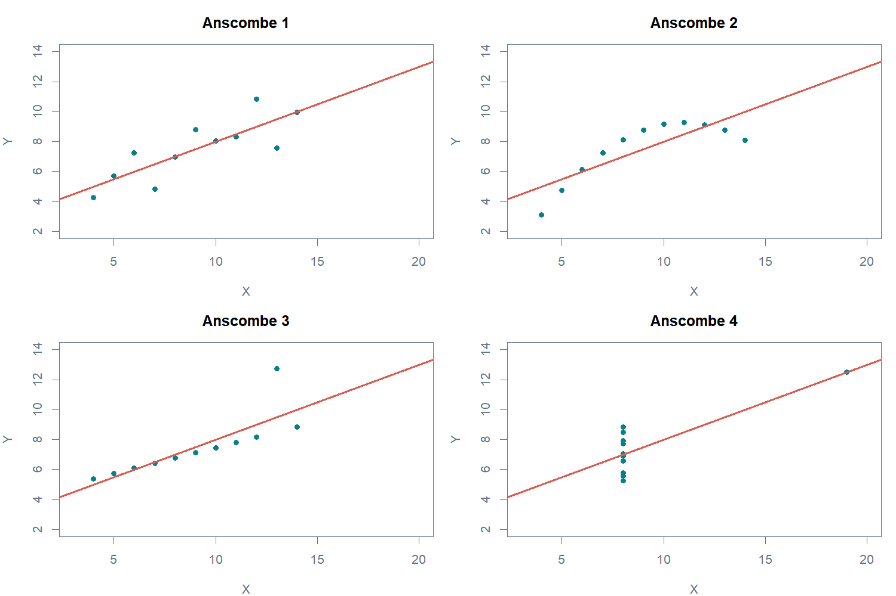
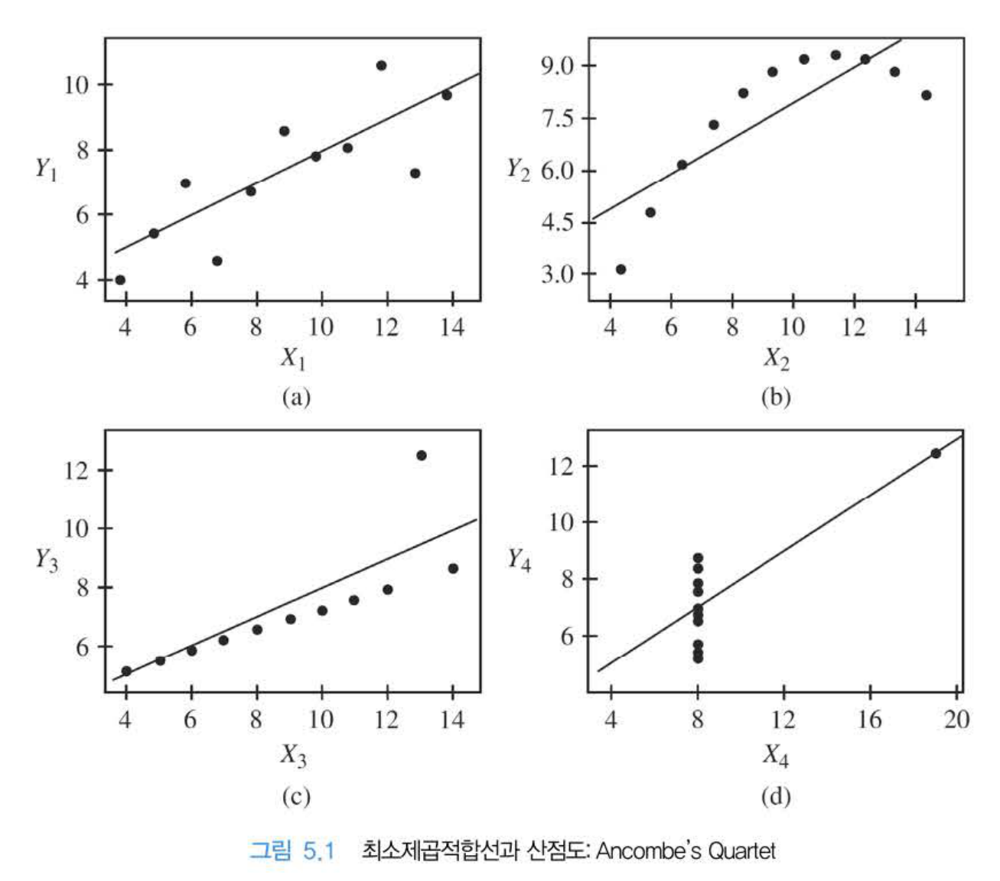
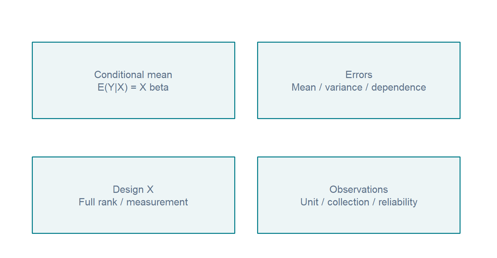
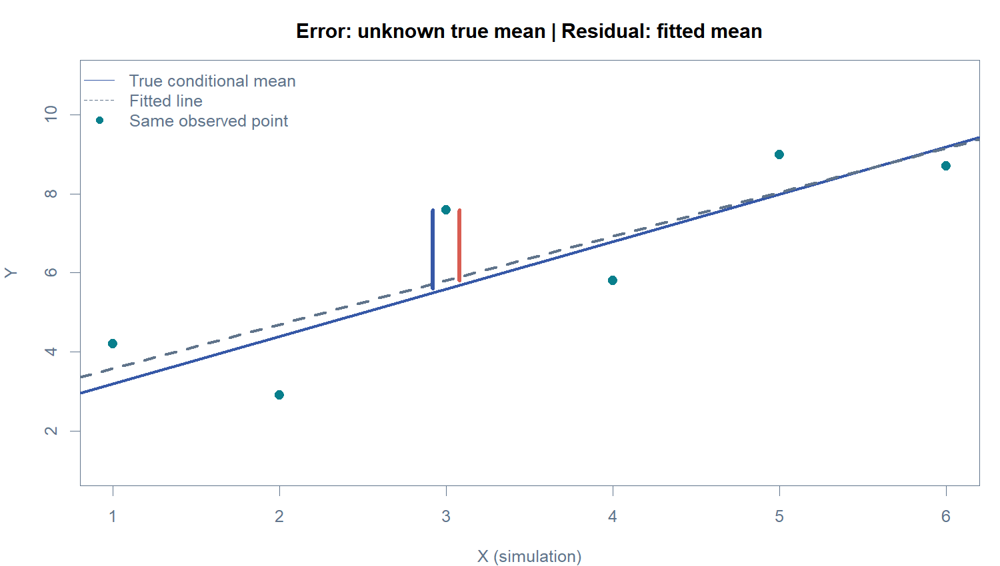
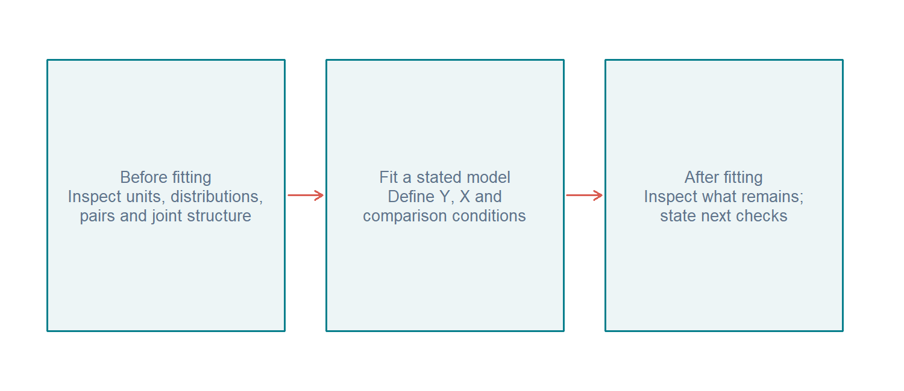

# W06A A · 좋은 적합과 믿을 만한 모형은 어떻게 다른가?

회귀분석의 이해 · 2026년 10월 5일 · 6주차 1차시

주교재 『Chatterjee 예제를 통한 회귀분석 제6판: R 활용』 §5.1–5.2, §5.4(pp.188–191, 194–197). 이번 수업 전체 범위는 §5.1–5.6입니다.

[온라인 R](https://lunalab-ai.github.io/regre/w06a.html) · [B: 다양한 잔차](w06a-residuals.md) · [C: 그래프 선택](w06a-graphs.md) · [비교 기록지](w06a-workbook.md)

## 1. 오늘의 질문: 회귀식이 놓친 것은 무엇인가?

지난 시간에는 회귀계수로 조건부 차이를 읽고, 표준오차와 t/F 통계량으로 불확실성을 설명했습니다. 오늘은 **그 계산을 믿기 위해 무엇을 확인해야 하는가**를 묻습니다. 진단은 모형에 합격 도장을 찍는 과정이 아닙니다. 관측된 자료와 우리가 가정한 자료 생성 방식 사이의 불일치를 찾아, 다음 확인을 정하는 과정입니다.

세 용어부터 연결합니다. 관측값은 실제 자료에 적힌 값, 적합값은 추정한 회귀식이 그 조건에서 내놓는 값, 잔차는 둘의 차이입니다. 계수의 표준오차는 계수 추정의 흔들림이고, 잔차는 한 관측에서 남은 차이입니다. 서로 대체할 수 없습니다.

$$
e_i=y_i-\hat y_i.
$$

R²는 평균만 예측하는 기준과 비교해 표본의 제곱합을 얼마나 줄였는지 요약합니다. 높은 R²가 평균함수의 형태, 오차의 일정한 분산, 독립성, 관측의 신뢰성까지 모두 보증하지는 않습니다. 작은 p값도 모형 가정을 대신 점검해 주지 않습니다.

## 2. 숫자를 먼저, 그림을 나중에: Anscombe

다음은 R 내장 Anscombe 네 자료에 직선을 적합한 결과입니다. 설명을 위해 구성된 자료이며 네 개의 실제 조사 사례가 아닙니다.

| 자료 | 절편(약) | 기울기(약) | R²(약) |
|---|---:|---:|---:|
| 1 | 3.000 | 0.500 | 0.66654 |
| 2 | 3.001 | 0.500 | 0.66624 |
| 3 | 3.002 | 0.500 | 0.66632 |
| 4 | 3.002 | 0.500 | 0.66671 |

표의 값은 매우 비슷합니다. 반올림된 데이터라서 컴퓨터 출력의 마지막 자리까지 완전히 같지는 않습니다. 이제 네 그림의 축 범위를 같게 두고 점의 배치를 봅니다.

**그림 A1 · 보는 순서.** 먼저 2번에서 직선 위·아래로 점이 바뀌는 곡선을 보세요. 다음으로 3번에서 대부분의 점과 다른 한 점, 4번에서 X가 같은 위치에 몰린 점들을 보세요. 요약통계는 비슷하지만 모형을 검토할 이유가 서로 다릅니다. 1번도 그림 한 장만으로 모든 가정이 확인된 것은 아닙니다.

**교재 연결.** 주교재 그림5.1, p.195의 선별 그림입니다. 위 재현 그림은 비교를 위해 네 패널의 축을 동일하게 맞췄습니다. 그림을 보는 목적은 ‘이상한 점을 지우기’가 아니라 데이터 구조와 직선 모형의 관계를 질문하는 것입니다.

**E1 · 설명하기.** “R²가 같으므로 네 자료에 같은 해석을 해도 된다”는 주장에 그림의 구체적인 근거 두 가지로 답하세요.

## 3. 가정의 대상부터 구별하기

주교재의 가정은 모형, 오차, 예측변수, 관측개체에 대한 조건으로 나누어 읽을 수 있습니다. 무엇이 정규분포여야 하는지, 무엇이 독립이어야 하는지를 먼저 명시해야 합니다.

**그림 A2.** 왼쪽 위는 평균을 설명하는 식, 오른쪽 위는 그 평균 주위의 오차, 왼쪽 아래는 설명변수 정보, 오른쪽 아래는 자료가 만들어진 과정을 뜻합니다. 서로 다른 상자에 대한 주장을 혼합하지 마세요.

$$
Y=X\beta+\varepsilon,\qquad E(\varepsilon\mid X)=0.
$$

이 식은 X가 주어졌을 때 Y의 평균이 Xβ라는 뜻입니다. 여기서 ‘선형’은 **모수 β에 대해 선형**이라는 뜻입니다. 예를 들어 x²를 별도의 설명변수로 넣은 평균함수도 β에 대해서는 선형일 수 있습니다. 다만 이번 핵심 실습은 기존의 두 변수 직선 평균모형을 진단하는 데 둡니다.

| 대상 | 확인할 조건 | 잘못 바꾸어 읽기 쉬운 주장 |
|---|---|---|
| 평균함수 | 설명변수 조건에 따른 평균을 적절하게 표현하는가? | 점들이 완벽한 직선 위에 있어야 한다 |
| 오차 평균 | 각 X 조건에서 평균 오차가 0인가? | 전체 잔차 평균이 0이면 충분하다 |
| 오차 분산 | X 조건이 달라도 오차 규모가 일정한가? | Y 전체의 분산이 작아야 한다 |
| 오차 의존 | 서로 다른 관측의 오차가 의존하지 않는가? | 적합 후 잔차들이 정확히 독립이다 |
| 오차 정규성 | 주어진 X에서 오차의 정규분포 가정이 적절한가? | X 또는 Y 자체가 정규분포여야 한다 |
| 설계와 측정 | 완전한 선형종속이 없는가, X의 측정은 신뢰할 만한가? | 설명변수끼리 조금이라도 상관되면 안 된다 |
| 관측 단위 | 한 행의 의미, 수집·누락·반복 측정은 무엇인가? | 행번호가 곧 시간 순서이다 |

X를 주어진 것으로 다루는 조건부 설명은 매번 X가 실험자가 정한 상수라는 뜻만은 아닙니다. 관측 자료에서도 X를 조건으로 추정 성질을 기술할 수 있습니다. X의 측정오차나 선택 방식이 조건부 오차 평균과 연결되면 별도의 문제가 생길 수 있으므로 자료 수집 맥락을 함께 읽습니다.

## 4. 어느 가정이 어느 결과를 지탱하는가?

모든 가정을 한 묶음으로 외우면 ‘정규성이 없으니 회귀계수는 무조건 틀렸다’와 같은 오해가 생깁니다. 이번에는 결과를 세 단계로 구별합니다.

| 알고 싶은 결과 | 이 수업에서 사용하는 주요 조건 | 가정을 위반하면 검토할 것 |
|---|---|---|
| OLS 계수의 조건부 불편성 | 올바른 선형 평균, E(ε∣X)=0, X의 완전 열계수 | 빠진 평균 구조, 내생성, 측정·선택 과정 |
| 선형 불편추정량 중 최소분산(BLUE) | 위 조건에 Cov(ε∣X)=σ²I 추가 | 등분산·무상관 조건과 효율성 |
| 통상적 소표본 t/F의 정확한 분포 | 위 조건에 조건부 정규오차 추가 | 표준오차·검정·구간의 근거 |

등분산 위반만으로 계수의 편향을 단정할 수 없습니다. 반대로 계수의 불편성이 성립한다고 해서 통상적인 표준오차와 검정이 그대로 적절하다는 뜻도 아닙니다. ‘계수’, ‘표준오차’, ‘정확한 분포’가 각각 어떤 근거를 쓰는지 구별하세요.

**E2 · 분류하기.** “등분산을 의심할 패턴이 보이면 OLS 계수는 반드시 편향된다”는 주장에 답하세요. 무엇은 유지될 수 있고 무엇은 재검토해야 하나요?

## 5. 오차와 잔차를 같은 것으로 보지 않기

오차는 관측값과 **알 수 없는 참 조건부 평균** 사이의 차이입니다. 잔차는 관측값과 **자료로 추정한 평균** 사이의 차이입니다. 같은 관측값을 출발점으로 삼아도 기준선이 다릅니다.

$$
\varepsilon_i=y_i-x_i^T\beta,\qquad e_i=y_i-x_i^T\hat\beta.
$$

**그림 A3.** 파란 선은 모의실험에서만 알고 있는 참 평균, 회색 점선은 이 여섯 점으로 적합한 평균입니다. 강조한 점에서 어느 선까지 내려가는지 보세요. 실제 attitude 자료에서는 참 평균선을 알 수 없기 때문에 오차 대신 잔차를 단서로 사용합니다.

절편을 포함한 비가중 OLS에서는 잔차합이 0이 됩니다. 이것은 최소제곱이 만족시키는 대수적 조건입니다. **계산 결과 잔차합이 0인 것과, 자료 생성 과정에서 E(ε∣X)=0인 것은 다른 주장**입니다. B에서 곡선 관계를 직선으로 잘못 적합해도 잔차합이 0임을 직접 확인합니다.

**E3 · 구별하기.** 실제 자료에서 오차를 직접 구할 수 없는 이유와, 잔차합0을 가정 충족의 증거로 사용할 수 없는 이유를 각각 한 문장으로 쓰세요.

## 6. 진단의 순서

**그림 A4.** 먼저 단위·분포·관계를 읽고, 어떤 모형을 적합했는지 밝힌 뒤, 남은 차이를 관찰합니다. 이상 패턴이 보이면 자료의 정의와 수집 과정으로 돌아갈 수 있습니다. 이 순서는 ‘R²를 최대화할 때까지 임의로 바꾸기’와 다릅니다.

오늘의 세 자료는 역할이 다릅니다. Anscombe는 요약과 그림의 차이, Hamilton은 쌍별 관계와 결합 관계의 차이, attitude는 같은 부서의 여러 잔차 정의를 보여줍니다. 이후 본문 B에서 한 부서의 숫자를 끝까지 계산합니다.

자료 근거: 주교재 §5.1–5.2·5.4. [R Anscombe 공식 설명](https://stat.ethz.ch/R-manual/R-devel/library/datasets/html/anscombe.html), [R attitude 공식 설명](https://stat.ethz.ch/R-manual/R-devel/library/datasets/html/attitude.html). 가정과 추정 성질을 연결한 표·모의 도식은 이해를 위한 추가 설명입니다.
