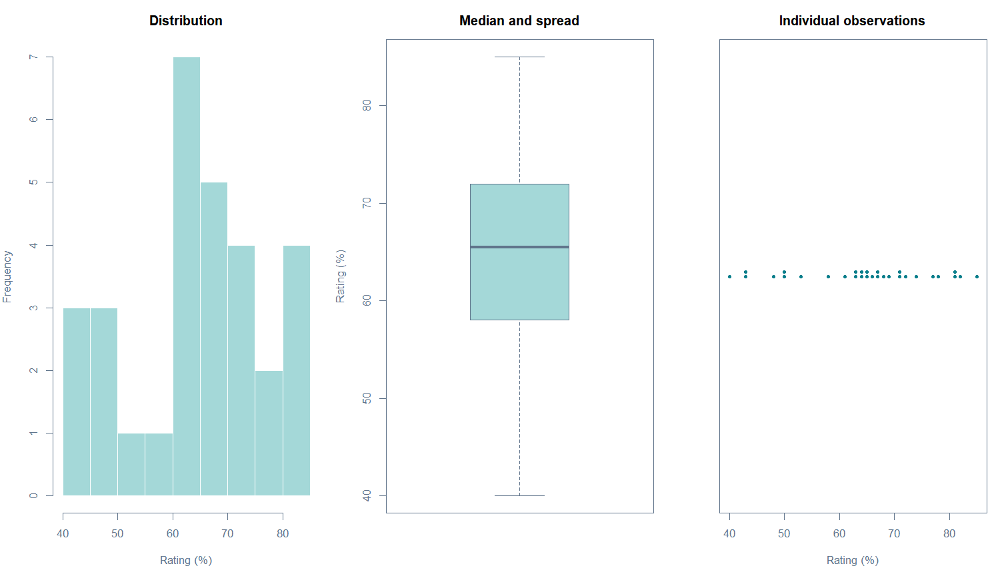
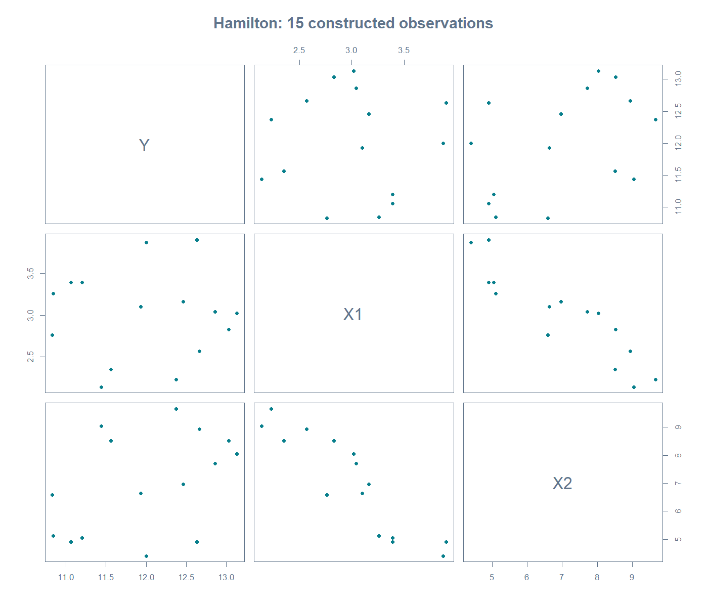
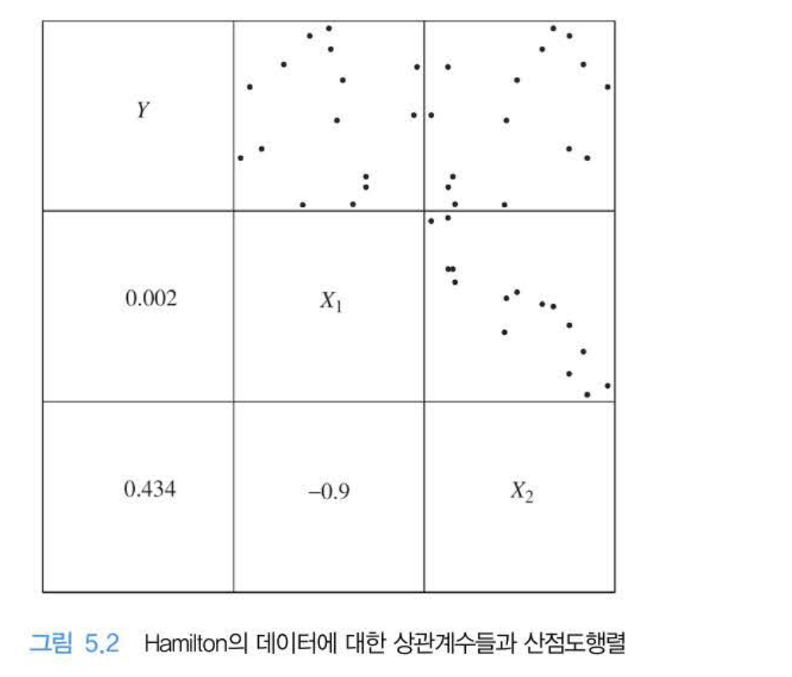
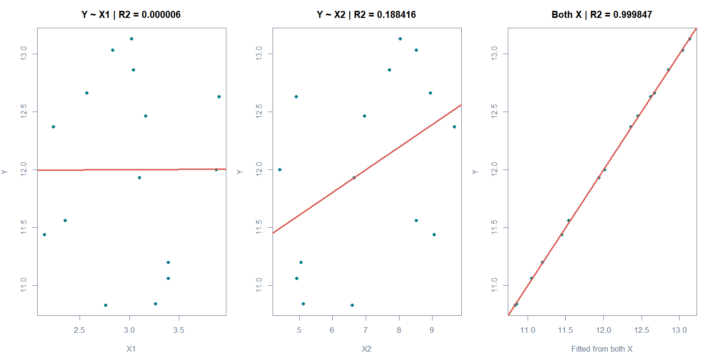
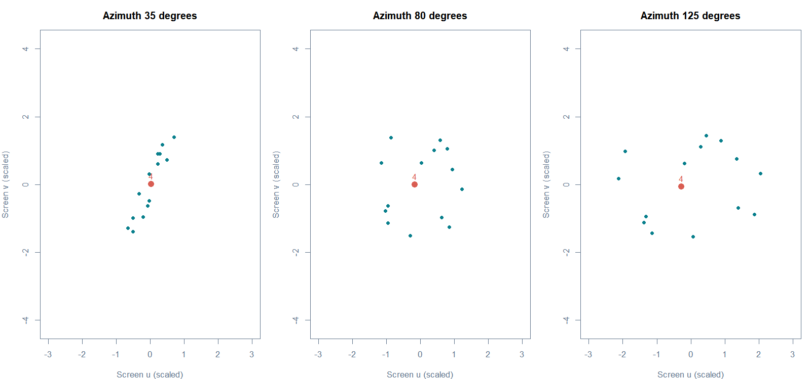
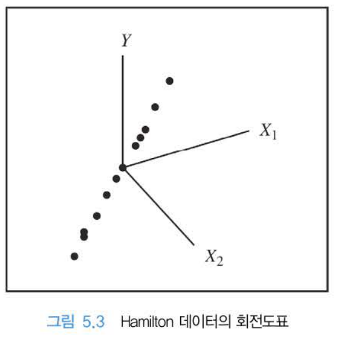
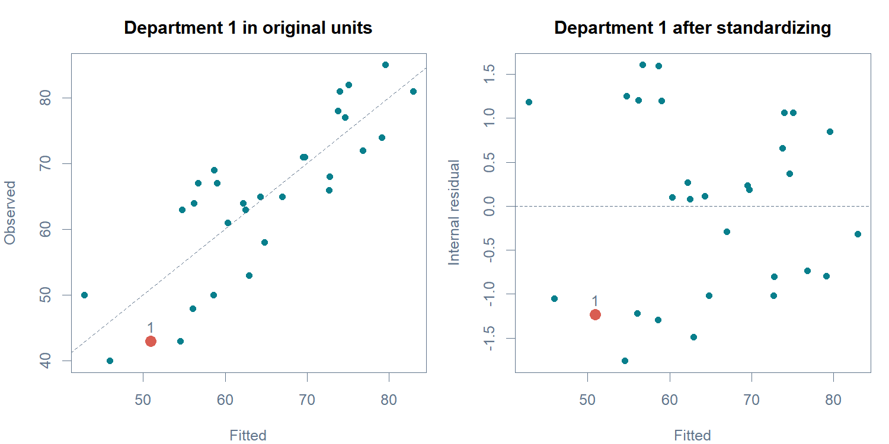
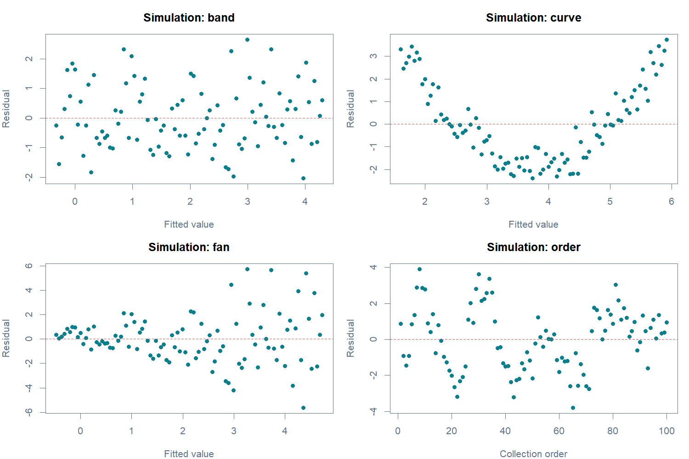

# W06A C · 적합 전후에 어떤 그림을 선택할까?

회귀분석의 이해 · 2026년 10월 5일 · 주교재 §5.5–5.6(pp.197–203)

[A: 가정](w06a-assumptions.md) · [B: 잔차](w06a-residuals.md) · [R Colab B](https://colab.research.google.com/github/lunalab-ai/regre/blob/2026-fall-w06a/notebooks/student/w06a_graphs.ipynb) · [누적 웹 앱](https://lunalab-ai.github.io/regre/apps/w06a/edit/index.html)

## 1. 적합 전 그래프는 무엇을 보여주는가?

모형을 적합하기 전에는 데이터의 단위, 분포, 관계, 특이한 관측 구조를 탐색합니다. 아직 특정 회귀식의 잔차는 없습니다. 이 단계에서 Y의 히스토그램을 그렸다고 해서 회귀오차의 정규성을 검사한 것은 아닙니다.

| 교재 분류 | 대표 도구 | 먼저 볼 것 | 그 그림만으로 알 수 없는 것 |
|---|---|---|---|
| 일차원 그래프 | 히스토그램, 줄기잎, 점플롯, 상자그림 | 범위·중심·퍼짐·치우침·개별 값 | 다른 변수를 고정한 효과 |
| 이차원 그래프 | 산점도, 산점도행렬 | 쌍별 관계·곡선·군집·눈에 띄는 점 | 여러 변수를 동시에 고려한 전체 구조 |
| 회전도표 | 3차원 점의 다른 방향 투영 | 한 방향에서 가려진 평면·겹침 | 임의의 고차원 구조 전체 |
| 동적 그래프 | 회전, 점 선택, 연결 강조 | 같은 점이 여러 표현에서 어디에 있는가 | 관측의 오류나 인과관계 확정 |



**그림 C1.** 왼쪽은 구간별 빈도, 가운데는 중앙값과 사분위 범위, 오른쪽은 개별 관측을 보여줍니다. 세 그림은 같은 30개 부서 자료를 다르게 요약합니다. 히스토그램 구간 폭을 바꾸면 모양도 달라질 수 있습니다. 상자그림 바깥의 점은 추가 확인의 대상이지 자동 삭제 대상이 아닙니다.

```r
hist(attitude$rating, breaks=8)
boxplot(attitude$rating)
stripchart(attitude$rating, method="stack")
stem(attitude$rating)
```

줄기잎은 값의 자릿수를 보존하면서 분포를 읽게 합니다. 그림이 보기 좋도록 변환하는 것과, 모형의 의미를 정해 변환하는 것은 다릅니다. 변수의 치우침만 보고 기계적으로 변환하지 말고 단위·0값·분석 목적을 먼저 확인하세요.

## 2. 산점도행렬: 어느 변수를 가로·세로로 읽는가?

Hamilton 자료는 주교재 표5.1의15개 구성 관측입니다. 변수 이름 Y, X1, X2에는 이번 예제 밖의 임의의 현실적 의미나 단위를 붙이지 않습니다. 저자 제공 원본 숫자를 그대로 사용합니다.



**그림 C2.** 대각선의 변수 이름을 기준으로 각 패널의 행 변수가 세로축, 열 변수가 가로축입니다. Y–X1은 뚜렷한 선형 관계가 거의 보이지 않고, X1–X2는 강한 음의 관계를 보입니다. 작은 쌍별 상관만으로 다중회귀에서의 역할까지 결론내리지 마세요.



**교재 연결.** 주교재 그림5.2, p.199. 교재는 한쪽 삼각형에 그림, 다른 쪽에 상관계수를 함께 제시합니다. R 재현 그림에서는 양쪽에 산점도를 두었습니다. 수치 상관과 그림을 함께 읽어야 한 점의 영향이나 곡선 구조를 놓치지 않습니다.

```r
ham <- diag_hamilton("data/hamilton.csv")
pairs(ham)
cor(ham)
```

Y–X1의 표본상관은 약0.002498, Y–X2는약0.434069, X1–X2는약−0.899776입니다. 강한 상관은 정확한 선형종속과 다릅니다. 절편·X1·X2 설계행렬의 계수(rank)는3이므로 이 자료에서 두 변수 OLS 계수를 추정할 수 있습니다.

## 3. 쌍별 관계와 함께 고려한 관계는 다르다

같은 Y와 같은15개 행에 세 모형을 적합합니다. 모형마다 다른 자료를 넣어 R²를 비교하지 않도록 주의합니다.

| 모형 | R² | 남은 제곱합 SSE |
|---|---:|---:|
| Y ~ X1 | 0.00000624 | 9.008544 |
| Y ~ X2 | 0.188416 | 7.311238 |
| Y ~ X1 + X2 | 0.999847 | 0.001378 |



**그림 C3.** 왼쪽 두 패널은 개별 X에 대한 Y의 투영입니다. 오른쪽은 두 변수를 함께 넣어 얻은 적합값과 Y를 비교합니다. 오른쪽 가로축을 X1이나 X2 하나로 오해하지 마세요. 거의 대각선에 놓인다는 것은 이 구성 자료에서 결합 모형의 잔차가 매우 작다는 뜻입니다.

$$
\hat Y=-4.515414+3.097008X_1+1.031859X_2.
$$

X1이 커지는 관측에서 X2가 줄어드는 경향이 있으므로, Y–X1의 쌍별 그림에는 두 변화가 함께 섞입니다. 두 변수를 함께 보는 모형은 ‘X2가 같은 조건의 X1 차이’를 구별합니다. 이 때문에 쌍별 상관이 거의0인 변수도 함께 고려한 모형에서는 중요한 역할을 할 수 있습니다.

**E7 · 변수 선택에 답하기.** “Y와X1의 상관이 거의0이므로 X1을 제외하자”는 주장에 위 표와 비교 조건을 사용해 답하세요. 높은 결합 R²로 말할 수 없는 결론도 하나 적으세요.

## 4. 회전도표: 다른 방향에서 같은 점 보기

종이 위 산점도는 다차원 자료를 한 방향으로 투영한 그림입니다. 그 방향에서는 관계가 가려질 수 있습니다. 회전도표는 자료를 새로 수집하거나 회귀식을 바꾸지 않고 보는 방향을 바꿉니다.



**그림 C4.** 붉은 점은 항상 관측4입니다. 이 수업의 웹 회전은 X1, X2, Y를 각각 표준화한 뒤 직교투영한 것으로, 가로·세로축 u/v는 화면 좌표입니다. 세 패널의 데이터는 같습니다. 일부 방향에서 점들이 선처럼 겹쳐 보인다는 사실만으로 원래 자료가 정확히 한 직선 위에 있다고 단정하지 않습니다.



**교재 연결.** 주교재 그림5.3, p.202. 교재 그림과 수업 앱은 같은 Hamilton 자료의 방향에 따른 모습을 읽기 위한 도구입니다. 수업 앱은 설치 없는 웹 실행을 위해 표준화 좌표의 투영을 사용하므로 교재의 축 배치와 시점이 그대로 같지는 않습니다.

관측4의 원자료는 Y=11.93, X1=3.10, X2=6.64입니다. 회전 후 화면 좌표가 바뀌어도 이 세 값은 유지됩니다. `diag_project(ham, azimuth=35, elevation=20)`의 두 각도 단위는 도입니다.

**E8 · 유지와 변화 구별하기.** 관측4를 강조한 채 방향을 바꾸세요. 바뀌는 값 두 개와 유지되는 사실 두 개를 기록하세요.

## 5. 동적 그래프: 같은 점 연결하기

동적 그래프에서는 점을 선택하거나 회전하고 즉시 변화를 봅니다. 여러 그림에서 같은 관측을 강조하는 연결은 단순히 그림을 많이 그리는 것보다 관측의 의미를 추적하기 쉽습니다.



**그림 C5.** 왼쪽과 오른쪽의 붉은 점은 모두 부서1입니다. 원자료 단위에서 보던 차이를 잔차의 비교 척도로 옮겼습니다. 오른쪽에서 다른 위치에 보인다고 다른 부서로 바뀐 것이 아닙니다. 웹 앱에서 점이나 행번호를 선택하면 그림과 표가 함께 바뀝니다.

실습에서는 부서1→다른 부서, 보통→내적→외적 잔차를 차례로 바꿉니다. 한 번에 한 조건만 바꾸어야 무엇 때문에 결과가 달라졌는지 설명할 수 있습니다.

## 6. §5.6은 적합 후 그래프의 ‘목적 지도’

주교재 §5.6(p.203 상단)은 다음 세 범주를 소개합니다. 이 차시에서는 분류와 목적을 이해하고, 상세 절차는 뒤 절로 연결합니다.

| 교재의 세 범주 | 묻는 질문 | 이번 수업의 위치 |
|---|---|---|
| 선형성·정규성 가정 검토 | 평균 형태와 오차 가정에 어긋나는 단서가 있는가? | 잔차의 의미와 목적 연결; 상세 검토는§5.7 |
| 특이값·영향 있는 관측 검출 | 어떤 관측을 더 살펴볼 필요가 있는가? | 점을 연결해 확인하는 관점; 상세 영향 진단은뒤 절 |
| 변수 효과에 대한 진단 | 다른 변수를 고려한 효과를 어떻게 살펴볼까? | 쌍별 관계의 한계를 연결; 상세 효과 진단은뒤 절 |

이 범주는 분석가가 원하는 목적을 먼저 정하게 합니다. 자동으로 모든 진단 플롯을 출력한 뒤 그림 이름만 나열하는 것보다, **무엇을 의심해서 무엇을 보는지**를 명시하는 편이 좋습니다.

## 7. 추가 연결 예제: 남은 패턴을 말로 설명하기

다음 그림은 §5.2–5.3의 가정과 잔차를 §5.6의 목적에 연결하기 위해 만든 모의 예제입니다. 교재 §5.7 이후의 정규성 검정이나 Cook 거리 절차를 이번 범위에 추가하는 것은 아닙니다.



**그림 C6.** 왼쪽 위는 뚜렷한 패턴이 없는 띠, 오른쪽 위는 곡선, 왼쪽 아래는 적합값에 따른 퍼짐 변화, 오른쪽 아래는 명시한 수집 순서에 따른 움직임입니다. 마지막 패널만 가로축이 수집 순서입니다. attitude의 행번호를 이 시간축으로 바꾸어 읽지 마세요.

| 관찰한 사실 | 가능한 설명 | 다음 확인 |
|---|---|---|
| 곡선 모양으로 위·아래가 반복됨 | 평균함수의 형태가 빠졌을 수 있음 | 변수 정의와 가능한 비선형 관계 |
| 오른쪽으로 갈수록 퍼짐이 커짐 | 조건부 분산이 일정하지 않을 수 있음 | 구간별 규모와 측정·수집 방식 |
| 실제 수집 순서에 따라 비슷한 부호가 이어짐 | 관측 간 의존 구조가 있을 수 있음 | 시간·공간·집단 구조와 실제 순서 |
| 눈에 띄는 패턴이 없음 | 현재 그림에서 뚜렷한 단서를 못 찾음 | 다른 목적의 그림과 자료 수집 맥락 |

‘곡선이 보인다’는 관찰이고, ‘평균함수가 빠졌을 수 있다’는 가능한 설명입니다. ‘이 변수를 제곱하면 문제가 완전히 해결된다’는 더 강한 주장으로, 추가 검토 없이 말할 수 없습니다. 원인과 해결을 한 번에 확정하지 마세요.

**E9 · 세 문장 진단.** 퍼짐 변화 그림에 대해 관찰·가능한 설명·다음 확인을 각각 한 문장으로 적으세요. 등분산 위반이 곧 계수 편향이라는 말도 점검하세요.

## 8. 마지막 웹 앱 활동

1. [누적 Shiny 편집기](https://lunalab-ai.github.io/regre/apps/w06a/edit/index.html)의 **W06A 잔차**를 엽니다. 부서1의 표와 두 그림에서 같은 관측을 확인합니다.
2. 보통·내적·외적 잔차를 바꾸고, 무엇이 분모에서 달라지는지 말합니다. **W06A 회전**에서는 관측4와 방향을 바꿉니다.
3. 코드에서 `W06A-L8`을 찾습니다. 선택한 잔차가 소수셋째자리로 표시되도록 출력 한 곳을 수정합니다. 입력→선택한 행→선택한 열→출력의 연결을 읽으세요.
4. Run으로 다시 실행하고 잔차 종류를 두 번 바꿔 숫자도 바뀌는지 확인합니다. 수정한 코드를 Download로 개인 파일에 보관합니다.

별도 성적 반영 과제나 제출 기한은 없습니다. 온라인 R과 Colab을 중복 수행할 필요도 없습니다. 편집기 재실행은 현재 입력을 초기화할 수 있으므로 비교할 값을 기록한 뒤 진행하세요.

근거: 주교재 §5.5–5.6. [저자 제공 Hamilton 원본](https://www1.aucegypt.edu/faculty/hadi/RABE6/Data6/Hamilton.Data.txt), [고정 버전 데이터와 함수](https://github.com/lunalab-ai/regre/blob/2026-fall-w06a/src/diagnostics-api.md). 동적 연결 방식과 잔차 패턴 그림은 수업용 추가 설명입니다.


## 개념 확인 퀴즈

먼저 스스로 답한 뒤 별도 퀴즈 해설과 비교하세요. 새 성적 반영 과제나 제출 기한은 없습니다.

1. R²와 회귀계수가 비슷하면 자료의 구조도 비슷한가?
2. 정규성 가정은 X 또는 Y 자체에 대한 주장인가?
3. 절편 포함 OLS의 잔차합0으로 E(ε|X)=0을 입증할 수 있는가?
4. 오차 분산이 같아도 보통잔차의 분산은 왜 다른가?
5. 교재 내적·외적 표준화잔차는 어떤 R 함수와 대응하는가?
6. 외적 표준화잔차의 분자도 삭제 후 예측잔차로 바꾸는가?
7. Y–X1 상관이 거의0인 Hamilton에서 X1을 바로 제외해도 되는가?
8. 회전도표에서 관측4의 위치가 바뀌면 데이터도 바뀌는가?
9. 잔차의 부채꼴 패턴은 계수가 반드시 편향되었다는 뜻인가?
10. 적합 후 그래프의 세 목적은 무엇이며 그림 하나로 무엇을 확정하면 안 되는가?
