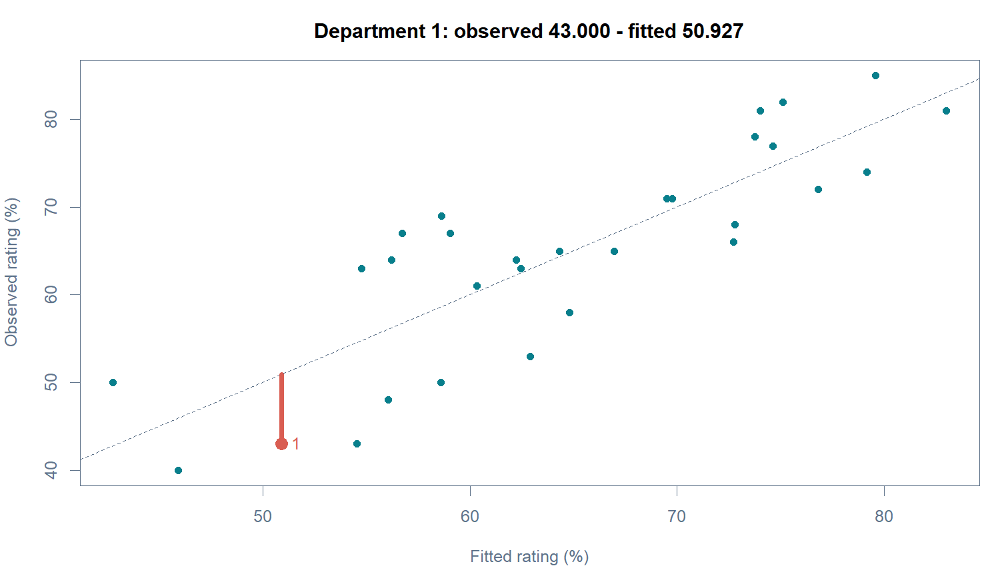
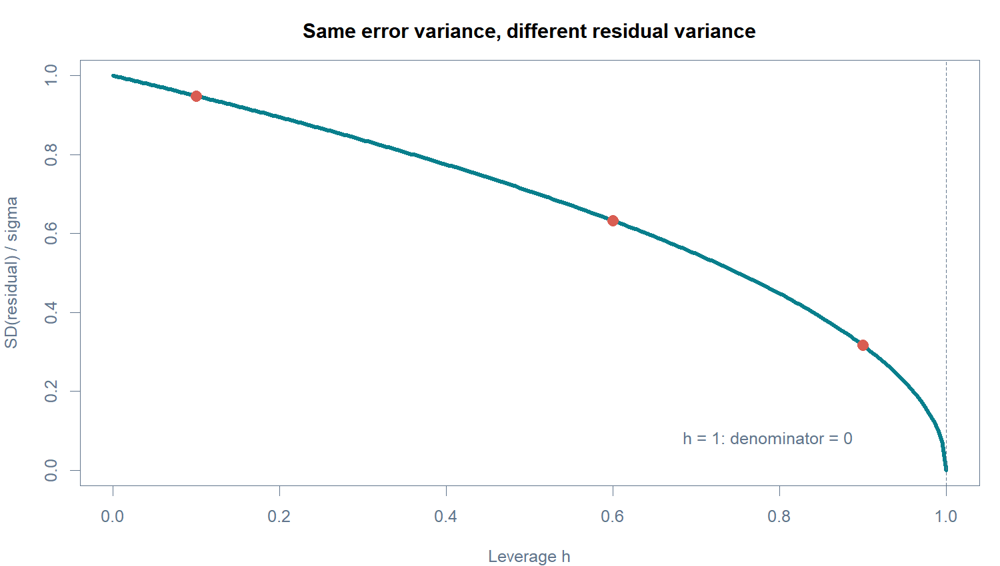
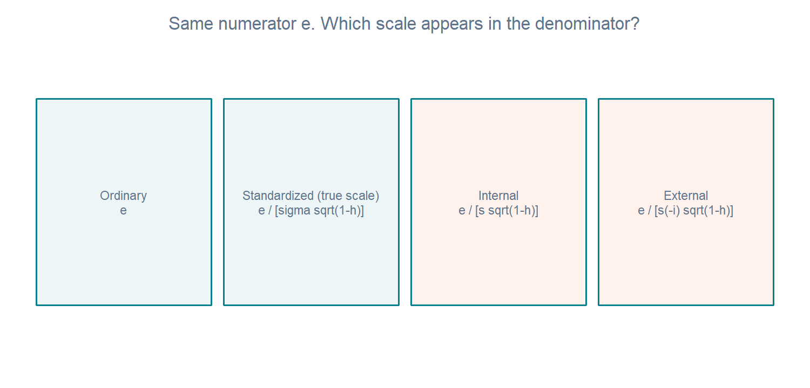
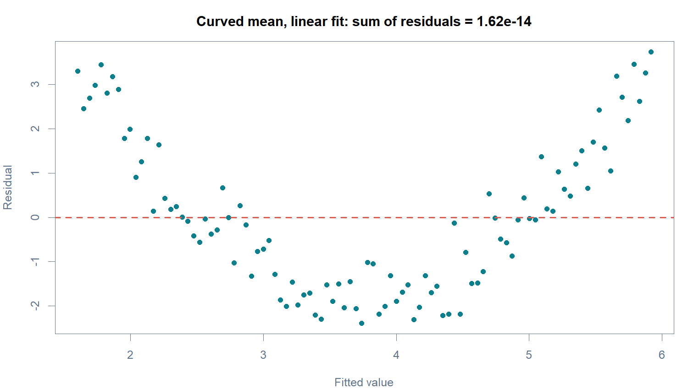

# W06A B · 같은 잔차를 왜 여러 방식으로 표현하는가?

회귀분석의 이해 · 2026년 10월 5일 · 주교재 §5.3(pp.191–194)

[A: 가정](w06a-assumptions.md) · [C: 그래프](w06a-graphs.md) · [수학 보충](w06a-math.md) · [R Colab A](https://colab.research.google.com/github/lunalab-ai/regre/blob/2026-fall-w06a/notebooks/student/w06a_residuals.ipynb)

## 1. 같은 한 부서에서 시작하기

R의 attitude는 30개 부서의 설문 집계 자료입니다. 부서별 약35명의 응답을 집계한 긍정 응답 비율(%)이며, 한 행은 직원 한 명이 아니라 **부서 하나**입니다. 지난 W05B와 같은 `rating ~ complaints + learning` 모형을 사용합니다. 행번호1은 시간1이나 첫 조사 시점이라는 뜻이 아닙니다.

```r
d <- datasets::attitude
fit <- lm(rating ~ complaints + learning, data=d)
c(observed=d$rating[1], fitted=fitted(fit)[1], residual=residuals(fit)[1])
```

첫 부서의 관측 rating은43%, 적합값은약50.926760%입니다. 따라서 보통잔차는 약−7.926760퍼센트포인트입니다. 음수는 이 부서의 관측값이 모형 적합값보다 낮다는 뜻이지, 부서 자체가 잘못되었다는 뜻이 아닙니다.



**그림 B1.** 가로축이 원래 설명변수 하나가 아니라 적합값임을 먼저 확인하세요. 회색 대각선 위에서는 관측값과 적합값이 같습니다. 강조된 수직 선분을 아래로 따라가면 부서1의 음의 잔차를 읽을 수 있습니다.

$$
e_1=43-50.926760=-7.926760.
$$

## 2. 같은 절댓값이면 같은 정도로 큰 잔차일까요?

오차 분산이 모든 관측에서 σ²로 같아도, 잔차의 분산은 관측마다 같지 않습니다. 잔차를 구할 때 그 점 자신도 회귀식 적합에 참여했기 때문입니다. 지레값 hᵢᵢ는 여기서 **잔차 분산을 보정하는 양**으로 사용합니다. 영향 관측을 판별하는 상세 절차는 이번 범위를 넘어가므로 다루지 않습니다.

$$
\operatorname{Var}(e_i\mid X)=\sigma^2(1-h_{ii}).
$$



**그림 B2.** 세로축은 잔차 표준편차를 σ로 나눈 값입니다. h가0.1, 0.6, 0.9일 때 같은 원잔차의 비교 기준이 다릅니다. 지레값이 크다는 사실만으로 잘못된 관측이나 큰 잔차라고 결론낼 수 없습니다.

간단한 비교를 해봅시다. 두 점의 보통잔차가 모두2이고 s=2라고 가정합니다. h=0.1인 점의 내적 표준화잔차는 약1.054, h=0.6인 점은 약1.581입니다. 분자가 같아도 두 번째 점의 비교 기준인 분모가 더 작기 때문입니다. 이 숫자는 이해를 위한 가상 비교이며 attitude의 두 실제 부서를 뜻하지 않습니다.

**E4 · 분모 읽기.** h가 커질수록 위 가상 비교의 표준화잔차 절댓값이 커지는 이유를 식의 분모로 설명하세요. 이것만으로 해당 점을 삭제해야 하나요?

## 3. 교재의 용어와 R 함수 정확히 대응시키기



**그림 B3.** 모든 표현의 출발점은 같은 보통잔차 e입니다. 두 번째 상자는 참 σ를 알고 있을 때, 세 번째는 전체 자료로 추정한 s, 네 번째는 해당 관측을 제외해 추정한 s₍ᵢ₎를 사용합니다. 실제 자료에서는 참 σ를 모르므로 추정한 규모를 사용합니다.

$$
z_i=\frac{e_i}{\sigma\sqrt{1-h_{ii}}},\qquad
r_i=\frac{e_i}{s\sqrt{1-h_{ii}}},\qquad
r_i^*=\frac{e_i}{s_{(i)}\sqrt{1-h_{ii}}}.
$$

| 교재 표현 | 오차 규모의 기준 | R 대응 | 단위 |
|---|---|---|---|
| 보통잔차 e | 나누지 않음 | `residuals(fit)` | Y의 차이 단위 |
| 표준화잔차 z | 참 σ | σ를 알고 직접 계산 | 없음 |
| 내적 표준화잔차 r | 전체 관측으로 추정한 s | `rstandard(fit)` | 없음 |
| 외적 표준화잔차 r* | i를 제외해 추정한 s₍ᵢ₎ | `rstudent(fit)` | 없음 |

`rstandard()`라는 함수 이름만 보고 교재의 z와 같다고 해석하지 마세요. 이 수업에서는 교재 용어를 유지하고, 함수가 실제 사용하는 분모를 대응시킵니다. s만으로 나눈 e/s도 교재의 내적 표준화잔차와 다릅니다.

## 4. 전체 오차 규모 s 계산하기

설명변수 수를 p, 절편을 포함한 총 계수 수를 k=p+1, 잔차 자유도를 ν=n−p−1로 둡니다. 이번 모형은 n=30, p=2, k=3, ν=27입니다.

$$
s^2=\frac{\sum_{j=1}^{n}e_j^2}{n-p-1}=\frac{\mathrm{SSE}}{\nu}.
$$

```r
nu <- df.residual(fit)
s <- sqrt(sum(residuals(fit)^2)/nu)
c(nu=nu, s=s, R_sigma=sigma(fit))
```

s는 약6.816780%p입니다. s가 크다는 것은 모형 주위에서 남은 차이의 전반적 규모가 크다는 뜻입니다. 특정 회귀계수의 표준오차와는 다릅니다.

첫 부서의 h₁₁≈0.1132912를 넣으면 내적 표준화잔차를 구할 수 있습니다.

$$
r_1=\frac{-7.926760}{6.816780\sqrt{1-0.1132912}}
\approx -1.2348835.
$$

```r
i <- 1
manual <- residuals(fit)[i]/(sigma(fit)*sqrt(1-hatvalues(fit)[i]))
c(manual=manual, R=rstandard(fit)[i])
```

**E5 · 오류 고치기.** `residuals(fit)[1]/sigma(fit)`를 내적 표준화잔차라고 쓴 코드에서 빠진 항을 고치고, R 함수와의 일치를 확인하세요.

## 5. 외적 표준화는 무엇을 제외하는가?

큰 잔차를 가진 관측이 전체 s를 키우면, 그 관측의 잔차를 큰 분모로 나누게 됩니다. 외적 표준화는 **오차 규모를 추정할 때 그 관측의 기여를 제외**합니다. 그렇다고 분자까지 삭제 후 예측오차로 바꾸는 것은 아닙니다.

$$
s_{(i)}^2=\frac{\mathrm{SSE}-e_i^2/(1-h_{ii})}{\nu-1}.
$$

```r
i <- 1
f_minus <- lm(rating~complaints+learning, data=d[-i,])
s_minus <- sigma(f_minus)
external <- residuals(fit)[i]/(s_minus*sqrt(1-hatvalues(fit)[i]))
c(manual=external, R=rstudent(fit)[i])
```

첫 부서의 외적 표준화잔차는약−1.2475416입니다. 내적 값과 조금 다르지만, 이 사례에서 아주 크게 달라지지는 않습니다. **제외 후 재적합은 정의를 확인하기 위한 계산 실험**이며, 이 부서를 실제 분석에서 삭제하자는 지시가 아닙니다.

삭제한 부서를 삭제 후 모형으로 예측해 구한 차이는 다음과 같습니다.

$$
y_i-\hat y_{i,(-i)}=\frac{e_i}{1-h_{ii}}.
$$

이것은 삭제예측잔차이며 외적 표준화잔차의 분자가 아닙니다. 분모의 s₍ᵢ₎와 분자의 eᵢ가 어디에서 왔는지 따로 확인하세요.

**E6 · 두 계산 구별하기.** 외적 표준화잔차와 삭제예측잔차의 분자 또는 기준 예측을 설명하세요. “외적”이라는 말이 모든 계산에서 해당 관측을 빼야 한다는 뜻인가요?

## 6. 계산이 안 되는 경우도 의미가 있다

h=1이면 표준화 분모가0입니다. 이를0으로 채우거나 아주 작은 수로 임의 치환하면 수학적 의미가 바뀝니다. Anscombe의4번 자료에는 이런 경계점이 있으므로 네 자료 전체에 표준화잔차 계산을 무조건 적용하는 예제로 사용하지 않습니다. 이번 공통 함수는 이 경우 NA와 이유를 표시합니다.

관측을 제외한 뒤 설계행렬의 계수가 부족해지거나 오차 분산이0이 되는 경우도 별도로 다뤄야 합니다. 따라서 공식의 사용 조건을 먼저 확인합니다. 실습의 attitude 모형은 완전 열계수이며 필요한 자유도를 확보합니다.

## 7. 잔차합0을 직접 반례로 확인하기



**그림 B4.** 모의 자료의 참 평균은 곡선이고 적합 모형은 직선입니다. 양·음 잔차가 합쳐져 거의0이어도 체계적인 곡선이 남습니다. 계산기의 작은 지수 표기값은 부동소수점 오차 수준입니다. 이를 “모형이 적절하다”로 바꾸어 말하면 안 됩니다.

오차가 독립이어도 잔차는 같은 추정 회귀식을 공유하므로 서로 독립이 아닙니다. 행렬 표현 Cov(e∣X)=σ²(I−H)가 이를 보여줍니다. 정확한 유도와 외적 표준화잔차의 t 분포 조건은 [수학 보충](w06a-math.md)에 따로 정리했습니다.

## 8. 공통 함수는 어떻게 읽는가?

[diagnostics.R 함수 안내와 실제 선언줄](https://github.com/lunalab-ai/regre/blob/2026-fall-w06a/src/diagnostics-api.md)에서 `diag_residuals`를 여세요. 입력은 적합한 lm 객체이며, 반환 표의 `raw`, `h`, `s`, `s_deleted`, `internal`, `external`을 순서대로 읽습니다. 함수는 원자료를 바꾸거나 관측을 삭제하지 않습니다.

```r
res <- diag_residuals(fit)
res[1,]
max(abs(res$internal-rstandard(fit)))
max(abs(res$external-rstudent(fit)))
```

수치 오차 수준의 차이는 두 계산이 일치한다는 뜻이며, 모형 가정의 입증은 아닙니다. 근거는 교재 §5.3과 [R 공식 진단 함수 설명](https://stat.ethz.ch/R-manual/R-devel/library/stats/html/influence.measures.html)입니다. 계산 예와 곡선 반례는 추가 해설입니다.
