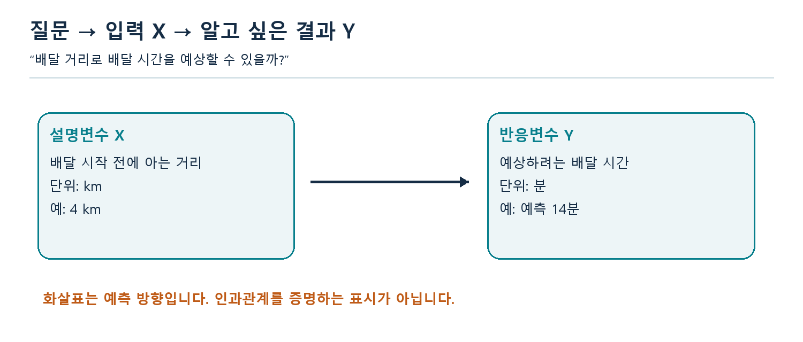
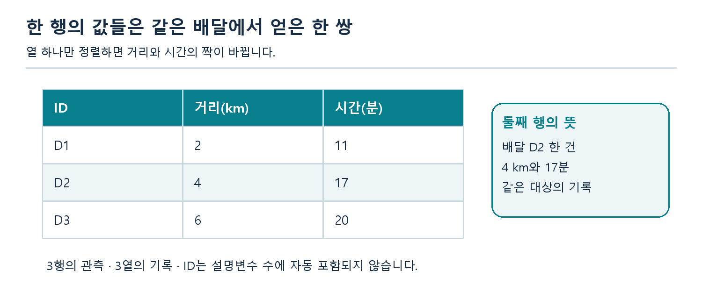
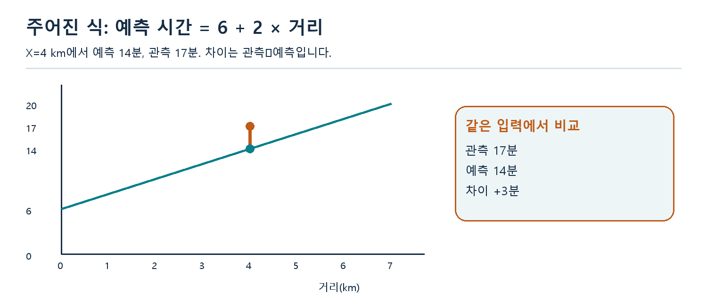
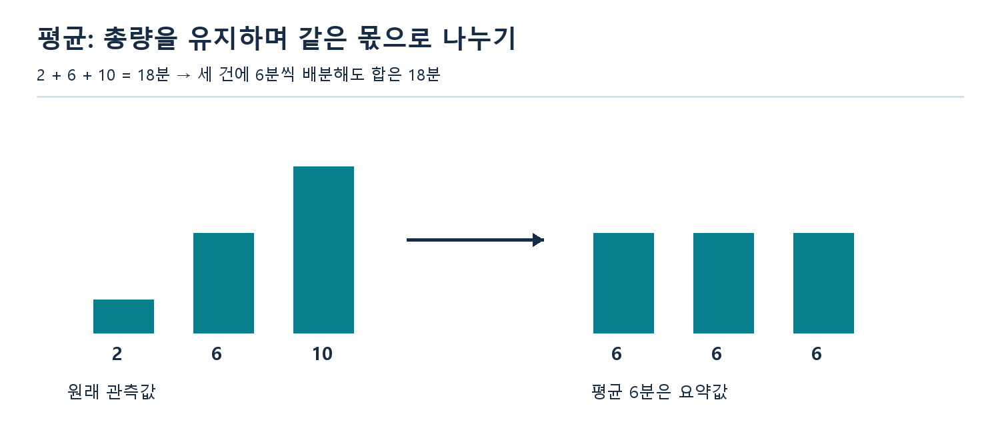
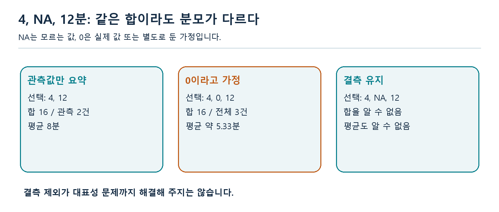
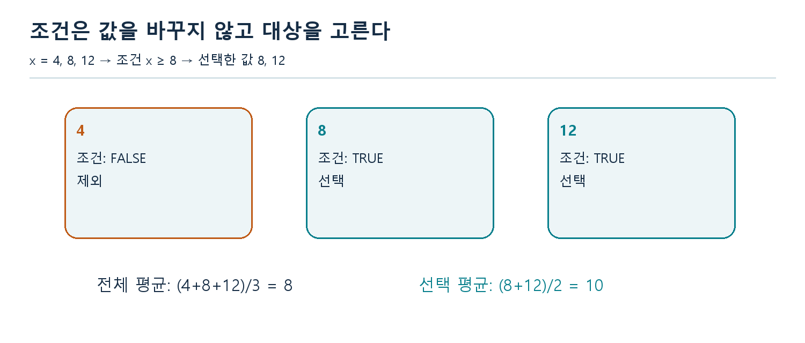
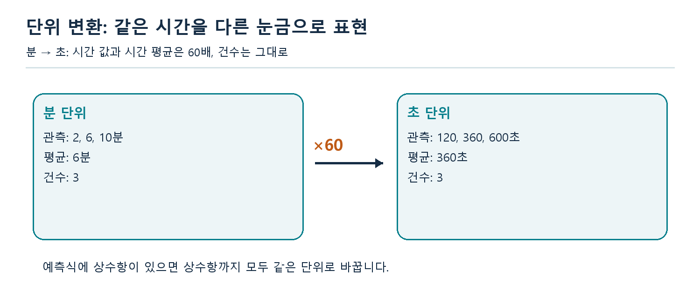
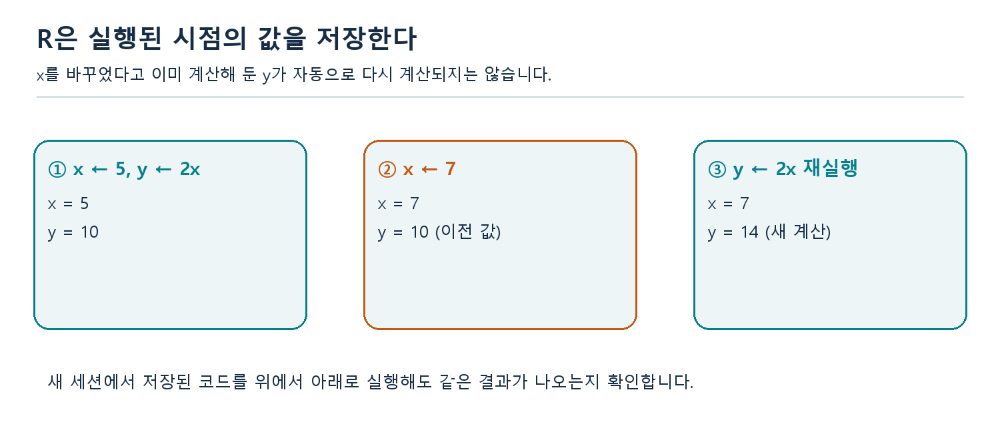

# W06B 중간고사 대비 ① · 회귀분석의 개요와 R 기초

2026년 10월 8일 · 회귀분석의 이해 · 실제 1–2주차 복습

이번 시간의 목표는 **분석 질문을 변수와 자료로 옮기고, 간단한 계산을 설명하며, R의 실행 결과가 그 질문에 맞는지 판단하는 것**입니다. 새로운 추정법을 배우는 시간이 아닙니다. 앞부분의 설명 예제를 읽은 뒤 Q01–Q60을 풉니다. 설명 예제와 연습문제는 서로 다른 수치를 사용합니다.

일반 문제 42개와 R 문제 18개로 구성됩니다. 정답만 적지 말고 **무엇을 구하는가 → 어떤 규칙을 쓰는가 → 중간 계산/실행 순서 → 결과의 뜻과 단위**를 적으세요. 공식이나 R 함수 이름이 바로 떠오르지 않아도 아래 참고표를 사용할 수 있습니다. 모든 문제를 수업 중에 끝내야 하는 것은 아닙니다. 따로 지정한 성적 반영 과제나 제출 기한은 없습니다.

| 복습 차시 | 날짜 | 범위 |
|---|---|---|
| W06B | 10월 8일 | 실제 1–2주차: 회귀 개요와 R 기초 |
| W07A | 10월 12일 | 실제 3주차 |
| W07B | 10월 14일 | 실제 4주차 |
| W08A | 10월 19일 | 총정리 복습 |

이번 자료에서는 상관계수 계산, 최소제곱 계수 추정, SST·SSR·SSE·R², t/F 검정, 신뢰구간·예측구간을 새 문제로 출제하지 않습니다. 실제 1–2주차 자료의 범위를 기준으로 했습니다. 주어진 식에 값을 대입하거나 관측값과 주어진 예측값의 차이를 구하는 활동은 포함합니다.

## 1. 회귀분석은 무엇을 알고 싶은지 정하는 데서 시작한다

“배달 거리로 배달 시간을 예상할 수 있을까?”에서 아직 알고 싶은 결과는 시간입니다. 이를 **반응변수 Y**라 부릅니다. 미리 이용할 정보인 거리는 **설명변수 X**입니다. X와 Y는 표의 첫 열과 둘째 열이라는 뜻이 아닙니다. 질문을 “시간으로 거리를 예상할 수 있을까?”로 바꾸면 역할도 바뀝니다.



시간을 알고 나서야 기록되는 ‘최종 결제 시각’을 배달 시작 전 예측 입력으로 쓰면 현실에서 이용할 수 없는 정보를 사용하게 됩니다. **언제 예측하는가**도 질문의 일부입니다. 설명이 목적이면 변수 사이의 관계와 해석에, 예측이 목적이면 새 대상에 대한 예측의 적절성에 주의를 기울입니다. 둘은 연결되지만 목적이 완전히 같지는 않습니다.

설명변수라는 이름이 그 변수가 원인임을 증명하지는 않습니다. 더운 날 음료 판매량과 수영장 이용객 수가 함께 늘 수 있습니다. 두 변수가 함께 움직여도 온도처럼 공통으로 작용하는 조건을 생각해야 합니다. 관찰 자료만으로 원인을 단정하지 않습니다.

**스스로 확인:** 변수 이름 두 개만 적지 않고 “무엇을 이용해 무엇을 알고 싶은가”를 한 문장으로 말할 수 있나요?

## 2. 한 행은 누구이며, 한 열은 무엇인가

아래 표의 한 행은 배달 한 건입니다. 같은 행의 거리와 시간은 같은 배달에서 함께 관측한 값입니다. 한 열만 따로 정렬하면 둘의 짝이 깨집니다.



ID는 관측을 구별하는 표지입니다. ID가 101, 205처럼 숫자로 적혀 있어도 그 평균이 ‘전형적인 배달’을 뜻하지는 않습니다. 시간처럼 양의 크기를 나타내는 숫자와 범주를 가리키는 코드를 구별하세요. 범주가 AM/PM이면 문자 또는 factor로 나타낼 수 있습니다. factor는 범주 정보이며 내부 숫자 코드 자체가 측정량이 아닙니다.

| 자료 구조 | 어떻게 생각할까 | 이번 수업에서의 용도 |
|---|---|---|
| 기본 벡터 | 같은 자료형의 값이 순서대로 놓인 한 줄 | 시간 값들, 조건 TRUE/FALSE |
| 행렬 | 같은 자료형을 행과 열에 놓음 | 같은 종류의 수치를 직사각형으로 저장 |
| 데이터프레임 | 열마다 자료형을 달리할 수 있는 표 | ID 문자, 시간 숫자를 함께 기록 |
| 리스트 | 서로 다른 구조를 각각 보관하는 묶음 | 원자료 표, 요약 숫자, 설명 문장을 함께 보관 |

벡터 `c(7,"9",11)`은 숫자처럼 보여도 문자 벡터가 됩니다. R은 한 기본 벡터의 자료형을 맞추기 때문입니다. 숫자로 바꾸기 전 문자열이 어떤 뜻인지 확인해야 합니다. 단위가 섞여 있는 `"9분"`, `"540초"`를 무작정 숫자로 바꾸는 것은 정리가 아닙니다.

## 3. 식의 각 부분을 말로 읽는다

모형을 생각하는 출발점은 다음과 같습니다.

$$Y=f(X)+\varepsilon$$

여기서 f(X)는 X로 표현한 체계적 부분이고, 오차 ε는 그 관계만으로 표현되지 않는 부분입니다. 같은 X에서도 결과가 다른 이유에는 빠진 조건, 우연한 변동, 측정 변동 등이 있을 수 있습니다. 오차가 오직 기록 실수라는 뜻은 아닙니다. 실제 분석에서는 진짜 f와 ε를 알지 못하는 경우가 보통입니다.

예측용으로 주어진 식을 다음처럼 읽어 봅시다.

$$\widehat{Y}=6+2X$$

X는 거리(km), 예측 시간의 단위는 분이라고 가정합니다. 6은 X=0일 때 식이 내놓는 시간, 2는 거리 1km가 늘 때 예측 시간이 늘어나는 분 수입니다. X=4라면 6+2×4=14분입니다. X=0이 관측 범위 밖이라면 6분을 현실의 확실한 사실처럼 말할 수 없습니다.



실제 시간이 17분이라면 **관측값−주어진 예측값=17−14=3분**입니다. 관측이 예측보다 3분 큽니다. 이 차이를 실제 미지의 오차 ε와 언제나 동일하다고 말하지는 않습니다. 추정한 식에서 계산하는 잔차와 진짜 관계를 기준으로 정의한 오차는 구분됩니다. 여기서는 잔차의 이론적 성질을 유도하지 않습니다.

**읽는 순서:** 입력의 단위 → 식의 출력 단위 → 대입 → 변화량 → 관측과 비교 → 관측 범위 확인.

## 4. 평균은 합뿐 아니라 분모를 설명하는 말이다

시간이 2, 6, 10분인 세 건을 같은 비중으로 요약하면 다음과 같습니다.

$$\overline{x}=\frac{\sum_{i=1}^{n}x_i}{n}=\frac{2+6+10}{3}=6$$



합은 18분이지만 평균은 6분입니다. 세 건에 동일한 값 6분씩을 배정하면 원래 합 18분을 유지합니다. 이것은 모든 작업이 실제 6분이었다는 뜻이 아니라 요약값의 해석입니다. 최댓값과 최솟값의 중간은 일반적으로 평균과 같지 않습니다.

두 집단의 평균을 다시 합칠 때에는 각 집단의 건수를 봐야 합니다. A 한 건이 4분, B 세 건의 평균이 12분이면 전체 합은 1×4+3×12=40분, 전체 건수는 4이므로 전체 평균은 10분입니다. (4+12)/2=8분은 두 집단에 같은 비중을 준 값으로, 네 관측값에 같은 비중을 준 평균이 아닙니다.

## 5. NA, 0, 빈 집합은 서로 다르다

NA는 값을 모른다는 표시입니다. 0은 실제 측정값이 0이라는 정보입니다. 예를 들어 4, NA, 12분에서 관측된 두 값만 요약하면 (4+12)/2=8분입니다. 결측을 0이라고 가정하면 (4+0+12)/3=16/3분입니다. 두 계산은 서로 다른 질문에 답합니다.



`na.rm=TRUE`는 계산 중 결측값을 제외하라는 뜻입니다. 누락된 대상이 나머지와 비슷하다고 증명하거나 원자료의 문제를 해결해 주지는 않습니다. **전체 건수, 관측된 건수, 결측 건수**를 함께 보고하세요. 결측이 특정 상황에서 자주 생기면 관측값 평균만으로 전체를 대표하기 어려울 수 있습니다.

조건에 맞는 자료가 하나도 없으면 분모가 0입니다. 이는 평균이 0인 집단이 아닙니다. R의 `mean(numeric(0))`는 NaN을 반환합니다. 앱에서는 “선택 건수 0, 평균 계산 불가”라고 보여 주는 것이 적절합니다.

## 6. 조건은 요약할 대상을 결정한다

벡터 `x <- c(4,8,12)`에서 `x >= 8`은 `FALSE,TRUE,TRUE`입니다. `x[x >= 8]`은 8,12를 선택합니다. 그 평균은 10이며 원래 전체 평균 8과 다릅니다. 원자료가 바뀐 것이 아니라 **요약할 대상**이 바뀌었습니다.



조건을 결합하는 `&`는 원소별 ‘그리고’, `|`는 원소별 ‘또는’입니다. `!`는 참/거짓을 뒤집습니다. NA가 있으면 비교 결과도 NA일 수 있으므로 의도적으로 처리해야 합니다. `!is.na(x) & x >= 8`은 관측된 값이면서 기준 이상인 값을 고릅니다. NA와 `==`로 비교해서 결측을 찾지 않습니다.

단위도 함께 유지해야 합니다. 분을 초로 바꾸면 모든 시간에 60을 곱합니다. 평균 역시 60배가 되지만 관측 건수는 그대로입니다. 상수항이 있는 예측식에서는 상수항도 같은 단위 변환을 받아야 합니다.



## 7. 코드가 실행되는 순서를 눈으로 추적한다

```r
x <- 5
y <- 2*x
x <- 7
print(y)
```

출력은 10입니다. 두 번째 줄이 실행될 때 계산한 10을 y에 저장했기 때문입니다. x를 바꾼 뒤 y의 계산식을 다시 실행해야 현재 x에 맞는 값을 얻습니다. R 객체에 수식을 입력했다고 스프레드시트 셀처럼 언제나 자동 갱신되는 것은 아닙니다.



반복문은 같은 규칙을 여러 값에 적용합니다. 함수는 입력을 받아 정해진 계산을 수행하고 결과를 돌려줍니다. 둘 다 라이브러리 이름을 외우는 것보다 **이번 줄에서 무엇이 입력되고 무엇이 남는지**를 추적하는 것이 중요합니다. `if`는 한 번에 하나의 TRUE/FALSE 조건을 받습니다. 여러 관측에 적용하려면 제공된 반복문처럼 각 관측의 조건을 차례로 검사할 수 있습니다.

재현 가능한 분석에는 자료, 코드, 실행 순서와 필요한 환경 정보가 필요합니다. 화면에 보이는 결과만 저장하면 이전에 어떤 객체를 만들었는지 놓치기 쉽습니다. 저장된 스크립트를 새 세션에서 위에서 아래로 실행해 결과가 다시 나오는지 확인하세요.

## 8. R 초보자를 위한 최소 참고표

| 표현 | 의미 | 확인할 점 |
|---|---|---|
| `x <- c(4,8,12)` | 값을 벡터로 묶어 x에 저장 | `c()`의 순서와 자료형 |
| `x[2]` | 둘째 원소 선택 | 첫 위치는 1 |
| `d[2,"time"]` | 표의 둘째 행 time 열 | 쉼표 앞 행, 뒤 열 |
| `d$time` | time 열 선택 | `$` 뒤는 열 이름 |
| `sum(x)`, `length(x)` | 합, 원소 수 | 결측 제외 여부와 분모 |
| `mean(x,na.rm=TRUE)` | 결측 제외 평균 | 전체 자료의 평균과 구별 |
| `is.na(x)`, `!is.na(x)` | 결측/관측 위치 | NA와 직접 비교하지 않음 |
| `x <= 8`, `x == 8` | 이하, 같음 비교 | `=` 또는 `<-` 대입과 구별 |
| `as.numeric(x)` | 숫자로 변환 | 원문 의미와 변환 후 NA 점검 |
| `for(v in x) { ... }` | 값마다 반복 | 누적값 초기화 위치 |
| `function(x) { ... }` | 입력 x를 받는 함수 | 반환값, 원자료 변경 여부 |

실습을 시작하기 전 질문의 목적을 적고, 실행 전 예상 출력, 실행 후 실제 출력, 차이가 난 이유를 각각 기록하세요. 잘못된 코드가 언제나 에러 메시지를 내는 것은 아닙니다. 값이 틀리거나 오래된 결과가 그대로 나오는 경우도 있습니다.

## 9. 마지막 활동 · 같은 자료, 다른 요약

[온라인 R 실습](https://lunalab-ai.github.io/regre/w06b.html) 또는 [누적 웹 앱](https://lunalab-ai.github.io/regre/apps/w06b/)을 엽니다. 앱의 **W06B 기초 복습** 탭에서 진행하세요. 자료는 수업용으로 만든 8건의 가상 작업 기록입니다. 실제 연구 결과가 아니며, 연습문제 정답 자료도 아닙니다.

1. 먼저 전체 건수·관측 건수·결측 건수를 셉니다. 앱 표에서 확인합니다.
2. 결측 처리를 ‘제외’, ‘유지’, ‘0 가정 비교’로 바꾸기 전에 분모와 결과가 어떻게 달라질지 적습니다.
3. 오전/오후와 시간 상한을 바꾸어 선택 행이 어떻게 변하는지 봅니다. 결측 행은 상한 비교가 불가능하여 따로 남겨 요약하도록 설계되어 있습니다.
4. 분/초 단위를 바꾸고 변하는 숫자와 변하지 않는 건수를 구분합니다.
5. 온라인 R에서 `review_summary(demo$minutes)`를 `review_summary(demo$minutes, scale=60)`으로 직접 수정해 실행합니다. 앱 입력을 바꾼 것과 코드 인수를 바꾼 것이 어떤 계산에 대응하는지 설명합니다.
6. 앱에서 현재 표를 내려받고 선택 조건·단위·결측 처리 방법을 메모합니다. 숫자만 내려받으면 해석에 필요한 조건을 잃을 수 있습니다.

| 내 예상 | 실제 관찰 | 차이의 이유 | 한 문장 설명 |
|---|---|---|---|
| 분모/평균/단위 | 앱과 R 출력 | 선택·결측·실행 순서 | 어떤 대상의 어떤 평균인가? |

공통 함수의 [입력·출력·실제 정의 바로가기](https://github.com/lunalab-ai/regre/blob/2026-fall-w06b/src/review-foundations-api.md)를 확인할 수 있습니다. 함수를 가져오는 `source()`는 정의를 읽는 단계이며 모형을 학습하는 명령이 아닙니다. 준비 코드가 파일을 내려받을 경우 고정 버전과 파일 체크섬을 검사합니다.

## 출처와 범위

기존 배포 자료 W01A(회귀 개요), W02A(R 기초), W02B(자료 구조·조건·함수·앱)의 용어와 실제 진도를 기준으로 재구성했습니다. 교재 1장 및 2장의 해당 기초 범위를 연결하되, 이번 60문항과 그림·가상 수치는 학습 목적의 새 제작 자료입니다. 교재 그림을 복제한 것처럼 표시하지 않습니다.

R 문법 확인: [An Introduction to R](https://cran.r-project.org/doc/manuals/r-release/R-intro.html), [mean](https://stat.ethz.ch/R-manual/R-devel/library/base/html/mean.html), [NA](https://stat.ethz.ch/R-manual/R-devel/library/base/html/NA.html), [조건과 반복](https://stat.ethz.ch/R-manual/R-devel/library/base/html/Control.html), [원소 추출](https://stat.ethz.ch/R-manual/R-devel/library/base/html/Extract.html). 공식 문서는 참고용이며 함수 이름 암기를 평가하지 않습니다.


# 연습문제 60문항 · 풀이와 정답 미포함

문제별로 풀이 과정과 결과의 의미를 씁니다. 계산기 또는 제공된 R 참고표를 사용할 수 있습니다.

## Q01 · 질문에서 Y와 X 찾기

유형: 일반 · 난이도: 기초

수리업체가 “수리할 부품 수를 알면 작업 시간을 예상할 수 있을까?”를 조사한다. 반응변수와 설명변수를 각각 쓰고, 단위와 선정 이유를 설명하시오.

풀이 기록: 주어진 정보 / 사용할 규칙 / 중간 계산 또는 코드 추적 / 최종 의미·단위

## Q02 · 같은 변수도 역할이 달라진다

유형: 일반 · 난이도: 기초

주택 자료에 면적(㎡)과 가격(만원)이 있다. A는 “면적을 알 때 가격”을, B는 “가격을 알 때 면적”을 예측하려 한다. 두 질문의 Y와 X를 쓰고, 두 예측 문제가 같은지 설명하시오.

풀이 기록: 주어진 정보 / 사용할 규칙 / 중간 계산 또는 코드 추적 / 최종 의미·단위

## Q03 · 행은 무엇을 한 번 관측한 것인가

유형: 일반 · 난이도: 기초

병원에서 환자 4명이 각각 3회 방문했다. 표는 “방문 한 번”을 한 행으로 기록하고, 환자 번호·방문일·대기시간의 세 열을 갖는다. 행 수와 열 수, 관측 단위를 쓰시오. 12행이 곧 서로 다른 환자 12명이라는 주장도 판단하시오.

풀이 기록: 주어진 정보 / 사용할 규칙 / 중간 계산 또는 코드 추적 / 최종 의미·단위

## Q04 · 여러 설명변수의 기본 구분

유형: 일반 · 난이도: 기초

월 전기 사용량(kWh)을 집의 면적(㎡)과 거주 인원(명)으로 설명하려 한다. Y, 두 X, 설명변수 개수 p를 쓰시오. “변수가 세 개이므로 p=3”이라는 답을 검토하시오.

풀이 기록: 주어진 정보 / 사용할 규칙 / 중간 계산 또는 코드 추적 / 최종 의미·단위

## Q05 · 설명과 예측의 목적

유형: 일반 · 난이도: 기초

A: “이미 수집한 자료에서 면적과 전기 사용량의 관계를 요약하고 싶다.” B: “다음 달 새 가구의 전기 사용량을 예상하고 싶다.” 각 분석의 주된 목적을 쓰고, B에서 답할 결과의 형태를 설명하시오.

풀이 기록: 주어진 정보 / 사용할 규칙 / 중간 계산 또는 코드 추적 / 최종 의미·단위

## Q06 · 양적 변수와 질적 변수

유형: 일반 · 난이도: 기초

자동차 자료의 차체 색상, 주행거리(km), 차량 식별번호, 탑승 인원(명)을 양적·질적 변수로 나누시오. 식별번호가 숫자로 저장된 경우에도 같은 판단인지 이유를 쓰시오.

풀이 기록: 주어진 정보 / 사용할 규칙 / 중간 계산 또는 코드 추적 / 최종 의미·단위

## Q07 · 독립변수라는 말의 함정

유형: 일반 · 난이도: 기초

한 모형에서 키와 체중을 설명변수로 함께 사용한다. 어떤 학생은 “두 변수가 독립변수라고 불리므로 서로 관련이 없어야 한다”고 했다. 이 주장을 고쳐 쓰시오.

풀이 기록: 주어진 정보 / 사용할 규칙 / 중간 계산 또는 코드 추적 / 최종 의미·단위

## Q08 · 관측값과 모수

유형: 일반 · 난이도: 기초

모형 $Y=\beta_0+\beta_1X+\varepsilon$에서 여러 수리 기록의 부품 수 X는 이미 관측했지만 두 회귀계수는 모른다. X의 관측값과 회귀계수가 하는 역할의 차이를 설명하시오.

풀이 기록: 주어진 정보 / 사용할 규칙 / 중간 계산 또는 코드 추적 / 최종 의미·단위

## Q09 · 함께 증가한다고 원인은 아니다

유형: 일반 · 난이도: 적용

여름철 일별 자료에서 아이스크림 판매량이 많은 날에 물놀이 사고도 많았다. “아이스크림 판매를 줄이면 사고가 줄어든다”는 결론을 이 자료만으로 확정할 수 있는가? 가능한 다른 설명 하나와 함께 답하시오.

풀이 기록: 주어진 정보 / 사용할 규칙 / 중간 계산 또는 코드 추적 / 최종 의미·단위

## Q10 · 오차는 실수만을 뜻하지 않는다

유형: 일반 · 난이도: 기초

“측정을 정확히 했으므로 회귀모형에 오차항을 둘 필요가 없다”는 주장을 검토하시오. 오차항이 필요할 수 있는 이유를 두 가지 쓰시오.

풀이 기록: 주어진 정보 / 사용할 규칙 / 중간 계산 또는 코드 추적 / 최종 의미·단위

## Q11 · 같은 X, 다른 Y

유형: 일반 · 난이도: 적용

부품 수가 모두 3개인 세 작업의 시간이 각각 24분, 29분, 32분이었다. 부품 수만 입력받아 한 개의 값을 내는 함수가 이 세 관측을 모두 정확하게 설명할 수 있는가? 회귀모형과 연결하여 답하시오.

풀이 기록: 주어진 정보 / 사용할 규칙 / 중간 계산 또는 코드 추적 / 최종 의미·단위

## Q12 · 분석 가능한 질문 만들기

유형: 일반 · 난이도: 통합

“좋은 카페를 알아보고 싶다”를 수치형 반응변수를 예측하는 회귀 질문으로 구체화하시오. Y와 그 단위, 설명변수 두 개, 한 행의 관측 단위, 기록 기간을 포함하시오.

풀이 기록: 주어진 정보 / 사용할 규칙 / 중간 계산 또는 코드 추적 / 최종 의미·단위

## Q13 · 체계적 부분과 오차를 계산하기

유형: 일반 · 난이도: 기초

설명용 가상 상황에서 참된 체계적 관계가 $f(x)=10+6x$로 알려져 있다고 하자. X=4인 작업의 실제 시간은 Y=37분이었다. f(4)와 $\varepsilon=Y-f(X)$를 구하고 부호를 해석하시오.

풀이 기록: 주어진 정보 / 사용할 규칙 / 중간 계산 또는 코드 추적 / 최종 의미·단위

## Q14 · 절편과 기울기의 말뜻

유형: 일반 · 난이도: 적용

제시된 예측식이 $\widehat{Y}=8+5X$이고 X는 부품 수(개), Y는 시간(분)이다. 8과 5의 의미와 각각의 단위를 설명하시오. X=0인 작업을 관측한 적이 없을 때 8의 해석에는 무엇을 덧붙여야 하는가?

풀이 기록: 주어진 정보 / 사용할 규칙 / 중간 계산 또는 코드 추적 / 최종 의미·단위

## Q15 · 주어진 식에 대입하기

유형: 일반 · 난이도: 기초

예측식 $\widehat{Y}=12+3X$에서 X=6일 때 예측값을 구하시오. Y의 단위가 분이면 답의 단위를 쓰고, 이 값이 실제 시간과 반드시 같은지도 설명하시오.

풀이 기록: 주어진 정보 / 사용할 규칙 / 중간 계산 또는 코드 추적 / 최종 의미·단위

## Q16 · 두 예측값의 차이

유형: 일반 · 난이도: 적용

같은 예측식 $\widehat{Y}=12+3X$에서 X가 2에서 5로 바뀔 때 예측시간은 얼마나 달라지는가? 각각 대입하는 방법과 변화량을 이용하는 방법으로 확인하시오.

풀이 기록: 주어진 정보 / 사용할 규칙 / 중간 계산 또는 코드 추적 / 최종 의미·단위

## Q17 · 관측과 예측의 차이, 참 오차의 차이

유형: 일반 · 난이도: 적용

어떤 자료로 구한 예측값은 30분이고 실제 관측은 32분이다. 관측값−예측값을 계산하시오. 이 정보만으로 참된 모형의 오차 ε도 정확하게 2분이라고 확정할 수 있는지 설명하시오.

풀이 기록: 주어진 정보 / 사용할 규칙 / 중간 계산 또는 코드 추적 / 최종 의미·단위

## Q18 · 같은 입력에 같은 예측

유형: 일반 · 난이도: 적용

주어진 예측식은 $\widehat{Y}=7+4X$이다. X=3인 두 작업의 실제 시간은 17분과 22분이다. 두 작업의 예측값과 관측−예측 차이를 구하고, 예측이 같은데 관측이 다른 것이 모순인지 설명하시오.

풀이 기록: 주어진 정보 / 사용할 규칙 / 중간 계산 또는 코드 추적 / 최종 의미·단위

## Q19 · 출력의 단위를 바꾸기

유형: 일반 · 난이도: 적용

분 단위 예측식이 $\widehat{Y}_{분}=2+4X$이다. X의 단위는 그대로 두고 예측시간을 초로 나타내는 식을 쓰시오. X=3에서 두 식이 같은 시간을 나타내는지 확인하시오.

풀이 기록: 주어진 정보 / 사용할 규칙 / 중간 계산 또는 코드 추적 / 최종 의미·단위

## Q20 · 입력의 단위를 바꾸기

유형: 일반 · 난이도: 통합

무게를 g으로 쓸 때 비용 예측식이 $\widehat{Y}=100+2X_g$ (원)이다. 무게를 kg으로 쓰는 $X_{kg}$를 이용하여 같은 예측을 하는 식을 쓰시오. 0.5kg에서 검산하시오.

풀이 기록: 주어진 정보 / 사용할 규칙 / 중간 계산 또는 코드 추적 / 최종 의미·단위

## Q21 · 계산 가능함과 적용 가능함

유형: 일반 · 난이도: 적용

X가 10~20인 자료로 만든 시간 예측식이 $\widehat{Y}=-5+2X$이다. X=1을 대입하면 무엇이 나오는가? 이를 곧바로 실제 작업시간으로 보고해도 되는지 두 근거로 설명하시오.

풀이 기록: 주어진 정보 / 사용할 규칙 / 중간 계산 또는 코드 추적 / 최종 의미·단위

## Q22 · 한 번 맞았다고 늘 맞는가

유형: 일반 · 난이도: 적용

두 후보 예측식 A: $\widehat{Y}=10+2X$, B: $\widehat{Y}=4+4X$가 있다. X=3과 X=5에서 각각 예측값을 계산하시오. X=3에서 두 식이 같다는 사실만으로 두 식이 같은 모형이라고 할 수 있는가?

풀이 기록: 주어진 정보 / 사용할 규칙 / 중간 계산 또는 코드 추적 / 최종 의미·단위

## Q23 · 자료의 크기와 설명변수 개수

유형: 일반 · 난이도: 기초

작업 6건을 한 행씩 기록한 표에 id, 부품 수, 작업 시간의 세 열이 있다. 시간은 부품 수로만 예측한다. 표의 행·열 수와 이 분석의 설명변수 개수를 각각 쓰시오.

풀이 기록: 주어진 정보 / 사용할 규칙 / 중간 계산 또는 코드 추적 / 최종 의미·단위

## Q24 · 숫자 ID의 평균

유형: 일반 · 난이도: 기초

세 매장의 ID가 101, 205, 309이다. 이 번호의 평균은 205다. “평균적인 매장은 ID 205 매장이다”라는 해석이 적절한가? 계산과 의미를 나누어 설명하시오.

풀이 기록: 주어진 정보 / 사용할 규칙 / 중간 계산 또는 코드 추적 / 최종 의미·단위

## Q25 · 범주와 순서

유형: 일반 · 난이도: 기초

근무조가 morning, afternoon, evening의 세 범주로 기록되어 있다. 이 범주 이름을 숫자 1, 2, 3으로 저장했다고 하자. “evening은 morning의 세 배”라고 해석할 수 있는지 설명하시오.

풀이 기록: 주어진 정보 / 사용할 규칙 / 중간 계산 또는 코드 추적 / 최종 의미·단위

## Q26 · 한 행의 짝을 보존하기

유형: 일반 · 난이도: 적용

세 작업의 (부품 수, 시간)은 A=(1,15), B=(2,25), C=(3,35)다. 부품 수 열만 내림차순으로 바꾸고 시간 열은 그대로 두었다. 바뀐 첫 행의 뜻과 이 처리가 왜 문제인지 설명하시오.

풀이 기록: 주어진 정보 / 사용할 규칙 / 중간 계산 또는 코드 추적 / 최종 의미·단위

## Q27 · 벡터와 표

유형: 일반 · 난이도: 기초

작업시간만 여섯 개 보관하는 경우와 작업별 ID·부품 수·시간을 함께 보관하는 경우에 적절한 자료구조를 각각 설명하시오. 두 번째 경우 행의 대응이 왜 중요한지도 쓰시오.

풀이 기록: 주어진 정보 / 사용할 규칙 / 중간 계산 또는 코드 추적 / 최종 의미·단위

## Q28 · 자료형이 섞인 직사각형

유형: 일반 · 난이도: 기초

모든 칸이 하나의 자료형이어야 하는 숫자 행렬에 문자 ID 열을 함께 넣으면 어떤 문제가 생길 수 있는가? 계산용 숫자 자료와 설명용 표를 어떻게 보관할지 제안하시오.

풀이 기록: 주어진 정보 / 사용할 규칙 / 중간 계산 또는 코드 추적 / 최종 의미·단위

## Q29 · 결측과 실제 영

유형: 일반 · 난이도: 기초

두 작업 기록 중 A의 시간은 0분, B의 시간은 NA이다. 두 기록의 의미가 어떻게 다른가? 평균을 구하기 전에 확인해야 할 사항을 각각 쓰시오.

풀이 기록: 주어진 정보 / 사용할 규칙 / 중간 계산 또는 코드 추적 / 최종 의미·단위

## Q30 · 서로 다른 결과를 묶어 보관하기

유형: 일반 · 난이도: 기초

분석 결과로 원자료 표, 평균 숫자 하나, 그래프 제목 문장을 한 묶음에 보관하려 한다. 하나의 숫자 벡터보다 리스트가 적절한 이유를 설명하시오.

풀이 기록: 주어진 정보 / 사용할 규칙 / 중간 계산 또는 코드 추적 / 최종 의미·단위

## Q31 · 평균의 분자와 분모

유형: 일반 · 난이도: 기초

여섯 작업 시간이 20, 30, 35, 45, 50, 60분이다. 합계와 평균을 구하고, 평균의 분모가 왜 6인지 설명하시오.

풀이 기록: 주어진 정보 / 사용할 규칙 / 중간 계산 또는 코드 추적 / 최종 의미·단위

## Q32 · NA를 제외한 평균과 0으로 바꾼 평균

유형: 일반 · 난이도: 기초

작업시간 기록이 10, NA, 30분이다. (a) 관측된 값만의 평균, (b) NA를 0이라고 가정한 평균을 각각 구하시오. 두 답이 달라지는 이유와 어느 사실을 새로 가정했는지 설명하시오.

풀이 기록: 주어진 정보 / 사용할 규칙 / 중간 계산 또는 코드 추적 / 최종 의미·단위

## Q33 · 조건에 맞는 값의 평균

유형: 일반 · 난이도: 적용

시간이 20, 30, 35, 45, 50, 60분일 때 40분 이상인 작업만 선택하여 평균을 구하시오. 선택된 값, 분자, 분모, 해석을 순서대로 쓰시오.

풀이 기록: 주어진 정보 / 사용할 규칙 / 중간 계산 또는 코드 추적 / 최종 의미·단위

## Q34 · 집단 평균의 평균

유형: 일반 · 난이도: 통합

A조는 2건의 평균 시간이 20분, B조는 4건의 평균 시간이 50분이다. 여섯 작업 전체의 평균을 구하시오. (20+50)/2와 비교하여 어떤 계산이 전체 작업 평균인지 설명하시오.

풀이 기록: 주어진 정보 / 사용할 규칙 / 중간 계산 또는 코드 추적 / 최종 의미·단위

## Q35 · 단위 변환 후 평균

유형: 일반 · 난이도: 기초

세 작업시간 2, 4, 9분의 평균을 구하시오. 각 값을 초로 바꾸어 평균을 구하는 방법과, 분 평균을 초로 바꾸는 방법이 일치하는지 계산하시오.

풀이 기록: 주어진 정보 / 사용할 규칙 / 중간 계산 또는 코드 추적 / 최종 의미·단위

## Q36 · 결측을 제외하면 무엇을 아는가

유형: 일반 · 난이도: 적용

네 작업의 기록이 10, 20, 30, NA분이다. 관측된 값의 평균을 구하시오. 전체 네 작업의 평균도 이 값이라고 확정할 수 있는가? 누락값이40일 때와100일 때를 비교하여 설명하시오.

풀이 기록: 주어진 정보 / 사용할 규칙 / 중간 계산 또는 코드 추적 / 최종 의미·단위

## Q37 · 분석 순서를 정하는 이유

유형: 일반 · 난이도: 기초

문제 진술, 자료 수집·점검, 모형 설정·적합, 모형 평가, 결과 활용을 자연스러운 순서로 쓰시오. 평가에서 문제가 발견되면 분석이 끝난 것인지도 설명하시오.

풀이 기록: 주어진 정보 / 사용할 규칙 / 중간 계산 또는 코드 추적 / 최종 의미·단위

## Q38 · 저장된 결과는 자동으로 갱신되는가

유형: 일반 · 난이도: 기초

어떤 프로그램에서 부품 수3개를 저장하고, 개당5분을 곱한 총시간15분을 별도 객체에 저장했다. 이후 부품 수만4개로 바꾸고 총시간 계산은 다시 하지 않았다. 총시간 객체에 남은 값과20분을 얻는 절차를 설명하시오.

풀이 기록: 주어진 정보 / 사용할 규칙 / 중간 계산 또는 코드 추적 / 최종 의미·단위

## Q39 · 다른 사람이 같은 결과를 얻으려면

유형: 일반 · 난이도: 기초

친구에게 평균 계산 결과의 화면 사진만 보냈다. 친구가 같은 분석을 다시 실행하도록 추가로 제공해야 할 자료 세 가지와 각각의 이유를 쓰시오.

풀이 기록: 주어진 정보 / 사용할 규칙 / 중간 계산 또는 코드 추적 / 최종 의미·단위

## Q40 · 파일이 열렸다는 것과 맞게 읽혔다는 것

유형: 일반 · 난이도: 적용

CSV 파일이 오류 없이 열렸다. 그러나 시간 열에 문자 "30분"이 섞였고, 일부 행의 시간 단위는 초였다. 평균 계산 전에 확인·수정해야 할 사항을 두 가지 이상 설명하시오.

풀이 기록: 주어진 정보 / 사용할 규칙 / 중간 계산 또는 코드 추적 / 최종 의미·단위

## Q41 · 선택된 관측이 하나도 없을 때

유형: 일반 · 난이도: 기초

오후 근무조의 평균 시간을 구하려고 자료를 골랐지만 해당 기록이0건이었다. 화면에 평균0분을 표시하면 적절한가? 평균의 정의와 학생에게 보여 줄 문장을 제안하시오.

풀이 기록: 주어진 정보 / 사용할 규칙 / 중간 계산 또는 코드 추적 / 최종 의미·단위

## Q42 · 앱에서 규칙을 바꾸면 무엇이 달라지는가

유형: 일반 · 난이도: 적용

작업시간35,45,55분을 “기준 이하”와 “기준 초과”로 나누는 앱이 있다. 기준을45에서55로 바꿀 때 기준 이하 건수와 원래 시간 값이 어떻게 되는지 설명하시오.

풀이 기록: 주어진 정보 / 사용할 규칙 / 중간 계산 또는 코드 추적 / 최종 의미·단위

## Q43 · 주어진 식을 코드로 옮기기

유형: R · 난이도: 기초 · 빈칸

주어진 예측식은 시간(분)=9+4×부품 수이다. 빈칸을 채우고 parts=3일 때 계산 과정과 단위를 쓰시오. 계수를 추정하는 문제가 아니다.

```r
parts <- 3
predicted <- ___ + ___ * parts
predicted
```

풀이 기록: 주어진 정보 / 사용할 규칙 / 중간 계산 또는 코드 추적 / 최종 의미·단위

## Q44 · 단위를 바꿀 때 식 전체를 바꾸기

유형: R · 난이도: 기초 · 빈칸

시간(분)=2+3*x이다. x=4일 때 초 단위 예측을 구하도록 빈칸을 채우고 괄호의 이유를 쓰시오.

```r
x <- 4
seconds <- ___ * (2 + 3*x)
seconds
```

풀이 기록: 주어진 정보 / 사용할 규칙 / 중간 계산 또는 코드 추적 / 최종 의미·단위

## Q45 · 짝을 유지하는 데이터프레임

유형: R · 난이도: 기초 · 빈칸

첫 작업은 부품 1개·시간 12분, 둘째는 부품 3개·시간 26분이다. 같은 행에 짝이 유지되도록 빈칸을 채우고 행과 열 개수를 쓰시오.

```r
d <- data.frame(parts=c(1,3), minutes=c(___,___))
d
```

풀이 기록: 주어진 정보 / 사용할 규칙 / 중간 계산 또는 코드 추적 / 최종 의미·단위

## Q46 · 행과 열로 한 값을 고르기

유형: R · 난이도: 기초 · 빈칸

둘째 작업의 시간 하나를 출력하도록 빈칸을 채우고, 쉼표 앞뒤가 무엇인지 설명하시오.

```r
d <- data.frame(parts=c(1,3,5), minutes=c(12,26,40))
d[___, "minutes"]
```

풀이 기록: 주어진 정보 / 사용할 규칙 / 중간 계산 또는 코드 추적 / 최종 의미·단위

## Q47 · 열 이름과 객체 이름 구별

유형: R · 난이도: 적용 · 에러 찾기

새 R 세션에서 다음 코드가 실패한다. 이유를 설명하고 시간 열 전체를 선택하도록 고치시오. minutes라는 별도 객체는 없다.

```r
d <- data.frame(parts=c(1,2), minutes=c(15,25))
d[, minutes]
```

풀이 기록: 주어진 정보 / 사용할 규칙 / 중간 계산 또는 코드 추적 / 최종 의미·단위

## Q48 · 숫자처럼 보이는 문자

유형: R · 난이도: 적용 · 에러 찾기

다음 덧셈이 실패하는 이유를 설명하고, 원자료가 모두 숫자를 의미하는 문자열임을 확인했다는 조건 아래 각 값에 5를 더하도록 고치시오.

```r
x <- c(10,"20",30)
x + 5
```

풀이 기록: 주어진 정보 / 사용할 규칙 / 중간 계산 또는 코드 추적 / 최종 의미·단위

## Q49 · 평균의 분자와 분모

유형: R · 난이도: 기초 · 빈칸

x의 산술평균을 sum과 length만으로 계산하도록 채우고, 중간 합과 개수를 쓰시오.

```r
x <- c(6,12,18)
avg <- ___(x) / ___(x)
avg
```

풀이 기록: 주어진 정보 / 사용할 규칙 / 중간 계산 또는 코드 추적 / 최종 의미·단위

## Q50 · 결측을 제외한 관측값 선택

유형: R · 난이도: 적용 · 빈칸

관측된 값만 남겨 평균을 계산하려 한다. 빈칸에 논리 조건을 채우고 선택된 값과 평균을 쓰시오. is.na(x)는 결측 위치에서 TRUE를 준다.

```r
x <- c(8,NA,16)
observed <- x[___]
mean(observed)
```

풀이 기록: 주어진 정보 / 사용할 규칙 / 중간 계산 또는 코드 추적 / 최종 의미·단위

## Q51 · 오류 없이 나온 NA 해석

유형: R · 난이도: 적용 · 에러 찾기

관측된 값만의 평균을 원했지만 아래 결과가 NA이다. 실행 오류인지 설명하고 목적에 맞게 고치시오.

```r
x <- c(5,NA,15)
mean(x)
```

풀이 기록: 주어진 정보 / 사용할 규칙 / 중간 계산 또는 코드 추적 / 최종 의미·단위

## Q52 · 실행되지만 분모가 잘못된 코드

유형: R · 난이도: 통합 · 에러 찾기

관측된 값만의 평균을 계산하려 한다. 다음 코드가 왜 틀렸는지 원래 출력과 올바른 출력의 계산 과정을 비교하고 고치시오.

```r
x <- c(10,NA,20)
sum(x,na.rm=TRUE)/length(x)
```

풀이 기록: 주어진 정보 / 사용할 규칙 / 중간 계산 또는 코드 추적 / 최종 의미·단위

## Q53 · 계산과 원본 변경은 다른 일

유형: R · 난이도: 적용 · 출력 예측

실행하지 말고 두 print의 출력을 순서대로 쓰고 그 이유를 설명하시오.

```r
x <- c(2,4,6)
y <- x*10
print(y)
print(x)
```

풀이 기록: 주어진 정보 / 사용할 규칙 / 중간 계산 또는 코드 추적 / 최종 의미·단위

## Q54 · 결측과 조건을 함께 읽기

유형: R · 난이도: 통합 · 출력 예측

keep, selected, mean(selected)의 출력을 순서대로 쓰시오. &는 원소별로 두 조건을 모두 만족하는지 검사한다.

```r
x <- c(10,NA,30,40)
keep <- !is.na(x) & x >= 30
selected <- x[keep]
print(keep)
print(selected)
mean(selected)
```

풀이 기록: 주어진 정보 / 사용할 규칙 / 중간 계산 또는 코드 추적 / 최종 의미·단위

## Q55 · 두 조건으로 행 고르기

유형: R · 난이도: 적용 · 빈칸

오전(AM)이면서 시간이 30분 이하인 행을 선택하도록 빈칸을 채우고 남는 id를 쓰시오. &는 그리고, |는 또는이다.

```r
d <- data.frame(id=c("A","B","C"),shift=c("AM","PM","AM"),minutes=c(20,25,40))
d[d$shift=="AM" ___ d$minutes<=30, ]
```

풀이 기록: 주어진 정보 / 사용할 규칙 / 중간 계산 또는 코드 추적 / 최종 의미·단위

## Q56 · 반복문에서 합 쌓기

유형: R · 난이도: 적용 · 빈칸

다음 반복문이 x의 합과 평균을 구하도록 빈칸을 채우고 각 반복 뒤 total의 값을 쓰시오.

```r
x <- c(3,6,9)
total <- 0
for (value in x) {
  total <- total + ___
}
avg <- total / length(x)
avg
```

풀이 기록: 주어진 정보 / 사용할 규칙 / 중간 계산 또는 코드 추적 / 최종 의미·단위

## Q57 · if는 한 번에 하나의 조건

유형: R · 난이도: 적용 · 에러 찾기

각 작업을 30분 이하이면 fast, 아니면 slow로 분류하려 한다. 아래 코드는 길이가 1보다 큰 조건 오류를 낸다. 제공한 반복문 틀을 사용해 고치고 출력하시오.
수정 틀: label <- character(length(x)); for(i in seq_along(x)) { if (조건) label[i] <- "fast" else label[i] <- "slow" }

```r
x <- c(20,40)
if (x<=30) "fast" else "slow"
```

풀이 기록: 주어진 정보 / 사용할 규칙 / 중간 계산 또는 코드 추적 / 최종 의미·단위

## Q58 · 입력을 바꾸면 계산도 다시

유형: R · 난이도: 적용 · 에러 찾기

부품 수를 4로 바꿨는데 printed가 새 예측값을 보여 주지 않는다. 실제 출력과 이유를 쓰고 필요한 한 줄을 추가하시오.

```r
parts <- 2
predicted <- 5+3*parts
parts <- 4
print(predicted)
```

풀이 기록: 주어진 정보 / 사용할 규칙 / 중간 계산 또는 코드 추적 / 최종 의미·단위

## Q59 · 함수의 입력과 반환값

유형: R · 난이도: 적용 · 출력 예측

아래 함수는 분 단위 숫자 벡터를 받아 초 단위 결과를 반환한다. 두 출력과 원자료 변경 여부를 쓰시오.

```r
to_seconds <- function(minutes) { minutes*60 }
x <- c(1,2.5)
print(to_seconds(x))
print(x)
```

풀이 기록: 주어진 정보 / 사용할 규칙 / 중간 계산 또는 코드 추적 / 최종 의미·단위

## Q60 · 앱의 조건 변화와 같은 계산 읽기

유형: R · 난이도: 통합 · 출력 예측

웹 앱에서 기준을 바꾸는 상황을 다음 기본 R 함수로 표현했다. 두 호출의 선택 값·분모·출력을 쓰고, 기준 증가만으로 전체 자료의 값이 변한 것인지 설명하시오. 이 자료에는 NA가 없다.

```r
selected_mean <- function(x,limit) {
 chosen <- x[x<=limit]
 mean(chosen)
}
x <- c(40,50,60)
print(selected_mean(x,50))
print(selected_mean(x,60))
```

풀이 기록: 주어진 정보 / 사용할 규칙 / 중간 계산 또는 코드 추적 / 최종 의미·단위

