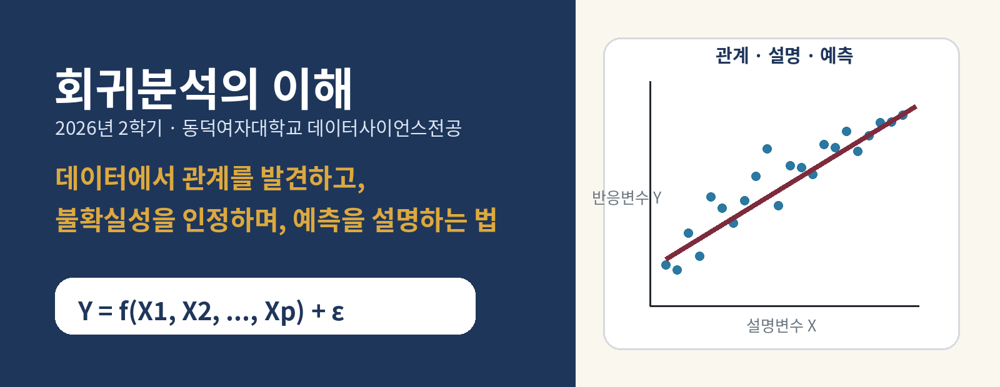
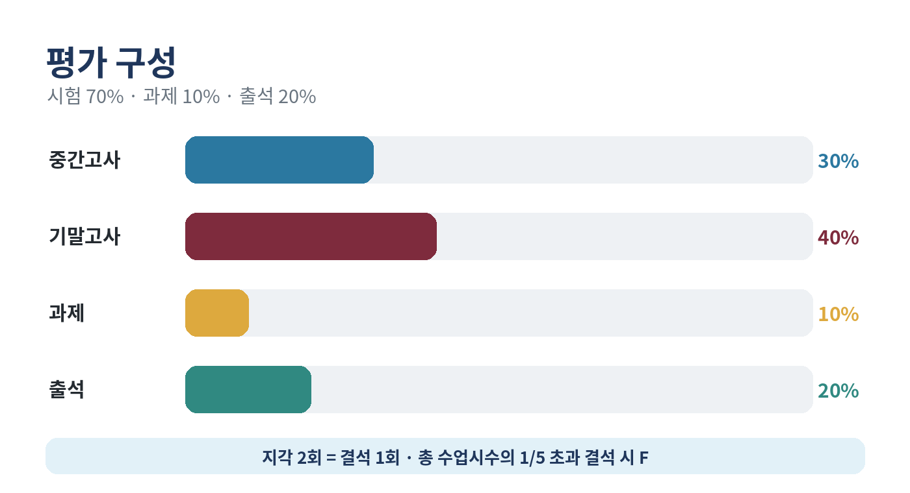
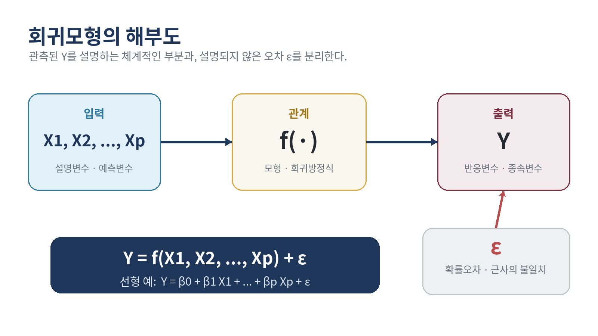
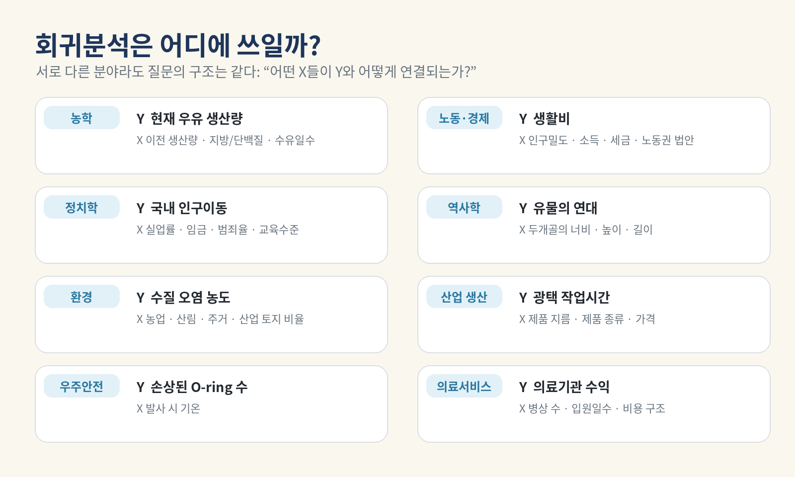
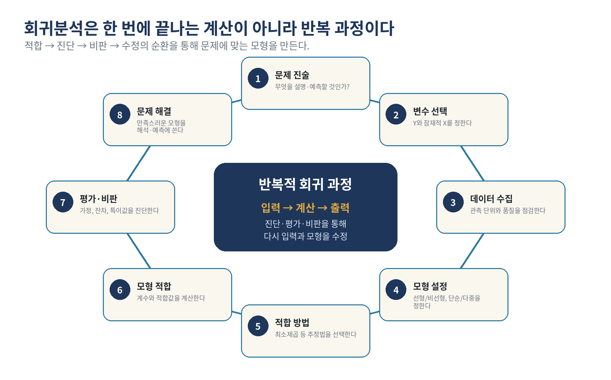
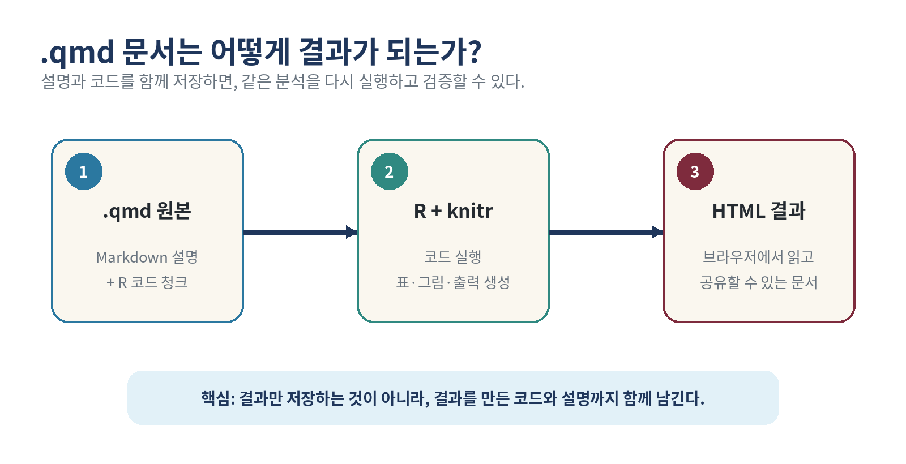
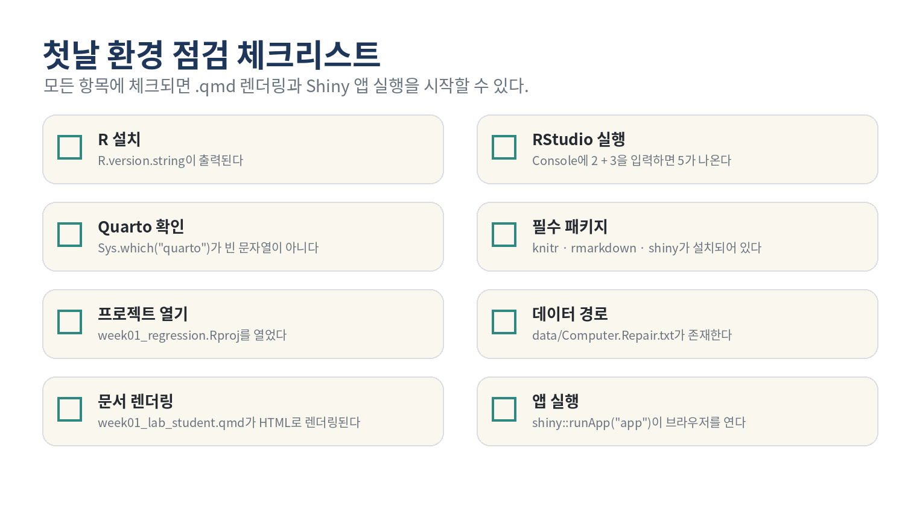

# 1주차: 강의 소개와 회귀분석의 첫 지도



> **수업일**: 2026년 9월 2일  
> **수업 주제**: 강의 소개 · 평가 및 운영 · 회귀분석의 개요  
> **수업 방법**: 오리엔테이션 + 개념 강의 (실습은 다음 수업부터)

## 오늘의 학습목표

수업을 마치면 다음을 설명하거나 수행할 수 있어야 합니다.

1. 이 과목의 학습 목표, 평가 방식과 출결 규정을 설명한다.
2. 데이터 기반 질문에서 반응변수 `Y`와 설명변수 `X`를 구분한다.
3. 회귀분석을 “변수 사이의 함수적 관계를 탐색하는 데이터 분석 방법”으로 설명한다.
4. 회귀분석이 문제 진술부터 모형 평가까지 이어지는 반복 과정임을 이해한다.
5. 관심 있는 사례를 반응변수와 설명변수로 표현한다.

## 75분 수업 흐름

| 시간 | 내용 | 학생 활동 |
|---:|---|---|
| 0–8분 | 환영, 과목의 질문, 첫 사례 | “무엇을 예측하고 싶은가?” 한 문장 작성 |
| 8–20분 | 강의 목표, 운영, 평가, 출결 | 핵심 규정 체크 |
| 20–42분 | 회귀분석의 개념과 용어 | 사례별 `Y`와 `X` 찾기 |
| 42–55분 | 회귀분석의 단계와 반복성 | 단계 순서 맞추기 |
| 55–68분 | 응용 사례 비교와 질문 | 사례의 Y와 X, 분석 목적 정리 |
| 68–75분 | 핵심 개념 정리 | Exit ticket 제출 |

---

## 1. 이 과목은 어떤 문제를 다루는가

데이터를 분석할 때 자주 묻는 질문은 다음과 같습니다.

- 수리할 부품 수가 늘면 수리 시간은 얼마나 늘어나는가?
- 광고비가 매출과 어떤 관계를 갖는가?
- 집의 위치, 연식, 면적과 가격은 어떻게 연결되는가?
- 발사 시 기온이 우주왕복선 부품의 손상과 관련되는가?
- 어떤 설명변수가 결과에 중요한가?

이 질문들은 서로 달라 보이지만 공통 구조를 갖습니다.

1. 설명하거나 예측하고 싶은 결과가 있다.
2. 그 결과와 관련될 수 있는 하나 이상의 변수가 있다.
3. 데이터로 관계를 요약하고, 설명하고, 예측하고 싶다.

## 2. 강의 운영과 평가



- 중간고사 30%, 기말고사 40%, 과제 10%, 출석 20%입니다.
- 지각 2회는 결석 1회로 산정합니다.
- 결석시수가 총 수업시수의 1/5을 초과하면 학칙에 따라 F학점이 부여됩니다.
- 개인 노트북을 준비합니다.
- 기본적인 R 문법과 프로그래밍 경험을 권장하지만, 실습 자료에서 필요한 개념을 다시 확인합니다.
- 이론을 먼저 이해한 뒤, 같은 개념을 R 코드와 시각화로 확인합니다.

## 3. 회귀분석이란 무엇인가



회귀분석은 변수들 사이의 함수적 관계를 탐색하는 개념적으로 단순하면서도 널리 활용되는 방법입니다. 일반적인 관계는 다음처럼 적을 수 있습니다.

```text
Y = f(X1, X2, ..., Xp) + ε
```

- `Y`: 반응변수(response), 종속변수(dependent), 목표변수(target), 출력(output)
- `X1, ..., Xp`: 설명변수(explanatory), 예측변수(predictor), 공변량(covariate), 회귀변수(regressor)
- `f(·)`: 설명변수와 반응변수 사이의 체계적인 관계
- `ε`: 모형이 정확히 설명하지 못하는 근사의 불일치, 즉 확률오차

선형회귀모형의 대표적인 형태는 다음과 같습니다.

```text
Y = β0 + β1 X1 + β2 X2 + ... + βp Xp + ε
```

여기서 `β0, β1, ..., βp`는 데이터로부터 추정할 미지의 회귀계수입니다.

> **주의**: “독립변수”라는 용어는 널리 쓰이지만, 실제 데이터의 예측변수들이 서로 통계적으로 독립이라는 뜻은 아닙니다. 이 강의에서는 주로 **설명변수** 또는 **예측변수**라는 표현을 사용합니다.

## 4. 회귀분석의 세 가지 핵심 목적

회귀방정식은 단순히 선 하나를 그리는 도구가 아닙니다.

1. **관계 요약과 설명**: 반응변수와 설명변수들의 관계를 간결하게 표현합니다.
2. **효과와 중요성 평가**: 개별 설명변수가 결과와 어떻게 관련되는지 평가합니다.
3. **예측**: 주어진 설명변수 값에서 반응변수 값을 예측합니다.

상황에 따라 예측변수 값을 바꾸는 정책이나 의사결정의 효과를 분석하는 데에도 활용할 수 있습니다. 그러나 관측 데이터의 회귀관계를 곧바로 인과효과로 해석해서는 안 됩니다. 인과적 결론에는 연구 설계와 추가 가정이 필요합니다.

## 5. 응용 사례에서 `Y`와 `X` 찾기



| 분야 | 가능한 반응변수 `Y` | 가능한 설명변수 `X` |
|---|---|---|
| 농학 | 현재 월의 우유 생산량 | 이전 월 생산량, 지방/단백질 함량, 수유일수 |
| 노동·경제 | 생활비 | 인구밀도, 노조가입 비율, 인구, 세금, 소득 |
| 정치학 | 국내 인구이동률 | 실업률, 임금, 범죄율, 소득, 교육수준 |
| 역사학 | 두개골의 대략적 연대 | 최대 너비, 높이, 길이, 코 높이 |
| 환경 | 강 유역의 평균 질소 농도 | 농업·산림·주거·상업/산업 용지 비율 |
| 산업 | 제품 광택시간 | 제품 지름, 제품 종류, 가격 |
| 우주안전 | 손상된 O-ring 수 | 발사 시 기온 |
| 의료서비스 | 시설의 순이익 | 병상 수, 입원일수, 환자치료 수익, 비용 |

### 짝 활동: 질문을 회귀문제로 바꾸기

아래에서 하나를 골라 2분 동안 작성합니다.

- 관심 있는 결과 `Y`는 무엇인가?
- 결과와 관련될 수 있는 설명변수 `X`를 두 개 이상 적어보자.
- 각 변수는 양적 변수인가, 질적 변수인가?
- 이 관계를 설명하려는가, 예측하려는가, 둘 다인가?

## 6. 데이터는 행과 열로 기록된다

관측 자료는 보통 다음 구조를 갖습니다.

| 관측개체 | 반응변수 `Y` | 설명변수 `X1` | 설명변수 `X2` | … | 설명변수 `Xp` |
|---:|---:|---:|---:|---:|---:|
| 1 | y1 | x11 | x12 | … | x1p |
| 2 | y2 | x21 | x22 | … | x2p |
| … | … | … | … | … | … |
| n | yn | xn1 | xn2 | … | xnp |

- 행(row)은 관측개체를 나타냅니다.
- 열(column)은 변수를 나타냅니다.
- 변수는 양적(quantitative)일 수도 있고 질적(qualitative)일 수도 있습니다.
- 질적 설명변수는 이후 지시변수/더미변수로 모형에 포함합니다.
- 질적 반응변수를 다루는 대표적 확장으로 로지스틱 회귀가 있습니다.

## 7. 회귀분석의 단계



회귀분석은 다음 단계들을 포함합니다.

1. 문제에 대한 진술
2. 잠재적으로 적절한 변수들의 선택
3. 데이터 수집
4. 모형 설정
5. 적합방법의 선택
6. 모형 적합
7. 모형 평가 및 비판
8. 선택된 모형을 문제 해결에 사용

중요한 점은 이 순서가 일방통행이 아니라는 것입니다. 잔차나 특이값에서 문제가 발견되면 변수, 모형, 데이터와 가정을 다시 검토합니다. 만족할 만한 설명과 예측이 얻어질 때까지 **적합 → 진단 → 비판 → 수정**을 반복합니다.

## 8. 학기 동안 만들 웹 애플리케이션


다음 실습 수업부터 제공된 코드를 실행해 입력값이 예측과 그림을 어떻게 바꾸는지 확인합니다. 이후 학습한 내용을 추가합니다.

- 단순회귀의 계수와 예측
- 다중회귀와 여러 설명변수
- 신뢰구간과 예측구간
- 잔차와 영향점 진단
- 질적 변수와 변수변환
- 공선성과 변수선택
- 최종 분석 보고와 앱 설명


> 운영 안내: 첫 수업에서는 환경설정을 진행하지 않습니다. 아래 내용은 다음 실습 수업을 위한 참고입니다.

## 9. 다음 수업 예고: R, RStudio, Quarto의 역할


- **R**은 통계 계산과 프로그래밍을 수행하는 엔진입니다.
- **RStudio**는 R 코드를 작성하고 실행하며 파일, 그래프, 도움말을 관리하는 통합 개발 환경입니다.
- **Quarto**는 설명, 코드, 표, 그림을 한 문서에 묶어 재현 가능한 결과물로 만드는 출판 시스템입니다.
- **R 패키지**는 R의 기능을 확장합니다. 이번 수업의 첫 앱에서는 `shiny`를 사용합니다.



### 다음 실습 수업에서 사용할 확인 명령

```r
R.version.string
2 + 3
getwd()
Sys.which("quarto")
```

```r
required <- c("knitr", "rmarkdown", "shiny")
required %in% rownames(installed.packages())
```



자세한 설치와 오류 해결은 [R/RStudio/Quarto 설치와 문제 해결](03_setup_troubleshooting.md)을 참고합니다.

## 10. 오늘의 Exit ticket

수업이 끝나기 전에 다음 세 문장을 완성합니다.

1. 회귀분석에서 `Y`는 ____________________이다.
2. 회귀분석에서 `ε`는 ____________________을 나타낸다.
3. 내가 회귀분석으로 살펴보고 싶은 질문은 ____________________이다.

## Take-home message

- 회귀분석은 `Y`와 `X`의 관계를 모형으로 요약하고 설명하며 예측하는 방법이다.
- 모형은 현실의 완전한 복사본이 아니라 근사이므로 오차 `ε`와 가정을 함께 고려해야 한다.
- 회귀분석은 한 번의 계산이 아니라 문제 진술, 적합, 진단, 비판과 수정이 반복되는 과정이다.
- R 코드는 결과를 만드는 계산이며, `.qmd` 문서는 그 계산의 이유와 결과까지 함께 기록한다.
- 이번 학기의 앱은 매주 배운 개념을 추가하며 성장한다.

## 다음 수업 준비

- 다음 수업에는 실습용 노트북을 준비합니다.
- R/RStudio/Quarto 환경설정과 기본 실행은 다음 실습 수업에서 함께 진행합니다.
- 다음 수업에서는 산점도, 공분산, 상관계수와 회귀분석의 기본 아이디어를 다룬다.

## 참고

- Ali S. Hadi, Samprit Chatterjee, *Chatterjee 예제를 통한 회귀분석 제6판: R 활용*, Chapter 1.
- 강현철, *예제를 통한 회귀분석 제6판 제1장 서론* 강의자료.
- 수업용 R 코드: 주교재 Chapter 2 예제 중 R 객체, 데이터 구조, 데이터 읽기 관련 부분.

## 점검 퀴즈

> 이전 과정에서 원 강의의 핵심 개념을 바탕으로 보충한 복습 문항입니다.

1. 회귀분석에서 반응변수와 설명변수는 각각 무엇인가요?
2. 회귀모형에서 오차 `ε`를 포함하는 이유는 무엇인가요?
3. 회귀분석을 반복적인 과정이라고 부르는 이유는 무엇인가요?
4. 관측 데이터의 회귀관계를 인과관계로 바로 해석할 수 있나요?
5. 데이터 표에서 행과 열은 각각 무엇을 나타내나요?
