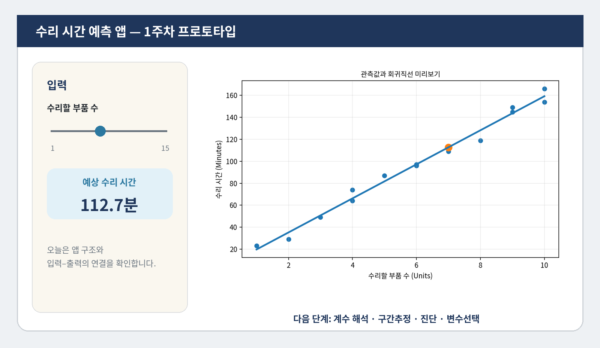
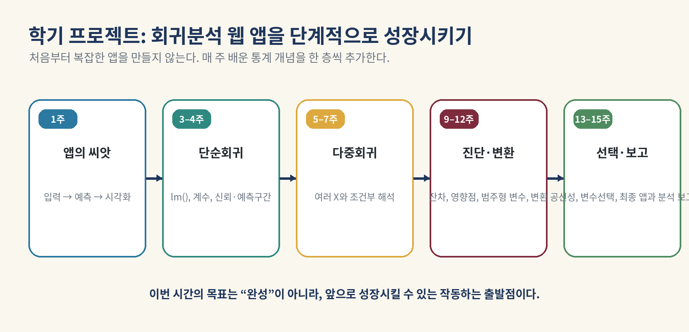

# 1주차 실습 안내: R/Quarto 환경과 첫 회귀 앱

## 실습 주제

**R/RStudio/Quarto 환경을 점검하고, 컴퓨터 수리시간 데이터를 읽어 첫 회귀모형과 Shiny 웹 앱을 실행한다.**

이번 실습은 단순선형회귀의 공식을 완전히 배우기 위한 시간이 아닙니다. 데이터가 `X → 모형 → Y 예측`의 구조로 연결되고, 이 결과가 웹 앱의 입력과 출력으로 이어지는 전체 흐름을 먼저 경험합니다.

## 실습 파일

- `week01_lab_student.qmd`: 학생용 실습 노트북
- `week01_lab_student.R`: 같은 실습을 R 스크립트로 정리한 파일
- `data/Computer.Repair.txt`: 컴퓨터 수리시간 예제 데이터
- `app/app.R`: 실행 가능한 첫 Shiny 앱
- `app/debug_app.R`: 오류를 찾아 수정하는 디버깅 과제
- `scripts/check_environment.R`: 환경 진단 스크립트
- `scripts/install_packages.R`: 필수 패키지 설치 스크립트

> Notion은 `.qmd` 파일을 강의 페이지로 변환하는 용도가 아니라 강의 내용을 읽는 위키로 사용합니다. 실습 파일은 배포 ZIP 또는 강의 GitHub 저장소에서 내려받아 로컬 RStudio에서 실행합니다.

## 시작 순서

1. 압축파일을 **먼저 완전히 풉니다**. ZIP 안에서 직접 파일을 열지 않습니다.
2. `week01_regression.Rproj`를 더블클릭하여 RStudio 프로젝트를 엽니다.
3. `scripts/check_environment.R`를 실행합니다.
4. 누락된 패키지가 있으면 `scripts/install_packages.R`를 실행합니다.
5. `week01_lab_student.qmd`를 열고 **Render**를 누릅니다.
6. 노트북의 지시에 따라 코드 셀을 실행하고 직접 코딩 문제를 풉니다.
7. 마지막에 `shiny::runApp("app")`으로 웹 앱을 실행합니다.

## 오늘 직접 해볼 것

- R 버전, 작업 폴더, Quarto 명령과 패키지 설치 상태 확인
- 벡터와 데이터프레임 생성
- `head()`, `class()`, `dim()`, `names()`, `str()`로 데이터 구조 확인
- `Computer.Repair.txt` 불러오기
- `Units`를 설명변수 `X`, `Minutes`를 반응변수 `Y`로 구분
- 산점도와 회귀직선 미리보기
- 새 입력값의 수리시간 예측
- Shiny 앱 실행과 간단한 수정
- 경로, 대소문자, 자료형 오류 디버깅

## 실습 완료 기준

- [ ] 환경 점검표에서 R, Quarto, 필수 패키지가 확인되었다.
- [ ] `.qmd`가 HTML로 렌더링되었다.
- [ ] 데이터의 행 수, 열 수, 변수 이름을 설명할 수 있다.
- [ ] `Y = Minutes`, `X = Units`를 구분할 수 있다.
- [ ] 산점도와 회귀직선이 표시되었다.
- [ ] 새 입력값에 대한 예측값을 계산했다.
- [ ] Shiny 앱이 브라우저에서 실행되었다.
- [ ] 디버깅 문제 중 적어도 두 개를 해결했다.
- [ ] 마지막 퀴즈와 Take-home message를 확인했다.

## 앱의 이번 주 역할

이번 주 앱은 **작동하는 씨앗**입니다. 데이터와 모형을 연결하고 사용자 입력에 따라 예측값이 바뀌는지만 확인합니다. 이후 수업에서 계수 해석, 신뢰구간과 예측구간, 다중회귀, 진단, 변수선택을 추가합니다.

## 문제가 생겼을 때

먼저 [R/RStudio/Quarto 설치와 문제 해결](03_setup_troubleshooting.md)을 확인합니다. 오류 메시지를 지우지 말고 다음 정보를 함께 기록합니다.

- 실행한 코드
- 전체 오류 메시지
- `R.version.string` 출력
- `getwd()` 출력
- `file.exists(file.path("data", "Computer.Repair.txt"))` 출력
- `Sys.which("quarto")` 출력
