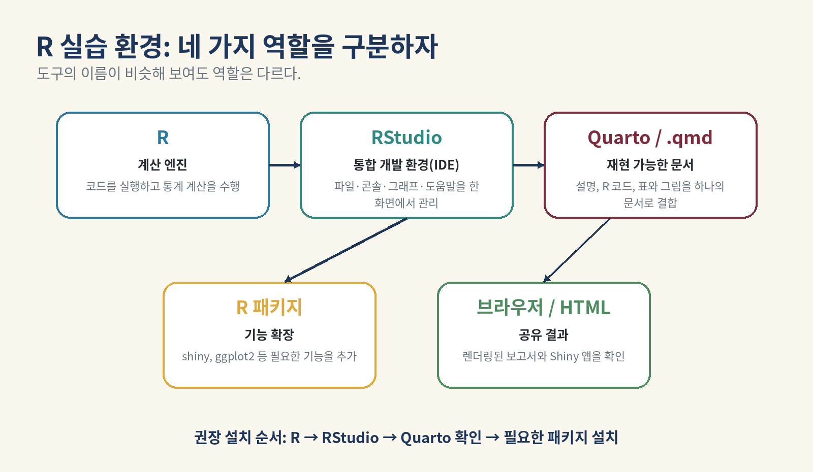

# R/RStudio/Quarto 설치와 문제 해결



## 권장 환경

이 수업의 기준 환경은 **로컬 R + RStudio + Quarto**입니다. R 코드만 짧게 확인할 때는 다른 환경을 사용할 수 있지만, `.qmd` 렌더링과 Shiny 앱 실습의 일관성을 위해 로컬 프로젝트 환경을 권장합니다.

## 설치 순서

### 1. R 설치

- 공식 CRAN: <https://cran.r-project.org/>
- 운영체제에 맞는 최신 안정 버전을 설치합니다.
- 설치 후 RStudio Console에서 다음을 실행합니다.

```r
R.version.string
2 + 3
```

### 2. RStudio Desktop 설치

- 공식 다운로드: <https://posit.co/download/rstudio-desktop/>
- R을 먼저 설치한 뒤 RStudio를 설치합니다.
- RStudio는 R 자체가 아니라 R을 편리하게 사용하는 통합 개발 환경입니다.

### 3. Quarto 확인

- 공식 시작 문서: <https://quarto.org/docs/get-started/>
- RStudio에서 다음을 실행합니다.

```r
Sys.which("quarto")
```

빈 문자열 `""`이 나오면 Quarto 설치 또는 RStudio/Quarto 경로 설정을 확인합니다.

### 4. 필수 패키지 설치

```r
install.packages(c("knitr", "rmarkdown", "shiny"))
```

이미 설치된 패키지는 다시 설치할 필요가 없습니다. 배포 파일의 `scripts/install_packages.R`는 누락된 패키지만 확인하여 설치합니다.

## 프로젝트를 여는 올바른 방법

1. ZIP 파일을 완전히 풉니다.
2. 폴더를 너무 깊지 않은 위치에 둡니다. 예: `C:/regre/week01`.
3. `week01_regression.Rproj`를 더블클릭합니다.
4. RStudio의 Files 창에서 `week01_lab_student.qmd`를 엽니다.
5. Render를 누릅니다.

> 실습에서는 `setwd()`로 매번 작업 폴더를 바꾸는 대신 RStudio 프로젝트와 상대경로를 사용합니다. 이렇게 해야 다른 컴퓨터에서도 같은 코드가 재현됩니다.

## 환경 진단 코드

```r
cat("R:", R.version.string, "\n")
cat("작업 폴더:", getwd(), "\n")
cat("Quarto:", Sys.which("quarto"), "\n")

required <- c("knitr", "rmarkdown", "shiny")
status <- data.frame(
  package = required,
  installed = vapply(required, requireNamespace, logical(1), quietly = TRUE)
)
status

file.exists(file.path("data", "Computer.Repair.txt"))
```

## 자주 발생하는 오류

### `object 'Units' not found`

가능한 원인:

- 변수 이름의 대소문자가 다름
- 데이터프레임을 지정하지 않음
- 데이터가 정상적으로 읽히지 않음

확인:

```r
names(repair)
str(repair)
head(repair)
```

### `cannot open the connection` 또는 파일을 찾을 수 없음

```r
getwd()
list.files()
list.files("data")
file.exists(file.path("data", "Computer.Repair.txt"))
```

프로젝트를 `.Rproj`로 열었는지, ZIP을 풀었는지, 파일명이 정확한지 확인합니다.

### `there is no package called 'shiny'`

```r
install.packages("shiny")
library(shiny)
```

설치 중에는 인터넷 연결과 CRAN 미러를 확인합니다.

### Render 버튼이 없거나 Quarto를 찾지 못함

```r
Sys.which("quarto")
```

- RStudio를 최신 안정 버전으로 업데이트합니다.
- Quarto를 별도로 설치한 뒤 RStudio를 완전히 종료하고 다시 시작합니다.
- 터미널에서 `quarto --version`을 확인합니다.

### 한글이 깨짐

- 프로젝트 파일을 UTF-8로 저장합니다.
- RStudio에서 `File → Save with Encoding... → UTF-8`을 사용합니다.
- 데이터 읽기 시 파일의 실제 인코딩이 다르면 `fileEncoding`을 지정합니다.

### 앱이 실행되지만 값이 바뀌지 않음

- `sliderInput()`의 입력 ID와 `input$...` 이름이 같은지 확인합니다.
- `predict()`에 넘기는 새 데이터프레임의 열 이름이 학습 데이터와 같은지 확인합니다.
- Console에 나타난 오류 메시지를 먼저 읽습니다.

## 도움을 요청할 때 포함할 정보

```r
sessionInfo()
R.version.string
getwd()
Sys.which("quarto")
list.files(recursive = TRUE)
```

오류가 난 코드와 전체 오류 메시지를 함께 제시하면 원인을 훨씬 빠르게 찾을 수 있습니다.

## 공식 참고자료

- R Project / CRAN: <https://cran.r-project.org/>
- RStudio Desktop: <https://posit.co/download/rstudio-desktop/>
- Quarto + RStudio 시작하기: <https://quarto.org/docs/get-started/hello/rstudio.html>
- Quarto에서 R 사용하기: <https://quarto.org/docs/computations/r.html>
- Shiny 시작하기: <https://shiny.posit.co/r/getstarted/>
